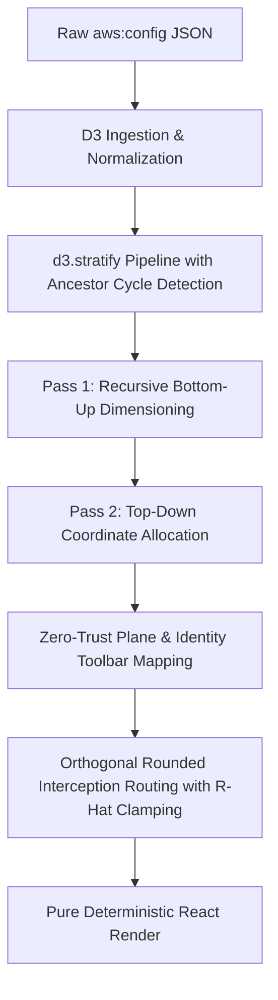

# Zero-Trust Static Deterministic Layout Engine Plan

This engineering implementation plan specifies the complete design and mathematical formulations for migrating the `AWS-DFD-Visualizer` from a D3 force-directed physics simulation to a **purely deterministic, zero-trust static layout engine**.

This plan fulfills DoD Impact Level 5 (IL5) Risk Management Framework (RMF) Audit Mode requirements by rendering completely predictable, reproducible, and structured network topology diagrams without spatial noise or physics jitter.

---

## 🏛️ Architecture Overview

The layout engine replaces D3 physics forces with a **two-pass tree and grid layout transformation** combined with a specialized **identity toolbar**, **rounded orthogonal routing**, and **mid-flight Security Group interception checks**.



---

## 1. 📥 D3 Data-Pipeline Ingestion & Stratification

To use `d3.stratify()`, the raw relationship graph from `aws:config` must be parsed and represented as a strict hierarchical tree where each node has a unique `id` and a single `parentId`.

### 1.1 Ingestion & Hierarchy Normalization Rules
Based on the revised AWS Well-Architected constraints, the custom layout engine implements a flattened single-parent containment tree: `VPC -> Subnet -> ComputeNode/Instance`.

1. **Hierarchy Normalization**:
   - **VPC** (Root in the Infrastructure Plane): Has no parent (`parentId = null`).
   - **Subnet** (Child of VPC): Parent is the associated `VpcId` (`parentId = VpcId`).
   - **ComputeNode/Instance** (Child of Subnet): Parent is the associated `SubnetId` (`parentId = SubnetId`).
   - **SecurityGroup**: Security Groups (SGs) are completely excluded from the containment tree (no container boxes or parent-child nodes in D3 stratification).

2. **Security Groups as Attributes & Mid-Flight Interception**:
   - **Node Envelopes**: A ComputeNode's JSON object includes an array of assigned Security Group metadata as an attribute:
     ```json
     "security_groups": [
       { "id": "sg-999", "name": "Web-Traffic-Allowed", "is_compliant": true },
       { "id": "sg-222", "name": "Unrestricted-SSH-Violation", "is_compliant": false }
     ]
     ```
   - **Mid-Flight Link Posture Interrogation**: Connections bypass any intermediate physical SG containers and go directly from the source to the destination compute node. However, the link style queries the destination's security posture mid-flight. Links contain a `port` attribute (e.g. `22`), which triggers active compliance checks.

3. **Global Edge Infrastructure Placement**:
   - **Control/Policy Plane Lock**: Global network assets (such as `AWS::WAFv2::WebACL` or `AWS::CloudFront::Distribution`) are stratified outside of the physical VPC container box.
   - **Strict Canvas Sector**: These global edge assets are positioned strictly within the **Policy & Control Plane** vertical boundary ($Y \in [200, 400]$).
   - **Infrastructure Plane**: The physical VPC container box and its subnets/instances are locked strictly inside the **Infrastructure Plane** boundary ($Y > 400$).

4. **Unassociated Identity/ICAM Nodes (Identity Toolbar)**:
   - IAM Roles, Users, and Policies that exist purely on the identity plane without direct network boundaries are flagged as **Unassociated Identity Nodes**.
   - These are excluded from standard hierarchical grid placement and assigned to the **Identity Plane Horizontal Toolbar** to prevent false network isolation auditing assumptions.

### 1.2 Ingest Cycle-Prevention & Pipeline Implementation
To prevent D3 crashes from cyclical dependencies common in complex real-world `aws:config` data ($A \rightarrow B \rightarrow A$), a Set-based ancestor trace is run for every node prior to stratification.

```javascript
const buildStratifiedHierarchy = (rawData) => {
    const parsedData = parseSplunkData(rawData);
    const nodes = parsedData.nodes;
    const links = parsedData.links;

    // 1. Separate nodes by type and hierarchy levels
    const vpcs = [];
    const subnets = [];
    const computes = [];
    const globalEdgeAssets = [];
    const unassociatedNodes = [];
    
    // Resolve child-to-parent subnet/VPC mappings from AWS Config metadata
    const subnetToVpc = new Map();
    const nodeToSubnet = new Map();
    const nodeToSGs = new Map();

    nodes.forEach(node => {
        const type = (node.type || '').toUpperCase();
        
        if (type.includes('VPC')) {
            vpcs.push(node);
        } else if (type.includes('SUBNET')) {
            subnets.push(node);
            if (node.vpcId) subnetToVpc.set(node.id, node.vpcId);
        } else if (type.includes('WAF') || type.includes('CLOUDFRONT')) {
            globalEdgeAssets.push(node);
        } else if (type.includes('IAM') || type.includes('ROLE') || type.includes('USER') || type.includes('POLICY')) {
            unassociatedNodes.push(node);
        } else {
            // Compute nodes (EC2, Lambda, RDS, etc.)
            computes.push(node);
            if (node.subnetId) nodeToSubnet.set(node.id, node.subnetId);
            if (node.securityGroups) nodeToSGs.set(node.id, node.securityGroups);
        }
    });

    // 2. Build flattened hierarchy node list
    const stratifiedNodes = [];

    // VPCs parented under 'aws-global-root' if multiple exist, otherwise parent = null
    const useGlobalRoot = vpcs.length > 1;
    if (useGlobalRoot) {
        stratifiedNodes.push({ id: "aws-global-root", parentId: null, label: "AWS Cloud Region", type: "CLOUD_REGION" });
    }

    vpcs.forEach(vpc => {
        stratifiedNodes.push({
            id: vpc.id,
            parentId: useGlobalRoot ? "aws-global-root" : null,
            label: vpc.label,
            type: vpc.type,
            group: vpc.group
        });
    });

    subnets.forEach(sub => {
        const parentId = subnetToVpc.get(sub.id) || (vpcs[0] ? vpcs[0].id : null);
        stratifiedNodes.push({
            id: sub.id,
            parentId: parentId,
            label: sub.label,
            type: sub.type,
            group: sub.group
        });
    });

    computes.forEach(node => {
        const parentId = nodeToSubnet.get(node.id) || (subnets[0] ? subnets[0].id : null);
        const securityGroups = nodeToSGs.get(node.id) || node.security_groups || [];
        
        stratifiedNodes.push({
            id: node.id,
            parentId: parentId,
            label: node.label,
            type: node.type,
            group: node.group,
            status: node.status,
            security_groups: securityGroups
        });
    });

    // Global network assets (WAF, CloudFront) - locked in the Policy & Control Plane
    globalEdgeAssets.forEach(node => {
        stratifiedNodes.push({
            id: node.id,
            parentId: null, // Placed outside VPCs as control plane roots
            label: node.label,
            type: node.type,
            group: node.group,
            isGlobalEdge: true // Flag to lock vertical position to Y: 200-400
        });
    });

    const stratify = d3.stratify()
        .id(d => d.id)
        .parentId(d => d.parentId);

    return {
        hierarchy: stratify(stratifiedNodes),
        toolbar: unassociatedNodes,
        globalEdge: globalEdgeAssets
    };
};
```

---

## 2. 🧮 Two-Pass Layout Transformation

### Pass 1: Recursive Bottom-Up Dimensioning (Sizing Containers)
Starting from leaf nodes (Compute Nodes) and working up the tree, the engine recursively computes dimensions $(W(u), H(u))$ of every container. **For any container $u$, Pass 1 is evaluated recursively on all children $c_i \in C(u)$ first, ensuring inner nested dimensions are fully settled.**

#### 1. Leaf Nodes (ComputeNode)
All leaf nodes have a fixed size:
$$W(u) = 280\text{ px}, \quad H(u) = 100\text{ px}$$

#### 2. Container Nodes (Subnet, VPC)
Let container $u$ have children $C(u) = \{c_1, c_2, \dots, c_m\}$.
We arrange these children in a grid with:
- Grid Padding: $P = 40\text{ px}$
- Column Gap: $dx = 120\text{ px}$
- Row Gap: $dy = 100\text{ px}$
- Columns: $K = \lceil \sqrt{m} \rceil$
- Rows: $R = \lceil m / K \rceil$

For column $k \in [0, K-1]$, the column width is the maximum child width in that column:
$$W_{\text{col}}(k) = \max \{ W(c_i) \mid \text{child } c_i \text{ is in column } k \}$$

For row $r \in [0, R-1]$, the row height is the maximum child height in that row:
$$H_{\text{row}}(r) = \max \{ H(c_i) \mid \text{child } c_i \text{ is in row } r \}$$

The total dimensions of container $u$ are computed as:
$$W(u) = 2 \cdot P + \sum_{k=0}^{K-1} W_{\text{col}}(k) + (K - 1) \cdot dx$$
$$H(u) = 2 \cdot P + \sum_{r=0}^{R-1} H_{\text{row}}(r) + (R - 1) \cdot dy$$

#### 3. Global Region Wrapper (CLOUD_REGION)
If $u$ is the `"CLOUD_REGION"` wrapper node, its children (VPCs) are laid out horizontally side-by-side:
$$W(u) = 2 \cdot P + \sum_{c \in C(u)} W(c) + (|C(u)| - 1) \cdot dx$$
$$H(u) = 2 \cdot P + \max_{c \in C(u)} H(c)$$

---

### Pass 2: Top-Down Coordinate Allocation (Positioning Nodes)

Starting from the top-level roots, coordinates $(X(u), Y(u))$ are computed and distributed downwards.

#### 1. Expanded Canvas Plane Bounds & Alignment
To prevent vertical viewport clipping, the canvas height is expanded to $1200 \times 1400$.
Zero-Trust Planes allocate strict vertical bounds:
- **Identity & ICAM**: $Y \in [0, 200]$ (Midpoint $Y_1 = 100\text{ px}$)
- **Policy & Control (Global Edge, WAF, CloudFront)**: $Y \in [200, 400]$ (Midpoint $Y_2 = 300\text{ px}$)
- **Infrastructure (VPC, Subnets, Instances)**: $Y \in [400, 1400]$ (Midpoint $Y_3 = 900\text{ px}$)

For each root container $r$ in Plane $i$, the initial center is assigned:
$$X(r) = 600\text{ px}, \quad Y(r) = Y_i^{\text{mid}}$$

#### 2. Policy & Control Plane Alignment (Global Edge Assets)
All global edge assets (marked with `isGlobalEdge: true`) are placed horizontally side-by-side centered inside the Policy & Control plane vertical midpoint $Y = 300\text{ px}$.
For the $i$-th global edge asset $g_i \in G$ (where $|G| = M$):
$$X(g_i) = 600 - \frac{(M - 1) \cdot 350}{2} + i \cdot 350$$
$$Y(g_i) = 300\text{ px}$$

#### 3. Identity Toolbar Alignment (Unassociated Nodes)
To prevent audit misrepresentation, unassociated IAM/ICAM nodes are aligned horizontally at the top-left section of the Identity Plane:
- **X bounds**: $[0, 250]$
- **Y offset**: $50\text{ px}$
- For the $i$-th unassociated node $u_i \in U$:
  $$X(u_i) = 40 + i \cdot (W_{\text{node}} + 20) + \frac{W_{\text{node}}/2}{2}$$
  $$Y(u_i) = 50 + \frac{H_{\text{node}}/2}{2}$$

#### 4. Absolute Children Positioning
Let parent $p$ have coordinates $(X(p), Y(p))$ and computed dimensions $(W(p), H(p))$.
The top-left corner of the parent container is:
$$X_{\text{TL}}(p) = X(p) - \frac{W(p)}{2}$$
$$Y_{\text{TL}}(p) = Y(p) - \frac{H(p)}{2}$$

For a child $c_i$ located at column $k$ and row $r$ inside $p$:
- **Relative top-left position of child**:
  $$X_{\text{rel, TL}}(c_i) = P + \sum_{j=0}^{k-1} W_{\text{col}}(j) + k \cdot dx$$
  $$Y_{\text{rel, TL}}(c_i) = P + \sum_{j=0}^{r-1} H_{\text{row}}(j) + r \cdot dy$$
- **Absolute center coordinates of child**:
  $$X(c_i) = X_{\text{TL}}(p) + X_{\text{rel, TL}}(c_i) + \frac{W(c_i)}{2}$$
  $$Y(c_i) = Y_{\text{TL}}(p) + Y_{\text{rel, TL}}(c_i) + \frac{H(c_i)}{2}$$

---

## 3. 🔀 Orthogonal Interception Routing (Mid-Flight Posture Checking)

To prevent overlapping line collision ("crossroads") during high-density audits, routing utilizes **Orthogonal Rounded Manhattan Paths** combined with mid-flight security posture checks.

```
          [ Node A ]
              │
              ├───┐  (Clamped Corner Radius R-Hat)
              │   │
              └───┼───► [ Node B ]
```

### 3.1 Clamped Path Corner Radius Formulation
For an orthogonal path between $A(x_A, y_A)$ and $B(x_B, y_B)$ with horizontal midpoint $M_x = \frac{x_A + x_B}{2}$ and baseline corner radius $R = 5\text{ px}$:

1. **Directional Sign Vectors**:
   $$s_x = \operatorname{sgn}(x_B - x_A)$$
   $$s_y = \operatorname{sgn}(y_B - y_A)$$

2. **Clamped Corner Radius ($\hat{R}$)**:
   To prevent backward looping on tight node connections where spacing is less than $2R$, the radius is dynamically clamped:
   $$\hat{R} = \min\left(R, \frac{|x_B - x_A|}{2}, \frac{|y_B - y_A|}{2}\right)$$

3. **SVG Path Interpolation String**:
   - Start: `M` $x_A, y_A$
   - Line to first corner entry: `L` $(M_x - s_x \cdot \hat{R}), y_A$
   - First corner curve (Quadratic Bezier): `Q` $M_x, y_A \quad M_x, (y_A + s_y \cdot \hat{R})$
   - Line to second corner entry: `L` $M_x, (y_B - s_y \cdot \hat{R})$
   - Second corner curve: `Q` $M_x, y_B \quad (M_x + s_x \cdot \hat{R}), y_B$
   - End line: `L` $x_B, y_B$

### 3.2 D3 Interception Interrogation Logic
Rather than routing lines through independent container boxes for SGs, the connection goes directly from the source to the destination compute instance. However, the link style queries the destination's security posture mid-flight.

If any assigned Security Group flags a violation on that specific link's port (e.g. port 22 with non-compliant status), the connection path is visually split/recolored to Vibrant Red and formatted as a dashed gap.

```javascript
// Mid-Flight Interception Styling Check
const hasPortViolation = (link, targetNode) => {
    if (targetNode.security_groups) {
        const hasViolation = targetNode.security_groups.some(sg => !sg.is_compliant);
        // Under DoD RMF Auditing: Unrestricted port 22 (SSH) triggers violation styling
        if (hasViolation && link.port === 22) {
            return true;
        }
    }
    return false;
};

// Styling Rules:
// - Stroke Color: hasPortViolation() ? "#FF0000" (Vibrant Red) : "#00FF00" (Vibrant Green)
// - Stroke Dasharray: hasPortViolation() ? "4, 4" (Dashed Gap) : "none"
```

---

## 4. 🎨 Visual States, Themes, and Concentric "Envelopes"

### 4.1 Concentric Security Group Metadata Envelopes
To ensure the auditor can physically see which Security Group caused a path to turn red, the engine draws concentric metadata "envelopes" (rings) directly surrounding the core compute icon.

The rings expand outward from the core compute node depending on the index of the security group:

* **Core Node Rect Size**: $140 \times 60\text{ px}$ (Centered at $x=0, y=0$, so offsets are $x = -70, y = -30$).
* **Concentric SG Envelope $i$**:
  - Width: $140 + (i \cdot 12)\text{ px}$
  - Height: $60 + (i \cdot 12)\text{ px}$
  - Offset coordinate $X$: $-70 - (i \cdot 6)\text{ px}$
  - Offset coordinate $Y$: $-30 - (i \cdot 6)\text{ px}$
  - Corner Radius: $r_x = 8, r_y = 8$
  - Fill: `none`
  - Stroke: `sg.is_compliant ? "#00FF00" : "#FF0000"` (Vibrant Green vs Vibrant Red)
  - Stroke Width: `1.5px`
  - Opacity: `0.7`

```
           ┌─────────────────────────┐
           │   Envelope (sg-222) 🔴  │
           │  ┌───────────────────┐  │
           │  │ Envelope (sg-999)🟢│  │
           │  │  ┌─────────────┐  │  │
           │  │  │ Core Node   │  │  │
           │  │  └─────────────┘  │  │
           │  └───────────────────┘  │
           └─────────────────────────┘
```

This nested visual representation makes security compliance configurations instantly auditable.

### 4.2 Compliance Visual Mapping Table

| State / Condition | Border Stroke | Stroke Style | Envelope Stroke | Link Color | Link Dash |
|---|---|---|---|---|---|
| **COMPLIANT Node/SG** | `#4A4A4A` (Core) | Solid | `#00FF00` (Vibrant Green) | `#00FF00` | None (`none`) |
| **NON_COMPLIANT Node/SG** | `#4A4A4A` (Core) | Solid | `#FF0000` (Vibrant Red) | `#FF0000` (Port 22) | Dashed (`4,4`) |