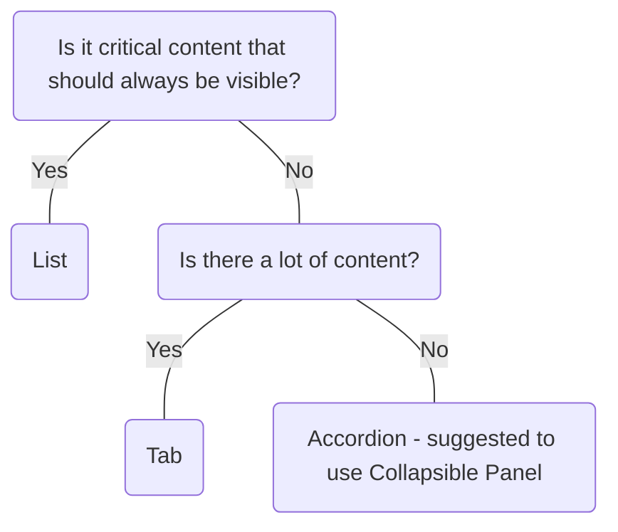

# Accordion

## Overview


> Image: Illustration of a group of accordion components with the second accordion expanded to show its content.


## When to use this component

<Message appearance="fill" type="warning">
    <Message.Title>
         <strong>Use Collapsible Panel</strong>
         <p>Collapsible Panel supports expanding a single or multiple panels.
         It is suggested to use <Link to="./CollapsiblePanel">Collapsible Panel</Link> as Accordion is deprecated and will be removed in a future major version.</p>
    </Message.Title>
</Message>

- When you have a large amount of non-essential content to show, and want to allow people to have control over the content visibility
- When you want to progressively disclose information or provide step-by-step guidance
- When you want to group related content and optimize space and information density
- When you are showing content on a small screen to reduce scrolling

## When to use another component
- If you need to expand a single or multiple panels at a time, use `Collapsible Panel`.
- If there are only one or two sections, it is better to display the content without requiring user interaction.
- If the content is critical and should always be visible, use a `list` or display the content without requiring user interaction.
- For information that needs to be viewed, grouped, or compared across categories use a `Table`.
- For large amounts of categorical content or for content that is not well-suited for organizing into sections, consider displaying this information using `Tab Bar`.



### Check out
- [Collapsible Panel][1]
- [List][2]
- [Table][3]
- [Tab bar][4]

## Usage

### Limit content
Avoid filling accordions with lots of content. Instead, use small, digestible chunks for the user.

> Image: Heart eye example with digestible amount of content next to a grimacing face example of an accordion with to much content


### Order panels logically
When your accordion panels need to be read in a specific order, order panels logically.

> Image: Heart eye example with accordions label in sequential order 1 - 4 next to a grimacing face example where the accordions are out of order 2, 1, 4, 3


## Content guidelines

### Panel title:
- Write a concise title that describes the associated body content so the user can decide whether to read the body content.
- Use sentence-style capitalization and capitalize the first word and proper nouns only.
- Don’t use punctuation such as periods, commas, or exclamation marks.

### Panel body:
- If you have a lot of content, split body content into paragraphs to create smaller chunks that are easier to read.
- Write in complete sentences with end punctuation.


[1]: ./CollapsiblePanel
[2]: ./List
[3]: ./Table
[4]: ./TabBar

## Examples


### Controlled

```typescript
import React, { useState } from 'react';

import Accordion, { AccordionChangeHandler } from '@splunk/react-ui/Accordion';
import P from '@splunk/react-ui/Paragraph';


function Controlled() {
    const [openPanelId, setOpenPanelId] = useState<string | number | undefined>(2);

    const handleChange: AccordionChangeHandler = (e, { panelId: panelValue }) => {
        setOpenPanelId(panelValue);
    };

    return (
        <Accordion openPanelId={openPanelId} onChange={handleChange}>
            <Accordion.Panel panelId={1} title="Panel 1">
                <P>
                    This is the content of Panel 1. Here is some more information. Additional
                    details can be placed here.
                </P>
            </Accordion.Panel>
            <Accordion.Panel panelId={2} title="Panel 2">
                <P>This is the content of Panel 2.</P>
            </Accordion.Panel>
            <Accordion.Panel panelId={3} title="Panel 3">
                <P>This is the content of Panel 3. More information for Panel 3.</P>
            </Accordion.Panel>
        </Accordion>
    );
}

export default Controlled;
```


### Uncontrolled

```typescript
import React from 'react';

import Accordion from '@splunk/react-ui/Accordion';
import P from '@splunk/react-ui/Paragraph';


function Uncontrolled() {
    return (
        <Accordion defaultOpenPanelId={2}>
            <Accordion.Panel panelId={1} title="Panel 1">
                <P>
                    This is the content of Panel 1. Here is some more information. Additional
                    details can be placed here.
                </P>
            </Accordion.Panel>
            <Accordion.Panel panelId={2} title="Panel 2">
                <P>This is the content of Panel 2.</P>
            </Accordion.Panel>
            <Accordion.Panel panelId={3} title="Panel 3">
                <P>This is the content of Panel 3. More information for Panel 3.</P>
            </Accordion.Panel>
        </Accordion>
    );
}

export default Uncontrolled;
```


### Inset

inset adds padding to the Accordion Panel. This can be set on the Accordion, or individual Panels. Individual Panels can override inset from their parent Accordion.

```typescript
import React, { useState } from 'react';

import Accordion, { AccordionChangeHandler } from '@splunk/react-ui/Accordion';
import P from '@splunk/react-ui/Paragraph';


const Inset = () => {
    const [openPanelId, setOpenPanelId] = useState<string | number | undefined>(1);

    const handleChange: AccordionChangeHandler = (e, data) => {
        setOpenPanelId(data.panelId);
    };

    return (
        <Accordion openPanelId={openPanelId} onChange={handleChange}>
            <Accordion.Panel panelId={1} title="Inset true (default)" inset>
                <P>This panel has inset enabled. Content is padded.</P>
            </Accordion.Panel>
            <Accordion.Panel panelId={2} title="Inset false" inset={false}>
                <P>This panel has inset disabled. Content is flush with the edges.</P>
            </Accordion.Panel>
        </Accordion>
    );
};

export default Inset;
```


## API


### Accordion API

@deprecated
Accordion has been deprecated and will be removed in a future major version. Use Collapsible Panel's SingleOpenPanelGroup API instead.

#### Props

| Name | Type | Required | Default | Description |
|------|------|------|------|------|
| children | React.ReactNode | no |  | Must be `Accordion.Panel`. |
| defaultOpenPanelId | string \| number | no |  | Sets the panel to expand on the initial render. Use only when using `Accordion` as an uncontrolled component. Must match the `panelId` of one of the `Accordion.Panel` children. |
| elementRef | React.Ref<HTMLDivElement> | no |  | A React ref which is set to the DOM element when the component mounts and null when it unmounts. |
| inset | boolean | no | true | Inset Accordions have padding for content to the panels |
| onChange | AccordionChangeHandler | no |  | Invoked on a change of the open panel. Callback is passed data, such as the `panelId` of the `Accordion.Panel` that originated the expand request. `panelId` is `undefined` when the open panel is collapsed. |
| openPanelId | string \| number | no |  | Indicates the `panelId` of the currently expanded `Accordion.Panel`. Use only when using `Accordion` as a controlled component. |

#### Types

| Name | Type | Description |
|------|------|------|
| AccordionChangeHandler | (     event: React.MouseEvent<HTMLButtonElement>,     data: {         event: React.MouseEvent<HTMLButtonElement>;         panelId?: string \| number;         reason: 'toggleClick';     } ) => void |  |


### Accordion.Panel API

`Accordion.Panel` operates as a container component for content in an `Accordion`.

#### Props

| Name | Type | Required | Default | Description |
|------|------|------|------|------|
| description | string | no |  | Displays right-aligned text in the title bar of the panel. |
| elementRef | React.Ref<HTMLDivElement> | no |  | A React ref which is set to the DOM element when the component mounts and null when it unmounts. |
| inset | boolean | no |  | When `true` renders the Panel with padding. When `false` render the Panel without padding. |
| panelId | string \| number | no |  | Identifies the unique `id` for a panel. `Accordion` uses 'panelID' to track the expanded panel. |
| title | React.ReactNode | yes |  | Displays the the name of the panel in its title bar. |


## Accessibility

## Visual Design
- Color contrast ratio **MUST** be:
    - &gt= 4.5:1 for normal text: 14 pt (typically 18.66px) and bold or larger [SC 1.4.3][1]
    - &gt= 3:1 for large text: 18 pt (typically 24px) or larger [SC 1.4.3][1]
    - &gt= 3:1 for arrow icon against accordion header background [SC 1.4.11][2]
    - Focus State: If the focus ring has a radius of [SC 1.4.11][2]
        - &lt 3px: &gt= 4.5.1 between button &lt&gt focus &lt&gt background
        - &gt 3px: &gt= 3.1 button button &lt&gt focus &lt&gt background

## Content
- Accordion titles **SHOULD** be between 60-80 characters; any more can lose a user's attention or negatively impact neurodivergent users 

## States
- Color contrast does not apply to a disabled accordion 

## Interaction Design
- **MUST** have keyboard navigation [SC 2.1][3]
    - <kbd>Tab</kbd> and <kbd>Shift</kbd>+<kbd>Tab</kbd> to move through accordion headers OR when open, any interactive elements within the accordion
    - <kbd>Space</kbd> and <kbd>Enter</kbd> to collapse or expand the accordion header when focused. In addition, any interactive elements within the accordion that are focused

## Implementation
- Accordion header(summary) **MUST** be kept in the parent/trigger attribute, while all details are kept in the child attribute
- Screen reader **MUST** announce when accordion is focused [SC 4.1.2][4]
    - Header title
    - Announcement should be made when user successfully closes or expands accordion

[1]: https://www.w3.org/TR/WCAG21/#contrast-minimum
[2]: https://www.w3.org/TR/WCAG21/#non-text-contrast
[3]: https://www.w3.org/TR/WCAG21/#keyboard-accessible
[4]: https://www.w3.org/TR/WCAG21/#name-role-value


