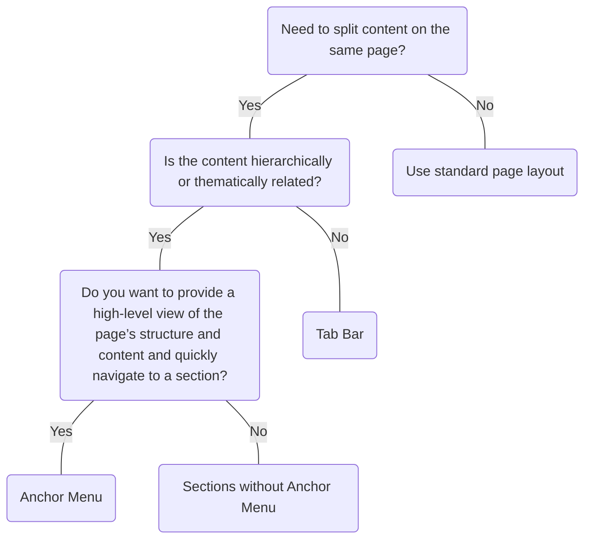

# Anchor Menu

## Overview

> Image: Illustration of an Anchor Menu.

## When to use this component

- When you have long-form content with multiple sections that users need to navigate within a single page.
- For providing a table of contents or outline view of page content.

## When to use another component

- For switching between different content views, use [`TabBar`] [1]

### Check out
- [TabBar] [1]

## Behavior 

### Appearance

#### Show the current page
Indicate where a user is within the navigational hierarchy. Pass the `itemId` to the `activeItemId` prop to set the currently active item to show users which page they have navigated to.

> Image: Examples of Anchor Menu active state highlighting. The first example with heart eyes emoji shows proper use of activeItemId to clearly indicate the current page section. The second example with grimacing emoji shows unclear active state indication that doesn

#### Spine
You can hide the side border spine. This is useful when the `AnchorMenu` is placed inside a container with its own border.

> Image: Examples of Anchor Menu spine border treatment, one with the spine border and the other without.

### Scrolling behavior
Clicking a menu link scrolls to the corresponding content section and updates the active indicator. The menu remains visible and updates the current location as users scroll through the page.

> Image: Example of Anchor Menu scrolling behavior. The example shows the Anchor Menu sticking to the top of the page as the content scrolls down.

## Usage

### Nesting
Use [`CollapsiblePanel`] [2] to group `AnchorMenu` links. Limit grouping to 1 level to maintain usability and prevent overwhelming users.

> Image: Examples of Anchor Menu nesting with Collapsible Panels.

### Links
Only use `AnchorMenu` to help users navigate within the same page. Don't use them to navigate to different pages.

> Image: Examples of Anchor Menu link usage. The first example with heart eyes emoji shows proper same-page navigation with anchor links to content sections. The second example with grimacing emoji shows incorrect use for cross-page navigation that breaks user expectations.

[1]: ./TabBar
[2]: ./CollapsiblePanel

## Examples

import React from 'react';

import DocExample from '@splunk/react-docs/DocExample';
import ExamplesPage from '@splunk/react-docs/ExamplesPage';

const examples = require.context('./examples/');
const examplesRaw = require.context('./examples/?prepareExamples');

function ExamplesSection() {
    return (
        <ExamplesPage>
            <DocExample
                key="Basic"
                code={examplesRaw('./Basic')}
                example={examples('./Basic').default}
            />
        </ExamplesPage>
    );
}

export default ExamplesSection;

## API

### AnchorMenu API

#### Props

| Name | Type | Required | Default | Description |
|------|------|------|------|------|
| activeItemId | string | no |  | The `itemId` prop of the currently active item. |
| children | React.ReactNode | no |  |  |
| elementRef | React.Ref<HTMLElement> | no |  | A React ref which is set to the DOM element when the component mounts and null when it unmounts. |
| hideSpine | boolean | no |  | Hides the side border spine. Useful when the AnchorMenu is placed inside a container with its own border. |
| label | string \| null | no | _('On this page:') | Label text to display above the menu items. Set to `null` to disable the label. |

