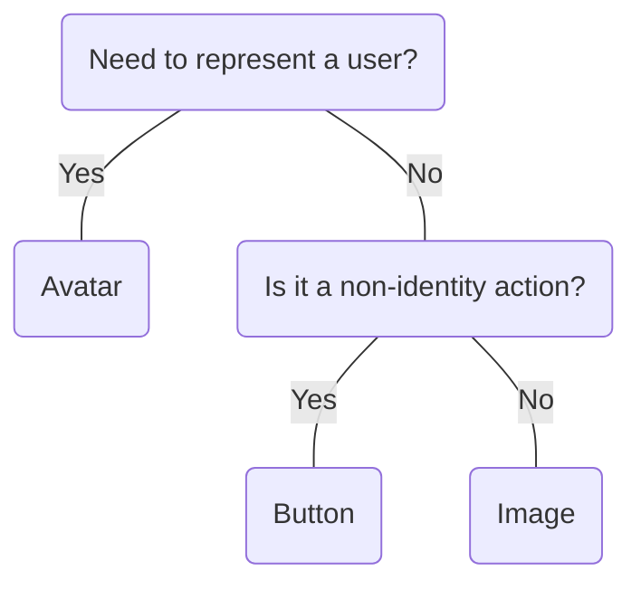

# Avatar

## Overview


> Image: Illustration of Avatar component showing user profile representations


## When to use this component
Use `Avatar` to represent a user in your application interface. It provides a visual identity for users through profile pictures, initials, or icons.

- To display user identity in profiles, user lists, or account settings.
- To show who performed an action in activity feeds or comments.
- To represent users in collaboration features or team member lists.
- To provide visual context for user-generated content.

### Additional considerations
- Always provide a meaningful label for accessibility.
- Use consistent sizing throughout your application.
- Consider using initials when profile pictures are not available.
- Ensure proper contrast between text and background colors.

## When to use another component
- For display of non-user entities like organizations or systems, use `Image`.
- For clickable actions that aren't related to user identity, use `Button`.



### Check out
- [Image][1]
- [Button][2]

## Behaviors

### Interactive
When an `onClick` handler or `to` prop is provided, the `Avatar` becomes interactive and can be clicked to navigate or trigger actions.

> Image: Examples of interactive Avatars. The first example with heart eyes emoji shows an Avatar with a subtle hover state. The second example with grimacing emoji shows an Avatar without clear interactive feedback.


### Image fallback
When an image fails to load, the `Avatar` automatically falls back to displaying initials, providing a consistent user experience.

> Image: Examples of image fallback behavior. The first example with heart eyes emoji shows an Avatar that gracefully falls back to initials when the image fails to load. The second example with grimacing emoji shows an Avatar with a broken image placeholder.


## Usage

### Size consistency
Use consistent `Avatar` sizes throughout your application. Group related `Avatars` using the same size for visual harmony.

> Image: Examples of Avatar size consistency. The first example with heart eyes emoji shows Avatars of consistent size in a user list. The second example with grimacing emoji shows Avatars of varying sizes creating visual inconsistency.


### Color and contrast
Ensure initials have sufficient contrast against the background color for accessibility compliance. By default, the component logic handles color contrast automatically.

> Image: Examples of proper color contrast. The first example with heart eyes emoji shows Avatars with good contrast between initials and background. The second example with grimacing emoji shows Avatars with poor contrast that are difficult to read.


## Content

### Meaningful labels
Always provide descriptive labels that clearly identify what the `Avatar` represents.

> Image: Examples of meaningful Avatar labels. The first example with heart eyes emoji shows an Avatar with a clear, descriptive label like 


### Initials best practices
Use 1-3 characters for initials, typically the first letter of first and last names.

> Image: Examples of proper initials usage. The first example with heart eyes emoji shows Avatars with appropriate 1-3 character initials. The second example with grimacing emoji shows Avatars with too many character initials.


### Image guidelines
Use high-quality, appropriately sized images that clearly show the person's face.

> Image: Examples of proper image usage. The first example with heart eyes emoji shows an Avatar with a clear, well-framed profile picture. The second example with grimacing emoji shows an Avatar with a low-quality or inappropriate image.


### Capitalization
Use all caps for `Avatar` labels to ensure consistency and clarity.

> Image: Examples of proper capitalization. The first example with heart eyes emoji shows an Avatar label in all caps. The second example with grimacing emoji shows an Avatar label with improper capitalization.


[1]: ./Image
[2]: ./Button

## Examples


### Basic

An Avatar can show one to three characters. You can use the `getInitials` helper to shorten a name.

```typescript
import React from 'react';

import Avatar, { getInitials } from '@splunk/react-ui/Avatar';
import Layout from '@splunk/react-ui/Layout';


export default function Basic() {
    return (
        <Layout>
            <Avatar initials="A" label="Amelia's profile" />
            <Avatar initials={getInitials('Amelia Earhart')} label="Amelia Earhart's profile" />
        </Layout>
    );
}
```


### Image

An Avatar can show an image provided as an icon, , or asset.

```typescript
import React from 'react';

import Portrait from '@splunk/react-icons/Portrait';
import Avatar from '@splunk/react-ui/Avatar';
import Layout from '@splunk/react-ui/Layout';

import profilePicture from '../assets/profilePicture.png';


export default function Image() {
    return (
        <Layout>
            <Avatar
                initials="AY"
                image={}
                label="Anna Yang's profile"
            />
            <Avatar initials="AE" image={<Portrait />} label="Amelia Earhart's profile" />
        </Layout>
    );
}
```


### Background color

```typescript
import React from 'react';

import Avatar from '@splunk/react-ui/Avatar';
import Layout from '@splunk/react-ui/Layout';
import { pick, variables } from '@splunk/themes';

const avatarColor = pick({
    light: variables.sequential6D7,
    dark: variables.sequential6D3,
});


export default function BackgroundColor() {
    return (
        <Layout>
            <Avatar backgroundColor={avatarColor} initials="AE" label="Amelia Earhart's profile" />
            <Avatar
                backgroundColor="rgb(255, 103, 123)"
                initials="AE"
                label="Amelia Earhart's profile"
            />
            <Avatar backgroundColor="#2d2d53" initials="AE" label="Amelia Earhart's profile" />
            <Avatar
                backgroundColor="cornflowerblue"
                initials="AE"
                label="Amelia Earhart's profile"
            />
        </Layout>
    );
}
```


### Interactive

Avatars can be interactive by including the appropriate props to make them buttons or links.

```typescript
import React from 'react';

import Avatar from '@splunk/react-ui/Avatar';
import Layout from '@splunk/react-ui/Layout';

import profilePicture from '../assets/profilePicture.png';


export default function Interactive() {
    return (
        <Layout>
            <Avatar
                image={}
                initials="AE"
                label="Amelia Earhart's profile"
                onClick={() => {}}
            />
            <Avatar initials="AY" label="Anna Yang's profile" to="#Interactive" />
        </Layout>
    );
}
```


### Size

Avatars can be one of three standard sizes: small, medium (default), or large. The size prop can also be a string if the standard size doesn't fit your use case. Note: using a non-standard size may have unexpected layouts when combined with other components.

```typescript
import React from 'react';

import Avatar from '@splunk/react-ui/Avatar';
import Layout from '@splunk/react-ui/Layout';


export default function Size() {
    return (
        <Layout>
            <Avatar initials="AE" label="Amelia Earhart's profile" size="small" />
            <Avatar initials="AE" label="Amelia Earhart's profile" size="medium" />
            <Avatar initials="AE" label="Amelia Earhart's profile" size="large" />
        </Layout>
    );
}
```


## API


### Avatar API

#### Props

| Name | Type | Required | Default | Description |
|------|------|------|------|------|
| backgroundColor | \| string \| Interpolation<Enterprise, OptionalThemedProps<Enterprise>> \| Interpolation<Prisma, OptionalThemedProps<Prisma>> | no |  | All CSS color definitions are supported, such as `#223344` or `red`. Using `theme` enables the theme default. |
| elementRef | React.Ref<HTMLAnchorElement \| HTMLButtonElement \| HTMLDivElement> | no |  | A React ref which is set to the DOM element when the component mounts and `null` when it unmounts. |
| image | React.ReactNode | no |  | The image to be displayed inside this `Avatar`, for example an `` or `<svg>`. |
| initials | string | yes |  | The contents of this `Avatar` if the `image` prop is not set or the provided image is not valid. Must not exceed three characters in length. |
| label | string | yes |  | Text to describe what this Avatar represents. |
| onClick | AvatarClickHandler | no |  | Enables interactive mode. |
| size | 'small' \| 'medium' \| 'large' \| string | no | 'medium' | Adjusts the size of the `Avatar`. |
| to | string | no |  | If set, the component will be rendered as an `<a>` tag with `href` equal to this prop rather than a `<button>` tag. |
| value | string | no |  | The value returned with `onClick` events, which can be used to identify the control when multiple controls share an `onClick` callback. Not to be confused with `initials`. |

#### Types

| Name | Type | Description |
|------|------|------|
| AvatarClickHandler | (     event: React.MouseEvent<HTMLButtonElement>,     data: { value?: string } ) => void |  |


#### Utils


#### getInitials(name)

Returns a suitable set of initials for a name. Uses the first character of each
name segment and omits middle segments if the segment count is greater than three.

##### Parameters

| Name | Type | Optional | Default | Description |
|------|------|------|------|------|
| name | string | no |  | The full name. |

##### Returns

**string** - Limited to three characters. Empty if `name` is empty.


