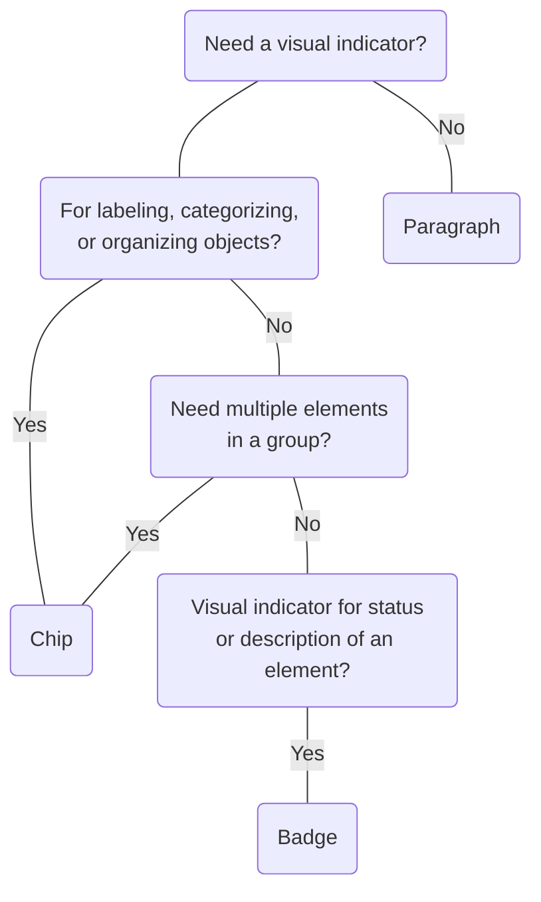

# Badge

## Overview


> Image: Illustration of a group of three Badges.


## When to use this component
Badges serve as visual indicators used to communicate a status, numeric value, or other associated metadata of an object.

- To represent a status, property, or specific metadata for an object (e.g., "New", "Beta", "Active", "Warning").
- To display a count of associated items (e.g., number of unread messages, items in a category).
- To visually annotate an item, drawing attention to its current state or characteristic.

## When to use another component

- When you need to represent input, attribute, or actions of an object, use `Chip`. 

### Decision tree




### Check out
-   [Chip][1]

## Usage

### Placement
Badges are positioned to the side of their associated context. 

> Image: Example of badge placed next to a text label.


### Non-interactive
Badges are non-interactive and serve purely as visual indicators.

> Image: The first example with heart eyes emoji shows a badge that is non interactive. The second example with grimacing emoji shows the badge with hover indicating it can be clicked.


### Standalone
Do not use multiple badges for similar type of page or object annotations, such as "new," "updated," or "experimental."

> Image: The first example with heart eyes emoji shows a heading with a single badge next to it. The second example with grimacing emoji shows a heading with mutliple badges that represent similar type of information next to it.


### Grouping Multiple Badges
In scenarios where an object has multiple concurrent states or properties, such as an incident that is "active", critically "severe", and "AI-detected", displaying multiple badges together is appropriate. Grouping badges allows each distinct property to be visually represented without conflating their meanings. Avoid overloading the interface with excessive badges; prioritize the most relevant states (tyipcally 1-3) for display.

> Image: The first example with heart eyes emoji shows a heading with a distinct badges. The second example with grimacing emoji shows a heading with a large number of badges next to it.


### Count Handling

#### Showing Zero '0'
Badges with a zero count should generally not be rendered to avoid unnecessary visual noise. However, there are specific instances where explicitly showing '0' is relevant and provides meaningful context (e.g., indicating "no alerts" or "zero items in a list"). 

> Image: The first example with heart eyes emoji shows a heading with no badge, indicating no objects. The second example with grimacing emoji shows heading with a badge with count zero.


#### Max count
When a count exceeds a certain threshold, it is often more effective to display a maximum value (e.g., '99+') rather than the exact large number. To achieve this, use the `truncateNumber` utility from `@splunk/ui-utils`.

> Image: The first example with heart eyes emoji shows a heading with badge that shows a max count of 


## Content

### Write concise labels: 1-3 words
Badges should provide concise information. For text-based Badges, keep the text brief and descriptive. When using icons, ensure they clearly communicate the status or description. 

> Image: The first example with heart eyes emoji shows a badge with concise text. The second example with grimacing emoji shows a badge with very lengthy text.


### Follow color contrast guidelines
When using custom colors, ensure you are following the WCAG guideline of a contrast ratio &gt= 4.5:1 between text and background. [SC 1.4.3][2]

> Image: Example of a badge with custom colours. In the first example with heart eyes, the badge label is dark and abide by the 4.5 to 1 contrast guidelines. In the second example with the grimacing face, the badge label is similar to the background colours, breaking the contrast guidelines.


[1]: ./Chip
[2]: https://www.w3.org/TR/WCAG21/#contrast-minimum

## Examples


### Basic

```typescript
import React from 'react';

import Badge from '@splunk/react-ui/Badge';


export default function Basic() {
    return <Badge label="Beta" />;
}
```


### Count

To set a max count, use the `truncateNumber` util from [@splunk/ui-utils](../ui-utils/Format).

```typescript
import React from 'react';

import Badge from '@splunk/react-ui/Badge';
import Layout from '@splunk/react-ui/Layout';
import { truncateNumber } from '@splunk/ui-utils/format';


export default function Count() {
    const count = truncateNumber({ number: 110, max: 99 });

    return (
        <Layout>
            <Badge label="5" />
            <Badge label={count} />
        </Layout>
    );
}
```


### With icons

Use the `icon` prop with an icon component (e.g., `@splunk/react-icons`) to add visual context or emphasis alongside the badge's `label`. When using an icon, a label must also be provided.

```typescript
import React from 'react';

import Lightbulb from '@splunk/react-icons/Lightbulb';
import Badge from '@splunk/react-ui/Badge';


export default function Icon() {
    return <Badge icon={<Lightbulb />} label="Beta" />;
}
```


### Custom colors

The background and text of Badge can be customized with the `backgroundColor` and `foregroundColor` props. Prefer using variables from `@splunk/themes`, but other valid CSS color values are supported. In all cases, you must check that the chosen colors meet [contrast minimum for text of 4.5:1](https://www.w3.org/WAI/WCAG21/Understanding/contrast-minimum.html#user%20interface%20component).

```typescript
import React from 'react';

import Badge from '@splunk/react-ui/Badge';
import Layout from '@splunk/react-ui/Layout';
import { variables } from '@splunk/themes';


export default function CustomColors() {
    return (
        <Layout>
            <Badge
                label="RGB"
                backgroundColor="rgb(255, 135, 139)"
                foregroundColor="rgb(0, 0, 0, 0.9)"
            />
            <Badge label="Hexcode" backgroundColor="#1AB2FF" foregroundColor="#000" />
            <Badge
                label="Variables"
                backgroundColor={variables.notificationColorPositive}
                foregroundColor={variables.contentColorInverted}
            />
            <Badge label="Named Colors" backgroundColor="cornflowerblue" foregroundColor="black" />
        </Layout>
    );
}
```


## API


### Badge API

#### Props

| Name | Type | Required | Default | Description |
|------|------|------|------|------|
| backgroundColor | \| React.CSSProperties['color'] \| Interpolation<AnyTheme, OptionalThemedProps<AnyTheme>> | no |  | Changes the background color. Accepts `@splunk/themes` variable or any valid `color` value. |
| elementRef | React.Ref<HTMLSpanElement> | no |  | A React ref which is set to the DOM element when the component mounts and null when it unmounts. |
| foregroundColor | \| React.CSSProperties['color'] \| Interpolation<AnyTheme, OptionalThemedProps<AnyTheme>> | no |  | Changes the text and icon color. Accepts `@splunk/themes` variable or any valid `color` value. |
| icon | React.ReactNode | no |  | Icon before the label. |
| label | string | yes |  | The content of the badge. |


