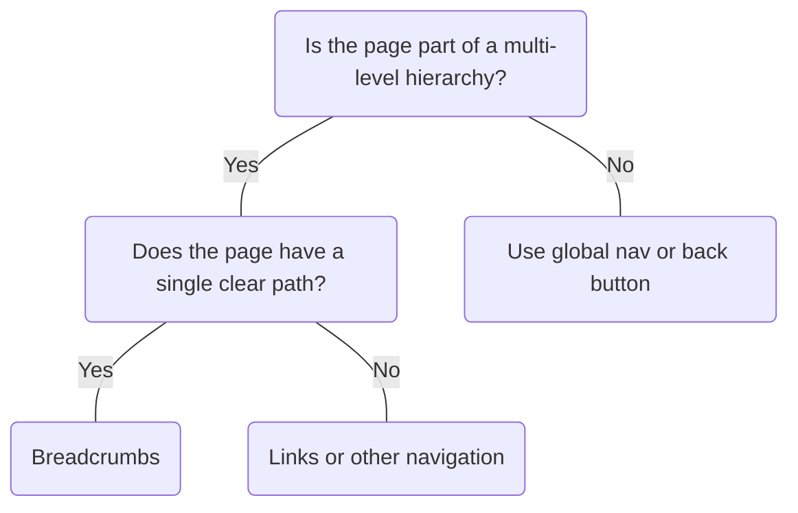

# Breadcrumbs

## Overview


> Image: Illustration of a Breadcrumb component.


## When to use this component
- The website or app structure has a large amount of content within a hierarchy of more than two levels.
- Pages are deeply nested and users could benefit from a sense of place to orient themselves and discover new content.

## When to use another component
- For selecting a specific page from a range of pages, use Paginator.
- For conveying progress with numbered steps, use Step Bar.
- For switching between related sections on the same level of hierarchy, use Tab Bar.
- Products have a single level navigation.



### Check out
- [Paginator][1]
- [Step Bar] [2]
- [Tab Bar] [3]

## Behaviors

### Don’t hyperlink the current page
Allow users to navigate to parent pages in the breadcrumb trail.
<ImageAsset
    context={require.context('./assets/clickable', false, /\.png$/)}
    alt="Breadcrumb navigation showing 'Home > Community > Contact us.' The 'Community' breadcrumb is underlined with a hand cursor hovering over it, indicating it is clickable, while 'Contact us' is the current page and not clickable."
/>


## Usage

### Don’t violate the Splunk logo with overrides
Do not override the separator '/'. Do not use the greater-than sign '>' or any iconography that is similar.
<ImageAsset
    context={require.context('./assets/separator', false, /\.png$/)}
    alt="Two breadcrumb examples. The first example with a heart eyes emoji uses a forward slash ('/') as a separator, displaying 'Page 1 / Page 2 / Current page.' The second example with a grimacing face emoji uses a greater-than symbol ('>') as a separator, which violates the Splunk brand guidelines."
/>

### Position accordingly
Breadcrumbs should be positioned below the top navigation and above the page title.
> Image: Two examples showing breadcrumb placement in relation to the page title. In the first example with a heart eyes emoji the Breadcrumb is positioned above the page title. In the second example with a grimacing face emoji the Breadcrumb is positioned below the page title, highlight improper positioning of Breadcrumb component.


### Match the page title
Keep the current page breadcrumb the same as the page title.
> Image: Two examples showing breadcrumbs and page titles. The first example with a heart eyes emoji shows a breadcrumb 


### Provide a logical hierarchy
Ensure that the hierarchy mirrors the actual structure of the content or navigation.
> Image: Two breadcrumb examples showing content hierarchy. The first example, with a heart eyes emoji, displays 


### Allow for natural wrapping
Ensure that no individual breadcrumb item splits between lines, allowing the breadcrumb container to only break when necessary to maintain readability.
> Image: Two breadcrumb examples showing content hierarchy. The first example, with a heart eyes emoji, displays 


### Complement the main navigation
Breadcrumbs are a secondary navigation method and should complement the main navigation system, not replace it.
> Image: Two interface examples showing Breadcrumb usage with navigation. The first example, with a heart eyes emoji, has both a top navigation bar with the Splunk logo and a left sidebar navigation. The Breadcrumbs, 


### Don’t use more than one breadcrumb per page
Having more than one breadcrumb on a page can overwhelm or mislead users.
> Image: Two interface examples show breadcrumb usage. The first example, with a heart eyes emoji, displays a single Breadcrumb 


## Content

### Limit breadcrumb to single line
Wrapping can make the hierarchy confusing.
> Image: Two examples showing Breadcrumb usage. The first example, with a heart eyes emoji, displays the Breadcrumb 


[1]: ./Paginator
[2]: ./StepBar
[3]: ./TabBar

## Examples


### Basic

```typescript
import React from 'react';

import Breadcrumbs from '@splunk/react-ui/Breadcrumbs';


function Basic() {
    return (
        <Breadcrumbs>
            <Breadcrumbs.Item to="#home" label="Home" />
            <Breadcrumbs.Item to="#design-principles" label="Design principles" />
            <Breadcrumbs.Item to="#components" label="Using components" />
            <Breadcrumbs.Item to="#setup" label="Setup a provider" />
        </Breadcrumbs>
    );
}

export default Basic;
```


### Adornments

A startAdornment and/or endAdornment can be added to a Breadcrumbs.Item. Icons should be decorative.

```typescript
import React from 'react';

import Cog from '@splunk/react-icons/Cog';
import GeoTag from '@splunk/react-icons/GeoTag';
import Lock from '@splunk/react-icons/Lock';
import Portrait from '@splunk/react-icons/Portrait';
import Breadcrumbs from '@splunk/react-ui/Breadcrumbs';


function Adornments() {
    return (
        <Breadcrumbs>
            <Breadcrumbs.Item to="#account" label="Account" startAdornment={<Portrait />} />
            <Breadcrumbs.Item to="#settings" label="Settings" startAdornment={<Cog />} />
            <Breadcrumbs.Item
                to="#privacy"
                label="Personal privacy"
                startAdornment={<Portrait />}
                endAdornment={<Lock />}
            />
            <Breadcrumbs.Item to="#history" label="Location history" endAdornment={<GeoTag />} />
        </Breadcrumbs>
    );
}

export default Adornments;
```


### Customized click

```typescript
import React, { useState } from 'react';

import Breadcrumbs, { BreadcrumbsClickHandler } from '@splunk/react-ui/Breadcrumbs';
import DL, { Term as DT, Description as DD } from '@splunk/react-ui/DefinitionList';
import Typography from '@splunk/react-ui/Typography';

const asideStyle = { marginTop: 20 };
const overflowStyle = { overflow: 'scroll' };


function CustomizedClick() {
    const [, setClickTo] = useState<string | undefined>();

    const [activeItemData, setActiveItemData] = useState<string>();

    const handleClick: BreadcrumbsClickHandler = (e, data) => {
        const { to } = data;

        setClickTo(to);
        setActiveItemData(JSON.stringify(data));
    };

    return (
        <>
            <Breadcrumbs onClick={handleClick}>
                <Breadcrumbs.Item to="#home" label="Home" />
                <Breadcrumbs.Item to="#community" label="Community" />
                <Breadcrumbs.Item to="#contactUs" label="Contact Us" />
            </Breadcrumbs>
            <aside style={asideStyle} aria-live="polite" aria-relevant="text">
                <Typography as="p">Click a `Breadcrumbs.Item` to see the returned data</Typography>
                {activeItemData ? (
                    <div style={overflowStyle}>
                        <DL>
                            <DT>Data:</DT>
                            <DD>
                                <code>{activeItemData}</code>
                            </DD>
                        </DL>
                    </div>
                ) : null}
            </aside>
        </>
    );
}

export default CustomizedClick;
```


## API


### Breadcrumbs API

#### Props

| Name | Type | Required | Default | Description |
|------|------|------|------|------|
| children | React.ReactElement<typeof Item>[] \| React.ReactElement<typeof Item> | yes |  | `children` must be of type `Breadcrumbs.Item`. The last child will be marked as the current page. |
| elementRef | React.Ref<HTMLElement> | no |  | A React ref which is set to the DOM element when the component mounts and null when it unmounts. |
| enableCurrentPage | boolean | no |  | By default, the current page is a dimmed link. This prop changes this behavior by enabling the current page link. |
| onClick | BreadcrumbsClickHandler | no |  | An `onClick` handler for all Items. The function takes the event and an options argument with `to` and `label`. |

#### Types

| Name | Type | Description |
|------|------|------|
| BreadcrumbsClickHandler | (     event: React.MouseEvent<HTMLAnchorElement>,     data: {         label?: string;         to: string;     } ) => void |  |


### Breadcrumbs.Item API

#### Props

| Name | Type | Required | Default | Description |
|------|------|------|------|------|
| elementRef | React.Ref<HTMLAnchorElement> | no |  | A React ref which is set to the DOM element when the component mounts and null when it unmounts. |
| endAdornment | React.ReactNode | no |  | Adornment at the end of the label. |
| label | string | yes |  | The label of the `Item`. |
| onClick | BreadcrumbsClickHandler | no |  | An `onClick` handler for the current `Item`. |
| startAdornment | React.ReactNode | no |  | Adornment at the start of the label. |
| to | string | yes |  | The URL or path to link to. |


## Accessibility

## Component Use Cases

*   Visual users know where they are in a product.
*   Screen reader users have confirmation of the page they are on while tabbing.

## Human Impact Overview

Breadcrumbs help users understand where they are in a product’s information architecture by displaying the parent pages of the current page in a hierarchical order. By having the component at the top of the page, a consistent guide is available, benefitting new product users and those with memory and focus difficulties.
When breadcrumbs are interactive, they create a highly visible and convenient method to return to a page, particularly for keyboard-only and screen reader users who would have to navigate through navigation and browser components.

## Expected User Experience

* **Able-bodied user:** User sees breadcrumb component, likely under navigation bar and before header. They understand where they are in the app, and if needed, can click on any of the parent pages to go back.
* **Colorblind user:** User sees breadcrumb component. Placement and link treatment inform user that the component is interactive and can choose assistive technology of choice to interact with the component.
* **Keyboard-only user:** After either the “skip to main content” button or after all interactive navigation has passed, the first page in the breadcrumb component receives focus. The user is able to tab through the remaining pages before moving to main.
* **Screen reader user:** After either from the “skip to main content” button or after all interactive navigation, the screen reader announces that user has entered a nav element.

## WCAG 2.2 Level A and AA Requirements

### Design:

* [Use of Color][1] **(SC 1.4.1, Level A):** Because not all users can see colors the same way, there must be an additional differentiator between the prior and current page of the breadcrumb.
* [Color Contrast][2] **(SC 1.4.3, Level AA):** All text and symbols to background must have a color contrast ratio of >=4.5.1.

### Implementation:

* [Keyboard Accessible][3] **(SC 2.1.1, Level A):** Close icon, and when applicable, in-line link, must be accessible via keyboard.
    * <kbd>Tab</kbd> and <kbd>Shift+Tab</kbd>: moves through hierarchy.
    * <kbd>Space</kbd> and <kbd>Enter</kbd>: navigates to selected link.
* [Focus Visible][4] **(SC 2.4.6, Level A):** Focus must be visible on any interactive element.

    * For a focus border of &lt3px, color contrast must be &gt=4.5:1
    * For a focus border of &gt3pc, color contrast must be &gt3:1

* [Consistent Navigation][5] **(SC 3.2.6, Level AA):** Breadcrumb names should replicate page names for consistency and exist in the same place on every webpage, where applicable.
* [Meaningful Sequence][6] **(SC 1.3.2, Level A):** On a page, breadcrumbs should appear or be announced after any primary and secondary (i.e. left side) navigation.

## Additional Recommendations

* Breadcrumb should follow the [A11y and Docs Team Stance on Character Usage][7] and use forward slash.
* Implementation should align to [WAI-ARIA Breadcrumb Practices][8].
* For screen readers:
    * Every clickable level/title is implemented as a **link** (not button).
    * Breadcrumb should be an ordered list within a labeled navigation landmark region, where the active page is marked with  `aria-current=”page”`. The last breadcrumb item will be automatically marked as the currently active page.
* Labels are required and icons should be decorative.

[1]: https://www.w3.org/TR/WCAG21/#use-of-color
[2]: https://www.w3.org/TR/WCAG21/#contrast-minimum
[3]: https://www.w3.org/TR/WCAG21/#keyboard-accessible
[4]: https://www.w3.org/TR/WCAG21/#focus-visible
[5]: https://www.w3.org/TR/WCAG21/#consistent-navigation
[6]: https://w3c.github.io/wcag/guidelines/22/#meaningful-sequence
[7]: https://docs.google.com/document/d/1av2jxk8n6DLHsq24_9szrsRQETR7ABWmJqCys0VJwXs/edit?usp=sharing
[8]: https://www.w3.org/TR/wai-aria-practices/#breadcrumb


