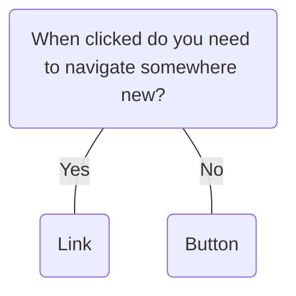

# Button

## Overview


> Image: Illustration of a button group, the first button is grey and the second is blue.


## When to use this component
Buttons are crucial interface elements that facilitate user interaction by triggering specific actions. Primary buttons are designated for primary actions and should only appear once, while secondary buttons are used for less prominent actions and can appear multiple times.

- To trigger an action or event
- To alert the user to a required action in a flow

### Additional considerations
- We advise against using disabled buttons, even if issues arise (notably in filters and modal windows with a single call to action). It's crucial for users to recognize that the product/service is operational. If a user clicks the button, provide an error message or guidance on the next steps.
- Limit the number of primary action buttons per focus area.
- Limit the use of icons to ones that convey the most meaning to users.

## When to use another component
- Buttons are used to complete an action; if you are providing navigation, implement a `Link`.
- When you have two or more actions related to the primary action that need to be consolidated and space is limited, use a `SplitButton`.



### Check out
- [Link] [1]
- [Split Button] [2]

## Usage

### Clear call to action
Avoid using multiple primary actions. Instead, use alternate button appearances to support additional actions.
> Image: Examples of a button group with a clear call to action. The first example with heart eyes emoji has a secondary button next to a primary button. The second example with a grimacing emoji has two primary buttons.


### Avoid disabled buttons
Always enable buttons, use validation in forms, and provide an error message or guidance on the next steps.
> Image: Example with two modals. The first modal example with heart eyes emoji has an error message and an enabled button. The second example with a grimacing emoji does not use an error message and disables the button.


### Dimmed button
If you absolutely need to disabled a button, use a dimmed button. This ensure users can still navigate to the button when using assistive technologies.
> Image: Example of using a dimmed button. The first example with heart eyes emoji has a dimmed button that is focused. The second example with a grimacing emoji uses a disabled button that is not dimmed and cannot receive focus.


### Button pairing
When using multiple buttons in a group, it’s best to use only two different appearances.
> Image: Examples of button appearance pairings. The first example with heart eyes emoji has three buttons in a group, the first two use the same secondary appearance and the third uses the primary appearance. The second example with a grimacing emoji has three buttons in a group. The first uses the flat appearance, the second uses default appearance, and the third uses primary appearance.


### Destructive actions
Use the destructive button appearance for destructive actions.
> Image: Examples of destructive actions. The first example with heart eyes emoji has two buttons in a group. The first button in the group uses the secondary appearance and the second button uses the destructive red appearance. The second example with a grimacing emoji has two buttons in a group and the second button using the primary appearance for a destructive action.


### Toggle actions and state
Toggle buttons convey both the current state and the expected interaction outcome. Whenever possible, use tooltips and visual cues (e.g. filled icons, color changes, etc.) to communicate both pieces of information.
> Image: Examples of toggle buttons and their state. The first example with heart eyes emoji has two icon buttons in a group. The first button is a pin icon that uses and outline and is not filled,  the second button is hovered and uses an eye icon that is filled and has a tooltip above it with 


## Content guidelines
- Start button text with a verb when possible.
- Avoid vague or generic language such as “click here” or “read more”; this is not helpful for screen reader users.
- Avoid any acronyms or confusing jargon that may leave a user guessing or afraid to click on a button (SC 2.4.4).

### Label should not exceed three words
Write concise button labels: 1 or 2 words.
> Image: Examples of button label length. The first example with heart eyes emoji has a primary button with a label the reads 


### Use sentence-style capitalization
> Image: Examples of sentence-style for button labels. The first example with heart eyes emoji has a primary button with a label using sentence-style capitalization that reads 


### Use precise language
Describe the action. For example, use “Add” when using an existing object in a new context, and use “Create” when making a new object from scratch.
> Image: Examples of precise language for button labels. The first example with heart eyes emoji has a primary button with a label that reads 


### Label overflow
While usage guidelines for content recommend one to two words for buttons, for internationalization there might be instances when text needs to overflow.
> Image: Examples of button label overflow. The first example with heart eyes has a primary button that is hovered with a truncated label that reads 


[1]: ./Link
[2]: ./SplitButton

## Examples


### Basic

```typescript
import React from 'react';

import Button from '@splunk/react-ui/Button';
import Layout from '@splunk/react-ui/Layout';


function Basic() {
    return (
        <Layout>
            <Button label="Primary" appearance="primary" />
            <Button label="Secondary" />
            <Button label="Destructive" appearance="destructive" />
            <Button label="Standalone" appearance="standalone" />
            <Button label="Subtle" appearance="subtle" />
        </Layout>
    );
}

export default Basic;
```


### With icons

By default, icons appear to the left of Button text. If you want an icon to appear the right of Button text, add it as a child and correct margins or other positioning as necessary.

```typescript
import React from 'react';

import Printer from '@splunk/react-icons/Printer';
import TrashCanCross from '@splunk/react-icons/TrashCanCross';
import Button from '@splunk/react-ui/Button';
import Layout from '@splunk/react-ui/Layout';


function Icons() {
    return (
        <Layout>
            <Button icon={<Printer />} />
            <Button icon={<Printer />} label="Print" />
            <Button icon={<Printer />} appearance="primary" label="Print" />
            <Button icon={<Printer />} appearance="standalone" label="Print" />
            <Button icon={<Printer />} appearance="subtle" label="Print" />
            <Button icon={<TrashCanCross />} appearance="destructive" label="Delete" />
        </Layout>
    );
}

export default Icons;
```


### With menu indicator

Add the isMenu prop to display the menu indicator to the right of Button text. See [Dropdown](Dropdown) to learn how to create a dropdown menu.

```typescript
import React from 'react';

import Button from '@splunk/react-ui/Button';
import Layout from '@splunk/react-ui/Layout';


function Menus() {
    return (
        <Layout>
            <Button isMenu label="Default" />
            <Button isMenu appearance="primary" label="Primary" />
            <Button isMenu appearance="subtle" label="Subtle" />
        </Layout>
    );
}

export default Menus;
```


### As a link

Add the to prop to indicate that the Button behaves as a link. The openInNewContext prop will open the link in a new window or tab and display the external link indicator

```typescript
import React from 'react';

import Button from '@splunk/react-ui/Button';
import Layout from '@splunk/react-ui/Layout';


function To() {
    return (
        <Layout style={{ flexDirection: 'column', alignItems: 'flex-start' }}>
            <Layout>
                <Button to="Select" label="Select component" />
                <Button to="Select" appearance="primary" label="Select component" />
                <Button to="Select" appearance="standalone" label="Select component" />
                <Button to="Select" appearance="subtle" label="Select component" />
            </Layout>
            <Layout>
                <Button to="https://www.splunk.com" openInNewContext label="Splunk" />
                <Button
                    to="https://www.splunk.com"
                    openInNewContext
                    appearance="primary"
                    label="Splunk"
                />
                <Button
                    to="https://www.splunk.com"
                    openInNewContext
                    appearance="standalone"
                    label="Splunk"
                />
                <Button
                    to="https://www.splunk.com"
                    openInNewContext
                    appearance="subtle"
                    label="Splunk"
                />
            </Layout>
        </Layout>
    );
}

export default To;
```


### Block sized

By default, Buttons exist in inline blocks. Set inline to false to make the Button the full width of the parent container.

```typescript
import React from 'react';

import Button from '@splunk/react-ui/Button';
import Layout from '@splunk/react-ui/Layout';


function Block() {
    return (
        <Layout style={{ flexDirection: 'column', width: '300px' }}>
            <Button inline={false} appearance="primary" label="Primary" />
            <Button inline={false} appearance="secondary" label="Secondary" />
            <Button inline={false} appearance="standalone" label="Standalone" />
        </Layout>
    );
}

export default Block;
```


### Disabled

Consider keeping Buttons enabled and inform the user why the action may have failed or can't be completed. Disabling buttons creates barriers for all users and can exclude people with disabilities. If a Button is passed disabled the default behavior is to render a 'dimmed' button. This ensures the button is still discoverable and can receive focus, but the button cannot not be activated by the user. If necessary, a Button can be completely disabled by setting disabled='disabled'. In these cases, consider contacting us to collaborate on alternatives for a more inclusive experience.

```typescript
import React from 'react';

import DotsThreeVertical from '@splunk/react-icons/DotsThreeVertical';
import Button from '@splunk/react-ui/Button';
import Layout from '@splunk/react-ui/Layout';


function Disabled() {
    return (
        <Layout>
            <Button disabled label="Default" />
            <Button disabled icon={<DotsThreeVertical height="16px" width="16px" />} />
            <Button disabled label="Primary" appearance="primary" />
            <Button disabled label="Destructive" appearance="destructive" />
            <Button disabled label="Standalone" appearance="standalone" />
            <Button disabled label="Subtle" appearance="subtle" />
        </Layout>
    );
}

export default Disabled;
```


## API


### Button API

#### Props

| Name | Type | Required | Default | Description |
|------|------|------|------|------|
| action | string | no |  | Returns a value on click. Use when composing or testing. |
| appearance | \| 'default' \| 'secondary' \| 'primary' \| 'destructive' \| 'destructiveSecondary' \| 'standalone' \| 'subtle' | no | 'default' | Changes the style of the button. |
| append | boolean | no |  | Removes the right border and border-radius of the button so you can append other elements to it. |
| children | React.ReactNode | no |  |  |
| disabled | boolean \| 'dimmed' \| 'disabled' | no |  | Prevents user from activating the button and adds disabled styling.  If set to `dimmed`, the component is able to receive focus. If set to `disabled`, the component is unable to receive focus (as a result of setting the html `disabled` attribute).  The default behavior when `disabled={true}` is `dimmed`. |
| elementRef | React.Ref<HTMLAnchorElement \| HTMLButtonElement> | no |  | A React ref which is set to the DOM element when the component mounts and null when it unmounts. |
| icon | React.ReactNode | no |  | Applies an icon to the button. See @splunk/react-icons documentation for more information. |
| inline | boolean | no | true | Restricts the horizontal size of the button. Set `inline` to `false` to remove the right margin and stretch the button to the full width of its container. |
| isMenu | boolean | no |  | Uses interactive styling and adds the chevron-down icon to indicate menu behavior.  **Accessibility:** This prop should be used with the `Dropdown` component, which manages the required `aria-controls` and `aria-expanded` attributes. If not using `Dropdown`, you must manually provide these ARIA attributes. |
| label | React.ReactNode | no |  | Applies the text that displays on the button. |
| onClick | (     event: React.MouseEvent<HTMLAnchorElement \| HTMLButtonElement>,     data: {         action?: string;         icon?: React.ReactNode;         label?: React.ReactNode;         value?: any; // eslint-disable-line @typescript-eslint/no-explicit-any     } ) => void | no |  | Called when the user activates the button. |
| openInNewContext | boolean \| string | no |  | Open the "to" link in a new context, which is usually a new tab or window based on browser settings.  An icon and a screen reader message is added to indicate this behavior to users. The default message is "(Opens new window)"; this can be customized by passing a string instead of boolean to `openInNewContext`. |
| prepend | boolean | no |  | Removes the left border and border-radius of the button so you can prepend elements to it. |
| to | string | no |  | Identifies the URL for a link. If set, Splunk UI applies an <a> tag instead of a <button> tag. |
| value | any | no |  | Returns a value on click. Use when composing or testing. |


## Accessibility

Buttons are used to complete an action; if you are providing navigation, implement a link.

## Visual Design
- Color contrast ratio **MUST** be:
    - &gt= 4.5:1 between text and background [SC 1.4.3][1]
    - &gt= 3:1 between button outline color to background OR icon color to background [SC 1.4.11][2]
    - Focus State: If the focus ring has a radius of [SC 1.4.11][2]
        - &lt 3px: &gt= 4.5.1 between button &lt&gt focus &lt&gt background
        - &gt 3px: &gt= 3.1 button button &lt&gt focus &lt&gt background

## Content
- **SHOULD** avoid vague or generic language such as “click here” or “read more”, or acronyms that are not widely known to users

## States
- Color contrast guidelines do not apply to disabled button

## Interaction Model
- **MUST** be perceivable and functional when when zoomed from 50-200% [SC 1.4.4][3] [SC 1.4.10][4]
- **SHOULD** use button semantics to be addressed by screen reader
- Icon buttons **MUST** have a tooltip that describes its function on hover [SC 1.4.13][5]

## Implementation
- **MUST** have a visible focus border [SC 2.4.7][6]
- **MUST** have keyboard navigation [SC 2.1][7]
- <kbd>ENTER</kbd>/<kbd>SPACE</kbd> to execute the action
- <kbd>TAB</kbd> to move focus to next interactive element
- <kbd>SHIFT</kbd>+<kbd>TAB</kbd> to move the focus to the previous interactive element
- **MUST** use a button for an action on the page. This should be reflected in wireframes, otherwise confirm with the designer before new implementation. [SC 4.1.2][8]
- Focus Management **SHOULD** be considered. Example behaviors are:
    - When pressing a button without a change in context, focus **MUST NOT** be lost (i.e. a refresh button refreshes a table or data visualization)
    - When pressing a button with a change in context, focus **MUST** be moved to first available component (i.e. primary button that requires page reload, so focus moves to first interactive element on new page)
- Buttons within other components **SHOULD** have consultation with a11y team to determine most accessible experience

[1]: https://www.w3.org/WAI/GL/UNDERSTANDING-WCAG20/visual-audio-contrast-contrast.html
[2]: https://www.w3.org/WAI/WCAG21/Understanding/non-text-contrast.html
[3]: https://www.w3.org/WAI/GL/UNDERSTANDING-WCAG20/visual-audio-contrast-scale.html
[4]: https://www.w3.org/WAI/WCAG21/Understanding/reflow.html
[5]: https://www.w3.org/TR/WCAG21/#content-on-hover-or-focus
[6]: https://www.w3.org/TR/WCAG21/#focus-visible
[7]: https://www.w3.org/TR/WCAG21/#keyboard-accessible
[8]: https://www.w3.org/TR/WCAG21/#name-role-value


