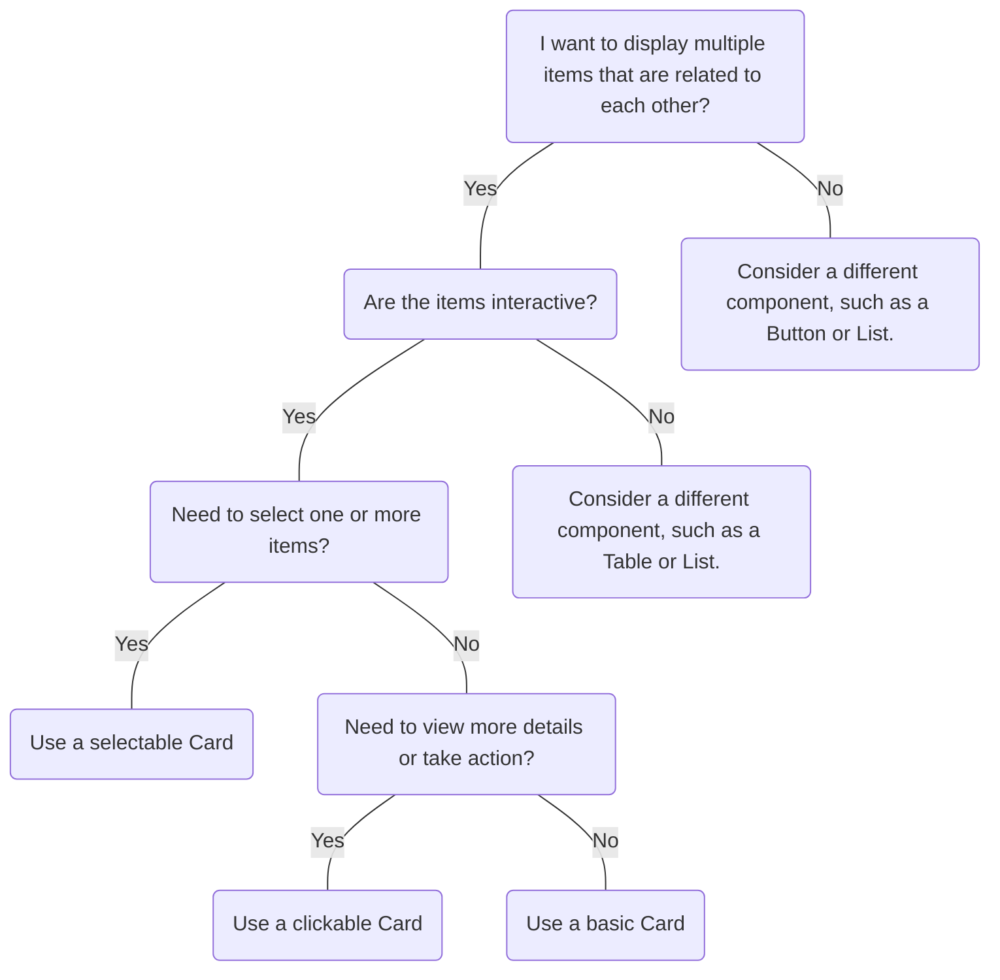

# Card

## Overview


> Image: Illustration of a card component. There are two cards with headings and a definition list inside them.


## When to use this component
Cards are a pattern that can be used to display a variety of information in a compact and organized manner. When deciding whether to use a card in your design, consider the following:
- If you have multiple pieces of related information that you want to present in a visually coherent manner, a card component can help to group and organize this information.
- Cards can help to increase the discoverability of the primary content by making it easier to scan and quickly understand what information is being presented.
- Cards can also be used to create interactive experiences, such as allowing users to expand or collapse content, or to navigate to other parts of the application.
- Cards are often designed to be flexible and to adjust their layout based on the size of the display. This makes them well-suited for responsive designs, where the layout needs to adjust to different screen sizes

## When to use another component
While card components can be a useful design tool in many situations, there are also cases where they might not be the best choice. 
- If the information you are presenting is simple and straightforward, a card component might add unnecessary complexity. In these cases, a simpler layout or a single element, such as a heading and a paragraph, might be more appropriate.
- If you need to to manipulate other components or content within the same relative context.




## Behaviors

### Clickable cards

A card that goes to a URL or performs an action when clicked. If a card's only function is to be viewed in more detail or opened, there is no need to include a button. Clicking on any part of the card should activate that action.

> Image: A card that is clickable, indicated by a hand cursor hovering over it, displaying interactivity. The clickable card has a title of 


#### Links in clickable cards
Clickable cards can also contain individual or multiple links

> Image: A card that is clickable, also with a link. The card has a title 


### Selectable cards
Clicking on the surface of a card can toggle its state to selected.

<Message appearance="fill" type="warning">
    <Message.Title>
         <strong>Important</strong>
         <p>Selectable cards do not come with any affordance that indicates their selection status by default.<strong> You MUST add an accessible affordance</strong> that is updated to match the cards selection state. Below we do this by adding a radio to the card. Using a radio or explicit text to indicate state are other examples of how to add a selectable affordance. Text color, background colors or borders cannot be used as the only visual affordance.</p>
    </Message.Title>
</Message>

<Message appearance="fill" type="error">
    <Message.Title>
         <strong>Don't</strong>
         <p>Cards that use selection as a mechanism to manipulate, filter and change other components or content within the same relative context should be avoided.</p>
    </Message.Title>
</Message>

> Image: Two card components. The card on the left has a title 


### Cards with actions
Card.Header and Card.Footer are specific areas within the card that can contain actions, providing additional functionality and interactivity.

When adding actions to the Header, if there are more than two actions use a Dropdown Menu as an overflow menu. This should be unambiguously labelled to ensure the actions are unique when in a group of cards.
> Image: A card component with four actions. The card has a title 


## Usage

### Nesting cards
Cards are their own individual containers and should not be nested in other containers, also avoid nesting cards within cards.

> Image: Example of two card components side by side. On the left is with a heart-eye emoji is a proper example of a basic card with a title and text-content. On the right with a grimacing-face emoji is an incorrect example of a card nested inside another card. 


### Actions
Best when actions use the appropriate visual hierarchy, a card must not have multiple primary buttons and should only include one primary action.

> Image: Example of two card components side by side. On the left is with a heart-eye emoji is a proper example with two buttons: a secondary and primary action, side-by-side aligned to the bottom right of the cards. On the right with a grimacing-face emoji is an incorrect example where the card has multiple primary actions.


### Spacing
Keep the content concise and relevant. Avoid filling the space with too much content, as it can be overwhelming.

> Image: Example of two card components side by side. On the left is with a heart-eye emoji is a proper example where the content is concise and properly spaced. On the right with a grimacing-face emoji is an incorrect example where the content in the card is dense and tightly packed together making it difficult to consume.


### Messaging
Avoid using cards to inform user about significant interface modifications or conditions. Instead use `Message bar` or `Message` to display significant conditions from the system or user actions.
> Image: Two examples side by side. On the left is with a heart-eye emoji is the proper example of a message bar with an error appearance being used inside of a Splunk application. On the right with a grimacing-face emoji is an incorrect example where are card is being used to display the status of the application, with the title 


## Examples


### heading

```typescript
import React from 'react';

import Card from '@splunk/react-ui/Card';
import DL from '@splunk/react-ui/DefinitionList';
import Heading from '@splunk/react-ui/Heading';

const heading = <Heading level={3}>Title</Heading>;


function Basic() {
    return (
        <Card>
            <Card.Header title={heading} />
            <Card.Body>
                <DL termWidth="222px">
                    <DL.Term>First key</DL.Term>
                    <DL.Description>Value</DL.Description>
                    <DL.Term>Second key</DL.Term>
                    <DL.Description>Value</DL.Description>
                    <DL.Term>Third key</DL.Term>
                    <DL.Description>Value</DL.Description>
                    <DL.Term>Next key</DL.Term>
                    <DL.Description>Value</DL.Description>
                    <DL.Term>Another key</DL.Term>
                    <DL.Description>Value</DL.Description>
                    <DL.Term>Last key</DL.Term>
                    <DL.Description>Value</DL.Description>
                </DL>
            </Card.Body>
        </Card>
    );
}

export default Basic;
```


### heading

```typescript
import React from 'react';

import Card from '@splunk/react-ui/Card';
import Heading from '@splunk/react-ui/Heading';
import Paragraph from '@splunk/react-ui/Paragraph';

const heading = <Heading level={3}>What is Splunk?</Heading>;


function HeadingTitle() {
    return (
        <Card style={{ width: 300 }}>
            <Card.Header title={heading} />
            <Card.Body>
                <Paragraph>
                    Splunk Enterprise makes it simple to collect, analyze and act upon the untapped
                    value of the big data generated by your technology infrastructure, security
                    systems and business applications — giving you the insights to drive operational
                    performance and business results.
                </Paragraph>
            </Card.Body>
        </Card>
    );
}

export default HeadingTitle;
```


### basicTitle

```typescript
import React from 'react';

import Star from '@splunk/react-icons/Star';
import Table from '@splunk/react-icons/Table';
import Button from '@splunk/react-ui/Button';
import Card from '@splunk/react-ui/Card';
import Heading from '@splunk/react-ui/Heading';
import P from '@splunk/react-ui/Paragraph';

const basicTitle = <Heading level={3}>Title</Heading>;
const longTitle = <Heading level={3}>This is a card with a really long title!</Heading>;
const insetTitle = <Heading level={3}>inset</Heading>;


function FullCard() {
    const style = { width: 300, height: 400, margin: '0 20px 20px 0' };

    return (
        <div>
            <Card style={style}>
                <Card.Header title={basicTitle} subtitle="Subtitle" />
                <Card.Body>
                    <P>
                        This card body demonstrates how you can use a Card to group related
                        information. Cards can contain text, images, and actions.
                    </P>
                </Card.Body>
                <Card.Footer>Footer</Card.Footer>
            </Card>
            <Card style={style}>
                <Card.Header title={longTitle} subtitle="Full card example">
                    <div style={{ textAlign: 'right', color: '#f1b10e' }}>
                        <Star variant="filled" height="24px" width="24px" />
                    </div>
                </Card.Header>
                <Card.Body>
                    <P>
                        This card has a longer title and an icon in the header. Use cards to display
                        complex data in a compact, visually appealing way. You can add actions to
                        the footer for user interaction.
                    </P>
                </Card.Body>
                <Card.Footer>
                    <Button label="Footer button" />
                </Card.Footer>
            </Card>
            <Card style={style}>
                <Card.Header title={insetTitle} subtitle="Example" />
                <Card.Body
                    inset={false}
                    style={{
                        color: '#3a87ad',
                        textAlign: 'center',
                    }}
                >
                    <Table height="255px" width="295px" />
                </Card.Body>
                <Card.Footer>Footer</Card.Footer>
            </Card>
        </div>
    );
}

export default FullCard;
```


### Card with images

A Card with Images. You can switch the order of Card.Header and Card.Body.

```typescript
import React from 'react';

import CheckCircle from '@splunk/react-icons/CheckCircle';
import CircleHalfFilled from '@splunk/react-icons/CircleHalfFilled';
import Card from '@splunk/react-ui/Card';


function Images() {
    const style = { width: 300, height: 400, margin: '0 20px 20px 0' };
    return (
        <div>
            <Card style={style}>
                <Card.Body
                    style={{
                        background: '#d9edf7',
                        textAlign: 'center',
                        padding: '84px 50px',
                        color: '#3a87ad',
                        borderRadius: '4px 4px 0 0',
                    }}
                >
                    <CheckCircle variant="filled" height="150px" width="150px" />
                </Card.Body>
                <Card.Header title="Blue" subtitle="Check mark" />
            </Card>
            <Card style={style}>
                <Card.Header title="Green" subtitle="Half circle" />
                <Card.Body
                    style={{
                        background: '#d0e9be',
                        textAlign: 'center',
                        padding: '84px 50px',
                        color: '#65a637',
                        borderRadius: '0 0 4px 4px',
                    }}
                >
                    <CircleHalfFilled height="150px" width="150px" />
                </Card.Body>
            </Card>
        </div>
    );
}

export default Images;
```


### heading

```typescript
import React, { useCallback, useState } from 'react';

import Card from '@splunk/react-ui/Card';
import CardLayout from '@splunk/react-ui/CardLayout';
import Heading from '@splunk/react-ui/Heading';
import P from '@splunk/react-ui/Paragraph';

const heading = <Heading level={3}>What is Splunk?</Heading>;


function Clickable() {
    const [timesClicked, setTimesClicked] = useState(0);

    const clickAction = useCallback(() => {
        setTimesClicked(timesClicked + 1);
    }, [setTimesClicked, timesClicked]);

    return (
        <CardLayout cardWidth={300} gutterSize={20}>
            <Card to="http://www.splunk.com" openInNewContext>
                <Card.Header title={heading} subtitle="Click to learn more" />
                <Card.Body>
                    <P>
                        Splunk Enterprise makes it simple to collect, analyze and act upon the
                        untapped value of the big data generated by your technology infrastructure,
                        security systems and business applications—giving you the insights to drive
                        operational performance and business results.
                    </P>
                </Card.Body>
                <Card.Footer>Splunk</Card.Footer>
            </Card>
            <Card onClick={clickAction}>
                <Card.Header title={`Click count: ${timesClicked}`} />
                <Card.Body>Click me please!</Card.Body>
                <Card.Footer>Click count: {timesClicked}</Card.Footer>
            </Card>
        </CardLayout>
    );
}

export default Clickable;
```


### StyledIconContainer

```typescript
import React, { useState } from 'react';

import styled from 'styled-components';

import CheckRadioIcon from '@splunk/react-icons/CheckRadio';
import Card, { CardClickHandler } from '@splunk/react-ui/Card';
import Heading from '@splunk/react-ui/Heading';
import Layout from '@splunk/react-ui/Layout';
import Paragraph from '@splunk/react-ui/Paragraph';

const StyledIconContainer = styled.div`
    display: flex;
    justify-content: right;
`;


function Selectable() {
    const [selectedValue, setSelectedValue] = useState(1);

    const handleChange: CardClickHandler = (e, { value: clickValue }) => {
        setSelectedValue(clickValue);
    };

    const cards = [1, 2, 3, 4].map((value) => {
        const cardSelected = value === selectedValue;
        const heading = <Heading level={3}>Card {value} title</Heading>;

        return (
            <Card
                aria-checked={cardSelected}
                key={value}
                onClick={handleChange}
                role="radio"
                value={value}
            >
                <Card.Header title={heading} subtitle={`Card ${value} subtitle`}>
                    <StyledIconContainer>
                        <CheckRadioIcon
                            variant={cardSelected ? 'filled' : 'default'}
                            height="20px"
                            width="20px"
                        />
                    </StyledIconContainer>
                </Card.Header>
                <Card.Body>
                    <Paragraph style={{ width: 200 }}>Card body {value}</Paragraph>
                </Card.Body>
            </Card>
        );
    });
    return <Layout role="radiogroup">{cards}</Layout>;
}

export default Selectable;
```


### Card with icon

A Card can have an icon in the header.

```typescript
import React from 'react';

import Cube from '@splunk/react-icons/Cube';
import Card from '@splunk/react-ui/Card';


function WithIcon() {
    return (
        <Card style={{ width: 300 }}>
            <Card.Header icon={<Cube />} title="Title" subtitle="subtitle" />
            <Card.Body>
                Splunk Enterprise makes it simple to collect, analyze and act upon the untapped
                value of the big data generated by your technology infrastructure, security systems
                and business applications.
            </Card.Body>
        </Card>
    );
}

export default WithIcon;
```


### MoreActionsButton

```typescript
import React from 'react';

import ArrowsCircularDouble from '@splunk/react-icons/ArrowsCircularDouble';
import Cross from '@splunk/react-icons/Cross';
import DotsThreeVertical from '@splunk/react-icons/DotsThreeVertical';
import Pencil from '@splunk/react-icons/Pencil';
import SquaresLayeredPlus from '@splunk/react-icons/SquaresLayeredPlus';
import Button from '@splunk/react-ui/Button';
import Card from '@splunk/react-ui/Card';
import CardLayout from '@splunk/react-ui/CardLayout';
import Dropdown from '@splunk/react-ui/Dropdown';
import Heading from '@splunk/react-ui/Heading';
import Layout from '@splunk/react-ui/Layout';
import Menu from '@splunk/react-ui/Menu';
import Tooltip from '@splunk/react-ui/Tooltip';

const MoreActionsButton = React.forwardRef<HTMLButtonElement, { content: string }>((props, ref) => {
    return (
        <Tooltip contentRelationship="label" {...props}>
            <Button appearance="subtle" icon={<DotsThreeVertical />} ref={ref} />
        </Tooltip>
    );
});


const renderFirstCardActions = () => {
    return (
        <>
            <Button appearance="subtle" icon={<Pencil variant="filled" />} />
            <Dropdown toggle={<MoreActionsButton content="More actions for 1st card" />}>
                <Menu>
                    <Menu.Item startAdornment={<ArrowsCircularDouble />}>Refresh</Menu.Item>
                    <Menu.Divider />
                    <Menu.Item startAdornment={<SquaresLayeredPlus />}>Duplicate</Menu.Item>
                    <Menu.Item startAdornment={<Cross />}>Delete</Menu.Item>
                </Menu>
            </Dropdown>
        </>
    );
};

const renderSecondCardActions = () => {
    return (
        <Dropdown toggle={<MoreActionsButton content="More actions for 2nd card" />}>
            <Menu>
                <Menu.Item>Favorite</Menu.Item>
                <Menu.Item>Share</Menu.Item>
            </Menu>
        </Dropdown>
    );
};

const heading = <Heading level={3}>Title</Heading>;

function Actions() {
    return (
        <CardLayout cardWidth={310} gutterSize={20}>
            <Card>
                <Card.Header
                    title={heading}
                    subtitle="subtitlesubtitlesubtitle"
                    actions={renderFirstCardActions}
                />
                <Card.Body>
                    Splunk Enterprise makes it simple to collect, analyze and act upon the untapped
                    value of the big data generated by your technology infrastructure, security
                    systems and business applications.
                </Card.Body>
                <Card.Footer>
                    <Layout style={{ justifyContent: 'flex-end' }}>
                        <Button appearance="secondary">Label</Button>
                        <Button appearance="primary">Label</Button>
                    </Layout>
                </Card.Footer>
            </Card>
            <Card>
                <Card.Header
                    title={heading}
                    subtitle="subtitlesubtitlesubtitle"
                    actions={renderSecondCardActions}
                />
                <Card.Body>
                    Splunk Enterprise makes it simple to collect, analyze and act upon the untapped
                    value of the big data generated by your technology infrastructure, security
                    systems and business applications.
                </Card.Body>
                <Card.Footer>
                    <Button>Action</Button>
                </Card.Footer>
            </Card>
        </CardLayout>
    );
}

export default Actions;
```


## API


### Card API

#### Props

| Name | Type | Required | Default | Description |
|------|------|------|------|------|
| children | React.ReactNode | no |  | Any children that can be rendered can be passed to the `Card`.  To use the default Splunk UI `Card` styles, use the `Card.Header`, `Card.Body`, and `Card.Footer`. |
| elementRef | React.Ref<HTMLAnchorElement \| HTMLButtonElement \| HTMLDivElement> | no |  | A React ref which is set to the DOM element when the component mounts and null when it unmounts. |
| onClick | CardClickHandler | no |  | Callback when the `Card` is clicked. |
| openInNewContext | boolean | no |  | To open the `to` link in a new window, set `openInNewContext` to `true`. |
| selected | boolean | no |  | **DEPRECATED**: This prop is deprecated and will be removed in the next major version. Renders `Card` as selected if set to `true`. Use only when `onClick` is also provided. |
| tag | 'article' \| 'div' \| 'aside' \| 'section' | no |  | Overrides the HTML tag for the Card component. Defaults to `article`. Ignored if `to` or `onClick` are present. |
| to | string | no |  | Takes a URL to go to when the `Card` is clicked. |
| value | any | no |  | Returns a value on click. Use when composing or if you have more than one selectable `Card`. |

#### Types

| Name | Type | Description |
|------|------|------|
| CardClickHandler | (     event: React.MouseEvent<HTMLAnchorElement \| HTMLButtonElement>,     data: {         selected: boolean;         value?: any; // eslint-disable-line @typescript-eslint/no-explicit-any     } ) => void |  |


### Card.Header API

A styled container for `Card` header content.

#### Props

| Name | Type | Required | Default | Description |
|------|------|------|------|------|
| actionPrimary | React.ReactNode | no |  | Adds a primary action to the header. For best results, use an icon-only button style. |
| actions | () => React.ReactNode | no |  | Renders the card actions.  This prop cannot be used with actionPrimary and actionsSecondary. |
| actionsSecondary | React.ReactNode | no |  | Adds a secondary actions dropdown menu to the header with an "Actions" label. Make this prop a `Menu`.  The `actions` prop is preferred so that a custom and unambiguous label can be added. |
| anchor | string | no |  | **DEPRECATED**: This prop is deprecated and will be removed in the next major version. Make the title an anchor so it can be bookmarked with a fragment. |
| children | React.ReactNode | no |  |  |
| elementRef | React.Ref<HTMLDivElement> | no |  | A React ref which is set to the DOM element when the component mounts and null when it unmounts. |
| icon | React.ReactNode | no |  | The icon to show before the title. |
| subtitle | React.ReactNode | no |  | Used as the subheading. |
| title | React.ReactNode | no |  | Used as the main heading. |
| truncateTitle | boolean | no | true | Do not wrap Title and Subtitle. Long titles will truncate with an ellipsis. |


### Card.Body API

A styled container for `Card` body content.

#### Props

| Name | Type | Required | Default | Description |
|------|------|------|------|------|
| children | React.ReactNode | no |  |  |
| elementRef | React.Ref<HTMLDivElement> | no |  | A React ref which is set to the DOM element when the component mounts and null when it unmounts. |
| inset | boolean | no | true | When true renders the `Card.Body` with padding. When false renders the `Card.Body` without padding. Default to true. |


### Card.Footer API

A styled container for `Card` footer content.

#### Props

| Name | Type | Required | Default | Description |
|------|------|------|------|------|
| children | React.ReactNode | no |  |  |
| elementRef | React.Ref<HTMLDivElement> | no |  | A React ref which is set to the DOM element when the component mounts and null when it unmounts. |


