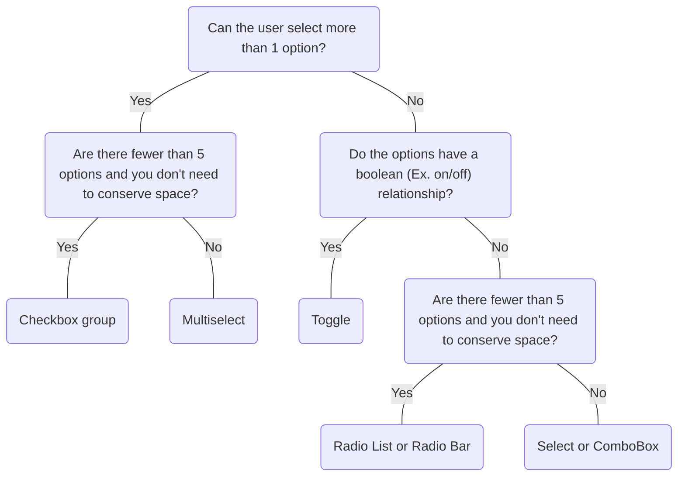

# Checkbox

## Overview


> Image: Illustration of Checkbox component


<Message appearance="fill" type="info">
    <div>All data entry components should be wrapped in a <Link to="ControlGroup">Control Group</Link> to provide a label, error states, and help or error text, ensuring an accessible experience for all users.</div>
</Message>

## When to use this component
Checkbox lets users select one or more options from a list. Use it for simple, binary choices where multiple selections are allowed.

- When users need to select multiple items independently (e.g., filter options, preferences)
- When you want to present a list of options that aren't mutually exclusive
- In forms where several related options can be enabled together

## When to use another component
- If selecting a single option from a set of two or more that are mutually exclusive and don't map to a boolean relationship (such as on/off) use `Radio List` or `Radio Bar`
- If multiple options can be selected from a long list of items, use `Multiselect`
- If there's a binary choice for enabling a setting, like on/off, true/false, enable/disable, or activate/deactivate, use `Switch` with `appearance="toggle"`
- If there are multiple options, space conservation is important, and only one option can be selected at a time use a `Select` or `Combobox`



### Check out
- [RadioList][1]
- [RadioBar][2]
- [Multiselect][3]
- [Switch][4]
- [Select][5]
- [ComboBox][6]

## Usage

### Group related options

Present checkboxes together for related choices. Grouping improves clarity and helps users scan options quickly.

> Image: The first example with heart eyes emoji shows grouped checkboxes with clear labels. The second example with grimacing emoji shows scattered checkboxes that are hard to scan.


### Consistent labeling in groups

Ensure labeling is consistent in checkbox groups so users can easily distinguish between the items.

> Image: Examples of a group of three checkboxes. The checkboxes in the heart eyes example have the labels, 


## Content

### Labels

Keep labels concise by using one to three words. Apply sentence-style capitalization and ensure each label clearly describes the option’s function.

> Image: The first example with heart eyes emoji shows concise, clear labels. The second example with grimacing emoji shows labels that are too long or vague.


[1]: ./RadioList
[2]: ./RadioBar
[3]: ./Multiselect
[4]: ./Switch
[5]: ./Select
[6]: ./ComboBox

## Examples


### Controlled

Checkbox can be controlled using the checked prop and an onChange callback.

```typescript
import React, { useState } from 'react';

import Checkbox, { CheckboxChangeHandler } from '@splunk/react-ui/Checkbox';


const Basic = () => {
    const [checkedTandC, setCheckedTandC] = useState<boolean>(true);
    const [checkedEmail, setCheckedEmail] = useState<boolean>(false);

    const handleEmailChange: CheckboxChangeHandler = (e, { checked: newChecked }) => {
        setCheckedEmail(newChecked);
    };

    const handleTandCChange: CheckboxChangeHandler = (e, { checked: newChecked }) => {
        setCheckedTandC(newChecked);
    };

    return (
        <>
            <Checkbox checked={checkedTandC} onChange={handleTandCChange}>
                I accept the terms and conditions
            </Checkbox>
            <Checkbox checked={checkedEmail} onChange={handleEmailChange}>
                Send me email updates
            </Checkbox>
        </>
    );
};

export default Basic;
```


### Uncontrolled

Checkbox can also used as an uncontrolled component, using defaultChecked to set the initial checked state.

```typescript
import React from 'react';

import Checkbox from '@splunk/react-ui/Checkbox';


const Uncontrolled = () => {
    return (
        <>
            <Checkbox defaultChecked>I accept the terms and conditions</Checkbox>
            <Checkbox>Send me email updates</Checkbox>
        </>
    );
};

export default Uncontrolled;
```


### Disabled

```typescript
import React from 'react';

import Checkbox from '@splunk/react-ui/Checkbox';


const Disabled = () => {
    return <Checkbox disabled>This option is disabled</Checkbox>;
};

export default Disabled;
```


### Error

```typescript
import React, { useState } from 'react';

import Checkbox, { CheckboxChangeHandler } from '@splunk/react-ui/Checkbox';


function CheckboxError() {
    const [checked, setChecked] = useState<boolean>();

    const handleChange: CheckboxChangeHandler = (e, { checked: newChecked }) => {
        setChecked(newChecked);
    };

    return (
        <Checkbox checked={checked} error={!checked} onChange={handleChange}>
            I accept the terms and conditions
        </Checkbox>
    );
}

export default CheckboxError;
```


## API


### Checkbox API

#### Props

| Name | Type | Required | Default | Description |
|------|------|------|------|------|
| checked | boolean \| 'indeterminate' | no |  | Setting this value makes the component controlled. If set, the onChange callback is required. A setting of "indeterminate" is considered unchecked for the purposes of form submission. |
| children | React.ReactNode | no |  | The content to display inside the checkbox label. |
| defaultChecked | boolean | no |  | Set this property instead of checked to make the component uncontrolled. |
| describedBy | string | no |  | The id of the description. When placed in a ControlGroup, this is automatically set to the ControlGroup's help component. |
| disabled | boolean | no |  |  |
| elementRef | React.Ref<HTMLDivElement> | no |  | A React ref which is set to the DOM element when the component mounts, and null when it unmounts. |
| error | boolean | no |  | Mark the component as having an error. |
| inert | boolean | no |  |  |
| inputRef | React.Ref<HTMLInputElement> | no |  | A React ref which is set to the input element when the component mounts and null when it unmounts. |
| labelledBy | string | no |  | The id of the label. When placed in a ControlGroup, this is automatically set to the ControlGroup's label. |
| name | string | no |  | The name is returned with onChange events, which can be used to identify the control when multiple controls share an onChange callback. |
| onChange | (     event: React.ChangeEvent<HTMLInputElement>,     data: {         checked: boolean;         name?: string;         value?: string;     } ) => void | no |  | Fires when the checked state changes. |
| value | string | no |  | Returned by the onChange handler and submitted during form submission if the checkbox is checked. This defaults to "on" if the input is checked. |


