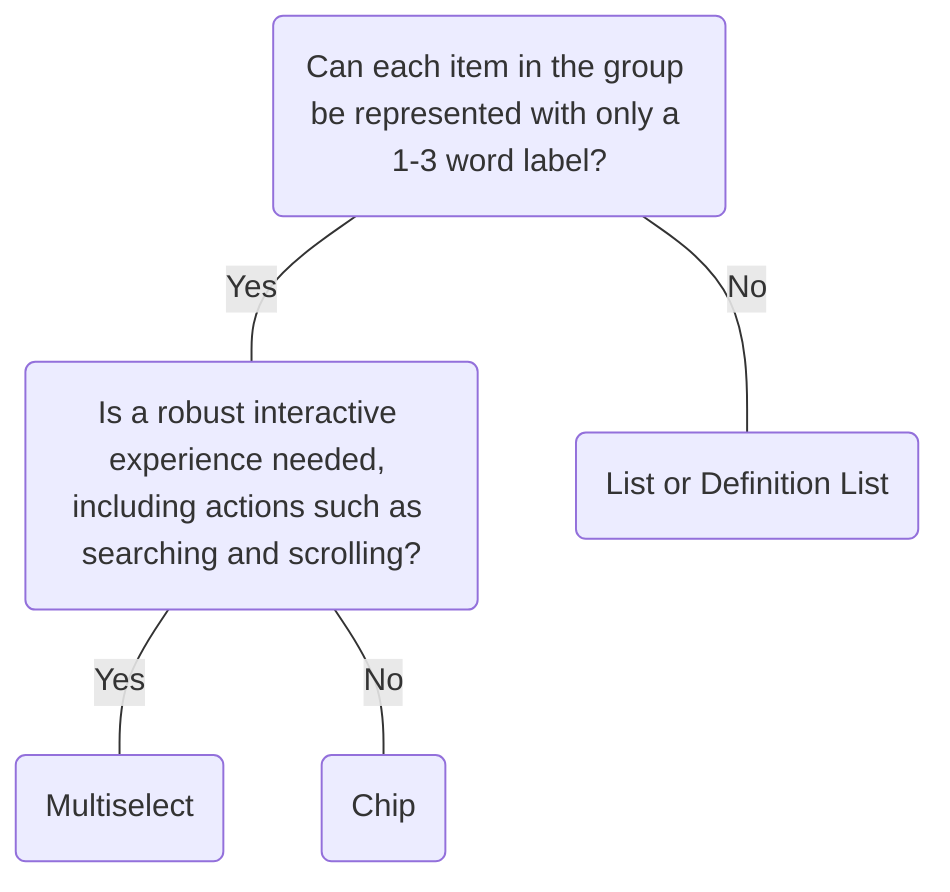

# Chip

## Overview


> Image: Illustration of a group of three Chips.


## When to use this component
- When you need to represent a large number of items in a limited amount of space. Ideal for use in list or grid format.

## When to use another component
- `Chip` is limited in hierarchical affordances, such as key-value pairs or sub categories. Using a `List` or `DefinitionList` can provide a more organized representation of a collection of items.
- Interactivity of `Chip` is limited, `Multiselect` provides a structured experience for selecting one or more options from a set.
- Due to the compact design, Chips can be difficult to discover. If the information represents a status change that is evoked by user action, consider including `Message` or `MessageBar`.



### Check out
- [Button][1]
- [Link][2]
- [Multiselect][3]

## Usage

### Grouping
A Chip works best in a group. Using a single Chip often loses the benefits of Chips, which is representing a large number of items in a limited amount of space.

> Image: Example with two modals. The first modal example with heart eyes emoji has a group of three Chips. The second example with a grimacing emoji only displays a single Chip.


### Removable Chips
When a `Chip` is removable, it’s best to allow users to also be able to add `Chip` back.

> Image: Examples of a group of two removable Chips. The example with the heart eyes includes an add button, where users can add more Chips. The second example with a grimacing emoji shows no way to add more Chips.


### Consistent interactions
Keep interactions consistent across the group.

> Image: Examples of two Chips. The first example with heart eyes shows two removable Chips. The second example with a grimacing face shows one Chip that is removable and one Chip that isn


### Group organization
To improve scannability, a Chip group should flow like words in a paragraph, rather than a vertical list.

> Image: Example of a group of three Chips. The first example with heart eyes shows the group aligned horizontally. The second example with a grimacing face the group aligned vertically.


### Large groups
When space is limited, such as in a table, the Chip group may overflow the space. A label like ‘3 more Chips’ makes this screen reader accessible. It is also important to provide a detailed view where users can view the entire Chip group.

> Image: Example of Chips within a table with 3 columns; Name, Groups, which includes the Chips, and Status. In the modal with the heart eyes, there is two chips and a plus two Chip which on hover, displayed a third Chip that do not fit in the column. The modal with a grimacing face does not have the plus two Chip, resulting in the third chip running into the next column, cutting off the name of the Chip.


## Content

### Write concise labels: 1-3 words

> Image: Examples of chip label length. The first example with heart eyes emoji has a chip with a label the reads 


### Label overflow
While one to two words (20-25 characters) is recommended for Chip labels, there might be instances when text needs to be longer. Truncation can be considered if characters go outside this limit, but make sure the Chip's content can be viewed in it's entirety with a `Tooltip`.

> Image: Examples of chip label overflow. The first example with heart eyes has a chip that is hovered with a truncated label that reads 


### Use sentence-style capitalization

> Image: Examples of sentence-style for Chip labels. The first example with heart eyes emoji has a Chip with a label using sentence-style capitalization that reads 


### Label metadata
Ensure labeling is consistent across chips so users can easily distinguish between the list items.

> Image: Examples of a group of three chips. The chips in the heart eyes example have the labels, 


### Appropriate icons
Use icons that relate to the labeling, enhancing comparability across the group.

> Image: Examples of two chips. The first example with heart eyes shows one chip with the label, 


### Follow color contrast guidelines
When using custom colors, ensure you are following the WCAG guideline of a contrast ratio &gt= 4.5:1 between text and background. [SC 1.4.3][4]

> Image: Examples of three chips with different custom background colours. In the first example with heart eyes, the chip labels are dark and abide by the 4.5 to 1 contrast guidelines. In the second example with the grimacing face, the chip labels are lighter and similar to the background colours, breaking the contrast guidelines.


[1]: ./Button
[2]: ./Link
[3]: ./Multiselect
[4]: https://www.w3.org/TR/WCAG21/#contrast-minimum

## Examples


### Appearance

```typescript
import React from 'react';

import Chip from '@splunk/react-ui/Chip';
import Layout from '@splunk/react-ui/Layout';


function Appearance() {
    return (
        <Layout>
            <Chip>default</Chip>
            <Chip appearance="outline">outline</Chip>
            <Chip appearance="info">info</Chip>
            <Chip appearance="success">success</Chip>
            <Chip appearance="warning">warning</Chip>
            <Chip appearance="error">error</Chip>
        </Layout>
    );
}

export default Appearance;
```


### Custom colors

When using custom colors, ensure you are following the WCAG guideline of a contrast ratio >= 4.5:1 between text and background.

```typescript
import React from 'react';

import Chip from '@splunk/react-ui/Chip';
import Layout from '@splunk/react-ui/Layout';


function CustomColors() {
    return (
        <Layout>
            <Chip foregroundColor="#400000" backgroundColor="#aeb6bf">
                Chart area
            </Chip>
            <Chip foregroundColor="#45b39d" backgroundColor="#004444">
                Chart area
            </Chip>
            <Chip foregroundColor="#4d1b7b" backgroundColor="#c79dd7">
                Chart area
            </Chip>
        </Layout>
    );
}

export default CustomColors;
```


### With icons

```typescript
import React from 'react';

import ChartArea from '@splunk/react-icons/ChartArea';
import ChartColumn from '@splunk/react-icons/ChartColumn';
import ChartLine from '@splunk/react-icons/ChartLine';
import Chip from '@splunk/react-ui/Chip';
import Layout from '@splunk/react-ui/Layout';


function Icon() {
    return (
        <Layout>
            <Chip icon={<ChartArea />}>Chart area</Chip>
            <Chip icon={<ChartColumn />}>Chart column</Chip>
            <Chip icon={<ChartLine />}>Line chart</Chip>
        </Layout>
    );
}

export default Icon;
```


### Removable

```typescript
import React from 'react';

import Chip from '@splunk/react-ui/Chip';


function Removable() {
    return <Chip onRequestRemove={() => {}}>Removable</Chip>;
}

export default Removable;
```


### Removable with non-string children

The descriptive label for a Chip can be overridden by applying an aria-label attribute. This is necessary if passing children that are not of type string.

```typescript
import React from 'react';

import Chip from '@splunk/react-ui/Chip';
import Typography from '@splunk/react-ui/Typography';


const RemovableWithNonStringChildren = () => (
    <Chip onRequestRemove={() => {}} aria-label="Remove Bar chart">
        <Typography as="span" variant="body">
            Bar chart{' '}
            <Typography as="span" variant="smallBody">
                with custom colors
            </Typography>
        </Typography>
    </Chip>
);

export default RemovableWithNonStringChildren;
```


### disabled

```typescript
import React from 'react';

import Chip from '@splunk/react-ui/Chip';
import Layout from '@splunk/react-ui/Layout';


function Disabled() {
    return (
        <Layout>
            <Chip disabled>Disabled</Chip>
            <Chip disabled onRequestRemove={() => {}}>
                Disabled
            </Chip>
        </Layout>
    );
}

export default Disabled;
```


## API


### Chip API

#### Props

| Name | Type | Required | Default | Description |
|------|------|------|------|------|
| appearance | 'info' \| 'success' \| 'warning' \| 'error' \| 'outline' | no |  | Sets the severity or type of this `Chip`. Setting this prop causes the `backgroundColor` prop to be ignored. |
| backgroundColor | string | no |  | Changes the background color of the `Chip`. Hexadecimal colors and valid color names are allowed, such as `#ffffff` or `white`. If the `appearance` prop is set, this prop is ignored. |
| children | React.ReactNode | yes |  |  |
| disabled | boolean | no |  | Disables the `Chip`. |
| elementRef | React.Ref<HTMLButtonElement \| HTMLDivElement> | no |  | A React ref which is set to the DOM element when the component mounts and null when it unmounts. |
| foregroundColor | string | no |  | Changes the text and icon color of the `Chip`. Hexadecimal colors and valid color names are allowed, such as `#ffffff` or `white`. |
| icon | React.ReactNode | no |  | The icon to show before the label. See the Icon component for more information. |
| onRequestRemove | ChipRequestRemoveHandler | no |  | Includes a remove button if callback is set. |
| value | any | no |  | Includes this value in `onRequestRemove` callbacks. |

#### Types

| Name | Type | Description |
|------|------|------|
| ChipRequestRemoveHandler | (     event: React.MouseEvent<HTMLButtonElement>,     data: { value?: any } // eslint-disable-line @typescript-eslint/no-explicit-any ) => void |  |


