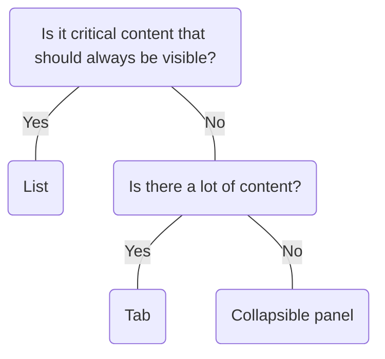

# Collapsible Panel

## Overview


> Image: Illustration of a group of accordion components with the second accordion expanded to show its content.


## When to use this component
- When you have a large amount of non-essential content to show, and want to allow people to have control over the content visibility
- When you want to progressively disclose information or provide step-by-step guidance
- When you want to group related content and optimize space and information density
- When you are showing content on a small screen to reduce scrolling

## When to use another component
- If the content is critical and should always be visible, use a `List` or display the content without requiring user interaction.
- If there are only one or two sections, it is better to display the content without requiring user interaction.
- For information that needs to be viewed, grouped, or compared across categories use a `Table`.



### Check out
- [List][1]
- [Table][2]
- [Tab Bar][3]

## Behaviors
`CollapsiblePanel` supports either having a single or multiple panels expanded at a time.

### Multiple panels
Expand and collapse multiple panels at a time.
> Image: Illustration of a `CollapsiblePanel` group with multiple expanded panels


### Single panel
Expand and collapse only one panel at a time.
> Image: Illustration of a `CollapsiblePanel` group with only a single expanded panel


## Usage

### Limit content
Avoid filling `Collapsible Panel` with lots of content. Instead, use small, digestible chunks for the user.

> Image: Heart eye example with digestible amount of content next to a grimacing face example of an accordion with too much content


### Order panels logically
Order panels logically, according to the specific reading order.

> Image: Heart eye example with Collapsible panel label in sequential order 1 - 4 next to a grimacing face example where the Collapsible panel are out of order 2, 1, 4, 3


## Content guidelines

### Panel title:
- Write a concise title that describes the associated body content so the user can decide whether to read the body content.
- Use sentence-style capitalization and capitalize the first word and proper nouns only.
- Don’t use punctuation such as periods, commas, or exclamation marks.

### Panel body:
- Split body content into small paragraphs to improve readability.
- Write in complete sentences with end punctuation.

[1]: ./List
[2]: ./Table
[3]: ./TabBar

## Examples


### Uncontrolled

```typescript
import React from 'react';

import CollapsiblePanel from '@splunk/react-ui/CollapsiblePanel';
import P from '@splunk/react-ui/Paragraph';


function BasicUncontrolled() {
    return (
        <CollapsiblePanel title="Introduction to Splunk Enterprise">
            <P>
                Splunk Enterprise makes it simple to collect, analyze and act upon the untapped
                value of the big data generated by your technology infrastructure, security systems
                and business applications—giving you the insights to drive operational performance
                and business results. Splunk Enterprise monitors and analyzes machine data from any
                source to deliver Operational Intelligence to optimize your IT, security and
                business performance. With intuitive analysis features, machine learning, packaged
                applications and open APIs, Splunk Enterprise is a flexible platform that scales
                from focused use cases to an enterprise-wide analytics backbone.
            </P>
        </CollapsiblePanel>
    );
}

export default BasicUncontrolled;
```


### Controlled

```typescript
import React, { useState } from 'react';

import CollapsiblePanel from '@splunk/react-ui/CollapsiblePanel';
import P from '@splunk/react-ui/Paragraph';


function BasicControlled() {
    const [open, setOpen] = useState(false);

    const handleChange = () => {
        setOpen(!open);
    };

    return (
        <CollapsiblePanel
            title="Introduction to Splunk Enterprise"
            onChange={handleChange}
            open={open}
            description="Splunk products"
        >
            <P>
                Splunk Enterprise makes it simple to collect, analyze and act upon the untapped
                value of the big data generated by your technology infrastructure, security systems
                and business applications—giving you the insights to drive operational performance
                and business results. Splunk Enterprise monitors and analyzes machine data from any
                source to deliver Operational Intelligence to optimize your IT, security and
                business performance. With intuitive analysis features, machine learning, packaged
                applications and open APIs, Splunk Enterprise is a flexible platform that scales
                from focused use cases to an enterprise-wide analytics backbone.
            </P>
        </CollapsiblePanel>
    );
}

export default BasicControlled;
```


### Disabled

If a CollapsiblePanel is passed disabled the default behavior is to render as "dimmed". This ensures the panel is still discoverable and can receive focus, but cannot be activated by the user. Actions that are passed are not disabled within a dimmed panel. If necessary, a CollapsiblePanel can be completely disabled by setting disabled="disabled".

```typescript
import React from 'react';

import Clone from '@splunk/react-icons/enterprise/Clone';
import MoreVertical from '@splunk/react-icons/enterprise/MoreVertical';
import Refresh from '@splunk/react-icons/enterprise/Refresh';
import Remove from '@splunk/react-icons/enterprise/Remove';
import Button from '@splunk/react-ui/Button';
import CollapsiblePanel from '@splunk/react-ui/CollapsiblePanel';
import Dropdown from '@splunk/react-ui/Dropdown';
import Menu from '@splunk/react-ui/Menu';
import P from '@splunk/react-ui/Paragraph';
import { _ } from '@splunk/ui-utils/i18n';


function Dimmed() {
    const title = (
        <div style={{ display: 'flex', width: 140, alignItems: 'center' }}>Splunk products</div>
    );

    const actionsToggle = (
        <Button
            disabled="dimmed"
            appearance="secondary"
            data-test="actions-toggle"
            icon={<MoreVertical width="16px" height="16px" screenReaderText={_('Actions')} />}
            style={{ marginLeft: 10 }}
        />
    );

    const actions = (
        <div
            style={{
                position: 'relative',
                width: '100%',
                display: 'flex',
                justifyContent: 'flex-end',
            }}
        >
            <div style={{ flex: '0 0 auto' }}>
                <Dropdown defaultPlacement="right" toggle={actionsToggle}>
                    <Menu>
                        <Menu.Item startAdornment={<Refresh width="16px" height="16px" />}>
                            Refresh
                        </Menu.Item>
                        <Menu.Divider />
                        <Menu.Item startAdornment={<Clone width="16px" height="16px" />}>
                            Duplicate
                        </Menu.Item>
                        <Menu.Item startAdornment={<Remove width="16px" height="16px" />}>
                            Delete
                        </Menu.Item>
                    </Menu>
                </Dropdown>
            </div>
        </div>
    );

    return (
        <>
            <CollapsiblePanel
                panelId={1}
                disabled="dimmed"
                title="Introduction to Splunk Enterprise"
            >
                <P>
                    Splunk Enterprise makes it simple to collect, analyze and act upon the untapped
                    value of the big data generated by your technology infrastructure, security
                    systems and business applications—giving you the insights to drive operational
                    performance and business results. Splunk Enterprise monitors and analyzes
                    machine data from any source to deliver Operational Intelligence to optimize
                    your IT, security and business performance. With intuitive analysis features,
                    machine learning, packaged applications and open APIs, Splunk Enterprise is a
                    flexible platform that scales from focused use cases to an enterprise-wide
                    analytics backbone.
                </P>
            </CollapsiblePanel>
            <CollapsiblePanel
                panelId={2}
                disabled="dimmed"
                defaultOpen
                title="Introduction to Splunk Enterprise"
            >
                <P>
                    Splunk Enterprise makes it simple to collect, analyze and act upon the untapped
                    value of the big data generated by your technology infrastructure, security
                    systems and business applications—giving you the insights to drive operational
                    performance and business results. Splunk Enterprise monitors and analyzes
                    machine data from any source to deliver Operational Intelligence to optimize
                    your IT, security and business performance. With intuitive analysis features,
                    machine learning, packaged applications and open APIs, Splunk Enterprise is a
                    flexible platform that scales from focused use cases to an enterprise-wide
                    analytics backbone.
                </P>
            </CollapsiblePanel>
            <CollapsiblePanel disabled="dimmed" title={title} actions={actions}>
                <P>
                    Splunk Security modernizes security operations and protects businesses with
                    data, analytics, automation and end-to-end integrations. Splunk Observability
                    solves problems in seconds with end-to-end visibility across infrastructure,
                    applications and digital customer experience. Splunk Cloud provides
                    cloud-powered insights for petabyte-scale data analytics across the hybrid cloud
                    with Splunk as a service.
                </P>
            </CollapsiblePanel>
        </>
    );
}

export default Dimmed;
```


### Multiple uncontrolled

```typescript
import React from 'react';

import CollapsiblePanel from '@splunk/react-ui/CollapsiblePanel';
import P from '@splunk/react-ui/Paragraph';


function MultiUncontrolled() {
    return (
        <div>
            <CollapsiblePanel title="Plan to migrate to Splunk Cloud Platform">
                <P>
                    Download the Splunk Cloud Migration Assessment (SCMA) app to analyze your
                    on-premises or BYOL Splunk Enterprise deployment. Determine if you’re looking at
                    a hybrid or full migration approach, and prepare your environment.
                </P>
            </CollapsiblePanel>
            <CollapsiblePanel title="Migrate to Splunk Cloud Platform">
                <P>
                    Start the actual migration process by optimizing and moving data sources,
                    searches, users, apps and knowledge objects. This is a multi-step process that
                    will require the right resources and expertise.
                </P>
            </CollapsiblePanel>
            <CollapsiblePanel title="Validate with System and User Acceptance Testing">
                <P>
                    Test and tune use cases and workflows. Make sure search and user priming
                    artifacts, user preferences, and historical data are accounted for through
                    System and User Acceptance Testing.
                </P>
            </CollapsiblePanel>
        </div>
    );
}

export default MultiUncontrolled;
```


### Multiple controlled

```typescript
import React, { useState } from 'react';

import { includes, xor } from 'lodash';

import CollapsiblePanel, { CollapsiblePanelChangeHandler } from '@splunk/react-ui/CollapsiblePanel';
import P from '@splunk/react-ui/Paragraph';


function MultiControlled() {
    const [open, setOpen] = useState<(string | number | undefined)[]>([]);

    const handleChange: CollapsiblePanelChangeHandler = (event, { panelId }) => {
        setOpen(xor(open, [panelId]));
    };

    return (
        <>
            <CollapsiblePanel
                panelId={1}
                title="Plan to migrate to Splunk Cloud Platform"
                onChange={handleChange}
                open={includes(open, 1)}
            >
                <P>
                    Download the Splunk Cloud Migration Assessment (SCMA) app to analyze your
                    on-premises or BYOL Splunk Enterprise deployment. Determine if you’re looking at
                    a hybrid or full migration approach, and prepare your environment.
                </P>
            </CollapsiblePanel>
            <CollapsiblePanel
                panelId={2}
                title="Migrate to Splunk Cloud Platform"
                onChange={handleChange}
                open={includes(open, 2)}
            >
                <P>
                    Start the actual migration process by optimizing and moving data sources,
                    searches, users, apps and knowledge objects. This is a multi-step process that
                    will require the right resources and expertise.
                </P>
            </CollapsiblePanel>
            <CollapsiblePanel
                panelId={3}
                title="Validate with System and User Acceptance Testing"
                onChange={handleChange}
                open={includes(open, 3)}
            >
                <P>
                    Test and tune use cases and workflows. Make sure search and user priming
                    artifacts, user preferences, and historical data are accounted for through
                    System and User Acceptance Testing.
                </P>
            </CollapsiblePanel>
        </>
    );
}

export default MultiControlled;
```


### Actions

Adding clickable items in the header.

```typescript
import React, { useState } from 'react';

import Clone from '@splunk/react-icons/enterprise/Clone';
import Filter from '@splunk/react-icons/enterprise/Filter';
import MoreVertical from '@splunk/react-icons/enterprise/MoreVertical';
import Refresh from '@splunk/react-icons/enterprise/Refresh';
import Remove from '@splunk/react-icons/enterprise/Remove';
import Button from '@splunk/react-ui/Button';
import CollapsiblePanel from '@splunk/react-ui/CollapsiblePanel';
import Dropdown from '@splunk/react-ui/Dropdown';
import Layout from '@splunk/react-ui/Layout';
import Menu from '@splunk/react-ui/Menu';
import P from '@splunk/react-ui/Paragraph';
import Search from '@splunk/react-ui/Search';
import { _ } from '@splunk/ui-utils/i18n';


function Actions() {
    const [open, setOpen] = useState(true);

    const handleChange = () => {
        setOpen(!open);
    };

    const title = (
        <div style={{ display: 'flex', width: 140, alignItems: 'center' }}>Splunk products</div>
    );

    const actionsToggle = (
        <Button
            appearance="secondary"
            data-test="actions-toggle"
            icon={<MoreVertical width="16px" height="16px" screenReaderText={_('Actions')} />}
        />
    );

    const actions = (
        <Layout>
            <Button icon={<Filter />} />
            <Search inline />
            <Dropdown defaultPlacement="right" toggle={actionsToggle}>
                <Menu>
                    <Menu.Item startAdornment={<Refresh width="16px" height="16px" />}>
                        Refresh
                    </Menu.Item>
                    <Menu.Divider />
                    <Menu.Item startAdornment={<Clone width="16px" height="16px" />}>
                        Duplicate
                    </Menu.Item>
                    <Menu.Item startAdornment={<Remove width="16px" height="16px" />}>
                        Delete
                    </Menu.Item>
                </Menu>
            </Dropdown>
        </Layout>
    );

    return (
        <CollapsiblePanel title={title} actions={actions} onChange={handleChange} open={open}>
            <P>
                Splunk Security modernizes security operations and protects businesses with data,
                analytics, automation and end-to-end integrations. Splunk Observability solves
                problems in seconds with end-to-end visibility across infrastructure, applications
                and digital customer experience. Splunk Cloud provides cloud-powered insights for
                petabyte-scale data analytics across the hybrid cloud with Splunk as a service.
            </P>
        </CollapsiblePanel>
    );
}

export default Actions;
```


### Subtle

Use appearance="subtle" when you need a Collapsible Panel that has less visual weight.

```typescript
import React, { useState } from 'react';

import CollapsiblePanel from '@splunk/react-ui/CollapsiblePanel';
import P from '@splunk/react-ui/Paragraph';


function Subtle() {
    const [open, setOpen] = useState(false);

    const handleChange = () => {
        setOpen(!open);
    };

    return (
        <CollapsiblePanel
            title="Introduction to Splunk Enterprise"
            onChange={handleChange}
            open={open}
            appearance="subtle"
        >
            <P>
                Splunk Enterprise makes it simple to collect, analyze and act upon the untapped
                value of the big data generated by your technology infrastructure, security systems
                and business applications—giving you the insights to drive operational performance
                and business results. Splunk Enterprise monitors and analyzes machine data from any
                source to deliver Operational Intelligence to optimize your IT, security and
                business performance. With intuitive analysis features, machine learning, packaged
                applications and open APIs, Splunk Enterprise is a flexible platform that scales
                from focused use cases to an enterprise-wide analytics backbone.
            </P>
        </CollapsiblePanel>
    );
}

export default Subtle;
```


### SingleOpenPanelGroup uncontrolled

Expands and collapses only one panel at a time. Takes a defaultOpenPanelId prop.

```typescript
import React from 'react';

import CollapsiblePanel, { SingleOpenPanelGroup } from '@splunk/react-ui/CollapsiblePanel';
import P from '@splunk/react-ui/Paragraph';


function SingleOpenPanelGroupUncontrolled() {
    return (
        <SingleOpenPanelGroup defaultOpenPanelId={2}>
            <CollapsiblePanel panelId={1} title="What is Splunk Enterprise?">
                <P>
                    Splunk Enterprise monitors and analyzes machine data from any source to deliver
                    Operational Intelligence to optimize IT, security and business performance. With
                    intuitive analysis features, machine learning, packaged applications and open
                    APIs, Splunk Enterprise is a flexible platform that scales from focused use
                    cases to an enterprise-wide analytics backbone.
                </P>
            </CollapsiblePanel>
            <CollapsiblePanel panelId={2} title="What is Splunk Security?">
                <P>
                    Splunk Security modernizes security operations and protects businesses with
                    data, analytics, automation and end-to-end integrations.
                </P>
            </CollapsiblePanel>
            <CollapsiblePanel panelId={3} title="What is Splunk Observability?">
                <P>
                    Splunk Observability solves problems in seconds with end-to-end visibility
                    across infrastructure, applications and digital customer experience.
                </P>
            </CollapsiblePanel>
        </SingleOpenPanelGroup>
    );
}

export default SingleOpenPanelGroupUncontrolled;
```


### SingleOpenPanelGroup controlled

Expands and collapses only one panel at a time. Note: the open prop on individual Panels is ignored when SingleOpenPanelGroup is used.

```typescript
import React, { useState } from 'react';

import CollapsiblePanel, {
    SingleOpenPanelGroup,
    SingleOpenPanelGroupChangeHandler,
} from '@splunk/react-ui/CollapsiblePanel';
import P from '@splunk/react-ui/Paragraph';


function SingleOpenPanelGroupControlled() {
    const [openPanelId, setOpenPanelId] = useState<string | number | null | undefined>(2);

    const handleChange: SingleOpenPanelGroupChangeHandler = (
        e,
        { action, panelId: panelValue }
    ) => {
        setOpenPanelId(action === 'open' ? panelValue : null);
    };

    return (
        <SingleOpenPanelGroup openPanelId={openPanelId} onChange={handleChange}>
            <CollapsiblePanel panelId={1} title="What is Splunk Enterprise?">
                <P>
                    Splunk Enterprise monitors and analyzes machine data from any source to deliver
                    Operational Intelligence to optimize IT, security and business performance. With
                    intuitive analysis features, machine learning, packaged applications and open
                    APIs, Splunk Enterprise is a flexible platform that scales from focused use
                    cases to an enterprise-wide analytics backbone.
                </P>
            </CollapsiblePanel>
            <CollapsiblePanel panelId={2} title="What is Splunk Security?">
                <P>
                    Splunk Security modernizes security operations and protects businesses with
                    data, analytics, automation and end-to-end integrations.
                </P>
            </CollapsiblePanel>
            <CollapsiblePanel panelId={3} title="What is Splunk Observability?">
                <P>
                    Splunk Observability solves problems in seconds with end-to-end visibility
                    across infrastructure, applications and digital customer experience.
                </P>
            </CollapsiblePanel>
        </SingleOpenPanelGroup>
    );
}

export default SingleOpenPanelGroupControlled;
```


### SingleOpenPanelGroup inset

Inset adds padding to the Collapsible Panel.

```typescript
import React, { useState } from 'react';

import CollapsiblePanel, {
    SingleOpenPanelGroup,
    SingleOpenPanelGroupChangeHandler,
} from '@splunk/react-ui/CollapsiblePanel';
import P from '@splunk/react-ui/Paragraph';


function SingleOpenPanelGroupInset() {
    const [openPanelId, setOpenPanelId] = useState<string | number | null | undefined>(1);

    const handleChange: SingleOpenPanelGroupChangeHandler = (
        e,
        { action, panelId: panelValue }
    ) => {
        setOpenPanelId(action === 'open' ? panelValue : null);
    };

    return (
        <SingleOpenPanelGroup openPanelId={openPanelId} onChange={handleChange}>
            <CollapsiblePanel panelId={1} title="Overview" inset>
                <P>
                    Splunk Enterprise makes it simple to collect, analyze and act upon the untapped
                    value of the big data generated by your technology infrastructure, security
                    systems and business applications—giving you the insights to drive operational
                    performance and business results.
                </P>
            </CollapsiblePanel>
            <CollapsiblePanel panelId={2} title="How Splunk Enterprise works" inset={false}>
                <P>
                    Splunk Enterprise monitors and analyzes machine data from any source to deliver
                    Operational Intelligence to optimize your IT, security and business performance.
                    With intuitive analysis features, machine learning, packaged applications and
                    open APIs, Splunk Enterprise is a flexible platform that scales from focused use
                    cases to an enterprise-wide analytics backbone.
                </P>
            </CollapsiblePanel>
        </SingleOpenPanelGroup>
    );
}

export default SingleOpenPanelGroupInset;
```


## API


### CollapsiblePanel API

#### Props

| Name | Type | Required | Default | Description |
|------|------|------|------|------|
| actions | React.ReactNode | no |  | Renders the toggle button and interactive elements separate from `title`, reserving the `title` prop for text only. |
| appearance | 'default' \| 'subtle' | no | 'default' | Changes the style of the panel. |
| children | React.ReactNode | no |  |  |
| defaultOpen | boolean | no | undefined | Sets the initial state of a panel to expanded. Incompatible with `open`. Use `open` or `defaultOpen`, not both. Incompatible with `SingleOpenPanelGroup` and will be ignored for any children in `SingleOpenPanelGroup`. |
| description | string | no |  | Displays right-aligned text in the title bar of the `panel`. |
| disabled | boolean \| 'dimmed' \| 'disabled' | no |  | Prevents the panel from expanding or collapsing. |
| elementRef | React.Ref<HTMLDivElement> | no |  | A React ref which is set to the DOM element when the component mounts and null when it unmounts. |
| headingLevel | number | no |  | Sets the `aria-level` of a panel to make heading level fit the outline of the page. If set, the heading element contains `role="heading"`. |
| innerBodyStyles | React.CSSProperties | no |  | Style object applied to `TransitionOpen` inner styles. |
| inset | boolean | no | true | By default, adds padding to panel content. If set to false, renders panel content without padding. |
| onChange | CollapsiblePanelChangeHandler | no |  | Invoked on a change of the open panel. Callback is passed the `panelId` of the `CollapsiblePanel` that originated the expand request and the `action` ("open" or "close") |
| open | boolean | no |  | Controls the expanded state of a panel. Incompatible with `defaultOpen`. Use `open` or `defaultOpen`, not both. Incompatible with `SingleOpenPanelGroup` and will be ignored for any children in `SingleOpenPanelGroup`. |
| overflow | string | no | 'auto' | Controls how panel overflow is handled. Default is `auto`, allowing fixed-height Accordions to scroll their content if the panel is too high to fit properly. Any value allowed by the CSS `overflow` property is permitted, as is `null` (which will use the CSS default of "visible"). |
| panelId | string \| number | no |  | Identifies a specific panel. Splunk UI uses `panelId` for callbacks      and managing expanded and collapsed states. |
| renderChildrenWhenCollapsed | boolean | no |  | When true, children are always rendered whether collapsed or not. Setting this to `true` can improve the performance of expanding panels at the cost of initial loading performance. |
| title | React.ReactNode | yes |  | Displays the name of the panel in its title bar. |

#### Types

| Name | Type | Description |
|------|------|------|
| CollapsiblePanelChangeHandler | (     event: React.MouseEvent<HTMLButtonElement>,     data: {         action: 'open' \| 'close';         panelId?: string \| number;         reason: 'toggleClick';     } ) => void |  |


### SingleOpenPanelGroup API

#### Props

| Name | Type | Required | Default | Description |
|------|------|------|------|------|
| children | React.ReactNode | no |  | Must be `CollapsiblePanel`. |
| defaultOpenPanelId | string \| number | no |  | Sets the panel to expand on the initial render. Use only when using `SingleOpenPanelGroup` as an uncontrolled component. Must match the `panelId` of one of the `CollapsiblePanel` children. |
| elementRef | React.Ref<HTMLDivElement> | no |  | A React ref which is set to the DOM element when the component mounts and null when it unmounts. |
| inset | boolean | no | true | By default, adds padding to panel content. If set to false, renders panel content without padding. |
| onChange | SingleOpenPanelGroupChangeHandler | no |  | Invoked on a change of the open panel. Callback is passed the `panelId` of the `CollapsiblePanel` that originated the expand request and the `action` ("open" or "close") |
| openPanelId | string \| number \| null | no |  | Indicates the `panelId` of the currently expanded `CollapsiblePanel`. Use only when using `SingleOpenPanelGroup` as a controlled component. |

#### Types

| Name | Type | Description |
|------|------|------|
| SingleOpenPanelGroupChangeHandler | (     event: React.MouseEvent<HTMLButtonElement>,     data: {         action: 'open' \| 'close';         panelId?: string \| number;         reason: 'toggleClick';     } ) => void |  |


## Accessibility

## Visual Design
- Color contrast ratio **MUST** be:
    - &gt= 4.5:1 for normal text: 14 pt (typically 18.66px) and bold or larger [SC 1.4.3][1]
    - &gt= 3:1 for large text: 18 pt (typically 24px) or larger [SC 1.4.3][1]
    - &gt= 3:1 for arrow icon against `CollapsiblePanel` header background [SC 1.4.11][2]
    - Focus State: If the focus ring has a radius of [SC 1.4.11][2]
        - &lt 3px: &gt= 4.5.1 between button &lt&gt focus &lt&gt background
        - &gt 3px: &gt= 3.1 button button &lt&gt focus &lt&gt background

## Content
- `CollapsiblePanel` titles **SHOULD** be between 60-80 characters; any more can lose a user's attention or negatively impact neurodivergent users 

## States
- Color contrast does not apply to a disabled panels 

## Interaction Design
- **MUST** have keyboard navigation [SC 2.1][3]
    - <kbd>Tab</kbd> and <kbd>Shift</kbd>+<kbd>Tab</kbd> to move through `CollapsiblePanel` headers OR when open, any interactive elements within the panel
    - <kbd>Space</kbd> and <kbd>Enter</kbd> to collapse or expand the `CollapsiblePanel` header when focused. In addition, any interactive elements within the panel that are focused

## Implementation
- `CollapsiblePanel` header(summary) **MUST** be kept in the parent/trigger attribute, while all details are kept in the child attribute
- Screen reader **MUST** announce when panel is focused [SC 4.1.2][4]
    - Header title
    - Announcement should be made when user successfully closes or expands panel

[1]: https://www.w3.org/TR/WCAG21/#contrast-minimum
[2]: https://www.w3.org/TR/WCAG21/#non-text-contrast
[3]: https://www.w3.org/TR/WCAG21/#keyboard-accessible
[4]: https://www.w3.org/TR/WCAG21/#name-role-value


