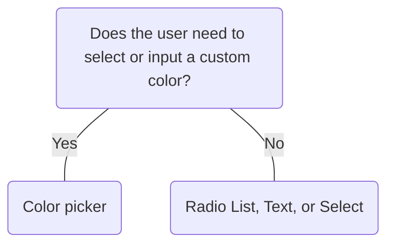

# Color

## Overview


> Image: Illustration of a Color component.


## When to use this component
- You need to allow users to select a specific color, such as customizing the look and feel of a dashboard, data visualization or other customizeable element.

## When to use another component
- If you have a list of predefined options consider using a Radio list or Select.
- If you only need to capture a hex value for data-entry purposes use Text.



### Check out
- [Radio List][1]
- [Select][2]
- [Text][3]

## Usage

### Number of options
#### Limit choices
Avoid overwhelming users with too many options, this can increase cognitive load.

> Image: Example laying emphasis on number of color swatch options provided to the user. The first example with the heart eyes emoji displays The color component to have 20 color swatch options, whereas the second example with the grimacing emoji displays the Color component to have too many color swatch options available. This could increase cognitive load for the user (according to Miller


#### Too few options
Avoid limiting users with too few color options, this can make them feel restricted and unable to fully express their preferences or align with their brand identity.

> Image: Example laying emphasis on number of color swatch options provided to the user. The first example with the heart eyes emoji displays the Color component to have 20 color swatch options, whereas the second example with the grimacing emoji displays the Color component to have too few color swatch options available. This could make users feel restricted.


### Color preview
Showcase a live color preview of the chosen color. This provides real-time visual feedback ensuring the user is confident in their selection.

> Image: Example showcasing the significance of visually displaying the selected color to the user. The first example with the heart eyes emoji displays the Color component to showcase the selected color visually, whereas the second example with the grimacing emoji displays the Color component to only display the hex value of the selected color.


### Text preview
When possible, set the hideInput property to false to display the input field, ensuring inclusive design with text and color affordances.

> Image: Example showcasing the significance of displaying the text input field to the user. The first example with the heart eyes emoji displays the Color component to showcase the selected color with both a color swatch and a text input, whereas the second example with the grimacing emoji displays the Color component to only display the color swatch of the selected color.


[1]: ./RadioList
[2]: ./Select
[3]: ./Text

## Examples


### Uncontrolled

```typescript
import React from 'react';

import Color from '@splunk/react-ui/Color';


function Uncontrolled() {
    return <Color defaultValue="#F29BAC" />;
}

export default Uncontrolled;
```


### Controlled

```typescript
import React, { useState } from 'react';

import Color, { ColorChangeHandler } from '@splunk/react-ui/Color';


function Controlled() {
    const [colorValue, setColorValue] = useState<string | null | undefined>('#000000');

    const handleChange: ColorChangeHandler = ({ value }) => {
        setColorValue(value);
    };

    return <Color value={colorValue} onChange={handleChange} />;
}

export default Controlled;
```


### Theme Variables

Variables from @splunk/themes can be used to set Color values, such as defaultValue.

```typescript
import React from 'react';

import Color, { defaultPalette } from '@splunk/react-ui/Color';
import useSplunkTheme from '@splunk/themes/useSplunkTheme';


export default function ThemeVariables() {
    const { syntaxTeal } = useSplunkTheme();

    const palette = [...defaultPalette, syntaxTeal];

    return (
        <div style={{ width: 170 }}>
            <Color defaultValue={syntaxTeal} palette={palette} />
        </div>
    );
}
```


### Transparent

Including transparent in the palette is supported. Put this option at the start or end of the palette.

```typescript
import React from 'react';

import Color, { defaultPalette } from '@splunk/react-ui/Color';


function Transparent() {
    return <Color defaultValue="transparent" palette={['transparent', ...defaultPalette]} />;
}

export default Transparent;
```


### N/A

Including N/A in the palette is supported. Put this option at the start or end of the palette. Selecting N/A will return null.

```typescript
import React, { useState } from 'react';

import Color, { ColorChangeHandler } from '@splunk/react-ui/Color';


function Null() {
    const [colorValue, setColorValue] = useState<string | null | undefined>(null);

    const handleChange: ColorChangeHandler = ({ value }) => {
        setColorValue(value);
    };

    return <Color value={colorValue} onChange={handleChange} />;
}

export default Null;
```


### Customized Palette

Color has defaultPalette exported which can be modified.

```typescript
import React from 'react';

import Color, { defaultPalette } from '@splunk/react-ui/Color';


export default function CustomizedPalette() {
    const customSwatches = [
        '#53a051',
        '#62b3b2',
        '#4fa484',
        '#f8be44',
        '#5a4575',
        '#708794',
        '#294e70',
        '#b6c75a',
    ];
    const myPalette = [...customSwatches, ...defaultPalette];

    return <Color defaultValue="#4fa484" palette={myPalette} />;
}
```


### Hide Input

Color without hex value text input. The input will still appear inside the dropdown when opened.

```typescript
import React from 'react';

import Color from '@splunk/react-ui/Color';


function HideInput() {
    return <Color hideInput defaultValue="#912344" />;
}

export default HideInput;
```


## API


### Color API

#### Props

| Name | Type | Required | Default | Description |
|------|------|------|------|------|
| append | boolean | no |  | Append removes border from the right side. |
| defaultValue | string \| null | no |  | Set this property instead of value to make value uncontrolled. |
| describedBy | string | no |  | The id of the description. When placed in a ControlGroup, this is automatically set to the ControlGroup's help component. |
| disabled | boolean | no |  | Add a disabled attribute and prevent clicking. |
| elementRef | React.Ref<HTMLDivElement> | no |  | A React ref which is set to the DOM element when the component mounts and null when it unmounts. |
| error | boolean | no |  | Add an error attribute. |
| hideInput | boolean | no |  | Set this property to hide the hex value text input in the initial appearance. The input will still appear inside the dropdown when opened. |
| labelledBy | string | no |  | The id of the label. When placed in a ControlGroup, this is automatically set to the ControlGroup's label. |
| name | string | no |  | The name is returned with onChange events, which can be used to identify the control when multiple controls share an onChange callback. |
| onChange | ColorChangeHandler | no |  | A callback that receives the value of a newly selected color. |
| palette | (string \| null)[] | no | defaultPalette | An array of optional color swatch values (hexadecimal or 'transparent'). The 'transparent' option should only be put at the start or end of the palette. |
| prepend | boolean | no |  | This has no effect on the appearance at this time but is recommended to be used when a control is joined to the left. Styles may change in the future. |
| value | string \| null | no |  | The value of the color (hexadecimal or 'transparent'). Setting this value makes the property controlled. An `onChange` callback is required. |

#### Types

| Name | Type | Description |
|------|------|------|
| ColorChangeHandler | (data: { name?: string; value?: string \| null }) => void |  |


