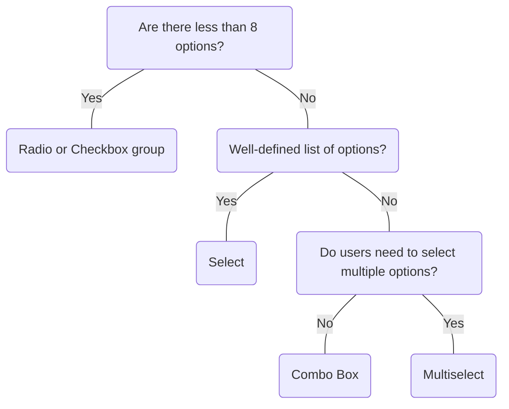

# Combo Box

## Overview


> Image: Illustration of a combo box component.


<Message appearance="fill" type="info">
    <div>All data entry components should be wrapped in a <Link to="ControlGroup">Control Group</Link> to provide a label, error states, and help or error text, ensuring an accessible experience for all users.</div>
</Message>

## When to use this component
- User needs to select from a large list of options.
- User needs to search and filter options within a list.
- Users need the flexibility to enter custom values in addition to selecting options from a list.
- Users know what they’re looking for and can enter enough characters to refine their search.

## When to use another component
- Use a Radio List or Switch(Checkbox) for a small list of predefined options.
- Use a Select when the list of options is short, well-defined, and clearly distinct from each other. If the user needs to browse through values, a Select is more appropriate
- User needs to select multiple options or needs to create a custom value in addition to selecting multiple options from a list, use Multiselect.
- Use a Text for free-form input.



### Check out
- [Radio List][1]
- [Switch] [2]
- [Select][3]
- [Multiselect][4]
- [Text][5]

## Behaviors

### Custom values
Allow users to enter custom values not present in the predefined list.
> Image: Image showing an examples of the Combo box component with a custom value, Custom chart, typed in the input box.


### Matching
Assist users in finding options quickly by providing matches and/or recommendations
> Image: Image showing a Combo box component in a focus state with the word chart typed in the input box, resulting in the list of options being filtered to only show options that have the word chart in the title.


## Usage
### Make large lists easier to search
The list of selections is complex enough to require searching and filtering capabilities. If the list is not extensive enough to justify a combo box, consider using a different selection method.
> Image: Two examples of Combo boxes. The first example with heart eyes emoji has a combo box labeled 


## Content guidelines
### Keep menu items concise
Menu items should be clear and concise. Avoid menu items that wrap to multiple lines. Instead, use shorter text or increase the menu width when space allows.
> Image: Two examples of Combo boxes, both are labeled 


### Truncation
Use a width that accommodates the majority of options when possible.
> Image: Two examples of Combo boxes, both are labeled 


[1]: ./RadioList
[2]: ./Switch
[3]: ./Select
[4]: ./Multiselect
[5]: ./Text

## Examples


### Uncontrolled

This is a basic example in which data management and filtering are handled internally.

```typescript
import React from 'react';

import ComboBox from '@splunk/react-ui/ComboBox';


function Uncontrolled() {
    return (
        <ComboBox inline>
            <ComboBox.Option value="Line Chart" description="Recommended" />
            <ComboBox.Option value="Area Chart" />
            <ComboBox.Option value="Column Chart" />
            <ComboBox.Option value="Bar Chart" />
            <ComboBox.Option value="Pie Chart" />
            <ComboBox.Option value="Scatter Chart" />
            <ComboBox.Option value="Bubble Chart" />
        </ComboBox>
    );
}

export default Uncontrolled;
```


### Headings

```typescript
import React from 'react';

import ComboBox from '@splunk/react-ui/ComboBox';


export default function Headings() {
    return (
        <ComboBox inline>
            <ComboBox.Option value="Events" />
            <ComboBox.Option value="Statistics Table" />
            <ComboBox.Heading>Chart</ComboBox.Heading>
            <ComboBox.Option value="Line Chart" />
            <ComboBox.Option value="Area Chart" />
            <ComboBox.Option value="Column Chart" />
            <ComboBox.Option value="Bar Chart" />
            <ComboBox.Option value="Pie Chart" />
            <ComboBox.Option value="Scatter Chart" />
            <ComboBox.Option value="Bubble Chart" />
            <ComboBox.Heading>Value</ComboBox.Heading>
            <ComboBox.Option value="Single Value" />
            <ComboBox.Option value="Radial Gauge" />
            <ComboBox.Option value="Filler Gauge" />
            <ComboBox.Option value="Marker Gauge" />
            <ComboBox.Heading>Map</ComboBox.Heading>
            <ComboBox.Option value="Cluster Map" />
            <ComboBox.Option value="Choropleth Map" />
        </ComboBox>
    );
}
```


### Controlled Value

Typically, the value is controlled.

```typescript
import React, { useState } from 'react';

import ComboBox, { ComboBoxChangeHandler } from '@splunk/react-ui/ComboBox';


function Controlled() {
    const [value, setValue] = useState('');

    const handleChange: ComboBoxChangeHandler = (e, { value: comboBoxValue }) => {
        setValue(comboBoxValue);
    };

    return (
        <ComboBox inline onChange={handleChange} value={value}>
            <ComboBox.Option value="Line Chart" description="Recommended" />
            <ComboBox.Option value="Area Chart" />
            <ComboBox.Option value="Column Chart" />
            <ComboBox.Option value="Bar Chart" />
            <ComboBox.Option value="Pie Chart" />
            <ComboBox.Option value="Scatter Chart" />
            <ComboBox.Option value="Bubble Chart" />
        </ComboBox>
    );
}

export default Controlled;
```


### Label

label can be used in addition to value when needed, similar to Select. label will be used for matching and must be a string.

```typescript
import React, { useState } from 'react';

import ComboBox, { ComboBoxChangeHandler } from '@splunk/react-ui/ComboBox';
import ControlGroup from '@splunk/react-ui/ControlGroup';


function Label() {
    const [value, setValue] = useState('');

    const handleChange: ComboBoxChangeHandler = (e, { value: comboBoxValue }) => {
        setValue(comboBoxValue);
    };

    return (
        <>
            <ControlGroup label="Controlled" labelPosition="top">
                <ComboBox inline onChange={handleChange} value={value}>
                    <ComboBox.Option value="chart-1" label="Line Chart" description="Recommended" />
                    <ComboBox.Option value="chart-2" label="Area Chart" />
                    <ComboBox.Option value="chart-3" label="Column Chart" />
                    <ComboBox.Option value="chart-4" label="Bar Chart" />
                    <ComboBox.Option value="chart-5" label="Pie Chart" />
                    <ComboBox.Option value="chart-6" label="Scatter Chart" />
                    <ComboBox.Option value="chart-7" label="Bubble Chart" />
                </ComboBox>
            </ControlGroup>

            <ControlGroup label="Uncontrolled" labelPosition="top">
                <ComboBox inline>
                    <ComboBox.Option value="chart-1" label="Line Chart" description="Recommended" />
                    <ComboBox.Option value="chart-2" label="Area Chart" />
                    <ComboBox.Option value="chart-3" label="Column Chart" />
                    <ComboBox.Option value="chart-4" label="Bar Chart" />
                    <ComboBox.Option value="chart-5" label="Pie Chart" />
                    <ComboBox.Option value="chart-6" label="Scatter Chart" />
                    <ComboBox.Option value="chart-7" label="Bubble Chart" />
                </ComboBox>
            </ControlGroup>
        </>
    );
}

export default Label;
```


### Fetching

You can populate the Options from a server. Here, that behavior is simulated. This simplified example only matches the start of the label. The matchRange prop can be set manually to reflect the matching algorithm used to filter the results. Otherwise matching text is not shown.

```typescript
import React, { useCallback, useEffect, useState } from 'react';

import ComboBox, { ComboBoxChangeHandler } from '@splunk/react-ui/ComboBox';
import useFetchOptions, { MovieOption } from '@splunk/react-ui/fixtures/useFetchOptions';
import { _ } from '@splunk/ui-utils/i18n';


function Fetching() {
    
    const { fetch, getFullCount, stop } = useFetchOptions();

    const [fullCount, setFullCount] = useState(0);
    const [isLoading, setIsLoading] = useState(false);
    const [options, setOptions] = useState<MovieOption[]>([]);
    const [value, setValue] = useState('');

    const handleFetch = useCallback(
        (comboBoxValue = '') => {
            setValue(comboBoxValue);
            setIsLoading(true);
            fetch(comboBoxValue)
                .then((comboBoxOptions) => {
                    setFullCount(getFullCount());
                    setIsLoading(false);
                    setOptions(comboBoxOptions);
                })
                .catch((error) => {
                    if (!error.isCanceled) {
                        throw error;
                    }
                });
        },
        [fetch, getFullCount]
    );

    const generateOptions = () => {
        if (isLoading) {
            return null;
        }

        /*
         * Filtering is done server-side and the `matchRanges` prop would be either
         * be provided by the server, deduced based on the match algorithm, or omitted.
         */
        return options.map((movie) => (
            <ComboBox.Option value={movie.title} key={movie.id} matchRanges={movie.matchRanges} />
        ));
    };

    const footerMessage = () => {
        if (fullCount > options.length && !isLoading) {
            return _('%1 of %2 movies')
                .replace('%1', options.length.toString())
                .replace('%2', fullCount.toString());
        }
        return null;
    };

    const handleChange: ComboBoxChangeHandler = (e, { value: comboBoxValue }) => {
        handleFetch(comboBoxValue);
    };

    useEffect(() => {
        handleFetch();

        return () => {
            stop();
        };
    }, [handleFetch, stop]);

    const comboBoxOptions = generateOptions();
    const footerMessageValue = footerMessage();

    return (
        <ComboBox
            value={value}
            controlledFilter
            inline
            placeholder={_('Select a movie...')}
            menuStyle={{ width: 300 }}
            onChange={handleChange}
            isLoadingOptions={isLoading}
            footerMessage={footerMessageValue}
        >
            {comboBoxOptions}
        </ComboBox>
    );
}

export default Fetching;
```


### Load more on scroll bottom

Similar example to Fetching, but you can also append more Options from a server when the list is scrolled to the bottom. Here, that behavior is simulated. The onScrollBottom prop is a function that fetches more results and appends them to the current Options. Once all items are loaded, the onScrollBottom prop should be set to null.

```typescript
import React, { useCallback, useEffect, useState } from 'react';

import ComboBox, { ComboBoxChangeHandler } from '@splunk/react-ui/ComboBox';
import useFetchOptions, { MovieOption } from '@splunk/react-ui/fixtures/useFetchOptions';
import { _ } from '@splunk/ui-utils/i18n';


const createFooterMessage = (loadingMore: string, count: string) => {
    return _('%1 movies %2').replace('%1', loadingMore).replace('%2', count);
};

function LoadMoreOnScrollBottom() {
    const [fullCount, setFullCount] = useState<number>(0);
    const [isLoading, setIsLoading] = useState<boolean>(false);
    const [isLoadingMore, setIsLoadingMore] = useState<boolean>(false);
    const [options, setOptions] = useState<MovieOption[]>([]);
    const [value, setValue] = useState<string>('');

    
    const { fetch, fetchMore, getFullCount, stop } = useFetchOptions();

    const handleFetch = useCallback(
        (comboBoxValue = '') => {
            setValue(comboBoxValue);
            setIsLoading(true);

            fetch(comboBoxValue)
                .then((comboBoxOptions) => {
                    setOptions(comboBoxOptions);
                    setIsLoading(false);
                    setIsLoadingMore(false);
                    setFullCount(getFullCount());
                })
                .catch((error) => {
                    if (!error.isCanceled) {
                        throw error;
                    }
                });
        },
        [fetch, getFullCount, setOptions]
    );

    const handleFetchMore = (currentOptions?: MovieOption[]) => {
        setIsLoadingMore(true);

        fetchMore(currentOptions)
            .then((comboBoxOptions) => {
                setOptions(comboBoxOptions);
                setIsLoadingMore(false);
                setIsLoadingMore(false);
                setFullCount(getFullCount());
            })
            .catch((error) => {
                if (!error.isCanceled) {
                    throw error;
                }
            });
    };

    const handleScrollBottom = () => {
        if (!isLoadingMore) {
            handleFetchMore(options);
        }
    };

    const generateOptions = () => {
        if (isLoading) {
            return null;
        }

        /*
         * Filtering is done server-side and the `matchRanges` prop would be either
         * be provided by the server, deduced based on the match algorithm, or omitted.
         */
        return options.map((movie) => (
            <ComboBox.Option value={movie.title} key={movie.id} matchRanges={movie.matchRanges} />
        ));
    };

    useEffect(() => {
        handleFetch();

        return () => {
            stop();
        };
    }, [setOptions, handleFetch, stop]);

    const handleChange: ComboBoxChangeHandler = (e, { value: comboBoxValue }) => {
        handleFetch(comboBoxValue);
    };

    const footerMessage = createFooterMessage(
        fullCount.toString(),
        isLoadingMore ? _('(Loading more movies)') : ''
    );
    const comboBoxOptions = generateOptions();

    return (
        <ComboBox
            value={value}
            controlledFilter
            inline
            placeholder={_('Select a movie...')}
            menuStyle={{ width: 300 }}
            onChange={handleChange}
            onScrollBottom={
                // Disable when all items are loaded.
                fullCount === options.length ? undefined : handleScrollBottom
            }
            isLoadingOptions={isLoading}
            footerMessage={footerMessage}
        >
            {comboBoxOptions}
        </ComboBox>
    );
}

export default LoadMoreOnScrollBottom;
```


## API


### ComboBox API

`ComboBox` allows the user to select a predefined string or enter a new value. Unlike `Select`
and `Multiselect`, `Option` value must always be a string.

#### Props

| Name | Type | Required | Default | Description |
|------|------|------|------|------|
| animateLoading | boolean | no |  |  |
| append | boolean | no |  | Append removes rounded borders and border from the right side. |
| children | React.ReactNode | no |  | All children must be instances of `ComboBox.Option`. |
| controlledFilter | boolean | no |  | If true, this component will not handle filtering. The parent must update the Options based on the onChange value. |
| defaultPlacement | 'above' \| 'below' \| 'vertical' | no | 'vertical' | The default placement of the dropdown menu. It might be rendered in a different direction depending upon the space available. |
| defaultValue | string | no |  | The initial value of the input. Only applicable in uncontrolled mode. |
| describedBy | string | no |  | The id of the description. When placed in a ControlGroup, this is automatically set to the ControlGroup's help component. |
| disabled | boolean | no |  |  |
| elementRef | React.Ref<HTMLDivElement> | no |  | A React ref which is set to the DOM element when the component mounts and null when it unmounts. |
| error | boolean | no |  | Highlight the field as having an error. The border and text will turn red. |
| footerMessage | React.ReactNode | no |  | The footer message can show additional information, such as a truncation message. |
| inline | boolean | no |  | Make the control an inline block with variable width. |
| inputId | string | no |  | An id for the input, which may be necessary for accessibility, such as for aria attributes. |
| inputRef | React.Ref<HTMLInputElement> | no |  | A React ref which is set to the input element when the component mounts and null when it unmounts. |
| isLoadingOptions | boolean | no |  |  |
| labelledBy | string | no |  | The id of the label. When placed in a ControlGroup, this is automatically set to the ControlGroup's label. |
| loadingMessage | React.ReactNode | no |  | The loading message to show when isLoadingOptions. |
| menuStyle | React.CSSProperties | no | {} |  |
| name | string | no |  | The name is returned with onChange events, which can be used to identify the control when multiple controls share an onChange callback. |
| noOptionsMessage | React.ReactNode | no |  | The noOptionsMessage is shown when there are no children and it's not loading, such as when there are no Options matching the filter. This can be customized to the type of content, for example: "No matching dashboards". You can insert content such as an error message or communicate a minimum number of characters to enter to see results. |
| onBlur | ComboBoxBlurHandler | no |  |  |
| onChange | ComboBoxChangeHandler | no |  |  |
| onClose | () => void | no |  | A callback function invoked when the popover closes. |
| onFocus | ComboBoxFocusHandler | no |  |  |
| onKeyDown | React.KeyboardEventHandler<HTMLInputElement> | no |  |  |
| onOpen | () => void | no |  | A callback function invoked when the popover opens. |
| onScroll | React.UIEventHandler<Element> | no |  | A callback function invoked when the menu is scrolled. |
| onScrollBottom | ComboBoxScrollBottomHandler | no |  | A callback function for loading additional list items. Called when the list is scrolled to the bottom or all items in the list are visible. This is called with an event argument if this is the result of a scroll.  This should be set this to `null` when all items are loaded. |
| onSelect | React.ReactEventHandler<HTMLInputElement> | no |  |  |
| placeholder | string | no | _('Select...') |  |
| prepend | boolean | no |  | Prepend removes rounded borders from the left side. |
| value | string | no |  | The value of the input. Only applicable in controlled mode. |

#### Types

| Name | Type | Description |
|------|------|------|
| ComboBoxBlurHandler | (     event: React.FocusEvent<HTMLInputElement>,     data: {         name?: string;         value: string;     } ) => void |  |
| ComboBoxChangeHandler | (     event:         \| React.ChangeEvent<HTMLInputElement>         \| React.MouseEvent<HTMLButtonElement \| HTMLSpanElement>         \| React.KeyboardEvent<HTMLInputElement>,     data: {         name?: string;         value: string;     } ) => void |  |
| ComboBoxFocusHandler | (     event: React.FocusEvent<HTMLInputElement>,     data: {         name?: string;         value: string;     } ) => void |  |
| ComboBoxScrollBottomHandler | (     event: React.UIEvent<HTMLDivElement> \| React.KeyboardEvent<HTMLInputElement> \| null ) => void |  |


### ComboBox.Option API

An option within a `ComboBox`.

#### Props

| Name | Type | Required | Default | Description |
|------|------|------|------|------|
| description | string | no |  | Additional information to explain the option, such as "Recommended". |
| descriptionPosition | 'right' \| 'bottom' | no | 'bottom' | The description text may appear to the right of the label or under the label. |
| disabled | boolean | no |  | If disabled=true, the option is grayed out and cannot be clicked. |
| elementRef | React.Ref<HTMLButtonElement \| HTMLAnchorElement> | no |  | A React ref which is set to the DOM element when the component mounts and null when it unmounts. |
| icon | React.ReactNode | no |  | The icon to show before the label. See the @splunk/react-icons package for drop in icons.  Caution: The element(s) passed here must be pure. All icons in the react-icons package are pure. |
| label | string | no |  | When provided, `label` is rendered instead of the `value` and used for matching. |
| matchRanges | { start: number; end: number }[] | no |  | Sections of the label string to highlight as a match. This is automatically set for uncontrolled filters, so it's not normally necessary to set this property when using filtering. |
| truncate | boolean | no |  | When `true`, wrapping is disabled and any additional text is ellipsised. |
| value | string | yes |  | The value of this option and the label shown for it. |


