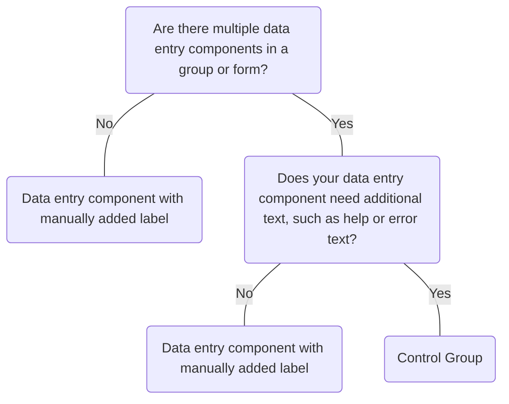

# Control Group

## Overview


> Image: Illustration of a group of data entry components in a Control Group.


## When to use this component
Control Group provides a robust experience for data entry and forms to:
- Group data entry components.
- Add labels and help or error messages to data entry components.
- Control the layout and/or visually combine multiple inputs on a single line.

## When to use another component
<Message appearance="fill" type="warning">
    If you choose not to use Control Group, it is your responsibility to ensure the experience is accessible to all users. Affordances such as correct labeling, help text, and errors need to be considered.
</Message>



## Behaviors

### Fill layout
Control Group's default layout can be used to put one or multiple inputs on a single line. Multiple components on a single line will be kept separate. Removing the fill layout will allow controls to control their own size and wrap onto multiple lines. This should usually be used for Date, Number and Switch controls.
> Image: Example of a Control Group with four inputs on two lines. On the first line, Alert name, there is a Select and Text input with the help text 


### Fill and join layout
Control Group can control the visual style of multiple inputs on a single line, making the input look joined as one. This is best used when the controls are directly related, for example a value input and its unit.
> Image: Example of a Control Group with four inputs on two lines. The inputs on the same lines are styled to visually be connected. On the first line, Alert name, there is a Select and Text input with the help text 


## Usage

### Avoid placeholder text and tooltips

#### Placeholder text
Placeholder text presents a number of visual and cognitive issues. It is best to avoid using it and use help text instead. Placeholder does not replace a label. [Read about issues placeholders can cause.] [1]
> Image: Example of a Control Group with three Text inputs: ID number, First name and Last name, and a Location Select input. In the first example with heart eyes emoji, the inputs are left blank, and help text is added for the ID number. In the second example with grimacing emoji, the labels are repeated as placeholder texts for each input.


#### Tooltips
To ensure information accessibility and convenience, it's recommended to minimize reliance on tooltips. Tooltips necessitate extra user actions, conceal crucial details, and may obstruct surrounding inputs or content. Instead, using visible help text directly is recommended for clearer and more immediate guidance.
> Image: Examples of using tooltips with a Text component. The first example with heart eyes emoji has a Text component labeled 


### Help and error text
Help and error text can describe multiple inputs within a Control Group. Both help and error text can visible at the same time and should complement one another.

> Image: Example of a Control Group with four inputs on two lines. On the first line, Alert name, there is a Select and Text input with the help text 


#### Help text
Put information that's essential to completing the task in help text so it's always visible.
Don’t add help text if it doesn’t provide helpful information for the user.
> Image: Examples of using help text that is helpful and essential to completing a task. The first example with heart eyes emoji has a text input labeled 


#### Error text with solution
Validation and error messages help users to understand and resolve problems. The error message should inform users what the problem is and how to fix it.

Note: Use [Message][2] to communicate server-side validation errors. Some errors, like those caused by temporary system issues, might only surface after submission.
> Image: Examples of a Control Group with a Select input and error message. In the first example with heart eyes emoji, the error message says 


### Required vs optional fields
Use one of these styles when all fields in a form are required, or when the form includes both required and optional fields—don't mix styles.

#### All fields are required
When a form only contains required inputs, inform users that all fields are required once at the beginning of the form.
> Image: Example of a Control Group with three Text inputs: ID number, First name and Last name, and a Location Select input. A description at the top says, 


#### Required and optional fields
When a form contains both required and optional fields, use the `required` prop for each required control group.
> Image: Example of a Control Group with three Text inputs: ID number, First name and Last name, and a Location Select input. The ID number input is marked as optional. A description at the top says, 


#### Optional fields
If the majority of fields are required, consider marking the optional fields instead. Ensure the word '(optional)' is included as part of the label, placed after the input label text and wrapped in parentheses.

> Image: Example of a Control Group with three Text inputs: ID number, First name and Last name, and a Location Select input. Description at the top says, 


### Field set
It is best to group related inputed in an HTML `<fieldset>` tag, which encloses related elements and provides a title for the children Control Group(s). Additionally, you can use a description to provide further context to help guide users.
> Image: Example of a Control Group with three Text inputs: ID number, First name and Last name, and a Location Select input. The Control Group has the title, Employee details, and the description, Use a description on field set to provide information that guides users.


## Content guidelines

### Labels
Labels are required, keep Control Group labels brief and use sentence-style capitalization.
> Image: Example of keeping Text component labels brief. The first example with heart eyes emoji has a Text component labeled 


[1]: https://www.nngroup.com/articles/form-design-placeholders/
[2]: ./Message

## Examples


### Default Appearance

By default, the label appears above and the control fills the available width.

```typescript
import React from 'react';

import ControlGroup from '@splunk/react-ui/ControlGroup';
import Text from '@splunk/react-ui/Text';


function Basic() {
    return (
        <div>
            <ControlGroup
                label="Field label"
                tooltip="Tooltip helps explain the label."
                help="This is the help text."
            >
                <Text canClear />
            </ControlGroup>
        </div>
    );
}

export default Basic;
```


### Labels to the left

Alternately, labels can be placed to the left of the control.

```typescript
import React from 'react';

import ControlGroup from '@splunk/react-ui/ControlGroup';
import Text from '@splunk/react-ui/Text';


function LabelLeft() {
    return (
        <div>
            <ControlGroup label="Label left" labelPosition="left">
                <Text />
            </ControlGroup>
        </div>
    );
}

export default LabelLeft;
```


### Help Text with a Link.

Help text may contain links or other content.

```typescript
import React from 'react';

import ControlGroup from '@splunk/react-ui/ControlGroup';
import Link from '@splunk/react-ui/Link';
import Text from '@splunk/react-ui/Text';


function HelpWithLinks() {
    const help = (
        <span>
            Help text with a <Link to="http://duckduckgo.com">link</Link>
        </span>
    );

    return (
        <div>
            <ControlGroup label="Username" help={help}>
                <Text />
            </ControlGroup>
        </div>
    );
}

export default HelpWithLinks;
```


### Required

The required property will set the required attribute on each child component and add an asterisk before the label.

```typescript
import React from 'react';

import ControlGroup from '@splunk/react-ui/ControlGroup';
import Text from '@splunk/react-ui/Text';


function Required() {
    return (
        <div>
            <ControlGroup required label="Field label">
                <Text canClear />
            </ControlGroup>
        </div>
    );
}

export default Required;
```


### Error

Most form controls have their own error property. It is recommended to supply an error message so the user understands what the problem is and how to fix it.

```typescript
import React from 'react';

import ControlGroup from '@splunk/react-ui/ControlGroup';
import Text from '@splunk/react-ui/Text';


function Error() {
    return (
        <div>
            <ControlGroup label="Alert name" error="Alert name cannot contain commas: ,">
                <Text canClear defaultValue="Server, Crash" error />
            </ControlGroup>
        </div>
    );
}

export default Error;
```


### Help and error text

Help and error text can appear at the same time.

```typescript
import React from 'react';

import ControlGroup from '@splunk/react-ui/ControlGroup';
import Text from '@splunk/react-ui/Text';


function HelpWithErrorText() {
    return (
        <div>
            <ControlGroup
                label="Field label"
                labelPosition="top"
                help="Some help text."
                error="Error text."
            >
                <Text error canClear />
            </ControlGroup>
        </div>
    );
}

export default HelpWithErrorText;
```


### Fill Layout (Default)

Fill layout will put space between the controls.

```typescript
import React from 'react';

import ControlGroup from '@splunk/react-ui/ControlGroup';
import RadioBar from '@splunk/react-ui/RadioBar';
import Select from '@splunk/react-ui/Select';
import Text from '@splunk/react-ui/Text';


function LayoutFill() {
    return (
        <div>
            <ControlGroup label="Two controls">
                <Text />
                <Select defaultValue="1">
                    <Select.Option label="Up" value="1" />
                    <Select.Option label="Down" value="2" />
                </Select>
            </ControlGroup>
            <ControlGroup label="Two controls">
                <Select defaultValue="1">
                    <Select.Option label="Up" value="1" />
                    <Select.Option label="Down" value="2" />
                </Select>
                <Text />
            </ControlGroup>

            <ControlGroup label="One control">
                <Select defaultValue="1">
                    <Select.Option label="Up" value="1" />
                    <Select.Option label="Down" value="2" />
                </Select>
            </ControlGroup>

            <ControlGroup label="RadioBar control">
                <RadioBar defaultValue={3} style={{ width: '460px' }}>
                    <RadioBar.Option value={1} label="one" />
                    <RadioBar.Option value={2} label="two" />
                    <RadioBar.Option value={3} label="three three three" />
                    <RadioBar.Option value={4} label="four" />
                </RadioBar>
            </ControlGroup>
        </div>
    );
}

export default LayoutFill;
```


### Fill and Join Layout

The controls will fill the space and will be joined together.

```typescript
import React from 'react';

import Button from '@splunk/react-ui/Button';
import ControlGroup from '@splunk/react-ui/ControlGroup';
import Number from '@splunk/react-ui/Number';
import Select from '@splunk/react-ui/Select';
import Text from '@splunk/react-ui/Text';


function LayoutFillJoin() {
    return (
        <div>
            <ControlGroup label="Two controls" controlsLayout="fillJoin">
                <Text />
                <Select defaultValue="1">
                    <Select.Option label="Up" value="1" />
                    <Select.Option label="Down" value="2" />
                </Select>
            </ControlGroup>
            <ControlGroup label="Two controls" controlsLayout="fillJoin">
                <Select defaultValue="1" style={{ minWidth: '80px' }}>
                    <Select.Option label="Up" value="1" />
                    <Select.Option label="Down" value="2" />
                </Select>
                <Text />
            </ControlGroup>

            <ControlGroup label="One control" controlsLayout="fillJoin">
                <Select defaultValue="13" prefixLabel="Direction">
                    <Select.Option label="Up" value="1" />
                    <Select.Option label="Down" value="2" />
                    <Select.Divider />
                    <Select.Option label="Down" value="3" />
                    <Select.Option label="Left" value="4" />
                    <Select.Divider />
                    <Select.Option
                        label="Behind"
                        value="11"
                        disabled
                        description="back"
                        descriptionPosition="right"
                    />
                    <Select.Option label="Over" value="12" description="Ya know what over means?" />
                    <Select.Option label={new Array(10).join('Truncate ')} value="13" truncate />
                    <Select.Option label={new Array(8).join('Wrap ')} value="14" disabled />
                </Select>
            </ControlGroup>

            <ControlGroup label="Multiple controls" controlsLayout="fillJoin">
                <Number defaultValue={10} />
                <Select defaultValue="1" style={{ minWidth: '80px' }}>
                    <Select.Option label="Up" value="1" />
                    <Select.Option label="Down" value="2" />
                    <Select.Option label="Right" value="3" />
                    <Select.Option label="Left" value="4" />
                </Select>
                <Button label="Cancel" />
                <Button label="Submit" />
            </ControlGroup>
        </div>
    );
}

export default LayoutFillJoin;
```


### No Layout

Removing the layout will allow controls to control their own size and wrap onto multiple lines. This should usually be used for Date, Number and Switch controls. Setting the control to inline, adjusting spacing, and/or setting a width may be necessary.

```typescript
import React from 'react';

import ControlGroup from '@splunk/react-ui/ControlGroup';
import Date from '@splunk/react-ui/Date';
import Number from '@splunk/react-ui/Number';
import RadioBar from '@splunk/react-ui/RadioBar';
import Switch from '@splunk/react-ui/Switch';


function LayoutNone() {
    return (
        <div>
            <ControlGroup label="RadioBar no layout" controlsLayout="none">
                <RadioBar defaultValue={3} inline style={{ width: '460px' }}>
                    <RadioBar.Option value={1} label="one" />
                    <RadioBar.Option value={2} label="two" />
                    <RadioBar.Option value={3} label="threethreethree" />
                    <RadioBar.Option value={4} label="four" />
                </RadioBar>
            </ControlGroup>
            <ControlGroup label="Date no layout" controlsLayout="none">
                <Date defaultValue="2017-04-05" />
            </ControlGroup>
            <ControlGroup label="Number no layout" controlsLayout="none">
                <Number defaultValue={400} inline style={{ width: 90 }} />
            </ControlGroup>
            <ControlGroup label="Switch no layout" controlsLayout="none">
                <Switch value="Breakfast">Breakfast</Switch>
                <Switch value="Lunch">Lunch</Switch>
                <Switch value="Supper">Supper</Switch>
            </ControlGroup>
        </div>
    );
}

export default LayoutNone;
```


### Customized Label Target

Change the focus/activation target that should be linked to the label.

```typescript
import React, { Component } from 'react';

import Checkbox, { CheckboxChangeHandler } from '@splunk/react-ui/Checkbox';
import ControlGroup from '@splunk/react-ui/ControlGroup';
import Select from '@splunk/react-ui/Select';
import Text from '@splunk/react-ui/Text';


class CustomizedLabelTarget extends Component<object, { values: string[] }> {
    constructor(props: object) {
        super(props);

        this.state = {
            values: [],
        };
    }

    handleClick: CheckboxChangeHandler = (e, { value }) => {
        const prevValues = this.state.values;
        if (value != null) {
            if (prevValues.includes(value)) {
                this.setState({
                    values: prevValues.filter((prevValue) => prevValue !== value),
                });
            } else {
                this.setState({
                    values: prevValues.concat(value),
                });
            }
        }
    };

    render() {
        const selectedValues = this.state.values;
        const CheckboxSwitches = ['1', '2', '3', '4', '5'].map((value) => (
            <Checkbox
                key={value}
                value={value}
                checked={selectedValues.includes(value)}
                onChange={this.handleClick}
                id={`customized-switch-${value}`}
            >
                {value}
            </Checkbox>
        ));

        return (
            <div>
                <ControlGroup
                    label="Two controls"
                    labelFor="customized-select-before"
                    help="Clicking the label will focus/activate the Select rather than the default first Text."
                >
                    <Select defaultValue="1" inputId="customized-select-before">
                        <Select.Option label="Up" value="1" />
                        <Select.Option label="Down" value="2" />
                    </Select>
                    <Text />
                </ControlGroup>

                <ControlGroup
                    label="Two controls"
                    labelFor="customized-select-after"
                    help="Clicking the label will focus/activate the Select rather than the default first Text."
                >
                    <Text />
                    <Select defaultValue="1" inputId="customized-select-after">
                        <Select.Option label="Up" value="1" />
                        <Select.Option label="Down" value="2" />
                    </Select>
                </ControlGroup>

                <ControlGroup
                    label="Multiple controls"
                    labelFor="customized-switch-4"
                    help="Clicking the label will focus/activate the fourth Switch rather than the default first child."
                >
                    {CheckboxSwitches}
                </ControlGroup>
            </div>
        );
    }
}

export default CustomizedLabelTarget;
```


## API


### ControlGroup API

`ControlGroup` places a label and optional help text around one or more controls. The `ControlGroup`
will automatically add aria attributes to associate the controls with the labels and help text to
address accessibility requirements.

`ControlGroup` provides layouts to assist in aligning and laying out controls, but the defaults are
not helpful in all cases, nor will the layout options address all cases. Consider setting
`controlsLayout` to none and manually positioning the controls as required.

`ControlGroup` uses the HTML `label` tag. The rules for determining which child component is linked
to the label's `for` attribute are:
1. If one or more `children` are `Text` components, the first one is used.
2. If there aren't any `Text` components, the first child is used.

If the linked child supports an `inputId` prop and it's set, its value is used for the label's `for`
attribute. If `inputId` is supported but not set a generated id is used instead. If `inputId` isn't
supported `id` is used. The `labelFor` prop may be used to override the `for` attribute.

#### Props

| Name | Type | Required | Default | Description |
|------|------|------|------|------|
| children | React.ReactNode | no |  |  |
| controlsLayout | 'fill' \| 'fillJoin' \| 'none' \| 'stack' | no | 'fill' | A layout defines how controls are aligned and displayed. |
| elementRef | React.Ref<HTMLDivElement> | no |  | A React ref which is set to the DOM element when the component mounts and null when it unmounts. |
| error | boolean \| string | no | false | Highlight the control group as having an error and optionally provide error text. If error text is provided, displays it below the control. In addition to passing this prop, set the error prop on child components. |
| help | React.ReactNode | no |  |  |
| hideLabel | boolean | no |  | Hide the `label` visually but still render it for screen readers. Only enable this prop if the purpose of the control is clear enough from the context. Enabling this prop will hide `tooltip`. |
| label | string | yes |  |  |
| labelFor | string | no |  | Override the `for` attribute of the `label`. See the component description for details. |
| labelPosition | 'left' \| 'top' | no | 'top' |  |
| labelWidth | number \| string | no | 120 | When labelPosition is left, the width of the label in pixels or a value with a unit. |
| required | boolean | no | false | Sets the control required and adds an asterisk before the `label`. |
| tooltip | React.ReactNode | no |  | Displays a tooltip beside the `label`. |
| tooltipDefaultPlacement | 'above' \| 'below' \| 'left' \| 'right' | no |  | If a `tooltip` is provided, sets its default placement. |


