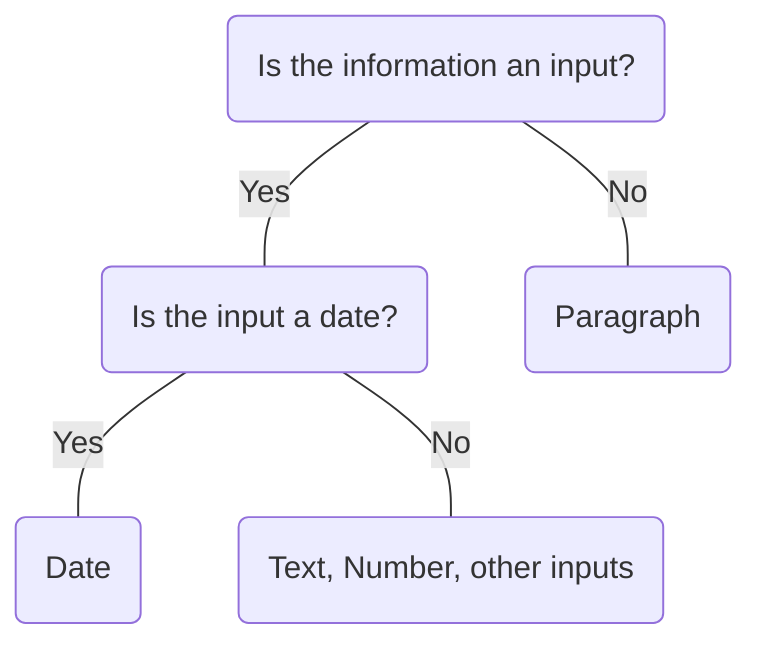

# Date

## Overview


> Image: Illustration of a Date component


<Message appearance="fill" type="info">
    <div>All data entry components should be wrapped in a <Link to="ControlGroup">Control Group</Link> to provide a label, error states, and help or error text, ensuring an accessible experience for all users.</div>
</Message>


## When to use this component
- When collecting date information from users like birthdays, anniversaries, or events, use a `Date` input component for a user-friendly, consistent experience.
- When capturing time-sensitive data such as deadlines or bookings, use a `Date` input for consistent, accurate entry.
- When performing calculations based on dates, such as determining the difference between two dates, `Date` will ensure a consistent format to be processed.


## When to use another component
- When the information being collected is not related to dates, use a different type of input component, such as a `Text` input or a `Dropdown` menu.
- When the date is only being displayed and not collected, use plain text instead.
- When non-standard date formats are required a custom date input component may be needed.

### Check out
- [Text][1]
- [Dropdown][2]
- [Modal] [3]




## Usage
### Keep input field an appropriate width
The `Date` input field is fixed width. Avoid resizing the field to prevent creating unnecessary space.


## Content

### Set locale for regional differences
Utilize the locale property to specify the language and adjust the date formatting to align with the country’s conventions. The default setting is U.S. English.

### Labels
Keep labels brief and descriptive, using sentence-style capitalization.
> Image: The image shows a do-and-don’t comparison between two input field labels. The left image shows a date input field labeled 


[1]: ./Text
[2]: ./Dropdown
[3]: ./Modal

## Examples


### Controlled

```typescript
import React, { Component } from 'react';

import Date, { DateChangeHandler } from '@splunk/react-ui/Date';


class Controlled extends Component<object, { value: string }> {
    constructor(props: object) {
        super(props);

        this.state = {
            value: '1988-08-24',
        };
    }

    handleChange: DateChangeHandler = (e, { value }) => {
        this.setState({ value });
    };

    render() {
        return <Date value={this.state.value} onChange={this.handleChange} />;
    }
}

export default Controlled;
```


### Uncontrolled

```typescript
import React from 'react';

import Date from '@splunk/react-ui/Date';


function Basic() {
    return <Date />;
}

export default Basic;
```


### Locale

Setting locale is recommended. Otherwise, en_US will always be used.

```typescript
import React from 'react';

import Date from '@splunk/react-ui/Date';


function CustomDate() {
    return <Date defaultValue="1988-08-24" locale="ko-KR" />;
}

export default CustomDate;
```


### Highlight Today

Highlight today's day.

```typescript
import React, { Component } from 'react';

import moment from 'moment';

import Date, { DateChangeHandler } from '@splunk/react-ui/Date';


class HighlightToday extends Component<object, { value: string }> {
    constructor(props: object) {
        super(props);

        const today = moment().format('YYYY-MM-DD');
        const lastDayOfMonth = moment().endOf('month').format('YYYY-MM-DD');
        const firstDayOfMonth = moment().startOf('month').format('YYYY-MM-DD');
        const tomorrow = moment().add(1, 'day').format('YYYY-MM-DD');

        const selectedDay = today === lastDayOfMonth ? firstDayOfMonth : tomorrow;

        this.state = {
            value: selectedDay,
        };
    }

    handleChange: DateChangeHandler = (e, { value }) => {
        this.setState({ value });
    };

    render() {
        return <Date highlightToday value={this.state.value} onChange={this.handleChange} />;
    }
}

export default HighlightToday;
```


### Disabled

```typescript
import React from 'react';

import Date from '@splunk/react-ui/Date';


function Disabled() {
    return <Date disabled defaultValue="1988-08-24" />;
}

export default Disabled;
```


### Error

```typescript
import React from 'react';

import Date from '@splunk/react-ui/Date';


function Error() {
    return <Date defaultValue="1988-08-24" error />;
}

export default Error;
```


### Without Calendar

Example with input only Date.

```typescript
import React from 'react';

import Date from '@splunk/react-ui/Date';


function WithoutCalendar() {
    return <Date defaultValue="2022-08-08" inputOnly />;
}

export default WithoutCalendar;
```


## API


### Date API

#### Props

| Name | Type | Required | Default | Description |
|------|------|------|------|------|
| append | boolean | no |  | Append removes rounded borders and the border from the right side. |
| canClear | boolean | no |  | Include an "X" button to clear the value. |
| defaultValue | string | no |  | Default date to display. Set this instead of value to make the Date uncontrolled. |
| describedBy | string | no |  | The id of the description. When placed in a ControlGroup, this automatically set to the ControlGroup's help component. |
| disabled | boolean | no |  | Add a disabled attribute and prevent clicking. |
| elementRef | React.Ref<HTMLDivElement> | no |  | A React ref which is set to the DOM element when the component mounts and null when it unmounts. |
| error | boolean | no |  | Highlight the field as having an error. The border and text will turn red. |
| highlightToday | boolean | no |  | Highlight today's day. |
| inline | boolean | no | true | When false, display as inline-block with the default width. |
| inputId | string | no |  | An id for the input, which may be necessary for accessibility, such as for aria attributes. |
| inputOnly | boolean | no |  | Whether or not to display the calendar menu. |
| labelledBy | string | no |  | The id of the label. When placed in a ControlGroup, this automatically set to the ControlGroup's label. |
| locale | string | no | 'en_US' | Locale set by language and localization specifiers. |
| name | string | no |  | The name is returned with onChange events, which can be used to identify the control when multiple controls share an onChange callback. |
| onBlur | DateBlurHandler | no |  | A callback for when the input loses focus. |
| onChange | DateChangeHandler | no |  | Return event and data object with date string (in YYYY-MM-DD format) when a date is selected. |
| onClick | React.MouseEventHandler<HTMLInputElement> | no |  |  |
| onFocus | DateFocusHandler | no |  |  |
| onKeyDown | React.KeyboardEventHandler<HTMLInputElement> | no |  |  |
| prepend | boolean | no |  | Prepend removes rounded borders from the left side. |
| value | string | no |  | Setting this value makes the property controlled. An onChange callback is required.  The value must be "" or in the format 'YYYY-MM-DD'. To simplify creation of these strings, Date provides a Moment.js formatting string: ``` moment().format(Date.momentFormat); ``` |

#### Types

| Name | Type | Description |
|------|------|------|
| DateBlurHandler | (     event: React.FocusEvent<HTMLInputElement>,     data: {         name?: string;         value: string;     } ) => void |  |
| DateChangeHandler | (     event:         \| React.MouseEvent<HTMLButtonElement \| HTMLDivElement>         \| React.KeyboardEvent<HTMLInputElement>         \| React.KeyboardEvent<HTMLDivElement>         \| KeyboardEvent         \| MouseEvent         \| TouchEvent         \| undefined,     data: {         name?: string;         value: string;     } ) => void |  |
| DateFocusHandler | (     event: React.FocusEvent<HTMLInputElement>,     data: {         name?: string;         value: string;     } ) => void |  |


