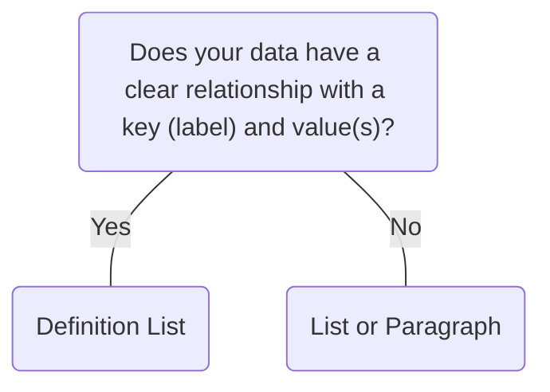

# Definition List

## Overview


> Image: Illustration of a Definition List component.


## When to use this component
- The information involves a clear relationship, with pairs where each "key" has a specific "value" associated with it. This is ideal for scenarios where users need to quickly understand a direct relationship or attribute.
- If the user needs to see a comparison or detailed information about specific attributes, a definition list is easy to scan.

## When to use another component
- Use a List when dealing with multiple similar items, sequential or hierarchical data, or when the data is not paired.



### Check out
- [List][1]
- [Paragraph][2]

## Usage

### Clear relationships
Definition List is best at displaying a group of independent key-value pairs. There shouldn’t be a specific relationship between the pairs, such as sequential or hierarchical data.

> Image: Two examples of a Definition List with three key-value pairs. In the first example with heart eyes emoji, the key value pairs are 


### Key-value groups
Key-value relationships do not have to be one-to-one. There can be multiple values for one key label.

> Image: Two examples of Definition List that illustrates key-value groups. In the first example with heart eyes emoji, there is a Definition List with the key-value pair, 


### Wrap long values
Long strings can be wrapped to the next line to ensure users can see the whole content.

> Image: Two examples of Definition list with three key-value pairs. In both examples the Definition List has the key-value pairs, 


## Content
- Follow writing best practices for Definitions Lists outlined in the [Splunk Style Guide][3]

### Mutually exclusive labels
Each key and value label should be distinct so that users can clearly differentiate between them.

> Image: Two examples that illustrate mutually exclusive labels. In the first example with heart eyes emoji, there is a Definition List with three key-value pairs, 


### Be concise
Use sentence-style capitalization and keep labels concise.

> Image: Two examples of a Definition List with three key-value pairs. In the first example with heart eyes emoji, the key labels are 


[1]: ./List
[2]: ./Paragraph
[3]: https://docs.splunk.com/Documentation/StyleGuide/current/StyleGuide/Definitionlists

## Examples


### Basic

```typescript
import React from 'react';

import DL, { Term as DT, Description as DD } from '@splunk/react-ui/DefinitionList';


function Basic() {
    return (
        <DL layout="auto">
            <DT>Name</DT>
            <DD>Splunk</DD>
            <DT>Type</DT>
            <DD>Public</DD>
            <DT>Founders</DT>
            <DD>Michael Baum</DD>
            <DD>Rob Das</DD>
            <DD>Erik Swan</DD>
            <DT>Headquarters</DT>
            <DD>San Francisco, CA</DD>
        </DL>
    );
}

export default Basic;
```


### Stacked layout

```typescript
import React from 'react';

import DL from '@splunk/react-ui/DefinitionList';


function StackedLayout() {
    return (
        <DL layout="stacked">
            <DL.Term>Term</DL.Term>
            <DL.Description>Description</DL.Description>
            <DL.Term>This is stacked layout.</DL.Term>
            <DL.Description>Stacked layout places each term above its description.</DL.Description>
        </DL>
    );
}

export default StackedLayout;
```


### Customized widths

The term widths and description widths can be set to a specific pixel or string value.

```typescript
import React from 'react';

import DL from '@splunk/react-ui/DefinitionList';


function CustomizedWidths() {
    return (
        <DL termWidth="200px" descriptionWidth="100px">
            <DL.Term>Location</DL.Term>
            <DL.Description>San Jose, CA</DL.Description>
            <DL.Term>IP Address</DL.Term>
            <DL.Description>123.456.0.0</DL.Description>
            <DL.Term>Device</DL.Term>
            <DL.Description>MacBook Pro (13-inch, 2020)</DL.Description>
        </DL>
    );
}

export default CustomizedWidths;
```


### With separator

Sets the character used to separate key-value pair

```typescript
import React from 'react';

import DefinitionList, { Term, Description } from '@splunk/react-ui/DefinitionList';


function WithSeparator() {
    return (
        <DefinitionList layout="auto" separatorCharacter="_">
            <Term>
                This is an example of auto layout with a separator. The term content is
                intentionally long to demonstrate how multi-line terms appear with a separator.
            </Term>
            <Description>Description</Description>
            <Term>Name</Term>
            <Description>Jon Doe</Description>
            <Term>Role</Term>
            <Description>Administrator</Description>
            <Term>Last login</Term>
            <Description>Aug 13 2019 5:13 PM</Description>
            <Term>Location</Term>
            <Description>Bend, OR</Description>
        </DefinitionList>
    );
}

export default WithSeparator;
```


### Empty description

Use a character and screen reader content to indicate when a description does not have a value. When there is not a better choice based on the context, use a hyphen to indicate the missing value with corresponding screen reader content.

```typescript
import React from 'react';

import DL from '@splunk/react-ui/DefinitionList';
import ScreenReaderContent from '@splunk/react-ui/ScreenReaderContent';


function EmptyDescription() {
    return (
        <DL>
            <DL.Term>Name</DL.Term>
            <DL.Description>New user</DL.Description>
            <DL.Term>Last login</DL.Term>
            <DL.Description>
                <span aria-hidden="true">-</span>
                <ScreenReaderContent>No login</ScreenReaderContent>
            </DL.Description>
            <DL.Term>Role</DL.Term>
            <DL.Description>Guest</DL.Description>
        </DL>
    );
}

export default EmptyDescription;
```


## API


### DefinitionList API

#### Props

| Name | Type | Required | Default | Description |
|------|------|------|------|------|
| children | React.ReactNode | no |  |  |
| descriptionWidth | string | no |  | Defines the width of the `Description`. Can be set to a specific pixel or string value. If not specified, will fill to take up available space. This prop is ignored when `layout="stacked"`. |
| elementRef | React.Ref<HTMLDListElement> | no |  | A React ref which is set to the DOM element when the component mounts and null when it unmounts. |
| layout | 'fixed' \| 'auto' \| 'stacked' | no | 'fixed' | Sets the layout style for the definition list.  - `fixed`: The `Term` uses a fixed width. The `Description` fills remaining available space. - `auto`: Both `Term` and `Description` size proportionally based on their container, taking an equal portion of available space. - `stacked`: `Term` is displayed above the `Description`. Custom `termWidth` and `descriptionWidth` are ignored. Both `Term` and `Description` size proportionally.  `fixed` layout is the current default. In the next major version, this prop will default to `auto`. |
| separatorCharacter | string | no |  | Sets the character used to separate key-value pair. Only supported in `layout="fixed"` and `layout="auto"`. Will not be rendered in `layout="stacked"`. |
| termWidth | string | no | '120px' | Defines the width of the `Term`. Can be set to a specific pixel or string value. The default value is ignored when `layout="auto"`. This prop is ignored when `layout="stacked"`. |


### DefinitionList.Term API

Container component for a `DefinitionList` term.

#### Props

| Name | Type | Required | Default | Description |
|------|------|------|------|------|
| children | React.ReactNode | yes |  |  |
| elementRef | React.Ref<HTMLElement> | no |  | A React ref which is set to the DOM element when the component mounts and null when it unmounts. |


### DefinitionList.Description API

Container component for a `DefinitionList` description.

#### Props

| Name | Type | Required | Default | Description |
|------|------|------|------|------|
| children | React.ReactNode | yes |  |  |
| elementRef | React.Ref<HTMLElement> | no |  | A React ref which is set to the DOM element when the component mounts and null when it unmounts. |


## Accessibility

## Visual Design
- Color contrast ratio **MUST** be [SC 1.4.3][1]:
    - &gt= 3:1 for icon and caret (&gt) against page background 
    - &gt= 4:5:1 for functional text against page background

## Implementation
- **MUST** use HTML semantics: `<ul>` or `<ol>` with `<li>` child elements, or `<dl>` with `<dt>` and `<dd>` child elements [SC 1.3.1][2]

[1]: https://www.w3.org/TR/WCAG21/#contrast-minimum
[2]: https://www.w3.org/TR/WCAG21/#info-and-relationships


