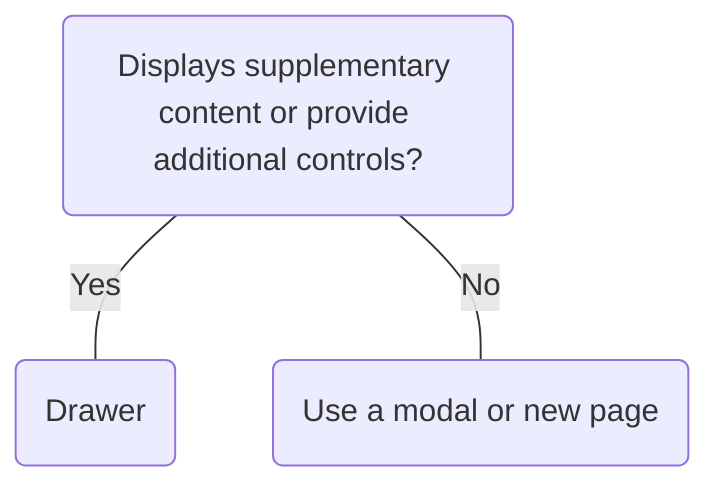

# Drawer

## Overview


> Image: Illustration of a Drawer component


## When to use this component
A drawer presents supplementary content without taking users away from the main page. Use it for navigation, filters, settings, previews, or contextual tools. Do not use a drawer to replace a primary view.

## When to use another component
A drawer should not be used when the content or actions are critical to the user’s main task or require immediate attention, as drawers are best suited for supplementary information.



### Check out
- [Modal] [1]


## Usage

### Close drawer
Provide a clear and recognizable way for users to close the drawer:
- **Escape key**: Pressing Esc closes the drawer when `position="page"`.
- **Close button**: A close button should be rendered in the top right corner of the drawer.

> Image: Examples of a clear method for closing a drawer: The first example, which includes a heart eyes emoji, features a close button in the top right corner of the drawer and a button group in the bottom right offering both primary and secondary actions. The second example, with a grimacing face emoji, lacks a close button in the top right corner of the drawer and only has a button group providing a primary and secondary action.


### Primary action
The final interactive element in a drawer should be the primary action.
> Image: Examples illustrating the placement of a primary action in drawers. The first example, marked with a heart eyes emoji, displays a drawer with a button group located in the bottom right corner; this group includes both primary and secondary actions, with the primary action designated as the second button. The second example, identified by a grimacing face emoji, presents a drawer with a secondary button in the bottom right and a button group in the bottom left corner for primary and tertiary actions. In the group, the primary action is again the second button.


## Content

### Title text
Titles should be brief yet accurately reflect the drawer content and its purpose. Use sentence-style capitalization for all titles.
> Image: Content examples of using sentence style in drawer titles. The first with heart eyes emoji reads 


### Body text
Include only content that is directly related to completing the task at hand. Don’t repeat or rephrase the title. Drawer body content should be easy to scan and avoid lengthy text blocks, such as terms and conditions or manuals. The content is scrollable and flexible, while the header and footer remain fixed.
> Image: Content example for drawer body text that is related to the task at hand. The first example with heart eyes emoji that reads 


### Actions
Use a precise verb to describe the action instead of vague words like Done or OK when possible.
> Image: Content example for actions in drawers using a precise verb. The first example with heart eyes emoji reads 


[1]: ./Modal


## Examples


### Basic

```typescript
import React, { useRef, useState } from 'react';

import Button from '@splunk/react-ui/Button';
import Drawer from '@splunk/react-ui/Drawer';


function Basic() {
    const [open, setOpen] = useState(false);
    const drawerToggle = useRef<HTMLButtonElement | null>(null);

    const handleRequestOpen = () => {
        setOpen(true);
    };

    const handleRequestClose = () => {
        setOpen(false);
    };

    return (
        <>
            <Button onClick={handleRequestOpen} elementRef={drawerToggle} label="Click me" />
            <Drawer returnFocus={drawerToggle} onRequestClose={handleRequestClose} open={open}>
                <Drawer.Header title="Basic Drawer" />
                <Drawer.Body>
                    Drawers are great for supplemental content, like forms or additional
                    information.
                </Drawer.Body>
            </Drawer>
        </>
    );
}

export default Basic;
```


### Initial focus

Initial focus can be set to a different element using the `initialFocus` prop. Use `'first'` to focus the first focusable element, `'container'` to focus the drawer itself, or pass a ref to a specific element.

```typescript
import React, { useCallback, useState, useRef } from 'react';

import Button from '@splunk/react-ui/Button';
import Drawer from '@splunk/react-ui/Drawer';
import P from '@splunk/react-ui/Paragraph';


function InitialFocus() {
    const [acceptButton, setAcceptButton] = useState<HTMLButtonElement | null>(null);
    const acceptButtonRef = useCallback((el: HTMLButtonElement | null) => setAcceptButton(el), []);

    const [open, setOpen] = useState(false);
    const drawerToggle = useRef<HTMLButtonElement | null>(null);

    const handleRequestOpen = () => {
        setOpen(true);
    };

    const handleRequestClose = () => {
        setOpen(false);
    };

    return (
        <>
            <Button onClick={handleRequestOpen} elementRef={drawerToggle} label="Click me" />
            <Drawer
                initialFocus={acceptButton}
                onRequestClose={handleRequestClose}
                open={open}
                returnFocus={drawerToggle}
            >
                <Drawer.Header title="Header" />
                <Drawer.Body>
                    <P>This drawer demonstrates how to set initial focus to a specific element.</P>
                </Drawer.Body>
                <Drawer.Footer>
                    <Button appearance="secondary" onClick={handleRequestClose} label="Cancel" />
                    <Button appearance="primary" elementRef={acceptButtonRef} label="Accept" />
                </Drawer.Footer>
            </Drawer>
        </>
    );
}

export default InitialFocus;
```


### PagePosition

The `page` position (default) renders the drawer relative to the viewport using a portal.

```typescript
import React, { useRef, useState } from 'react';

import Button from '@splunk/react-ui/Button';
import Drawer from '@splunk/react-ui/Drawer';
import P from '@splunk/react-ui/Paragraph';


function PagePosition() {
    const [open, setOpen] = useState(false);
    const drawerToggle = useRef<HTMLButtonElement | null>(null);

    const handleRequestOpen = () => {
        setOpen(true);
    };

    const handleRequestClose = () => {
        setOpen(false);
    };

    return (
        <>
            <Button onClick={handleRequestOpen} elementRef={drawerToggle} label="Open Drawer" />
            <Drawer
                position="page"
                open={open}
                onRequestClose={handleRequestClose}
                returnFocus={drawerToggle}
            >
                <Drawer.Header title="Page Position" subtitle="Relative to viewport" />
                <Drawer.Body>
                    <P>
                        This drawer is positioned relative to the viewport. It overlays all page
                        content.
                    </P>
                </Drawer.Body>
                <Drawer.Footer>
                    <Button appearance="primary" label="Close" onClick={handleRequestClose} />
                </Drawer.Footer>
            </Drawer>
        </>
    );
}

export default PagePosition;
```


### ContainerPosition

The `container` position renders the drawer relative to its nearest positioned ancestor.

```typescript
import React, { useRef, useState } from 'react';

import Button from '@splunk/react-ui/Button';
import Drawer from '@splunk/react-ui/Drawer';
import P from '@splunk/react-ui/Paragraph';


function ContainerPosition() {
    const [open, setOpen] = useState(false);
    const drawerToggle = useRef<HTMLButtonElement | null>(null);

    const handleRequestOpen = () => {
        setOpen(true);
    };

    const handleRequestClose = () => {
        setOpen(false);
    };

    return (
        <div
            style={{
                position: 'relative',
                height: '300px',
                width: '600px',
                border: '2px dashed #ccc',
            }}
        >
            <div style={{ padding: '16px' }}>
                <P>
                    The drawer will be contained within this bordered area rather than covering the
                    entire viewport.
                </P>
                <br />
                <Button onClick={handleRequestOpen} elementRef={drawerToggle} label="Open Drawer" />
            </div>
            <Drawer
                position="container"
                open={open}
                onRequestClose={handleRequestClose}
                width="250px"
                returnFocus={drawerToggle}
            >
                <Drawer.Header title="Container Position" subtitle="Relative to ancestor" />
                <Drawer.Body>
                    <P>
                        This drawer is positioned within its container. Useful for split-pane
                        layouts or panels within a larger application.
                    </P>
                </Drawer.Body>
                <Drawer.Footer>
                    <Button appearance="primary" label="Close" onClick={handleRequestClose} />
                </Drawer.Footer>
            </Drawer>
        </div>
    );
}

export default ContainerPosition;
```


### InlinePosition

The `inline` position renders the drawer inline. Content reflows around the drawer.

```typescript
import React, { useRef, useState } from 'react';

import Button from '@splunk/react-ui/Button';
import Drawer from '@splunk/react-ui/Drawer';
import P from '@splunk/react-ui/Paragraph';


function InlinePosition() {
    const [open, setOpen] = useState(false);
    const drawerToggle = useRef<HTMLButtonElement | null>(null);

    const handleRequestOpen = () => {
        setOpen(true);
    };

    const handleRequestClose = () => {
        setOpen(false);
    };

    return (
        <div
            style={{ display: 'flex', height: '300px', width: '600px', border: '2px dashed #ccc' }}
        >
            <div style={{ flex: '1 0 0', padding: '16px', overflow: 'auto' }}>
                <P>
                    The inline position renders the drawer as part of the layout. Content reflows
                    around the drawer when it opens or closes.
                </P>
                <br />
                <Button onClick={handleRequestOpen} elementRef={drawerToggle} label="Open Drawer" />
            </div>
            <Drawer
                position="inline"
                open={open}
                onRequestClose={handleRequestClose}
                width="250px"
                returnFocus={drawerToggle}
            >
                <Drawer.Header title="Inline Position" subtitle="Content reflows" />
                <Drawer.Body>
                    <P>
                        This drawer renders inline and pushes content aside rather than overlaying
                        it. Ideal for persistent sidebars or detail panels.
                    </P>
                </Drawer.Body>
                <Drawer.Footer>
                    <Button appearance="primary" label="Close" onClick={handleRequestClose} />
                </Drawer.Footer>
            </Drawer>
        </div>
    );
}

export default InlinePosition;
```


## API


### Drawer API

#### Props

| Name | Type | Required | Default | Description |
|------|------|------|------|------|
| children | React.ReactNode | no |  | Any renderable children can be passed to the `Drawer`.  To use the default `Drawer` styles, use the `Drawer.Header`, `Drawer.Body`, and `Drawer.Footer`. |
| closeOnClickAway | boolean | no | false | Set to `true` to enable closing the Drawer by clicking the scrim (overlay).  Only applies to `position="page"` because other position modes do not have a scrim.  When `false` (default), the scrim is still displayed to block interaction with underlying content, but clicking it will not close the Drawer.  Closing on click away should be avoided as it can lead to accidental dismissal of the drawer causing data loss or disruption of a user's workflow. Only enable click outside to dismiss when: - The drawer content is non-critical or purely informational - Accidental dismissal will not result in loss of progress, data, or important context  When enabled, `onRequestClose` will receive an event with reason `clickAway`. |
| divider | 'header' \| 'footer' \| 'both' \| 'none' | no | 'both' | Show dividers between header, body and footer. |
| elementRef | React.Ref<HTMLDivElement> | no |  | A React ref which is set to the DOM element when the component mounts and null when it unmounts. |
| initialFocus | \| 'first' \| 'container' \| (React.Component & { focus: () => void }) \| HTMLElement \| null | no | 'first' | Allows focus to be set to a component other than the default. Supports `first` (first focusable element in the drawer), `container` (focus the drawer itself), or a ref. |
| onRequestClose | DrawerRequestCloseHandler | no |  | Called when a close event occurs.  The callback is passed the event and a reason, which is `escapeKey`, `clickAway`, or `clickCloseButton`.  Generally, use this callback to toggle the `open` prop. |
| open | boolean | no | false | Set `open` to `true` to open the drawer and `false` to close it. |
| position | 'page' \| 'container' \| 'inline' | no | 'page' | The layout mode for the drawer. - `page`: Positions relative to the viewport (default) - `container`: Positions relative to nearest positioned ancestor - `inline`: Renders inline without portal, allowing content to reflow around the drawer |
| returnFocus | \| React.MutableRefObject<(React.Component & { focus: () => void }) \| HTMLElement \| null> \| (() => void) | no |  | Pass the ref of the invoking element (or other element that follows the logical flow of the application) to automatically move focus to the invoking element on `Drawer` close. If using a ref is not possible, you *must* pass a function that sets focus to the appropriate element. This function will be called after `onRequestClose`.  Recommended when `position` is `page` to ensure proper focus management. |
| width | string | no | '300px' | Width of the drawer. |

#### Types

| Name | Type | Description |
|------|------|------|
| DrawerRequestCloseHandler | (data: {     event:         \| React.MouseEvent<HTMLDivElement \| HTMLAnchorElement \| HTMLButtonElement>         \| MouseEvent         \| KeyboardEvent         \| TouchEvent;     reason: 'clickAway' \| 'escapeKey' \| 'clickCloseButton'; }) => void |  |


### Drawer.Header API

A styled container for `Drawer` header content.

#### Props

| Name | Type | Required | Default | Description |
|------|------|------|------|------|
| children | React.ReactNode | no |  | `children` might be passed instead of a title. Note that `children` aren't rendered if a title is provided. |
| hideCloseButton | boolean | no | false | Hide the closeButton in the Header if `onRequestClose` is provided to `Drawer`. |
| icon | React.ReactNode | no |  | The icon to show before the title. |
| subtitle | React.ReactNode | no |  | Used as the subheading. Only shown if `title` is also present. |
| title | string | no |  | Used as the main heading. |


### Drawer.Body API

A styled container for `Drawer` body content.

#### Props

| Name | Type | Required | Default | Description |
|------|------|------|------|------|
| children | React.ReactNode | no |  |  |


### Drawer.Footer API

A styled container for `Drawer` footer content.

#### Props

| Name | Type | Required | Default | Description |
|------|------|------|------|------|
| children | React.ReactNode | no |  |  |
| layout | 'auto' \| 'none' | no | 'auto' | Controls the layout and styling for children.  `auto` will style children for common use cases, such as: buttons; controls; documentation links; or a combination. Set `none` when custom styling is needed. |


