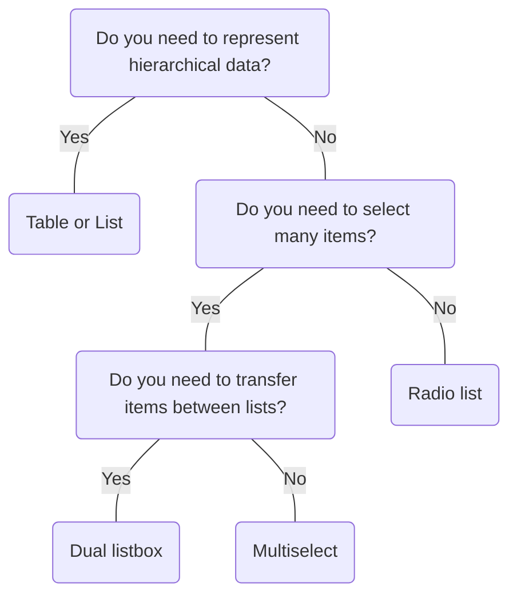

# Dual Listbox

## Overview


> Image: Illustration of a dual listbox component


## When to use this component
- When you need to manage or transfer content between two lists.
- A clear visual distinction between available and selected items is required.


## When to use another component
- Consider a `Radio List` when only one item from a list needs to be selected
- When space is extremely limited and a compact selection is needed, use `Multiselect`
- Consider `Table` or `List` when representing hierarchical data or key-value pairs




### Check out
- [Radio List][1]
- [Multiselect][2]
- [Table] [3]
- [List][4]


## Usage
### Use descriptive names for each list box when applicable.
The default names for each list box are “Source” and “Target”, but they can be changed to accurately reflect the data within each list.

> Image: The image shows a do-and-don’t comparison between two Dual Listboxes. The image with the heart eyes emoji shows a Dual Listbox with a source label of 


### Use a controlled dual list box for bulk transfers.
If it is anticipated that the user will be moving numerous items, a controlled dual listbox allows users to revert changes, providing greater control and preventing accidental bulk modifications.

> Image: The image shows a Dual Listbox where the left list is labeled 


### Confirming high-impact changes
If the dual list box will create major changes in the page or workflow, include a confirmation button, such as “Apply” or “Save” so users understand that their changes will be finalized.

> Image: The image shows a Dual Listbox where the left list is labeled ‘Available countries’ and the right is labeled ‘Enabled countries. A button labeled ‘Apply’ is underneath the Dual Listbox component to allow users to confirm the choices they made.


### Modal placement for expanded space
When limited space prevents the effective display of a dual listbox, consider placing it within a modal. Ensure the modal includes a clear confirmation button.

> Image: The image shows a Dual Listbox inside of a Modal component titled ‘Publish components’. The left list is labeled ‘Available components’ and the right list is labeled ‘Released components’. The Modal footer has two buttons; the left one says ‘Cancel’ and the right one says ‘Apply’.


[1]: ./RadioList
[2]: ./Multiselect
[3]: ./Table
[4]: ./List

## Examples


### Uncontrolled

```typescript
import React from 'react';

import DualListbox, { Option } from '@splunk/react-ui/DualListbox';


function Uncontrolled() {
    return (
        <DualListbox
            lists={[
                { name: 'list-1', label: 'Source' },
                { name: 'list-2', label: 'Target' },
            ]}
        >
            <Option id="option-0" label="Alpha" value="alpha" />
            <Option id="option-1" label="Beta" value="beta" />
            <Option id="option-2" label="Gamma" value="gamma" />
            <Option id="option-3" label="Delta" value="delta" />
            <Option id="option-4" label="Epsilon" value="epsilon" />
        </DualListbox>
    );
}

export default Uncontrolled;
```


### optionValues

```typescript
import React, { useState } from 'react';

import Button from '@splunk/react-ui/Button';
import DualListbox, {
    Option,
    DualListboxChangeHandler,
    DualListboxSelectHandler,
} from '@splunk/react-ui/DualListbox';
import ScreenReaderContent from '@splunk/react-ui/ScreenReaderContent';

const optionValues = ['Alpha', 'Beta', 'Gamma', 'Delta', 'Epsilon'];


const Controlled = () => {
    const [twoValues, setTwoValues] = useState<string[]>([]);
    const [oneSelectedValues, setOneSelectedValues] = useState<string[]>([]);
    const [twoSelectedValues, setTwoSelectedValues] = useState<string[]>([]);
    const [screenReaderMessage, setScreenReaderMessage] = useState<string>('');

    const handleChange: DualListboxChangeHandler = (
        event,
        { targetListName, targetValues, sourceValues, screenReaderMessage: message }
    ) => {
        if (targetListName === 'list-1') {
            setTwoSelectedValues([]);
            setTwoValues(sourceValues);
        } else {
            setOneSelectedValues([]);
            setTwoValues(targetValues);
        }
        setScreenReaderMessage(message);
    };

    const handleSelect: DualListboxSelectHandler = (event, { values, listName }) => {
        if (listName === 'list-1') {
            setOneSelectedValues(values);
        } else {
            setTwoSelectedValues(values);
        }
    };

    const handleResetClick = () => {
        setOneSelectedValues([]);
        setTwoSelectedValues([]);
        setTwoValues([]);
        // If the state of the DualListbox is being altered externally, it needs to be messaged.
        setScreenReaderMessage('Source and Target listbox values reset');
    };

    const twoSet = new Set(twoValues);
    const twoSelectedSet = new Set(twoSelectedValues);
    const oneSelectedSet = new Set(oneSelectedValues);

    const options = optionValues.map((value) => {
        const isList2Item = twoSet.has(value);
        let isSelected = false;
        if (isList2Item) {
            isSelected = twoSelectedSet.has(value);
        } else {
            isSelected = oneSelectedSet.has(value);
        }

        return (
            <Option
                id={`controlled-id-${value}`}
                key={value}
                label={value}
                value={value}
                selected={isSelected}
                listName={isList2Item ? 'list-2' : 'list-1'}
            />
        );
    });

    return (
        <>
            <Button label="Reset lists" onClick={handleResetClick} />
            <DualListbox
                controlled
                onChange={handleChange}
                onSelect={handleSelect}
                lists={[
                    { name: 'list-1', label: 'Source' },
                    { name: 'list-2', label: 'Target' },
                ]}
            >
                {options}
            </DualListbox>
            {}
            <ScreenReaderContent aria-live="assertive">{screenReaderMessage}</ScreenReaderContent>
        </>
    );
};

export default Controlled;
```


### Fill

Dynamic size example.

```typescript
import React from 'react';

import DualListbox, { Option } from '@splunk/react-ui/DualListbox';


function Fill() {
    return (
        <div
            style={{
                height: '500px',
                position: 'relative',
                width: '800px',
            }}
        >
            <DualListbox
                fill
                lists={[
                    { name: 'list-1', label: 'Source' },
                    { name: 'list-2', label: 'Target' },
                ]}
            >
                <Option id="option-0" label="Alpha" value="alpha" />
                <Option id="option-1" label="Beta" value="beta" />
                <Option id="option-2" label="Gamma" value="gamma" />
                <Option id="option-3" label="Delta" value="delta" />
                <Option id="option-4" label="Epsilon" value="epsilon" />
            </DualListbox>
        </div>
    );
}

export default Fill;
```


## API


### DualListbox API

#### Props

| Name | Type | Required | Default | Description |
|------|------|------|------|------|
| children | React.ReactNode | no |  | All children must be instances of `DualListbox.Option`. |
| controlled | boolean | no | false | When true, `Options`'s `listName` and `selected` state props are fully controlled. |
| elementRef | React.Ref<HTMLDivElement> | no |  | A React ref which is set to the DOM element when the component mounts, and null when it unmounts. |
| fill | boolean | no | false | When true, fill height and width of the relative parent container. |
| inline | boolean | no | false | When false, display as inline-block with the default width. Ignored if `fill=true` set. |
| lists | ListboxConfig[] | yes |  | List identifiers. `name` should map to child `Option`s `listName` prop, and will be returned with event calls. `label` will be used for visual and assistive text. |
| onChange | DualListboxChangeHandler | no |  | Callback for selected options moving from one list to another. |
| onSelect | DualListboxSelectHandler | no |  | Callback for single selected/de-select actions. |

#### Types

| Name | Type | Description |
|------|------|------|
| DualListboxChangeHandler | (     event:         \| React.MouseEvent<HTMLButtonElement>         \| React.MouseEvent<HTMLLIElement>         \| React.KeyboardEvent<HTMLUListElement>,     data: {         /**          * The values being changed.          */         affectedValues: string[];         /**          * The a11y text describing the move action.          * If `controlled="true"` the presentation of the text MUST be implemented by the consumer.          */         screenReaderMessage: string;         /**          * The list `name` associated to the source of the move action.          */         sourceListName: string;         /**          * The values now contained within the source list.          */         sourceValues: string[];         /**          * The list `name` associated to the target of the move action.          */         targetListName: string;         /**          * The values now contained within the target list.          */         targetValues: string[];     } ) => void |  |
| DualListboxSelectHandler | (     event:         \| React.MouseEvent<HTMLLIElement>         \| React.KeyboardEvent<HTMLUListElement>         \| React.ChangeEvent<HTMLInputElement>,     data: {         /**          * The list `name` associated to the batch action.          */         listName: string;         /**          * The values marked as selected with the given list.          */         values: string[];     } ) => void |  |


## Accessibility

## Visual Design
- Color contrast ratio **MUST** be:
    - &gt= 4.5:1 for normal text: 14 pt (typically 18.66px) and bold or larger [SC 1.4.3][1]
    - Focus State: If the focus ring has a radius of [SC 1.4.11][2]
        - &lt 3px: &gt= 4.5.1 between button &lt&gt focus &lt&gt background
        - &gt 3px: &gt= 3.1 button button &lt&gt focus &lt&gt background

## States
- Color contrast does not apply to a disabled child elements in DualListbox 

## Interaction Model
- **MUST** be perceivable and functional when when zoomed from 50-200% [SC 1.4.4][3] [SC 1.4.10][4]
- **SHOULD** use button semantics to be addressed by screen reader
- Icon buttons **MUST** have a tooltip that describes its function on hover [SC 1.4.13][5]
- **MUST** have keyboard navigation [SC 2.1][6]
    - <kbd>Tab</kbd> and <kbd>Shift</kbd>+<kbd>Tab</kbd> to move through interactive elements within the DualListbox.
    - <kbd>Space</kbd> changes the selection state of the focused option.
    - <kbd>Down Arrow</kbd> moves focus to the next option.
    - <kbd>Up Arrow</kbd> moves focus to the previous option.
    - <kbd>Home</kbd> moves focus to the first option.
    - <kbd>End</kbd> moves focus to the last option.
    - <kbd>Shift</kbd>+<kbd>Down Arrow</kbd> moves focus to and selects the next option.
    - <kbd>Shift</kbd>+<kbd>Up Arrow</kbd> moves focus to and selects the previous option.
    - <kbd>Control</kbd>+<kbd>Shift</kbd>+<kbd>Home</kbd> selects from the focused option to the beginning of the list.
    - <kbd>Control</kbd>+<kbd>Shift</kbd>+<kbd>End</kbd> selects from the focused option to the end of the list.
    - <kbd>Control</kbd>+<kbd>A</kbd> selects all options in the list. If all options are selected, unselects all options.
    - <kbd>Command</kbd>+<kbd>A</kbd> (macOS) selects all options in the list. If all options are selected, unselects all options.
    - <kbd>Enter</kbd> performs an add only when focus is in the available options list.
    - <kbd>Delete</kbd> performs a remove only when focus is in the chosen options list.

## Implementation
- When pressing a button without a change in context, focus **MUST NOT** be lost (i.e. a refresh button refreshes a table or data visualization)
- **MUST** have a visible focus border [SC 2.4.7][7]
- **MUST** use HTML semantics: `<ul>` or `<ol>` with `<li>` child elements, or `<dl>` with `<dt>` and `<dd>` child elements [SC 1.3.1][8]

[1]: https://www.w3.org/TR/WCAG21/#contrast-minimum
[2]: https://www.w3.org/TR/WCAG21/#non-text-contrast
[3]: https://www.w3.org/WAI/GL/UNDERSTANDING-WCAG20/visual-audio-contrast-scale.html
[4]: https://www.w3.org/WAI/WCAG21/Understanding/reflow.html
[5]: https://www.w3.org/TR/WCAG21/#content-on-hover-or-focus
[6]: https://www.w3.org/TR/WCAG21/#keyboard-accessible
[7]: https://www.w3.org/TR/WCAG21/#focus-visible
[8]: https://www.w3.org/TR/WCAG21/#info-and-relationships


