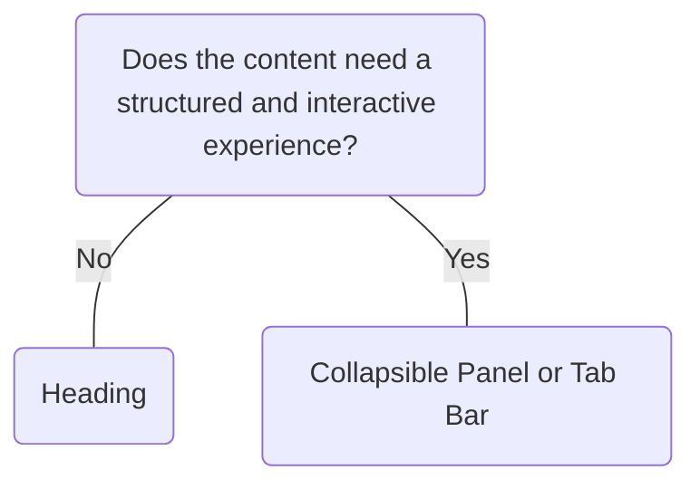

# Heading

## Overview


> Image: Illustration of a Heading component.


## When to use this component
- To establish clear visual rhythm and hierarchical distinction between sections of content

## When to use another component
- If interaction is needed between sections, components such as `Collapsible Panel` or `Tab Bar` provide a structured pattern for interacting with the content contained within.



### Check out
- [Collapsible Panel][1]
- [Tab Bar][2]
- [Typography][3]

## Usage

### Use only one `<h1>` tag
The `<h1>` tag represents the most important idea of a page. Each page should have only one `<h1>` tag to help both search engines and users quickly understand the page.
> Image: Examples display two sections each with a heading and paragraph. In the first example with heart eyes emoji, the first section has an h1 tag while the second section has an h2 tag. In the second example with grimacing emoji both sections have the h1 tag.


### Do not skip heading levels
Headings must follow a linear order without skipping levels.

> Image: Examples display three sections each with a heading and paragraph. In the first example with heart eyes emoji, the headings in the three sections follow the tag order of h1, h2, and h3. In the second example with grimacing emoji, there is no h2 tag, resulting in three sections having h1, h3, and h4 tag, respectively.


### Customized visual style
The `variant` prop can be used to customize the visual style while still following the semantic structure.

> Image: Example display three sections each with a heading and paragraph. The headings follow the tag order of h1, h2, and h3, but are styled title 2, title 3, and title 4.


### Follow the level hierarchy
The heading hierarchy is meaningful. Ordering headings according to the levels makes a page easy to scan.
> Image: Examples display three sections each with a heading and paragraph. In the first example with heart eyes emoji, the headings in the three sections follow the tag order of h1, h2, and h3. In the second example with grimacing emoji, the heading hierachy is not followed, with the three sections having h1, h3, and h2 tag, respectively.


## Content guidelines
- Follow writing best practices outlined in the [UI text style guidelines][4]

[1]: ./CollapsiblePanel
[2]: ./TabBar
[3]: ./Typography
[4]: https://docs.splunk.com/Documentation/StyleGuide/current/StyleGuide/UIGuidelines

## Examples


### content

```typescript
import React from 'react';

import Heading from '@splunk/react-ui/Heading';
import P from '@splunk/react-ui/Paragraph';
import Prose from '@splunk/react-ui/Prose';

const content = `Splunk Inc. is an American software company based in San Francisco, California, that
produces software for searching, monitoring, and analyzing machine-generated data
via a web-style interface.`;


function Basic() {
    return (
        <Prose>
            <Heading level={1}>Heading 1</Heading>
            <P>{content}</P>
            <Heading level={2}>Heading 2 </Heading>
            <P>{content}</P>
            <Heading level={3}>Heading 3</Heading>
            <P>{content}</P>
            <Heading level={4}>Heading 4</Heading>
            <P>{content}</P>
            <Heading level={5}>Heading 5</Heading>
            <P>{content}</P>
            <Heading level={6}>Heading 6</Heading>
            <P>{content}</P>
        </Prose>
    );
}

export default Basic;
```


### Variant

The level prop determines the <hX> HTML tag and has an associated default typography mixin style. To override this default styling, the variant prop can be used to specify a typography mixin style. For instance, it is possible for a variant to have title1 styling and be a <h2> tag as in the below example.

```typescript
import React from 'react';

import Heading from '@splunk/react-ui/Heading';
import P from '@splunk/react-ui/Paragraph';
import Prose from '@splunk/react-ui/Prose';


function Variant() {
    return (
        <Prose>
            <Heading level={2} variant="title1">
                Heading 1
            </Heading>
            <P>
                Splunk Inc. is an American software company based in San Francisco, California, that
                produces software for searching, monitoring, and analyzing machine-generated data
                via a web-style interface.
            </P>
        </Prose>
    );
}

export default Variant;
```


## API


### Heading API

#### Props

| Name | Type | Required | Default | Description |
|------|------|------|------|------|
| children | React.ReactNode | yes |  |  |
| elementRef | React.Ref<HTMLHeadingElement> | no |  | A React ref which is set to the DOM element when the component mounts and null when it unmounts. |
| level | 1 \| 2 \| 3 \| 4 \| 5 \| 6 | yes |  | Corresponds to the respective `<hX>` HTML tags and `typography(titleX)` `@splunk/themes` typography variant. Styles will be set corresponding to level if variant is not provided: e.g. `level=3` will default to using `title3` from `mixins`. |
| variant | TypographyTitleVariant | no |  | Styles the component based on typography mixin title preset styles. If a variant is not provided, styles will be set corresponding to level: e.g. `level=3` will default to using `title3` from `mixins`. |


## Accessibility

## Visual Design
- Color contrast ratio **MUST** be [SC 1.4.3][1]:
    - &gt= 4.5:1 for normal text: 14 pt (typically 18.66px) and bold or larger
    - &gt= 3:1 for large text: 18 pt (typically 24px) or larger 
    - For high contrast mode, ratios **MUST** be &gt= 7:1 for normal text and &gt= 4.5:1 for large text [SC 1.4.6][2]

## Content
- Headings within the Splunk product portfolio **SHOULD** follow:
    - H1 = Splunk
    - H2 = application name
    - H3 = page title
    - H4+ = page specific content
- **MUST** use a linear order of headings. Do not jump from 1, 3, 5, subtitles. Instead, use 1, 2, 3, etc. Screen readers allow users to navigate by headings, so headings are an effective way to bypass blocks of content. [SC 2.4.1][3]

## States
-  Headers cannot be disabled

## Implementation
- **SHOULD** use h-tags to ensure they are not buried under divs, boxes, etc.. This makes headers easier to pick up with screen readers, making information esier to find. 

[1]: https://www.w3.org/TR/WCAG21/#contrast-minimum
[2]: https://www.w3.org/TR/WCAG21/#contrast-enhanced
[3]: https://www.w3.org/TR/WCAG21/#bypass-blocks


