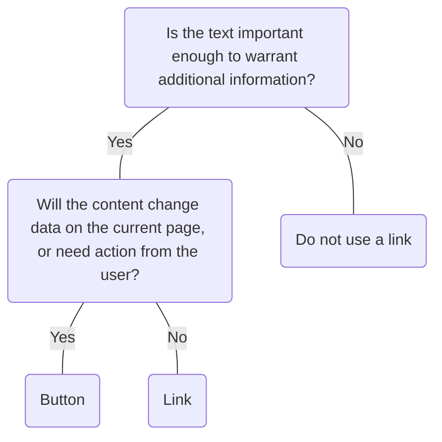

# Link

## Overview


> Image: Illustration of a paragraph of text with a link component at the end


## When to use this component
- When you want to navigate users to a different page within your application
- When you want to direct users to a location on the same page
- When you want to navigate users to an external site

## When to use another component
- If the text is not relevant or important enough to warrant additional information, do not use a link.
- If the content will change the data on the current page or need action from the user, use a `Button`.
- For revealing large amounts of information, use an `Accordion` or `Collapsible panel`.



### Check out
- [Button][1]
- [Accordion][2]
- [Collapsible panel][3]

## Usage

### Standalone links
Are used on their own and should not be used within or paired with other text content. Standalone links that open in a new window are exempt from this requirement as they use an icon by default.

> Image: Example of correct and incorrect styles for standalone links. On the left is the correct example with a heart-eye emoji of a blue standalone link with no additional decorations or text. On the right is the incorrect example with a grimacing emoji with a standalone link with addition text next to it.


### Limit the number of links
Make sure each link is necessary. Using too many links can create a “sea of blue”.

> Image: Example with heart eyes showing a small amount of links in a body of text next to a grimacing face example with too many link in a body of text.


### Group links when possible
For multiple links on the same page, grouping the links as a bulleted list or under a suitable title like “Resources”, will help users navigate.

> Image: Illustration with two examples. First example with heart eyes has a group of links, the second example with a grimace has links scattered.


### Be concise
Keep the link text brief while still providing enough context to convey where the link takes the user.

> Image: Illustration with two examples. The first example with heart eyes with brief link text that has enough context to convey where the link goes. The second example with grimace face has link text that is too long and not clear.


## Content guidelines
A user should never be surprised about where a link takes them. Use descriptive labels for links so users know where they’re going and what they’ll find if they select the link.

- Keep the link text brief while still providing enough context to convey where the link takes the user.
- Don’t use phrases like “click here” or “here” as link text. 
- Links should be understandable out of context. This way, they are more informative of the destination and convenient targets for pressing.
- Link judiciously. Too many links are a distraction.

### Links that guide you to documentation
The standard for writing the link text for links to Splunk documentation is to create a synopsis of the doc page title and add the word "documentation" at the end using this format: [doc page title synopsis] documentation

For example, for a doc page with the title “Configure single sign-on with SAML” you could create a link called “SAML SSO documentation”. 
- For more detailed guidance and examples, see the [UI text style guidelines][4] in the Splunk Style Guide.

> Image: Two examples. The first with heart eyes has a modal with a link in the body with the correct formatting: Automatic UI updates documentation. The second example with a grimace has a modal with a link in the body with incorrect formatting: learn more.


### Links in a sentence
- When multiple links are present in a single sentence, consider grouping them for better scannability and usability. This will also make it easier for screen reader users to digest additional aria-labels associated with links.
- Don’t link the entire sentence, only the text that describes the action or where the user goes when they select the link. If it’s a very short sentence that only describes the action, it’s okay to link the entire sentence.
- Avoid links breaking onto a new line.
- Don’t add links to Splunk product documentation in a sentence. Review "Links that guide you to documentation” section for more details.

> Image: Guidelines is a two-column chart contrasting 


### Standalone links
A standalone link is a link that is not part of a sentence.
- Use a standalone link with the external link icon for links that navigate outside of the application.
- Don't use punctuation.
- Don’t add links to Splunk product documentation in a sentence. Review “Links that guide you to documentation” section for more details.

> Image: Guidelines for creating standalone links, which are links not part of a sentence and a chart divided into two sections labeled 


[1]: ./Button
[2]: ./Accordion
[3]: ./CollapsiblePanel
[4]: https://docs.splunk.com/Documentation/StyleGuide/current/StyleGuide/UIGuidelines#Links_to_Splunk_product_documentation

## Examples


### Basic

Use the Link component instead of an <a> tag, by default it is displayed inline.

```typescript
import React from 'react';

import Link from '@splunk/react-ui/Link';


function Basic() {
    return (
        <>
            Use Splunk products to take advantage of one platform for all your security and
            observability data needs. In an ever-changing world, Splunk delivers insights to unlock
            innovation, enhance security and drive resilience.{' '}
            <Link to="https://www.splunk.com/en_us/products/platform.html">
                The Splunk Platform
            </Link>{' '}
            allows you turn data into doing to unlock innovation, enhance security and drive
            resilience.
        </>
    );
}

export default Basic;
```


### Standalone

Use appearance="standalone" when using Link on its own without other text content.

```typescript
import React from 'react';

import Link from '@splunk/react-ui/Link';


function Standalone() {
    return (
        <Link appearance="standalone" to="https://www.splunk.com/en_us/products/observability.html">
            Splunk Observability
        </Link>
    );
}

export default Standalone;
```


### New Window

openInNewContext=true adds an icon and sets target to _blank. A message indicates the behavior for screen reader users. The default message, '(Opens new window)', can be customized by by passing a string to openInNewContext.

```typescript
import React from 'react';

import Link from '@splunk/react-ui/Link';


function NewWindow() {
    return (
        <Link
            appearance="standalone"
            to="https://www.splunk.com/en_us/products/observability.html"
            openInNewContext
        >
            Splunk Observability
        </Link>
    );
}

export default NewWindow;
```


### Disabled

Links can be disabled. The href is then removed from the markup.

```typescript
import React from 'react';

import Link from '@splunk/react-ui/Link';


function Disabled() {
    return (
        <Link
            appearance="standalone"
            to="https://www.splunk.com/en_us/products/observability.html"
            disabled
        >
            Splunk Observability
        </Link>
    );
}

export default Disabled;
```


### Visited

Enable visited link styling using the LinkProvider.

```typescript
import React from 'react';

import Link, { LinkProvider } from '@splunk/react-ui/Link';


const Visited = () => (
    <LinkProvider enableVisitedStyling>
        <p>After visiting the link below, its color will change.</p>
        <Link to="https://www.splunk.com" openInNewContext>
            Splunk.com
        </Link>
    </LinkProvider>
);

export default Visited;
```


## API


### Link API

`Link` is a simple method for configuring `Button` for inline links. For more complex behaviors,
see the `Button` documentation.

#### Props

| Name | Type | Required | Default | Description |
|------|------|------|------|------|
| appearance | 'inline' \| 'standalone' | no | 'inline' | Changes the style of the link. |
| children | React.ReactNode | no |  |  |
| disabled | boolean | no | false | Adds an aria-disabled attribute and prevents clicking. |
| elementRef | React.Ref<HTMLButtonElement \| HTMLAnchorElement> | no |  | A React ref which is set to the DOM element when the component mounts and null when it unmounts. |
| onClick | React.MouseEventHandler<HTMLButtonElement \| HTMLAnchorElement> | no |  | The onClick event handler is ignored if Ctrl or meta keys are pressed, which allows the link to open in a new context. |
| openInNewContext | boolean \| string | no | false | Open the "to" link in a new context, which is usually a new tab or window based on browser settings.  An icon and a screen reader message is added to indicate this behavior to users. The default message is "(Opens new window)"; this can be customized by passing a string instead of boolean to `openInNewContext`. |
| to | string | no |  | The URL or path to link to. |


## Accessibility

A link enables a user to navigate through an app. If you are providing an action, use a [button][1].

## Visual Design

- **MUST** have a visual distinction beyond color, such as underline, bold, or an icon [SC 1.4.1][2]

- Color contrast ratio **MUST** be, in active, hover, and selected states:
    - &gt=4.5:1 between text and background of [SC 1.4.3][3]
    - &gt=3:1 between button outline color to background OR icon color to background [SC 1.4.11][4]
    - Focus State: if the focus ring has a radius of [SC 1.4.11][4]
        - &lt 3px: &gt=4.5.1 between button &lt&gt focus &lt&gt background
        - &gt 3px: &gt=3.1 between button &lt&gt focus &lt&gt background
-   Visited links **SHOULD** have a different color applied that satisfies
    color contrast guidelines

- **MUST** have a visual element present for a link that opens a [SC 3.2][5]
    - new tab or window non-HTML document (doc, excel spreedsheet, ppt, plain text, etc.)
    - non-HTML document doc, excel spreedsheet, ppt, plain text, etc.
    - new application

## States

- In-line links **SHOULD** use underline, not a focus state. This is to preserve zoom/magnification and prevent a split focus ring.

- **MUST** avoid vague or generic language such as "click here" or "read more", or acronyms that are not widely know to users [SC 2.4.4][6]
- **SHOULD** avoid linking entire sentences.

## Interaction Design

- **MUST** have keyboard navigation [SC 2.1][7]
    - <kbd>Enter/Space</kbd> to execute the action for link
    - <kbd>Tab</kbd> to move focus to next interactive element
    - <kbd>Shift</kbd>+<kbd>Tab</kbd> to move the focus to the previous interactive element

## Implementation

- **MUST** have a visible focus border [SC 2.4.7][8]
    - Exception is an in-line link, which **SHOULD** use an underline to preserve zoom/magnification and prevent a split focus ring
- **MUST** use `<a>` element with a valid href value. In rare problematic cases, setting `role="link"` (and adding all other aspects of link functionality) may be acceptable [SC 4.1.2][9]
- **Focus Management:** if button activation closes the containing entity or launches another
    entity, then focus moves to the newly opened entity. If activitating a button results in the
    control being disabled, focus should move to the next active element in the tab order.
- **Screen reader announcements** for when a link opens a [SC 3.2][10]:
    - new tab or window
    - non-HTML document (doc, excel, spreadsheet, ppt, plain text, etc)
    - new application

[1]: https://splunkui.splunkeng.com/Packages/react-ui/Button
[2]: https://www.w3.org/TR/WCAG21/#use-of-color
[3]: https://www.w3.org/TR/WCAG21/#contrast-minimum
[4]: https://www.w3.org/TR/WCAG21/#non-text-contrast
[5]: https://www.w3.org/TR/WCAG20-TECHS/G201.html
[6]: https://www.w3.org/TR/WCAG21/#link-purpose-in-context%5C
[7]: https://www.w3.org/TR/WCAG21/#keyboard-accessible
[8]: https://www.w3.org/TR/WCAG21/#focus-visible
[9]: https://www.w3.org/TR/WCAG21/#name-role-value
[10]: https://www.w3.org/TR/WCAG20-TECHS/G201.html


