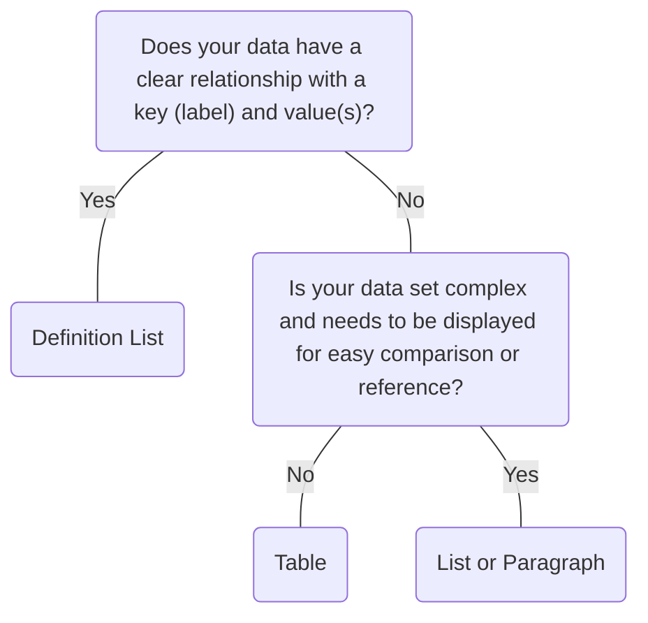

# List

## Overview


> Image: Illustration of a list component.


## When to use this component
You need to group related content vertically.
- If your content has no specific order, use an unordered list.
- If your content has a priority, hierarchy, or sequence between list items, use an ordered list.


## When to use another component
- If you need to display complex sets of data, use a data table.
- If users need to quickly understand a direct relationship between a key-value pairs, use a definition list.



### Check out
- [Definition List][1]
- [Table][2]

## Usage

### Multiple items
Lists are best at displaying multiple items. If you are displaying fewer than two items, consider how to present the information as plain text on the page.

> Image: Examples of a List outlining the Benefits of Splunk ES. In the first example with heart eyes emojis, the following three benefits are outlined, 


### Logical order
Arrange list items in a logical way. For example, if the list is about resource use, the default order might be highest resource use to lowest. Grouping items in categories into smaller, more specific lists might be more meaningful.

> Image: Examples of a List outlining server usage stats for four servers, Server A with 85% CPU usage, Server B with 70% CPU usage, Server C with 50% CPU usage, and Server D with 30% CPU usage. In the first example with heart eyes emojis, the servers are split based on their data center location and then ordered alphabetically. In the second example with grimacing emoji, the order of the list is totally random, not following any sequence.


### Links
Include links if they are relevant to better understanding the context of the list. If the whole list item is selectable, use a navigational or interactive component.

> Image: Examples of a List with the title, 


## Content
Follow writing best practices for Lists outlined in the [Splunk Style Guide][3]

### Be concise
Try not to exceed 2 lines per list item and use list items that are grammatically parallel. For example, do not mix passive voice with active voice or declarative sentences (statements) with imperative sentences (direct command).

> Image: Examples of List with two items outlining server installation steps. In the first example with the heart eyes emoji has a concise label, the list items are 


[1]: ./DefinitionList
[2]: ./Table
[3]: https://docs.splunk.com/Documentation/StyleGuide/current/StyleGuide/Listoverview

## Examples


### Unordered List

```typescript
import React from 'react';

import List from '@splunk/react-ui/List';


function UnorderedList() {
    return (
        <List>
            <List.Item>Bar Chart</List.Item>
            <List.Item>Area Chart</List.Item>
            <List.Item>Pie Chart</List.Item>
        </List>
    );
}

export default UnorderedList;
```


### Ordered List

Ordered Lists use numerals by default.

```typescript
import React from 'react';

import List from '@splunk/react-ui/List';


function Ordered() {
    return (
        <List ordered>
            <List.Item>First Item</List.Item>
            <List.Item>Second Item</List.Item>
            <List.Item>Third Item</List.Item>
        </List>
    );
}

export default Ordered;
```


### Customized List

```typescript
import React from 'react';

import styled from 'styled-components';

import List from '@splunk/react-ui/List';

const StyledList = styled(List)`
    list-style-type: lower-roman;
`;


function CustomizedList() {
    return (
        <StyledList ordered>
            <List.Item>First Item</List.Item>
            <List.Item>Second Item</List.Item>
            <List.Item>Third Item</List.Item>
        </StyledList>
    );
}

export default CustomizedList;
```


## API


### List API

#### Props

| Name | Type | Required | Default | Description |
|------|------|------|------|------|
| children | React.ReactNode | no |  |  |
| elementRef | React.Ref<HTMLOListElement \| HTMLUListElement> | no |  | A React ref which is set to the DOM element when the component mounts and null when it unmounts.  `HTMLUListElement` if type is 'disc', `HTMLOListElement` otherwise. |
| ordered | boolean | no |  | Sets the element as an `HTMLOListElement`  otherwise it defaults to `HTMLUListElement`. |


### List.Item API

A container for items of a `List`.

#### Props

| Name | Type | Required | Default | Description |
|------|------|------|------|------|
| children | React.ReactNode | no |  |  |
| elementRef | React.Ref<HTMLLIElement> | no |  | A React ref which is set to the DOM element when the component mounts and null when it unmounts. |


## Accessibility

## Visual Design
- Color contrast ratio **MUST** be [SC 1.4.3][1]:
    - &gt= 3:1 for icon and caret (&gt) against page background 
    - &gt= 4:5:1 for functional text against page background

## Implementation
- **MUST** use HTML semantics: `<ul>` or `<ol>` with `<li>` child elements, or `<dl>` with `<dt>` and `<dd>` child elements [SC 1.3.1][2]

[1]: https://www.w3.org/TR/WCAG21/#contrast-minimum
[2]: https://www.w3.org/TR/WCAG21/#info-and-relationships


