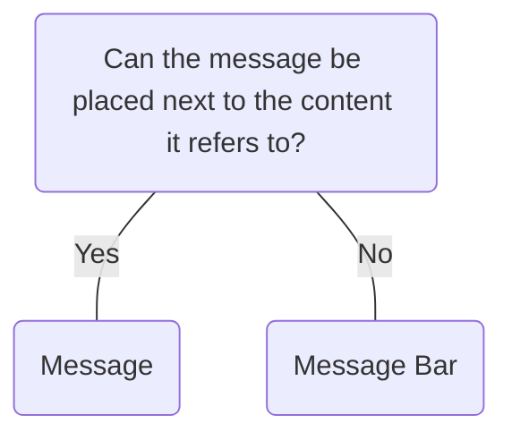

# Message Bar

## Overview


> Image: Illustration of a Message Bar component.


## When to use this component
To communicate information at the page level. Examples:
- System level items (expired accounts, server outages)
- Account status

## When to use another component
- When you need to communicate feedback of actions taken within the page use `Message`.



### Check out
- [Message][1]

## Behavior

### Types
Choose from four account notification types: Information, Warning, Success, Error
> Image: Image of four Message Bar components. The first is a information type with the label, Provides helpful feedback/information to the user. More details. The second is a warning type with the label, Warns the user of something that needs their attention. Stop warning. The third is a error type with the label, Informs user of a problem or error, system or user. Fix error. The fourth is a success type with the label, Provides positive feedback/information to the user.  More details.


## Usage

### Place at the top of pages
`Message Bar` is used for posting system level messages and should be placed at the top of a page.

> Image: Illustration of pages with a Message Bar. The example with heart eyes emoji shows a Message Bar at the top of the page, while the example with grimacing emoji shows the Message Bar nexted inside a page section.


### In other areas, place below heading
If used in areas other than a page, placing the `Message Bar` below the heading gives users context on what the message is referring to.

> Image: Illustration of modals that include a Message Bar. The first example with heart eyes emoji shows the Message Bar placed under the modal title. The second example with grimacing emoji shows the Message Bar placed above the modal title.


### Include a dismiss action
Always consider including a dismiss action.

> Image: Illustration of pages with a Message Bar. The example with heart eyes emoji shows a Message Bar with a dismiss button, while the example with grimacing emoji shows a Message Bar without a dismiss button.


### Icons
The icons are used to convey meaning and must not be removed nor changed.

> Image: Illustration of pages with a Message Bar. The example with heart eyes emoji shows a Message Bar with an icon, while the example with grimacing emoji shows a Message Bar without an icon.


### Don't stack Message Bars
Stacking of `Message Bar` should be avoided as it removes the one to one relationship a message has with a specific user action. This can create confusion on what is causing the message to be displayed.

> Image: The first example with heart eyes emoji shows an illustration of a page with a Message Bar while the second example with grimacing emoji, shows an illustration of a page with multiple Message Bars.


## Content

### Be concise
Keep content direct and concise. Consider using a link within the message bar if you need to provide more robust content.

> Image: Illustration of pages with a Message Bar. The first example with heart eyes emoji shows the a Message Bar with a single line of text. The second  example with grimacing emoji shows a Message Bar with three lines of text.


[1]: ./Message

## Examples


### Basic

Message Bar is a landmark so that users can easily navigate to and discover the important information; therefore, they must include a label using aria-labelledby or aria-label. There are several ways to accomplish this so each of the examples on this page illustrates a different approach.

```typescript
import React from 'react';

import Layout from '@splunk/react-ui/Layout';
import MessageBar from '@splunk/react-ui/MessageBar';
import { createDOMID } from '@splunk/ui-utils/id';


function Basic() {
    const labelId = createDOMID('messagebar-label');

    return (
        <Layout style={{ display: 'flex', flexDirection: 'column', gap: '12px' }}>
            <MessageBar type="info" aria-labelledby={labelId}>
                <span id={labelId}>Account notification:</span> your trial{' '}
                <strong>will expire soon</strong>.
            </MessageBar>
            <MessageBar type="info" aria-label="Account notification">
                Your trial <strong>will expire soon</strong>.
            </MessageBar>
        </Layout>
    );
}

export default Basic;
```


### Types

Message Bar can have one of four types: "info", "warning", "error" or "success".

```typescript
import React from 'react';

import Layout from '@splunk/react-ui/Layout';
import Link from '@splunk/react-ui/Link';
import MessageBar from '@splunk/react-ui/MessageBar';
import { createDOMID } from '@splunk/ui-utils/id';


function Types() {
    const handleRequestClose = () => {};
    const headingId = createDOMID('account-notifications');

    return (
        <section>
            <Layout style={{ display: 'flex', flexDirection: 'column', gap: '12px' }}>
                <h2 id={headingId}>Account notifications</h2>
                <MessageBar
                    type="info"
                    aria-labelledby={headingId}
                    onRequestClose={handleRequestClose}
                >
                    Your trial <strong>will expire soon</strong>. This message should include{' '}
                    <Link to="http://duckduckgo.com">inline links</Link> for recovery.
                </MessageBar>
                <MessageBar
                    type="warning"
                    aria-labelledby={headingId}
                    onRequestClose={handleRequestClose}
                >
                    Your trial <strong>will expire soon</strong>. This message should include{' '}
                    <Link to="http://duckduckgo.com">inline links</Link> for recovery.
                </MessageBar>
                <MessageBar
                    type="error"
                    aria-labelledby={headingId}
                    onRequestClose={handleRequestClose}
                >
                    Your trial <strong>will expire soon</strong>. This message should include{' '}
                    <Link to="http://duckduckgo.com">inline links</Link> for recovery.
                </MessageBar>
                <MessageBar
                    type="success"
                    aria-labelledby={headingId}
                    onRequestClose={handleRequestClose}
                >
                    Your trial <strong>will expire soon</strong>. This message should include{' '}
                    <Link to="http://duckduckgo.com">inline links</Link> for recovery.
                </MessageBar>
            </Layout>
        </section>
    );
}

export default Types;
```


### With actions

```typescript
import React from 'react';

import Button from '@splunk/react-ui/Button';
import Layout from '@splunk/react-ui/Layout';
import MessageBar from '@splunk/react-ui/MessageBar';
import { createDOMID } from '@splunk/ui-utils/id';


function WithActions() {
    const labelId = createDOMID('region-label');

    return (
        <MessageBar type="info" aria-labelledby={labelId}>
            <div id={labelId}>
                A message that prompts the user to take action now. Users can dismiss this message
                or take action.
            </div>
            <Layout style={{ marginTop: '8px' }}>
                <Button appearance="primary">Update</Button>
                <Button appearance="secondary">Dismiss</Button>
            </Layout>
        </MessageBar>
    );
}

export default WithActions;
```


## API


### MessageBar API

#### Props

| Name | Type | Required | Default | Description |
|------|------|------|------|------|
| children | React.ReactNode | yes |  | Text is required and should be concise. |
| elementRef | React.Ref<HTMLDivElement> | no |  | A React ref which is set to the DOM element when the component mounts and null when it unmounts. |
| onRequestClose | React.MouseEventHandler<HTMLButtonElement \| HTMLAnchorElement> | no |  | Includes a close button. Always consider including a close button. |
| type | 'info' \| 'warning' \| 'error' \| 'success' | yes |  | Sets the severity of this `MessageBar`. |


## Accessibility


## Tab Order
Links and dismiss buttons are interactive elements that can be added to `Message Bar` that change the tab order.

> Image: Image of two Multiselect components with interactive elements in a focus state. The first component has a dismiss button while the second component has an inline link and a dismiss button.


