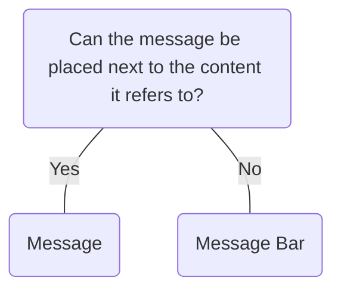

# Message

## Overview


> Image: Illustration of a Message component.


## When to use this component
Messages provide feedback, guidance, or alerts directly within the flow of content.
- To convey information that is relevant to the user's current task or context.

## When to use another component
- When the information being communicated is at the system level, use a `Message Bar`.



### Check out
- [Message Bar][1]

## Behavior

### Types
Choose from four message types: Information, Warning, Success, Error

> Image: Image of four Message components. The first is a information type with the label, Provides helpful feedback/information inline with the content. The second is a warning type with the label, Warns the user of something that needs their attention inline with the content. The third is a error type with the label, Informs user of a problem or error inline with the content. The fourth is a success type with the label, Provides positive feedback/information inline with the content


### Appearance
#### Default
The default appearance consists of an icon and a single line of text.

> Image: Image of four Message components. The first is a information type with the label, Provides helpful feedback/information inline with the content. The second is a warning type with the label, Warns the user of something that needs their attention inline with the content. The third is a error type with the label, Informs user of a problem or error inline with the content. The fourth is a success type with the label, Provides positive feedback/information inline with the content


#### Fill
The fill appearance consists of a filled box with an icon and text and can also include a title.

> Image: Image of four Message components using appearance `fill`. The first is a information type with the label, Provides helpful feedback/information. The second is a warning type with the label, Warns the user of something that needs their attention. The third is a error type with the label, Informs user of a problem or error. The fourth is a success type with the label, Provides positive feedback/information.


## Usage

### Icons
The icons are used to convey meaning and must not be removed nor changed.

> Image: Illustration of two default Message components. The example with heart eyes emoji shows the message with an icon, while the example with grimacing emoji shows the message without an icon.


### Don't replace other component's error states
Many components have built-in error messages. Ensure they are being fully utilized before using `Message`.

> Image: Illustration of an text input for emails and an error message. The example with heart eyes emoji shows the text input component


### Use filled Messages for larger sections of content
The appearance used should be appropriate to the size of the content it is regarding to and the importance of the message.

> Image: Illustration of pages that are split into one large and two small sections of content. The example with heart eyes emoji shows a Fill Message Component at the top the large content section. The second example with grimacing emoji shows a default Message Component at the top the large content section, that could easily be missed.


### Include a dismiss action for filled Messages
Messages with filled appearance are more noticeable. Always consider including a dismiss action to allow users to reduce noise.

> Image: Illustration of two Messages. The example with heart eyes emoji shows a Message with a title and a paragraph, while the example with grimacing emoji shows a Message without a title and a much longer paragraph.


## Content

### Add titles to break up content
When conveying larger messages, titles provide users a way to quickly comprehend the main meaning of the message. Titles should accompany content rather than being used alone. If not including visually including a title, a semantic title still must be added for improved accessibility.

> Image: Illustration of two Messages. The first example with heart eyes emoji shows a Message with a single line of text. The second  example with grimacing emoji shows a Message with three lines of text.


### Keep content direct and concise.

> Image: Illustration of two filled Messages with a title and a paragraph. In the first example with heart eyes emoji, the title is user group access updated, and the paragraph is general users can now edit alert logs. In the second  example with grimacing emoji, the title is User Group access updated to view alert logs, and the paragraph is The 368 users that are in the general user group can now edit alert logs.


[1]: ./MessageBar

## Examples


### Message Types

```typescript
import React from 'react';

import Layout from '@splunk/react-ui/Layout';
import Message from '@splunk/react-ui/Message';


function Basic() {
    return (
        <Layout style={{ flexDirection: 'column', alignItems: 'stretch' }}>
            <Message type="info">An info message for the user.</Message>
            <Message type="warning">A warning message for the user.</Message>
            <Message type="error">An error message for the user.</Message>
            <Message type="success">A success message for the user.</Message>
        </Layout>
    );
}

export default Basic;
```


### Fill

```typescript
import React from 'react';

import Layout from '@splunk/react-ui/Layout';
import Message from '@splunk/react-ui/Message';


function Fill() {
    return (
        <Layout style={{ flexDirection: 'column', alignItems: 'stretch' }}>
            <Message appearance="fill" type="info">
                An info message for the user.
            </Message>
            <Message appearance="fill" type="warning">
                A warning message for the user.
            </Message>
            <Message appearance="fill" type="error">
                An error message for the user.
            </Message>
            <Message appearance="fill" type="success">
                A success message for the user.
            </Message>
        </Layout>
    );
}

export default Fill;
```


### Content

Message can contain text, links, and buttons. Interactive items should not be included in content when Message is being used as a toast.

```typescript
import React from 'react';

import Link from '@splunk/react-ui/Link';
import Message from '@splunk/react-ui/Message';
import P from '@splunk/react-ui/Paragraph';


function Content() {
    return (
        <Message appearance="fill" type="info" onRequestRemove={() => {}}>
            <Message.Title>
                Your trial <strong>will expire soon</strong>.
            </Message.Title>
            <P>
                An info message for the user explaining the trial expiration and what actions they
                may need to take.
            </P>
            <Link to="Overview" appearance="standalone">
                Read more about Splunk UI
            </Link>
        </Message>
    );
}

export default Content;
```


### Removable

```typescript
import React from 'react';

import Layout from '@splunk/react-ui/Layout';
import Message from '@splunk/react-ui/Message';


function Removable() {
    return (
        <Layout style={{ flexDirection: 'column', alignItems: 'stretch' }}>
            <Message appearance="fill" type="info" onRequestRemove={() => {}}>
                An info message for the user.
            </Message>
            <Message appearance="fill" type="warning" onRequestRemove={() => {}}>
                A warning message for the user.
            </Message>
            <Message appearance="fill" type="error" onRequestRemove={() => {}}>
                An error message for the user.
            </Message>
            <Message appearance="fill" type="success" onRequestRemove={() => {}}>
                A success message for the user.
            </Message>
        </Layout>
    );
}

export default Removable;
```


## API


### Message API

#### Props

| Name | Type | Required | Default | Description |
|------|------|------|------|------|
| appearance | 'default' \| 'fill' | no | 'default' | Changes the style of the Message. |
| children | React.ReactNode | no |  |  |
| elementRef | React.Ref<HTMLDivElement> | no |  | A React ref which is set to the DOM element when the component mounts and null when it unmounts. |
| onRequestRemove | React.MouseEventHandler<HTMLButtonElement \| HTMLAnchorElement> | no |  | Includes a remove button if set. Only set this prop when using the `fill` appearance. |
| type | 'info' \| 'warning' \| 'error' \| 'success' | no | 'warning' | Sets the severity or type of this `Message`. |


### Message.Title API

A title component for use in `Message`.

#### Props

| Name | Type | Required | Default | Description |
|------|------|------|------|------|
| children | React.ReactNode | no |  |  |


