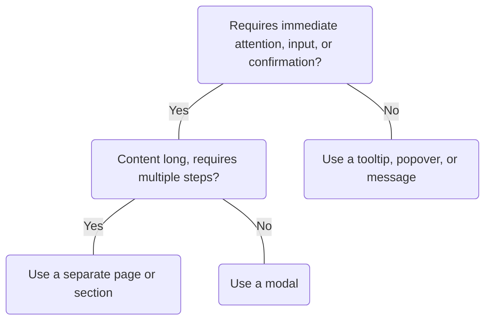

# Modal

## Overview


> Image: Illustration of a Modal component


## When to use this component
Modals create a new context for users, similar to navigating to a new page. This makes them inherently disruptive to a workflow as they disable everything on the page until dismissed. Modals should be used sparingly, thoughtfully, and only when an isolated or focused context is necessary to continue a task. Only use them in the following cases:

- When you need to show important content that the user needs to interact with before they can continue.
- When there is a choice that the user must make immediately or a small amount of information the user must provide.
- When you need to intentionally block progress and require confirmation for destructive actions.

## When to use another component
- If multiple tasks or steps are required to exit a modal, take the user to a separate page instead.
- When the information is not crucial for the user to interact with, display it on the main page without interrupting the user.
- When the modal would be too disruptive to the user's experience, such as if it pops up unexpectedly or covers up too much of the main page, use a less intrusive component such as a `Message`, `Popover`, or `Tooltip`.



### Check out
- [Message] [1]
- [Popover] [2]
- [Tooltip] [3]


## Usage

### Close modal
Provide a clear and recognizable way for users to close the modal:
- **Escape key**: Pressing <kbd>Esc</kbd> must close the modal. This behavior cannot be overridden.
- **Close button**: A close button should be rendered in the top right corner of the modal.

> Image: Examples of a clear method for closing a modal: The first example, which includes a heart eyes emoji, features a close button in the top right corner of the modal and a button group in the bottom right offering both primary and secondary actions. The second example, with a grimacing face emoji, lacks a close button in the top right corner of the modal and only has a button group providing a primary and secondary action.


### Clicking outside to dismiss

By default, clicking outside of a modal does not close the modal.

This is an intentional design decision to prevent accidental dismissal, which can result in data loss or disruption of a workflow. A modal should always provide a clear, intentional way to be closed, such as the Escape key or a close button.

In specific, limited scenarios, it may be appropriate to allow clicking outside the modal to dismiss it by enabling the `closeOnClickAway` prop.

#### When this may be appropriate
Only consider enabling click outside to dismiss when all of the following are true:
- The modal content is non-critical or purely informational
- Accidental dismissal will not result in loss of data, progress, or important context
- The modal behaves like a transient or lightweight interface, such as global search or a command palette

#### When not to use this behavior
Avoid enabling click outside to dismiss for:
- Forms or workflows with user input
- Multi-step or stateful interactions
- Destructive or confirmation dialogs
- Any modal where dismissal could lead to confusion or loss of work

### Primary action
The final interactive element in a modal should be the primary action.
> Image: Examples illustrating the placement of a primary action in modals. The first example, marked with a heart eyes emoji, displays a modal with a button group located in the bottom right corner; this group includes both primary and secondary actions, with the primary action designated as the second button. The second example, identified by a grimacing face emoji, presents a modal with a secondary button in the bottom right and a button group in the bottom left corner for primary and tertiary actions. In the group, the primary action is again the second button.


### Workflow
If multiple tasks are required, take the user to a separate page instead of a modal.
> Image: Examples illustrating the management of multiple tasks or steps in a user interface. The first example, represented by a heart eyes emoji, displays a step pattern located directly under the page title, signifying a recommended approach for task progression. The second example, marked with a grimacing face emoji, shows the step pattern placed within a modal, an approach that is not recommended.


### Messages in modals
`MessageBar` or `Message` components should be placed after the modal header. Neither the message bar or message should use the `isDismissible` prop because it would conflict with the close or dismiss actions for the modal.
> Image: Examples illustrating using the `Message` or `MessageBar` component in a modal. The first example with a heart eye emoji displays the `MessageBar` below the modal header. The second example with a grimacing face emoji displays the `MessageBar` at the top of the modal above the modal header.


### Disabled elements
Avoid disabling buttons or inputs in modals. Enable them and show an error text in-line or in a summary at the top of the modal.
> Image: Examples of disabling buttons or inputs in modals, and use error text and validation instead. The first example with heart eyes emoji has a modal with two inputs in the modal body followed by a button group in the bottom right. All inputs and buttons are enabled and the first input is in an error state with error text. The second example with a grimacing face emoji, has two inputs in the modal body follow by the button group in the bottom right. The buttons in this example are disabled and it


### Clear content
Make sure that the content inside the modal is clearly related to the action that triggered the modal to appear, since users do not have access to the content from the page.
> Image: Examples of modal titles that are brief and provide context. The first example with heart eyes emoji has a modal with a title of 


## Content

### Title
Write a brief title in the form of a statement or question that clearly describes the task the user is completing in the modal. Use a verb plus noun combination when possible.
> Image: Content examples for modal titles in the form of a statement or question. The first example with heart eyes emoji reads 


#### Sentence style
Use sentence-style capitalization and capitalize the first word and proper nouns only.
> Image: Content examples of using sentence style in modal titles. The first with heart eyes emoji reads 


### Body text
Include only content that is directly related to completing the task at hand. Don’t repeat or rephrase the title.
> Image: Content example for Modal body text that is related to the task at hand. The first example with heart eyes emoji that reads 


#### Clear context
Provide context that helps the user decide which action to take.
> Image: Content example for Modal content that helps users decide which actions to take. The first example with heart eyes emoji reads 


### Actions
Use a precise verb to describe the action instead of vague words like Done or OK when possible.
> Image: Content example for actions in Modals using a precise verb. The first example with heart eyes emoji reads 


[1]: ./Message
[2]: ./Popover
[3]: ./Tooltip

## Examples


### Basic

```typescript
import React, { useRef, useState } from 'react';

import Button from '@splunk/react-ui/Button';
import Modal from '@splunk/react-ui/Modal';


function Basic() {
    const [open, setOpen] = useState(false);
    const modalToggle = useRef<HTMLButtonElement | null>(null);

    const handleRequestOpen = () => {
        setOpen(true);
    };

    const handleRequestClose = () => {
        setOpen(false);
    };

    return (
        <>
            <Button onClick={handleRequestOpen} elementRef={modalToggle} label="Click me" />
            <Modal returnFocus={modalToggle} onRequestClose={handleRequestClose} open={open}>
                <Modal.Header title="Simple dialog" />
                <Modal.Body>
                    Modals create a new context for users, similar to navigating to a new page.
                </Modal.Body>
            </Modal>
        </>
    );
}

export default Basic;
```


### Typical usage

This example shows a basic Splunk UI-styled Modal. By default, the Modal takes on the width of the content, so ensure that the width is set on the children. Alternately, set width on the Modal or Modal.Body with an inline style. Use an inline style to set the width and height of the icon to fit the icon's container. Modals *must* return focus to the element that invoked the dialog (or another element that follows the logical flow of the application) on close. To automatically return focus to the invoking element on Modal close, pass the ref of the invoking element to Modal's returnFocus prop. If using a ref is not possible, you *must* manually return focus to the invoking element in a function passed to returnFocus. Additionally, Modals containing a form should not close when clickAway event occurs. See below for an example of how to implement these requirements.

```typescript
import React, { useState, useRef } from 'react';

import Layout from '@splunk/react-icons/Layout';
import Button from '@splunk/react-ui/Button';
import ControlGroup from '@splunk/react-ui/ControlGroup';
import Modal from '@splunk/react-ui/Modal';
import P from '@splunk/react-ui/Paragraph';
import Select from '@splunk/react-ui/Select';
import Text from '@splunk/react-ui/Text';


function TypicalUsage() {
    const modalToggle = useRef<HTMLButtonElement | null>(null);

    const [open, setOpen] = useState(false);

    const handleRequestOpen = () => {
        setOpen(true);
    };

    const handleRequestClose = () => {
        setOpen(false);
    };

    return (
        <>
            <Button onClick={handleRequestOpen} elementRef={modalToggle} label="Click me" />
            <Modal
                onRequestClose={handleRequestClose}
                open={open}
                returnFocus={modalToggle}
                style={{ width: '600px' }}
            >
                <form>
                    <Modal.Header
                        title="Header"
                        subtitle="Similar to cards, modals consist of three major parts."
                        icon={<Layout />}
                    />
                    <Modal.Body>
                        <P>
                            This is an example of modal body content. Please fill out the form
                            below.
                        </P>
                        <ControlGroup label="First Name">
                            <Text />
                        </ControlGroup>
                        <ControlGroup label="Last Name" controlsLayout="fillJoin">
                            <Text />
                        </ControlGroup>
                        <ControlGroup label="Office" tooltip="The office you are assigned to.">
                            <Select defaultValue="sf">
                                <Select.Option label="San Francisco" value="sf" />
                                <Select.Option label="Santana Row" value="sr" />
                            </Select>
                        </ControlGroup>
                    </Modal.Body>
                    <Modal.Footer>
                        <Button
                            appearance="secondary"
                            onClick={handleRequestClose}
                            label="Cancel"
                        />
                        <Button appearance="primary" label="Submit" type="submit" />
                    </Modal.Footer>
                </form>
            </Modal>
        </>
    );
}

export default TypicalUsage;
```


### Undismissable

To create a Modal that cannot be dismissed, omit the onClose callback.

```typescript
import React, { useState, useEffect, useRef } from 'react';

import Button from '@splunk/react-ui/Button';
import Modal from '@splunk/react-ui/Modal';
import ScreenReaderContent from '@splunk/react-ui/ScreenReaderContent';


function Basic() {
    const modalToggle = useRef<HTMLButtonElement | null>(null);
    const counterInterval = useRef<() => void>();
    const [count, setCount] = useState(5);
    const [open, setOpen] = useState(false);
    const [wasOpen, setWasOpen] = useState(false);

    const handleCounter = () => {
        const newCount = count - 1;
        if (newCount === 0) {
            setOpen(false);
            setWasOpen(true);
        } else {
            setCount(newCount);
        }
    };

    useEffect(() => {
        counterInterval.current = handleCounter;
    });

    // eslint-disable-next-line consistent-return
    useEffect(() => {
        const tick = () => {
            counterInterval?.current?.();
        };
        if (open) {
            setCount(5);
            const id = window.setInterval(tick, 1000);
            return () => {
                window.clearInterval(id);
            };
        }
    }, [open]);

    const handleRequestOpen = () => {
        setOpen(true);
        setWasOpen(false);
    };

    return (
        <div>
            {/* Use an aria-live element that is visually hidden to announce when the modal is automatically dismissed */}
            <ScreenReaderContent aria-atomic="true" aria-live="assertive">
                {wasOpen ? 'Modal has been automatically dismissed' : ''}
            </ScreenReaderContent>
            <Button onClick={handleRequestOpen} elementRef={modalToggle} label="Click me" />
            <Modal returnFocus={modalToggle} open={open}>
                <Modal.Body>
                    This modal cannot be dismissed by the user. It will be dismissed in {count}{' '}
                    seconds.
                </Modal.Body>
            </Modal>
        </div>
    );
}
export default Basic;
```


### Initial focus

Initial focus can be set to an different element.

```typescript
import React, { useCallback, useState, useRef } from 'react';

import Button from '@splunk/react-ui/Button';
import Modal from '@splunk/react-ui/Modal';
import P from '@splunk/react-ui/Paragraph';


function InitialFocus() {
    const [acceptButton, setAcceptButon] = useState<HTMLButtonElement>();
    const acceptButtonRef = useCallback((el: HTMLButtonElement) => setAcceptButon(el), []);

    const [open, setOpen] = useState(false);
    const modalToggle = useRef<HTMLButtonElement | null>(null);

    const handleRequestOpen = () => {
        setOpen(true);
    };

    const handleRequestClose = () => {
        setOpen(false);
    };

    return (
        <>
            <Button onClick={handleRequestOpen} elementRef={modalToggle} label="Click me" />
            <Modal
                initialFocus={acceptButton}
                onRequestClose={handleRequestClose}
                open={open}
                returnFocus={modalToggle}
                style={{ width: '600px' }}
            >
                <Modal.Header title="Header" />
                <Modal.Body>
                    <P>This modal demonstrates how to set initial focus to a specific element.</P>
                </Modal.Body>
                <Modal.Footer>
                    <Button appearance="secondary" onClick={handleRequestClose} label="Cancel" />
                    <Button appearance="primary" elementRef={acceptButtonRef} label="Accept" />
                </Modal.Footer>
            </Modal>
        </>
    );
}

export default InitialFocus;
```


## API


### Modal API

#### Props

| Name | Type | Required | Default | Description |
|------|------|------|------|------|
| children | React.ReactNode | no |  | Any renderable children can be passed to the `Modal`.  To use the default Splunk UI `Modal` styles, use the `Modal.Header`, `Modal.Body`, and `Modal.Footer`. |
| closeOnClickAway | boolean | no |  | Set to 'true' to enable closing the Modal by clicking outside of it.  This behavior should be avoided as it can lead to accidental dismissal of the modal causing data loss or disruption of a user's workflow. Only enable click outside to dismiss when: - The modal content is non-critical or purely informational - Accidental dismissal will not result in loss of progress, data, or important context  `onRequestClose` will receive an event with reason 'clickAway' when this happens. |
| divider | 'header' \| 'footer' \| 'both' \| 'none' | no | 'both' | Show dividers between header, body and footer. |
| elementRef | React.Ref<HTMLDivElement> | no |  | A React ref which is set to the DOM element when the component mounts and null when it unmounts. |
| initialFocus | \| 'first' \| 'container' \| (React.Component & { focus: () => void }) \| HTMLElement \| null | no | 'first' | Allows focus to be set to a component other than the default. Supports `first` (first focusable element in the modal), `container` (focus the modal itself), or a ref. |
| onRequestClose | ModalRequestCloseHandler | no |  | Called when a close event occurs. When `Modal` includes this prop, a close button is displayed by default in the `Modal.Header`. To hide the close button, pass the `hideCloseButton` prop to `Modal.Header`.  The callback is passed the event and a reason, which is 'escapeKey', 'clickAway', or 'clickCloseButton'.  Generally, use this callback to toggle the `open` prop. |
| open | boolean | no | false | Set to `true` if the `Modal` is currently open. Otherwise, set to `false`. |
| returnFocus | \| React.MutableRefObject<(React.Component & { focus: () => void }) \| HTMLElement \| null> \| (() => void) | yes |  | Pass the ref of the invoking element (or other element that follows the logical flow of the application) to automatically move focus to the invoking element on `Modal` close. If using a ref is not possible, you *must* pass a function that sets focus to the appropriate element. This function will be called after `onRequestClose`. |

#### Types

| Name | Type | Description |
|------|------|------|
| ModalRequestCloseHandler | (data: {     event:         \| React.MouseEvent<HTMLDivElement \| HTMLAnchorElement \| HTMLButtonElement>         \| MouseEvent         \| KeyboardEvent         \| TouchEvent;     reason: 'clickAway' \| 'escapeKey' \| 'clickCloseButton'; }) => void |  |


### Modal.Header API

A styled container for `Modal` header content.

#### Props

| Name | Type | Required | Default | Description |
|------|------|------|------|------|
| children | React.ReactNode | no |  | `children` might be passed instead of a title. Note that `children` aren't rendered if a title is provided. |
| hideCloseButton | boolean | no | false | Hide the closeButton in the Header if `onRequestClose` is provided to `Modal`. |
| icon | React.ReactNode | no |  | The icon to show before the title. |
| subtitle | React.ReactNode | no |  | Used as the subheading. Only shown if `title` is also present. |
| title | string | no |  | Used as the main heading. |


### Modal.Body API

A styled container for `Modal` body content.

#### Props

| Name | Type | Required | Default | Description |
|------|------|------|------|------|
| children | React.ReactNode | no |  |  |


### Modal.Footer API

A styled container for `Modal` footer content.

#### Props

| Name | Type | Required | Default | Description |
|------|------|------|------|------|
| children | React.ReactNode | no |  |  |
| layout | 'auto' \| 'none' | no | 'auto' | Controls the layout and styling for children.  `auto` will style children for common use cases, such as: buttons; controls; documentation links; or a combination. Set `none` when custom styling is needed. |


