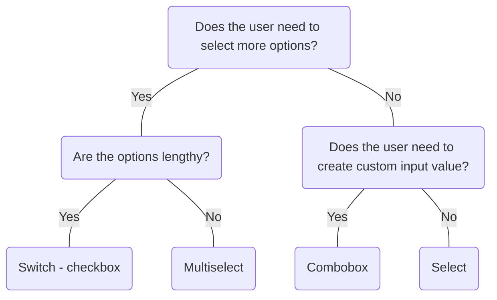

# Multiselect

## Overview


> Image: Illustration of a Multiselect component.


<Message appearance="fill" type="info">
    <div>All data entry components should be wrapped in a <Link to="ControlGroup">Control Group</Link> to provide a label, error states, and help or error text, ensuring an accessible experience for all users.</div>
</Message>

## When to use this component
- To select one or multiple options from a list of choices.
- There are a large number of options. For instance, in a form for filtering search results or making multiple selections from a list of categories.

## When to use another component
- If the user is only required to select one pre-determined option, use `Select` or `Radio List`.
- If the user is only required to select one option, but needs to create a custom value in addition to selecting from a list, use `Combo Box`.
- If the options have long names, a list of `Checkboxes` can be used to avoid label truncation.



### Check out
- [Select][1]
- [Radio List][2]
- [Switch - Checkbox][3]
- [Combo Box][4]

## Behaviors

### Default
Default Multiselect uses removable chips as its value and grows vertically as chips are added.

> Image: Image showing the default Multiselect component, which uses chips to display each option. The image shows that when additional selections are made, the Multiselect height grows to fit another row of chips.


### Compact
When compact is `true`, Multiselect will never grow vertically. Compact uses a string separated by commas with a count. Note that this compact is different than compact density, which only affects size of the component.

> Image: Image showing the compact Multiselect component, which uses a string separated by commas with a count to display the total selection.


### Compact with Select all appearance
When compact is `true`, the Select all appearance displays Select and Clear all actions as a menu-item for improved keyboard and screen reader usability.

> Image: Image showing the compact Multiselect component in a focus state including a `Select all` button that allows users to select all possible options.


### New Value
Optionally, users can be allowed to add arbitrary values.

> Image: Image showing examples of the Multiselect component with a new value, Hello World, typed in the input box. The first example is a default Multiselect while the second is a compact Multiselect.


### Matching
Options can be populated from a server to allow field matching.

> Image: Image showing a Multiselect component in a focus state with the word chart typed in the input box, resulting in the list of options being filtered to only show options that have the word chart in the title.


### Filtering
When compact is `true`, a search bar is included in the menu to allow users to filter through options.

> Image: Image showing a compact Multiselect component in a focus state with the word Line typed in the search box. The menu is filtered down to only show the options, Line (new value) and Line chart.


### Footers
Footers can provide additional context on the options.

> Image: Image showing a compact Multiselect component in a focus state with a footer with the label, 10 charts.


## Usage

### Leave enough space for selections
Consider the width of the Multiselect to leave enough space for multiple selections.

> Image: In this image, there is a Multiselect and Text Input components in a form. In the first example with heart eyes emoji, the components are vertically stacked. In the second example with a grimacing emoji, the components are horizontally stacked, resulting in the width of the Multiselect shorter and the height being elongated to display the selection.


### Use the compact variant for large selections
Consider using the compact design when users are expected to select a large number of options.

> Image: In this image, there is a Multiselect component with 6 selected options. In the first example with heart eyes emoji, the Multiselect uses the compact design, while in the second example with a grimacing emoji, it is in the default style. The second example is three times taller than the first to display all six options as chips.


## Content

### Be concise
Keep labels short and compact so that they fit in the input box.

> Image: Examples of option label length: The first example with the heart eyes emoji has three options with the titles: 


[1]: ./Select
[2]: ./RadioList
[3]: ./Switch
[4]: ./ComboBox

## Examples


### Controlled

```typescript
import React, { useCallback, useState } from 'react';

import Multiselect, { MultiselectChangeHandler } from '@splunk/react-ui/Multiselect';


function Controlled() {
    const [selectedValues, setSelectedValues] = useState<(string | number | boolean)[]>(['1', '5']);

    const handleChange: MultiselectChangeHandler = useCallback((e, { values }) => {
        setSelectedValues(values);
    }, []);

    return (
        <Multiselect values={selectedValues} onChange={handleChange} inline>
            <Multiselect.Option label="Area chart" value="1" />
            <Multiselect.Option label="Bar chart" value="2" />
            <Multiselect.Option label="Bubble chart" value="3" />
            <Multiselect.Option label="Column chart" value="4" />
            <Multiselect.Option label="Line chart" value="5" />
            <Multiselect.Option label="Pie chart" value="6" />
            <Multiselect.Option label="Scatter chart" value="7" />
        </Multiselect>
    );
}

export default Controlled;
```


### defaultValues

```typescript
import React from 'react';

import Multiselect from '@splunk/react-ui/Multiselect';

const defaultValues = ['1', '5'];


function Uncontrolled() {
    return (
        <Multiselect defaultValues={defaultValues} inline>
            <Multiselect.Option label="Area chart" value="1" />
            <Multiselect.Option label="Bar chart" value="2" />
            <Multiselect.Option label="Bubble chart" value="3" />
            <Multiselect.Option label="Column chart" value="4" />
            <Multiselect.Option label="Line chart" value="5" />
            <Multiselect.Option label="Pie chart" value="6" />
            <Multiselect.Option label="Scatter chart" value="7" />
        </Multiselect>
    );
}

export default Uncontrolled;
```


### values

```typescript
import React from 'react';

import Multiselect from '@splunk/react-ui/Multiselect';

const values = ['Value1', 'Chart5'];


function Headings() {
    return (
        <Multiselect inline allowNewValues defaultValues={values}>
            <Multiselect.Option label="Events" value="Basic1" />
            <Multiselect.Divider />
            <Multiselect.Option label="Statistics table" value="Basic2" />
            <Multiselect.Heading>Chart</Multiselect.Heading>
            <Multiselect.Option label="Area chart" value="Chart1" />
            <Multiselect.Option label="Bar chart" value="Chart2" />
            <Multiselect.Option label="Bubble chart" value="Chart3" />
            <Multiselect.Option label="Column chart" value="Chart4" />
            <Multiselect.Option label="Line chart" value="Chart5" />
            <Multiselect.Option label="Pie chart" value="Chart6" />
            <Multiselect.Option label="Scatter chart" value="Chart7" />
            <Multiselect.Heading>Map</Multiselect.Heading>
            <Multiselect.Option label="Choropleth map" value="Map1" />
            <Multiselect.Option label="Cluster map" value="Map2" />
            <Multiselect.Heading>Value</Multiselect.Heading>
            <Multiselect.Option label="Filler gauge" value="Value1" />
            <Multiselect.Option label="Marker gauge" value="Value2" />
            <Multiselect.Option label="Radial gauge" value="Value3" />
            <Multiselect.Option label="Single value" value="Value4" />
        </Multiselect>
    );
}

export default Headings;
```


### New Values

Optionally, users can be allowed to add arbitrary values.

```typescript
import React, { useCallback, useState } from 'react';

import Multiselect, { MultiselectChangeHandler } from '@splunk/react-ui/Multiselect';


function NewValues() {
    const [selectedValues, setSelectedValues] = useState<(string | number | boolean)[]>([
        'Line Chart',
        'Map',
        'Table',
    ]);

    const handleChange: MultiselectChangeHandler = useCallback((e, { values }) => {
        setSelectedValues(values);
    }, []);

    return (
        <Multiselect allowNewValues values={selectedValues} onChange={handleChange} inline>
            <Multiselect.Option label="Area chart" value="Area chart" />
            <Multiselect.Option label="Bar chart" value="Bar chart" />
            <Multiselect.Option label="Bubble chart" value="Bubble chart" />
            <Multiselect.Option label="Column chart" value="Column chart" />
            <Multiselect.Option label="Line chart" value="Line chart" />
            <Multiselect.Option label="Pie chart" value="Pie chart" />
            <Multiselect.Option label="Scatter chart" value="Scatter chart" />
        </Multiselect>
    );
}

export default NewValues;
```


### defaultValues

```typescript
import React from 'react';

import ChartArea from '@splunk/react-icons/ChartArea';
import ChartBar from '@splunk/react-icons/ChartBar';
import ChartBubble from '@splunk/react-icons/ChartBubble';
import ChartColumn from '@splunk/react-icons/ChartColumn';
import ChartLine from '@splunk/react-icons/ChartLine';
import ChartPie from '@splunk/react-icons/ChartPie';
import ChartScatter from '@splunk/react-icons/ChartScatter';
import Multiselect from '@splunk/react-ui/Multiselect';

const defaultValues = ['1', '5'];


function Icons() {
    return (
        <Multiselect defaultValues={defaultValues} inline>
            <Multiselect.Option label="Area chart" icon={<ChartArea />} value="1" />
            <Multiselect.Option label="Bar chart" icon={<ChartBar />} value="2" />
            <Multiselect.Option label="Bubble chart" icon={<ChartBubble />} value="3" />
            <Multiselect.Option label="Column chart" icon={<ChartColumn />} value="4" />
            <Multiselect.Option label="Line chart" icon={<ChartLine />} value="5" />
            <Multiselect.Option label="Pie chart" icon={<ChartPie />} value="6" />
            <Multiselect.Option label="Scatter chart" icon={<ChartScatter />} value="7" />
        </Multiselect>
    );
}

export default Icons;
```


### Error

```typescript
import React, { useCallback, useState } from 'react';

import Multiselect, { MultiselectChangeHandler } from '@splunk/react-ui/Multiselect';


function MultiselectError() {
    const [selectedValues, setSelectedValues] = useState<(string | number | boolean)[]>(['1', '5']);

    const handleChange: MultiselectChangeHandler = useCallback((e, { values }) => {
        setSelectedValues(values);
    }, []);

    return (
        <Multiselect values={selectedValues} onChange={handleChange} error inline>
            <Multiselect.Option label="Area chart" value="1" />
            <Multiselect.Option label="Bar chart" value="2" />
            <Multiselect.Option label="Bubble chart" value="3" />
            <Multiselect.Option label="Column chart" value="4" />
            <Multiselect.Option label="Line chart" value="5" />
            <Multiselect.Option label="Pie chart" value="6" />
            <Multiselect.Option label="Scatter chart" value="7" />
        </Multiselect>
    );
}

export default MultiselectError;
```


### Disabled

If you absolutely need to disable a `Multiselect` use `"disabled="dimmed"`. This ensures the `Multiselect` does not respond to events, but can still receive focus to so that users can navigate to the `Multiselect` when using assistive technologies.

```typescript
import React, { useCallback, useState } from 'react';

import Multiselect, { MultiselectChangeHandler } from '@splunk/react-ui/Multiselect';


function Disabled() {
    const [selectedValues, setSelectedValues] = useState<(string | number | boolean)[]>(['1', '5']);

    const handleChange: MultiselectChangeHandler = useCallback((e, { values }) => {
        setSelectedValues(values);
    }, []);

    return (
        <Multiselect values={selectedValues} onChange={handleChange} disabled="dimmed" inline>
            <Multiselect.Option label="Area chart" value="1" />
            <Multiselect.Option label="Bar chart" value="2" />
            <Multiselect.Option label="Bubble chart" value="3" />
            <Multiselect.Option label="Column chart" value="4" />
            <Multiselect.Option label="Line chart" value="5" />
            <Multiselect.Option label="Pie chart" value="6" />
            <Multiselect.Option label="Scatter chart" value="7" />
        </Multiselect>
    );
}

export default Disabled;
```


### Children

children replace label when provided. label is still used for matching to the filter.

```typescript
import React, { useCallback, useState } from 'react';

import Multiselect, { MultiselectChangeHandler } from '@splunk/react-ui/Multiselect';


function Children() {
    const [selectedValues, setSelectedValues] = useState<(string | number | boolean)[]>(['1', '5']);

    const handleChange: MultiselectChangeHandler = useCallback((e, { values }) => {
        setSelectedValues(values);
    }, []);

    return (
        <Multiselect values={selectedValues} onChange={handleChange} inline>
            <Multiselect.Option label="Chart: Area" value="1">
                Chart: <b>Area</b>
            </Multiselect.Option>
            <Multiselect.Option label="Chart: Bar" value="2">
                Chart: <b>Bar</b>
            </Multiselect.Option>
            <Multiselect.Option label="Chart: Bubble" value="3">
                Chart: <b>Bubble</b>
            </Multiselect.Option>
            <Multiselect.Option label="Chart: Column" value="4">
                Chart: <b>Column</b>
            </Multiselect.Option>
            <Multiselect.Option label="Chart: Line" value="5">
                Chart: <b>Line</b>
            </Multiselect.Option>
            <Multiselect.Option label="Chart: Pie" value="6">
                Chart: <b>Pie</b>
            </Multiselect.Option>
            <Multiselect.Option label="Chart: Scatter" value="7">
                Chart: <b>Scatter</b>
            </Multiselect.Option>
        </Multiselect>
    );
}

export default Children;
```


### Tab to confirm new value

If a new value is entered and there are no other Options available, pressing the Tab key will confirm the new value.

```typescript
import React, { useCallback, useState } from 'react';

import Multiselect, { MultiselectChangeHandler } from '@splunk/react-ui/Multiselect';


function TabInput() {
    const [selectedValues, setSelectedValues] = useState<(string | number | boolean)[]>(['1', '5']);

    const handleChange: MultiselectChangeHandler = useCallback((e, { values }) => {
        setSelectedValues(values);
    }, []);

    return (
        <Multiselect
            values={selectedValues}
            onChange={handleChange}
            inline
            tabConfirmsNewValue
            allowNewValues
        >
            <Multiselect.Option label="Area chart" value="1" />
            <Multiselect.Option label="Bar chart" value="2" />
            <Multiselect.Option label="Bubble chart" value="3" />
            <Multiselect.Option label="Column chart" value="4" />
            <Multiselect.Option label="Line chart" value="5" />
            <Multiselect.Option label="Pie chart" value="6" />
            <Multiselect.Option label="Scatter chart" value="7" />
        </Multiselect>
    );
}

export default TabInput;
```


### Customize selected Options

It's possible to customize the appearance of selected Options.

```typescript
import React, { useCallback, useState } from 'react';

import Multiselect, { MultiselectChangeHandler } from '@splunk/react-ui/Multiselect';


function CustomizeSelected() {
    const [selectedValues, setSelectedValues] = useState<(string | number | boolean)[]>([
        '1',
        '4',
        '5',
    ]);

    const handleChange: MultiselectChangeHandler = useCallback((e, { values }) => {
        setSelectedValues(values);
    }, []);

    return (
        <Multiselect values={selectedValues} onChange={handleChange} inline>
            <Multiselect.Option label="Area chart" value="1" selectedAppearance="warning" />
            <Multiselect.Option label="Bar chart" value="2" />
            <Multiselect.Option label="Bubble chart" value="3" />
            <Multiselect.Option label="Column chart" value="4" selectedAppearance="error" />
            <Multiselect.Option label="Line chart" value="5" />
            <Multiselect.Option label="Pie chart" value="6" />
            <Multiselect.Option label="Scatter chart" value="7" />
        </Multiselect>
    );
}

export default CustomizeSelected;
```


### defaultPlaceholder

```typescript
import React, { useCallback, useEffect, useMemo, useState } from 'react';

import useFetchOptions, {
    isMovieOption,
    Movie,
    MovieOption,
} from '@splunk/react-ui/fixtures/useFetchOptions';
import Multiselect, {
    MultiselectChangeHandler,
    MultiselectFilterChangeHandler,
} from '@splunk/react-ui/Multiselect';
import { _ } from '@splunk/ui-utils/i18n';

const defaultPlaceholder = _('Select a movie...');


function Fetching() {
    const [fullCount, setFullCount] = useState(0);
    const [isLoading, setIsLoading] = useState(false);
    const [options, setOptions] = useState<MovieOption[]>([]);
    const [selectedValues, setSelectedValues] = useState<(string | number | boolean)[]>([10, 30]);

    
    const { fetch, getFullCount, getSelectedOptions, stop } = useFetchOptions();

    const handleFetch = useCallback(
        (keyword?: string) => {
            setIsLoading(true);

            fetch(keyword)
                .then((fetchedOptions) => {
                    setIsLoading(false);
                    setOptions(fetchedOptions);
                    setFullCount(getFullCount());
                })
                .catch((error) => {
                    if (!error.isCanceled) throw error;
                });
        },
        [fetch, getFullCount]
    );

    const handleChange: MultiselectChangeHandler = useCallback(
        (e, { values }) => {
            setSelectedValues(values);
            handleFetch();
        },
        [handleFetch]
    );

    const handleFilterChange: MultiselectFilterChangeHandler = useCallback(
        (e, { keyword }) => {
            handleFetch(keyword);
        },
        [handleFetch]
    );

    useEffect(() => {
        handleFetch();

        return () => {
            stop();
        };
    }, [handleFetch, stop]);

    const createOption = useCallback(
        (movie: Movie | MovieOption, isSelected = false) => (
            
            <Multiselect.Option
                hidden={isSelected}
                key={isSelected ? `selected-${movie.id}` : movie.id}
                label={movie.title}
                matchRanges={isMovieOption(movie) ? movie.matchRanges : undefined}
                value={movie.id}
            />
        ),
        []
    );

    const generateOptions = useMemo(() => {
        // The selected items always have to be in the option list, but can be hidden
        let selectedOptions: React.ReactElement[] = [];
        if (selectedValues.length) {
            const selectedMovies = getSelectedOptions(selectedValues as number[]);
            selectedOptions = selectedMovies.map((movie) => createOption(movie, true));
        }

        if (isLoading) {
            // Only return the select items
            return selectedOptions;
        }

        const list = options.map((movie) => createOption(movie));
        return list.concat(selectedOptions);
    }, [selectedValues, isLoading, options, getSelectedOptions, createOption]);

    const footerMessage = useMemo(() => {
        if (fullCount > options.length && !isLoading) {
            return _('%1 of %2 movies')
                .replace('%1', options.length.toString())
                .replace('%2', fullCount.toString());
        }
        return null;
    }, [fullCount, options.length, isLoading]);

    return (
        <Multiselect
            values={selectedValues}
            placeholder={defaultPlaceholder}
            onChange={handleChange}
            controlledFilter
            onFilterChange={handleFilterChange}
            isLoadingOptions={isLoading}
            footerMessage={footerMessage}
            inline
        >
            {generateOptions}
        </Multiselect>
    );
}

export default Fetching;
```


### Load more on scroll bottom

Similar example as fetching but it's also possible to append more Options from a server when the list is scrolled to the bottom. Here, that behavior is simulated. The onScrollBottom prop is a function that should fetch more results and append them to the current Options. Once all items are loaded, the onScrollBottom prop should be set to null.

```typescript
import React, { useCallback, useEffect, useMemo, useState } from 'react';

import useFetchOptions, {
    isMovieOption,
    Movie,
    MovieOption,
} from '@splunk/react-ui/fixtures/useFetchOptions';
import Multiselect, {
    MultiselectChangeHandler,
    MultiselectFilterChangeHandler,
} from '@splunk/react-ui/Multiselect';
import { _ } from '@splunk/ui-utils/i18n';


function LoadMoreOnScrollBottom() {
    const [fullCount, setFullCount] = useState(0);
    const [isLoading, setIsLoading] = useState(false);
    const [isLoadingMore, setIsLoadingMore] = useState(false);
    const [options, setOptions] = useState<MovieOption[]>([]);
    const [selectedValues, setSelectedValues] = useState<(string | number | boolean)[]>([10, 30]);

    
    const { fetch, fetchMore, getFullCount, getSelectedOptions, stop } = useFetchOptions();

    const handleFetch = useCallback(
        (keyword?: string) => {
            setIsLoading(true);

            fetch(keyword)
                .then((fetchedOptions) => {
                    setIsLoading(false);
                    setOptions(fetchedOptions);
                    setFullCount(getFullCount());
                })
                .catch((error) => {
                    if (!error.isCanceled) throw error;
                });
        },
        [fetch, getFullCount]
    );

    const handleChange: MultiselectChangeHandler = useCallback(
        (e, { values }) => {
            setSelectedValues(values);
            handleFetch();
        },
        [handleFetch]
    );

    const handleFetchMore = useCallback(
        (currentOptions: MovieOption[]) => {
            setIsLoadingMore(true);

            fetchMore(currentOptions)
                .then((fetchedOptions) => {
                    setOptions(fetchedOptions);
                    setIsLoading(false);
                    setIsLoadingMore(false);
                    setFullCount(getFullCount());
                })
                .catch((error) => {
                    if (!error.isCanceled) {
                        throw error;
                    }
                });
        },
        [fetchMore, getFullCount]
    );

    const handleFilterChange: MultiselectFilterChangeHandler = useCallback(
        (e, { keyword }) => {
            handleFetch(keyword);
        },
        [handleFetch]
    );

    const handleScrollBottom = useCallback(() => {
        if (!isLoadingMore) {
            handleFetchMore(options);
        }
    }, [handleFetchMore, isLoadingMore, options]);

    useEffect(() => {
        handleFetch();

        return () => {
            stop();
        };
    }, [handleFetch, stop]);

    const createOption = useCallback(
        (movie: Movie | MovieOption, isSelected = false) => (
            
            <Multiselect.Option
                hidden={isSelected}
                key={isSelected ? `selected-${movie.id}` : movie.id}
                label={movie.title}
                matchRanges={isMovieOption(movie) ? movie.matchRanges : undefined}
                value={movie.id}
            />
        ),
        []
    );

    const generateOptions = useMemo(() => {
        // The selected items always have to be in the option list, but can be hidden
        let selectedOptions: React.ReactElement[] = [];
        if (selectedValues.length) {
            const selectedMovies = getSelectedOptions(selectedValues as number[]);
            selectedOptions = selectedMovies.map((movie) => createOption(movie, true));
        }

        if (isLoading) {
            // Only return the select items
            return selectedOptions;
        }

        const list = options.map((movie) => createOption(movie));
        return list.concat(selectedOptions);
    }, [createOption, getSelectedOptions, isLoading, options, selectedValues]);

    const footerMessage = useMemo(() => {
        if (fullCount > options.length && !isLoading) {
            return _('%1 of %2 movies')
                .replace('%1', options.length.toString())
                .replace('%2', fullCount.toString());
        }
        return null;
    }, [fullCount, options.length, isLoading]);

    return (
        <Multiselect
            values={selectedValues}
            placeholder={_('Select a movie...')}
            onChange={handleChange}
            controlledFilter
            onFilterChange={handleFilterChange}
            onScrollBottom={fullCount === options.length ? undefined : handleScrollBottom} // Disable when all items are loaded.
            isLoadingOptions={isLoading}
            footerMessage={footerMessage}
            inline
        >
            {generateOptions}
        </Multiselect>
    );
}

export default LoadMoreOnScrollBottom;
```


### data

```typescript
import React, { useCallback, useState } from 'react';

import Multiselect, { MultiselectChangeHandler } from '@splunk/react-ui/Multiselect';

const data = [
    'Area chart',
    'Bar chart',
    'Bubble chart',
    'Column chart',
    'Line chart',
    'Pie chart',
    'Scatter chart',
];


function Compact() {
    const [optionValues, setValues] = useState<(number | boolean | string)[]>([
        'Area chart',
        'Line chart',
    ]);
    const [options, setOptions] = useState(data);

    const multiselectOptions = options.map((v, i) => {
        if (i === options.length - 1) {
            return <Multiselect.Option key={v} label={v} value={v} disabled />;
        }

        return <Multiselect.Option key={v} label={v} value={v} />;
    });

    const handleChange: MultiselectChangeHandler = useCallback(
        (e, { values }) => setValues(values),
        []
    );

    const handleClose = useCallback(() => {
        const optionSet = new Set<number | boolean | string>(options);
        optionValues.forEach((v) => {
            if (!optionSet.has(v)) {
                setOptions([v as string, ...options]);
            }
        });
    }, [optionValues, options]);

    return (
        <Multiselect
            values={optionValues}
            onChange={handleChange}
            onClose={handleClose}
            inline
            allowNewValues
            compact
            selectAllAppearance="checkbox"
        >
            {multiselectOptions}
        </Multiselect>
    );
}

export default Compact;
```


## API


### Multiselect API

#### Props

| Name | Type | Required | Default | Description |
|------|------|------|------|------|
| allowNewValues | boolean | no |  | Allow the user to add arbitrary values. |
| animateLoading | boolean | no |  |  |
| append | boolean | no |  | Append removes rounded borders and the border from the right side. |
| children | React.ReactNode | no |  | `children` should be `Multiselect.Option`, `Multiselect.Heading`, or `Multiselect.Divider`. |
| compact | boolean | no |  | When compact, options are shown as checkboxes and the input is a single line. This is useful when placing the Multiselect in a horizontal bar, such as a filter. |
| controlledFilter | boolean | no |  | If true, this component will not handle filtering. The parent must update the Options based on the onFilterChange value.  Ignored in `compact` mode if the `filter` prop is provided. |
| defaultPlacement | 'above' \| 'below' \| 'vertical' | no | 'vertical' | The default placement of the dropdown menu. It might be rendered in a different direction depending upon the space available. |
| defaultValues | (string \| number \| boolean)[] | no |  | Set this property instead of value to keep the value uncontrolled. |
| describedBy | string | no |  | The id of the description. When placed in a ControlGroup, this is automatically set to the ControlGroup's help component. |
| disabled | boolean \| 'dimmed' \| 'disabled' | no |  | Prevents user interaction and adds disabled styling.  If set to `dimmed`, the component is able to receive focus. If set to `disabled`, the component is unable to receive focus. |
| elementRef | React.Ref<HTMLButtonElement \| HTMLDivElement> | no |  | A React ref which is set to the DOM element when the component mounts, and null when it unmounts. |
| error | boolean | no |  | Display as in an error. |
| filter | boolean \| 'controlled' | no |  | Determines whether to show the filter box. When true, the children are automatically filtered based on the label. When controlled, the parent component must provide a onFilterChange callback and update the children.  Only supported when `compact=true`. |
| footerMessage | React.ReactNode | no |  | The footer message can show additional information, such as a truncation message. |
| inline | boolean | no |  | Make the control an inline block with variable width. |
| inputId | string | no |  | An id for the input, which may be necessary for accessibility, such as for aria attributes. |
| inputRef | React.Ref<HTMLInputElement> | no |  | A React ref which is set to the input element when the component mounts and null when it unmounts. |
| isLoadingOptions | boolean | no |  |  |
| labelledBy | string | no |  | The id of the label. When placed in a ControlGroup, this is automatically set to the ControlGroup's label. |
| loadingMessage | React.ReactNode | no |  | The loading message to show when isLoadingOptions. |
| menuStyle | React.CSSProperties | no |  | Style properties to apply to the Menu. This is primarily used to override the width of the menu should it need to be wider than the toggle Button. |
| name | string | no |  | The name is returned with onChange events, which can be used to identify the control when multiple controls share an onChange callback. |
| noOptionsMessage | React.ReactNode | no | _('No matches') | The noOptionsMessage is shown when there are no children and it's not loading, such as when there are no Options matching the filter. This can be customized to the type of content, for example: "No matching dashboards". You can insert other content, such as an error message, or communicate a minimum number of characters to enter to see results. |
| onChange | MultiselectChangeHandler | no |  | A callback to receive the change events.  If values is set, this callback is required. This must set the values prop to retain the change. |
| onClose | () => void | no |  | A callback function invoked when the popover closes. |
| onFilterChange | MultiselectFilterChangeHandler | no |  | A callback with the change event and value of the filter box. Providing this callback and setting controlledFilter to true enables you to filter and update the children by other criteria. |
| onOpen | () => void | no |  | A callback function invoked when the popover opens. |
| onScroll | React.UIEventHandler<Element> | no |  | A callback function invoked when the menu is scrolled. |
| onScrollBottom | MultiselectScrollBottomHandler | no |  | A callback function for loading additional list items. Called when the list is scrolled to the bottom or all items in the list are visible. This is called with an event argument if this is the result of a scroll.  This should be set this to `null` when all items are loaded. |
| placeholder | string | no | _('Select...') | If 'value' is undefined or doesn't match an item, the Button will display this text. |
| prepend | boolean | no |  | Prepend removes rounded borders from the left side. |
| repositionMode | 'none' \| 'flip' | no | 'flip' | See `repositionMode` on `Popover` for details. |
| selectAllAppearance | 'buttongroup' \| 'checkbox' \| 'none' | no |  | **DEPRECATED**: Value 'buttongroup' Determines how to display Select all/Clear all. Only supported when `compact=true`.  The 'buttongroup' value is deprecated and will be removed in a future major version. |
| showSelectedValuesFirst | 'nextOpen' \| 'immediately' \| 'never' | no |  | When `compact=true`, move selected values to the top of the list on next open (default), immediately, or not at all. |
| tabConfirmsNewValue | boolean | no |  | Pressing Tab while entering an input confirms the new value. Requires `allowNewValues`. |
| values | (string \| number \| boolean)[] | no |  | Value will be matched to one of the children to deduce the label and/or icon for the toggle. |

#### Types

| Name | Type | Description |
|------|------|------|
| MultiselectChangeHandler | (     event: React.MouseEvent<HTMLButtonElement> \| React.KeyboardEvent<HTMLInputElement>,     data: {         name?: string;         reason?: SelectBaseChangeReason;         values: (string \| number \| boolean)[];     } ) => void |  |
| MultiselectFilterChangeHandler | (     event:         \| React.ChangeEvent<HTMLInputElement>         \| React.FocusEvent<HTMLInputElement>         \| React.MouseEvent<HTMLSpanElement>         \| React.KeyboardEvent,     data: { keyword: string } ) => void |  |
| MultiselectScrollBottomHandler | (     event: React.UIEvent<HTMLDivElement> \| React.KeyboardEvent<HTMLInputElement> \| null ) => void |  |


### Multiselect.Option API

An option within a `Multiselect`.

#### Props

| Name | Type | Required | Default | Description |
|------|------|------|------|------|
| children | React.ReactNode | no |  | When provided, `children` is rendered instead of the `label`.  Caution: The element(s) passed here must be pure. |
| description | string | no |  | Additional information to explain the option, such as "Recommended". |
| descriptionPosition | 'right' \| 'bottom' | no | 'bottom' | The description text may appear to the right of the label or under the label. |
| disabled | boolean \| 'dimmed' \| 'disabled' | no |  | Prevents user interaction and adds disabled styling.  If set to `dimmed`, the component is able to receive focus. If set to `disabled`, the component is unable to receive focus. |
| hidden | boolean | no |  | Adding hidden options can be useful for resolving the selected display label and icon, when the option should not be in the list. This scenario can arise when Select's filter is controlled, because the selected item may be filtered out; and when a legacy option is valid, but should no longer be displayed as a selectable option. |
| icon | React.ReactNode | no |  | The icon to show before the label. See the @splunk/react-icons package for drop in icons.  Caution: The element(s) passed here must be pure. All icons in the react-icons package are pure. |
| label | string | yes |  | The text to show for the option when `children` is not defined. When filtering, the `label` is used for matching to the filter text. |
| matchRanges | { start: number; end: number }[] | no |  | Sections of the label string to highlight as a match. This is automatically set for uncontrolled filters, so it's not normally necessary to set this property when using filtering. |
| selectedAppearance | 'info' \| 'success' \| 'warning' \| 'error' | no |  | The `Chip` appearance to use if the option is selected. Not supported in compact mode. |
| selectedBackgroundColor | string | no |  | The `Chip` background color to use if the option is selected. Not supported in compact mode. |
| selectedForegroundColor | string | no |  | The `Chip` foreground color to use if the option is selected. Not supported in compact mode. |
| truncate | boolean | no |  | When `true`, wrapping is disabled and any additional text is ellipsised. |
| value | string \| number \| boolean | yes |  | The label and/or icon will be placed on the Control's toggle if it matches this value. |


### Multiselect.Heading API

A non-interactive `Menu` item used to separate and label groups of `Menu` items.

#### Props

| Name | Type | Required | Default | Description |
|------|------|------|------|------|
| children | React.ReactNode | no |  |  |
| outerStyle | React.CSSProperties | no |  |  |
| title | boolean | no |  | Renders this heading as a title to describe the whole `Menu`, which should only be enabled for the first heading in a `Menu`. |


