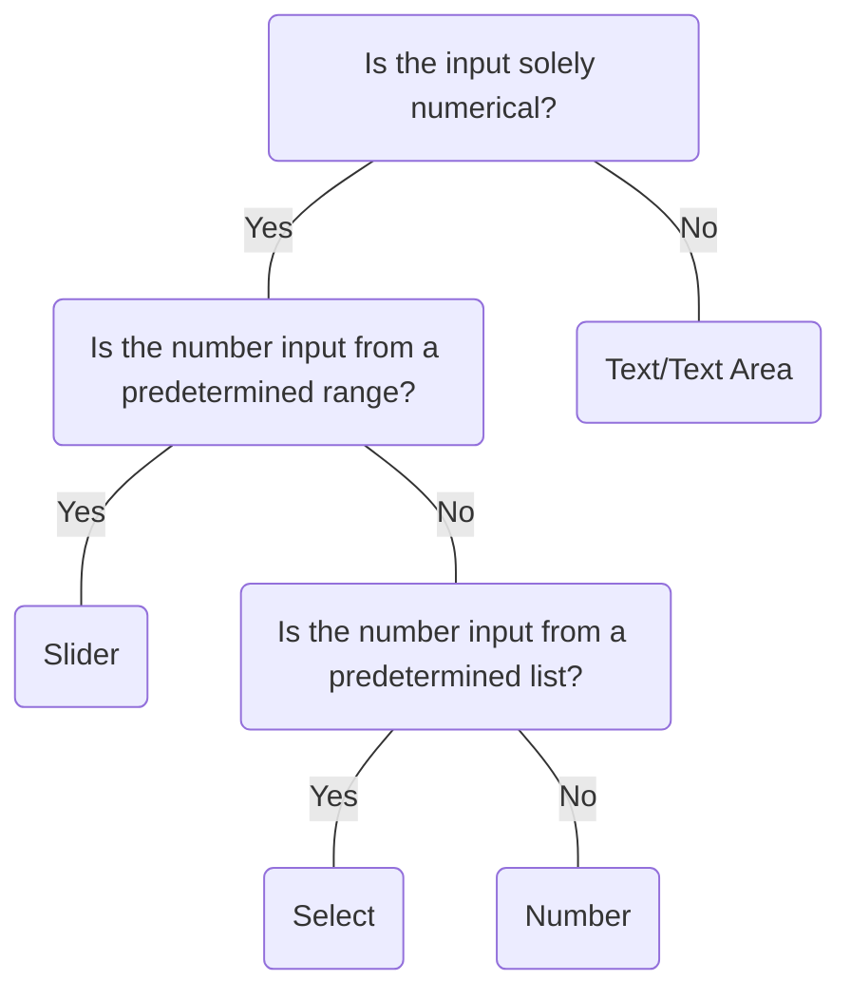

# Number

## Overview


> Image: Illustration of a number component


<Message appearance="fill" type="info">
    <div>All data entry components should be wrapped in a <Link to="ControlGroup">Control Group</Link> to provide a label, error states, and help or error text, ensuring an accessible experience for all users.</div>
</Message>


## When to use this component
- The user only needs to input numeric values.
- Increasing or decreasing by small values only requires a few clicks.


## When to use another component
- Large value changes are expected.
- Exact values need to be specified within a wide range.
- Consider the `Slider` component for inputs that aren’t precise.
- Consider `Text` or `Text Area` for inputs that are a mix of numbers and text
- For a predetermined list of values the user can select from, use `Select`.



### Check out
- [Slider][1]
- [Text][2]
- [Text Area] [3]
- [Select][4]

## Behaviors
### Locale
Number inputs can automatically convert periods to commas for decimal places based on the user's regional settings.

## Usage
### Avoid placeholder text
Placeholder text presents a number of visual and cognitive issues; it is best to avoid using it. Placeholder does not replace a label. [Splunk Style Guide placeholder guidelines][5]

> Image: Image showing a comparison between two number input fields and ways to show placeholders. The correct version on the left shows a number input field with the placeholder text displayed underneath the input field, providing clear contextual information. The incorrect version shows a number input field with the placeholder text inside the input field, which could be mistaken for user input.


### Adjust width to support longest values
Adjust the width to accommodate the anticipated input length, ensuring it is sufficiently wide to support the longest expected values. Avoid extending Number across the entire width of large viewports to maintain usability and readability.

> Image: Image showing a comparison between two number input fields and widths based on content. The correct version of the left shows a number input field with a reasonable width that accommodates the longest expected values, ensuring a clean and efficient design. The incorrect version shows a number input field that is excessively long, wasting space and making the design look unbalanced.


## Content guidelines

### Use descriptive labels
The required labels on top of the number input field should be descriptive to ensure users do not type in additional text along with the number. They should still champion brevity and use sentence-case capitalization.

> Image: Image showing a comparison between two number input fields for price. The correct example includes the currency denotated in the label, while the incorrect example requires the user to enter the currency symbol inside the number input field.


[1]: ./Slider
[2]: ./Text
[3]: ./TextArea
[4]: ./Select
[5]: https://docs.splunk.com/Documentation/StyleGuide/drafts/StyleGuide/UIGuidelines#Placeholder_text

## Examples


### Controlled

Number requires a value prop and an onChange callback to update the value prop for most use cases. Set value to null.

```typescript
import React, { Component } from 'react';

import Number, { NumberChangeHandler } from '@splunk/react-ui/Number';


class Basic extends Component<object, { value?: number }> {
    constructor(props: object) {
        super(props);

        this.state = {
            value: undefined, // default empty
        };
    }

    handleChange: NumberChangeHandler = (e, { value }) => {
        this.setState({ value });
    };

    render() {
        return <Number value={this.state.value} onChange={this.handleChange} inline />;
    }
}

export default Basic;
```


### Uncontrolled

Alternately, Number can be uncontrolled and optionally provided a defaultValue. The onChange callback still fires. The value prop cannot be set or updated externally.

```typescript
import React from 'react';

import Number from '@splunk/react-ui/Number';


function Uncontrolled() {
    return <Number inline />;
}

export default Uncontrolled;
```


### Limits

Number accepts min, max, step, and roundTo props.

```typescript
import React, { Component } from 'react';

import Number, { NumberChangeHandler } from '@splunk/react-ui/Number';


class Limits extends Component<object, { value?: number }> {
    constructor(props: object) {
        super(props);

        this.state = {
            value: undefined, // default empty
        };
    }

    handleChange: NumberChangeHandler = (e, { value }) => {
        this.setState({ value });
    };

    render() {
        return (
            <Number
                value={this.state.value}
                max={10}
                min={-10}
                roundTo={1}
                step={0.1}
                onChange={this.handleChange}
                inline
            />
        );
    }
}

export default Limits;
```


### Locale

A locale can be included which may change the decimal separator to a comma.

```typescript
import React, { Component } from 'react';

import Number, { NumberChangeHandler } from '@splunk/react-ui/Number';


class Locale extends Component<object, { value?: number }> {
    constructor(props: object) {
        super(props);

        this.state = {
            value: 2.4,
        };
    }

    handleChange: NumberChangeHandler = (e, { value }) => {
        this.setState({ value });
    };

    render() {
        return (
            <Number
                locale="fr-FR"
                step={0.15}
                value={this.state.value}
                onChange={this.handleChange}
                inline
            />
        );
    }
}

export default Locale;
```


### Error

```typescript
import React from 'react';

import Number from '@splunk/react-ui/Number';


function NumberError() {
    return <Number error defaultValue={2020} inline />;
}
export default NumberError;
```


### Disabled

```typescript
import React from 'react';

import Number from '@splunk/react-ui/Number';


function Disabled() {
    return <Number disabled defaultValue={2020} inline />;
}

export default Disabled;
```


## API


### Number API

#### Props

| Name | Type | Required | Default | Description |
|------|------|------|------|------|
| append | boolean | no |  | Append removes the rounded borders and the border from the right side and moves the increment and decrement buttons to the left. |
| children | React.ReactNode | no |  |  |
| defaultValue | number | no |  | Set this property instead of value to make the value uncontrolled. |
| describedBy | string | no |  | The id of the description. When placed in a ControlGroup, this is automatically set to the ControlGroup's help component. |
| disabled | boolean | no |  | Determines if the input is editable. |
| elementRef | React.Ref<HTMLDivElement> | no |  | A React ref which is set to the DOM element when the component mounts, and null when it unmounts. |
| error | boolean | no |  | Highlight the field as having an error. |
| hideStepButtons | boolean | no |  | Hides the increment and decrement step buttons if true. |
| inline | boolean | no |  | When false, displays as inline-block with the default width. |
| inputId | string | no |  | An id for the input, which may be necessary for accessibility, such as for aria attributes. |
| inputRef | React.Ref<HTMLInputElement> | no |  | A React ref which is set to the text input element when the component mounts, and null when it unmounts. |
| labelledBy | string | no |  | The id of the label. When placed in a ControlGroup, this is automatically set to the ControlGroup's label. |
| locale | string | no | 'en-US' | The locale determines the decimal separator. Supported locale formats are: `xx`, `xx-XX`, and `xx_XX`. |
| max | number | no |  | The largest allowable value. |
| min | number | no |  | The smallest allowable value. |
| name | string | no |  | The name is returned with onChange events, which can be used to identify the control when multiple controls share an onChange callback. |
| onBlur | NumberBlurHandler | no |  | A callback for when the input loses focus. |
| onChange | NumberChangeHandler | no |  | This is equivalent to onInput which is called on keydown, paste, and so on. If value is set, this callback is required. This must set the value prop to retain the change. |
| onClick | React.MouseEventHandler<HTMLInputElement> | no |  | A callback for when the input is clicked. This will only trigger when the textbox itself is clicked and will not trigger for other parts of the component such as the step buttons. |
| onFocus | NumberFocusHandler | no |  | A callback for when the input takes focus. |
| onKeyDown | React.KeyboardEventHandler<HTMLInputElement> | no |  | A keydown callback can be used to prevent a certain input by utilizing the event argument. |
| onKeyUp | React.KeyboardEventHandler<HTMLDivElement> | no |  | A keyup callback. |
| onSelect | React.ReactEventHandler<HTMLInputElement> | no |  | A callback for when the user selects text. |
| prepend | boolean | no |  | Prepend removes rounded borders from the left side. This cannot be used in combination with append. |
| roundTo | number | no | 5 | The number of decimal places for rounding. Set to zero to limit input to integers. Negative numbers are supported. For instance, -2 will round to the nearest hundred. |
| step | number | no | 1 | The amount of increment and decrement applied by the buttons and arrow keys. |
| value | number | no |  | The contents of the input. Setting this value makes the property controlled. A callback is required. |

#### Types

| Name | Type | Description |
|------|------|------|
| NumberBlurHandler | (     event: React.FocusEvent<HTMLInputElement>,     data: {         name?: string;         value: string;     } ) => void |  |
| NumberChangeHandler | (     event:         \| React.ChangeEvent<HTMLInputElement>         \| React.KeyboardEvent<HTMLInputElement>         \| React.MouseEvent<HTMLAnchorElement \| HTMLButtonElement \| HTMLSpanElement>,     data: {         name?: string;         value?: number;         reason: 'input' \| 'stepButton';     } ) => void |  |
| NumberFocusHandler | (     event: React.FocusEvent<HTMLInputElement>,     data: {         name?: string;         value: string;     } ) => void |  |


