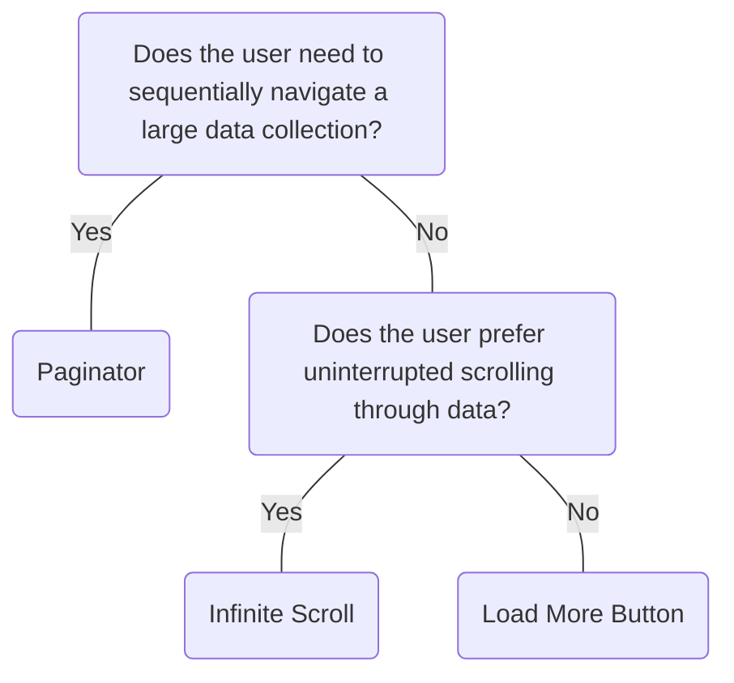

# Paginator

## Overview


> Image: Illustration of a Paginator component.


## When to use this component
- When you have a large amount of data or content that needs to be divided into smaller, more manageable chunks for users to view sequentially.
- When you want to maintain performance and reduce load times by displaying only a subset of data at a time.
- When users need to navigate a gallery of content, such as videos.

## When to use another component
- If you only have a small amount of data to display, such as single page content.




### Appearance

#### Grouping variants
Use a Paginator at the top and bottom of longer tables for improved keyboard navigation.

> Image: Illustration of a data table component utilizing both the compact and default paginator. The compact Paginator is at the top of the table, right aligned, and it includes the Page Control. The default Paginator is at the bottom of the table.


## Behaviors
The paginator automatically indicates when users are on the first or last page by disabling the previous or next buttons as needed.

> Image: Examples illustrating the disabled and enabled states as a visual indicator for navigation controls.


## Usage

### Default

> Image: Example of Default Paginator, showing the first page as active.


### Page Control
 The Page Control is utilized only with the Compact variant of the Paginator component.

> Image: Example of Page Control Paginator, with the label displaying the total page number. 


### Page Control without a label
Use Page Control without a label when there's a need to save space within a page.

> Image: Example of Page Control Paginator, without the label. 


### Compact

> Image: Example of Compact Paginator, with the label displaying the total page number. 


### Compact without a label

> Image: Example of Compact Paginator, without the label.


### Loading
 Use [Wait Spinner] [1] when a page change is initiated and will only take a few seconds.

> Image: Examples illustrating the Paginator with a table and a wait spinner. The first example, marked with a heart eyes emoji, displays the paginator component with the data table and a wait spinner as the user navigates to a second page. The second example, identified by a grimacing face emoji, presents the paginator component with an empty table and no spinner as the user navigates to the second page.


### Paginator with table

The Paginator can be paired with other components, such as the [Table][2], enabling users to navigate data sets in a specific order.

> Image: An abstract illustration of a data table with a Paginator component.


### Navigating galleries

The Paginator can be also utilized to navigate [Card] [3] galleries and other sequential content.

> Image: An abstract illustration with three cards in preview and a paginator.


[1]: ./WaitSpinner
[2]: ./Table
[3]: ./Card


## Examples


### Basic

```typescript
import React, { useState } from 'react';

import Paginator, { PaginatorChangeHandler } from '@splunk/react-ui/Paginator';


function Basic() {
    const [pageNum, setPageNum] = useState(3);

    const handleChange: PaginatorChangeHandler = (event, { page }) => {
        setPageNum(page);
    };

    return (
        <Paginator
            onChange={handleChange}
            current={pageNum}
            alwaysShowLastPageLink
            totalPages={30}
        />
    );
}

export default Basic;
```


### Labelled

When possible, a Paginator should use aria-labelledby or aria-label to provide an accessible label describing the content that is being paginated.

```typescript
import React, { useState } from 'react';

import Heading from '@splunk/react-ui/Heading';
import Paginator, { PaginatorChangeHandler } from '@splunk/react-ui/Paginator';
import { createDOMID } from '@splunk/ui-utils/id';


function Labelled() {
    const [pageNum, setPageNum] = useState(3);

    const handleChange: PaginatorChangeHandler = (event, { page }) => {
        setPageNum(page);
    };

    const labelId = createDOMID('labelled');

    return (
        <>
            <Heading level={4} id={labelId} style={{ margin: 0 }}>
                Paginated content example
            </Heading>
            <Paginator
                aria-labelledby={labelId}
                onChange={handleChange}
                current={pageNum}
                alwaysShowLastPageLink
                totalPages={30}
            />
        </>
    );
}

export default Labelled;
```


### Page control

A Paginator control that allows any page to be selected.

```typescript
import React, { useState } from 'react';

import Paginator, { PaginatorPageControlChangeHandler } from '@splunk/react-ui/Paginator';


function PageControl() {
    const [pageNum, setPageNum] = useState(3);

    const handleChange: PaginatorPageControlChangeHandler = (event, { page }) => {
        setPageNum(page);
    };

    return <Paginator.PageControl onChange={handleChange} current={pageNum} totalPages={30} />;
}

export default PageControl;
```


### Custom pages

Customize Paginator's pages and Prev/Next buttons with generatePageProps.

```typescript
import React, { useState } from 'react';

import Paginator, {
    PaginatorGeneratePageProps,
    PaginatorChangeHandler,
} from '@splunk/react-ui/Paginator';


function CustomPages() {
    const [currentPage, setCurrentPage] = useState<number>(3);

    const handleChange: PaginatorChangeHandler = (e, { page }) => {
        e.preventDefault();
        setCurrentPage(page);
    };

    const generatePageProps: PaginatorGeneratePageProps = ({ page }) => {
        return {
            to: `#page-${page}`,
        };
    };

    return (
        <Paginator
            alwaysShowLastPageLink
            generatePageProps={generatePageProps}
            current={currentPage}
            onChange={handleChange}
            totalPages={30}
        />
    );
}

export default CustomPages;
```


### Compact

A Paginator control with buttons only.

```typescript
import React, { useState } from 'react';

import Paginator, { PaginatorCompactChangeHandler } from '@splunk/react-ui/Paginator';


function Compact() {
    const [pageNum, setPageNum] = useState<number | undefined>(3);

    const handleChange: PaginatorCompactChangeHandler = (event, { page }) => {
        setPageNum(page);
    };

    return <Paginator.Compact current={pageNum} onChange={handleChange} totalPages={30} />;
}

export default Compact;
```


### Compact with label

```typescript
import React, { useState } from 'react';

import Paginator, { PaginatorCompactChangeHandler } from '@splunk/react-ui/Paginator';


function CompactWithLabel() {
    const [pageNum, setPageNum] = useState<number | undefined>(3);

    const handleChange: PaginatorCompactChangeHandler = (event, { page }) => {
        setPageNum(page);
    };

    return (
        <Paginator.Compact current={pageNum} onChange={handleChange} renderLabel totalPages={30} />
    );
}

export default CompactWithLabel;
```


### Compact with custom label

```typescript
import React, { useState } from 'react';

import Paginator, { PaginatorCompactChangeHandler } from '@splunk/react-ui/Paginator';


function CompactCustomLabel() {
    const [pageNum, setPageNum] = useState<number | undefined>(1);
    const itemsPerPage = 50;
    const totalItems = 300;

    const handleChange: PaginatorCompactChangeHandler = (event, { page }) => {
        setPageNum(page);
    };

    return (
        <Paginator.Compact
            current={pageNum}
            onChange={handleChange}
            renderLabel={({ current }) => {
                if (current) {
                    const pageEnd = current * itemsPerPage;
                    const pageStart = pageEnd - itemsPerPage + 1;
                    return `${pageStart}-${pageEnd} of ${totalItems}`;
                }
                return `0-${itemsPerPage} of ${totalItems}`;
            }}
            totalPages={totalItems / itemsPerPage}
        />
    );
}

export default CompactCustomLabel;
```


## API


### Paginator API

#### Props

| Name | Type | Required | Default | Description |
|------|------|------|------|------|
| alwaysShowLastPageLink | boolean | no | false | Displays a link to the last page in a collection. |
| current | number | no | 1 | Currently selected page. |
| elementRef | React.Ref<HTMLElement> | no |  | A React ref which is set to the DOM element when the component mounts and null when it unmounts. |
| generatePageProps | PaginatorGeneratePageProps | no |  | Passes props to Paginator's pages and Prev/Next buttons. Supports [Clickable](./Clickable) props (except for `onClick`) and global HTML attributes. `generatePageProps` will not differentiate between Prev/Next buttons and its corresponding page. For example, if page 5 is passed prop P and current is 6, the Prev button will also be passed prop P. |
| numPageLinks | number | no | 5 | Number of pages to display. If greater than `totalPages`, `totalPages` is used instead. |
| onChange | PaginatorChangeHandler | no |  | Callback to handle page change. |
| totalPages | number | yes |  | The total number of pages. |

#### Types

| Name | Type | Description |
|------|------|------|
| PaginatorChangeHandler | (     event: React.MouseEvent<HTMLButtonElement>,     data: { page: number } ) => void |  |
| PaginatorGeneratePageProps | ({     page, }: {     page: number; }) => Partial<React.ComponentProps<typeof Clickable>> &     React.ComponentProps<'a'> &     React.ComponentProps<'button'> |  |


### Page Control API

#### Props

| Name | Type | Required | Default | Description |
|------|------|------|------|------|
| current | number | no | 1 | Currently selected page. |
| elementRef | React.Ref<HTMLElement> | no |  | A React ref which is set to the DOM element when the component mounts and null when it unmounts. |
| onChange | PaginatorPageControlChangeHandler | no |  | Callback to handle page change. |
| totalPages | number | yes |  | The total number of pages. |

#### Types

| Name | Type | Description |
|------|------|------|
| PaginatorPageControlChangeHandler | (     event: React.MouseEvent<HTMLButtonElement> \| React.KeyboardEvent<HTMLInputElement>,     data: { page: number } ) => void |  |


### Compact API

#### Props

| Name | Type | Required | Default | Description |
|------|------|------|------|------|
| current | number | no |  | The current page number. If not provided, the component will not keep track of the page number and will not provide it in the callback. |
| elementRef | React.Ref<HTMLElement> | no |  | A React ref which is set to the DOM element when the component mounts and null when it unmounts. |
| onChange | PaginatorCompactChangeHandler | no |  | Callback to handle page change. |
| renderLabel | boolean \| PaginatorCompactRenderLabelCallback | no |  | If true, renders the a label for the current and total pages. Can be passed a function to render a custom label that receives an object with current and totalPages as an argument. |
| totalPages | number | no |  | The total number of pages. If not provided, the component will operate in indeterminate mode and will not prevent the current page number from exceeding any values. |

#### Types

| Name | Type | Description |
|------|------|------|
| PaginatorCompactChangeHandler | (     event: React.MouseEvent<HTMLButtonElement> \| React.KeyboardEvent<HTMLInputElement>,     data: { direction: 'prev' \| 'next'; page?: number } ) => void |  |
| PaginatorCompactRenderLabelCallback | (data: {     current?: number;     totalPages?: number; }) => React.ReactNode |  |


