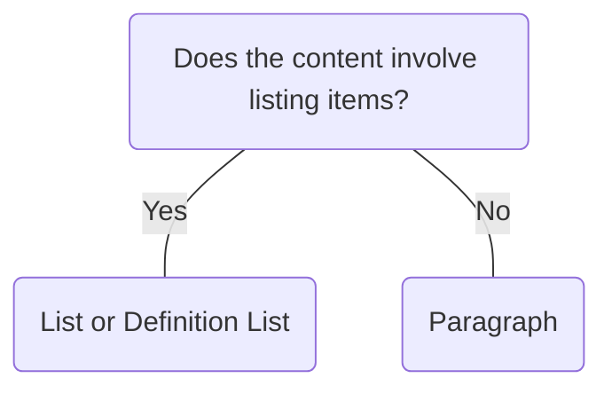

# Paragraph

## Overview


> Image: Illustration of Paragraph component.


## When to use this component
- To provide a structured layout for textual sentence-style information.

## When to use another component
- If the content involves listing or numbering items, using `List` improves readability and organization.
- If the content involves related data elements, using `Definition List` provides a structured visual representation for key-value pairs.



### Check out
- [List][1]
- [Definition List][2]

## Usage

### Break paragraphs into small chunks
Shorter paragraphs improves readability and reduces eye fatigue.

> Image: Examples of Paragraph components. In the first example with heart eyes emoji, the text is formatted into two smaller paragraphs. In the second example with grimacing emoji the text is formatted in one longer paragraph.


### Avoid standalone paragraphs
Paragraphs should be accompanied by a header that summarizes the content, guides the user’s attention and allows screen readers to navigate to the content.

> Image: Examples of Paragraph components. In the first example with heart eyes emoji, the paragraph is accompanied by a header, while the second example with grimacing emoji is a stand alone paragraph.


## Content guidelines
Follow writing best practices outlined in the [UI text style guidelines][3]

[1]: ./List
[2]: ./DefinitionList
[3]: https://docs.splunk.com/Documentation/StyleGuide/current/StyleGuide/UIGuidelines


## Examples


### Basic

Paragraph provides default fonts, line heights, and spacing. Margins can be removed when necessary.

```typescript
import React from 'react';

import Link from '@splunk/react-ui/Link';
import P from '@splunk/react-ui/Paragraph';


function Basic() {
    return (
        <>
            <P>
                Use Splunk products to take advantage of one platform for all your security and
                observability data needs. In an ever-changing world, Splunk delivers insights to
                unlock innovation, enhance security and drive resilience.
            </P>
            <P>
                <Link to="https://www.splunk.com/en_us/products/platform.html" openInNewContext>
                    The Splunk Platform
                </Link>{' '}
                allows you turn data into doing to unlock innovation, enhance security and drive
                resilience.{' '}
                <Link
                    to="https://www.splunk.com/en_us/products/cyber-security.html"
                    openInNewContext
                >
                    Splunk Security
                </Link>{' '}
                protects your business and modernize your security operations with a best-in-class
                data platform, advanced analytics and automated investigations and response.{' '}
                <Link
                    to="https://www.splunk.com/en_us/products/observability.html"
                    openInNewContext
                >
                    Splunk Observability
                </Link>{' '}
                solves problems in seconds with the only full-stack, analytics-powered and
                OpenTelemetry-native observability solution.
            </P>
        </>
    );
}

export default Basic;
```


## API


### Paragraph API

#### Props

| Name | Type | Required | Default | Description |
|------|------|------|------|------|
| children | React.ReactNode | no |  | Generally text, but might also include `Link`s. |
| elementRef | React.Ref<HTMLParagraphElement> | no |  | A React ref which is set to the DOM element when the component mounts and null when it unmounts. |


## Accessibility

## Visual Design
- Color contrast ratio **MUST** be [SC 1.4.3][1]
    - &gt= 4.5:1 for normal text: 14 pt (typically 18.66px) and bold or larger
    - &gt= 3:1 for large text: 18 pt (typically 24px) or larger
    - For high contrast mode, ratios **MUST** be &gt=7:1 for normal text and &gt=4.5:1 for large text [SC 1.4.6][2]

## States
- Color contrast guidelines do NOT apply to disabled text

## Interaction Model
- **MUST NOT** lose content or functionality when the user adapts [SC 1.4.12][3]
    - Line height (line spacing) to at least 1.5 times the font size;
    - Spacing following paragraphs to at least 2 times the font size;
    - Letter spacing (tracking) to at least 0.12 times the font size;
    - Word spacing to at least 0.16 times the font size
- Line spacing (leading) **MUST** be at least space-and-a-half within paragraphs, and paragraph spacing is at least 1.5 times larger than the line spacing [SC 1.4.8][4]

## Implementation
- **SHOULD** use correct [phrasing elements][5] to describe the semantics of the content

[1]: https://www.w3.org/WAI/GL/UNDERSTANDING-WCAG20/visual-audio-contrast-contrast.html
[2]: https://www.w3.org/TR/WCAG21/#contrast-enhanced
[3]: https://www.w3.org/TR/WCAG21/#text-spacing
[4]: https://www.w3.org/TR/WCAG21/#visual-presentation
[5]: https://developer.mozilla.org/en-US/docs/Web/Guide/HTML/Content_categories#phrasing_content


