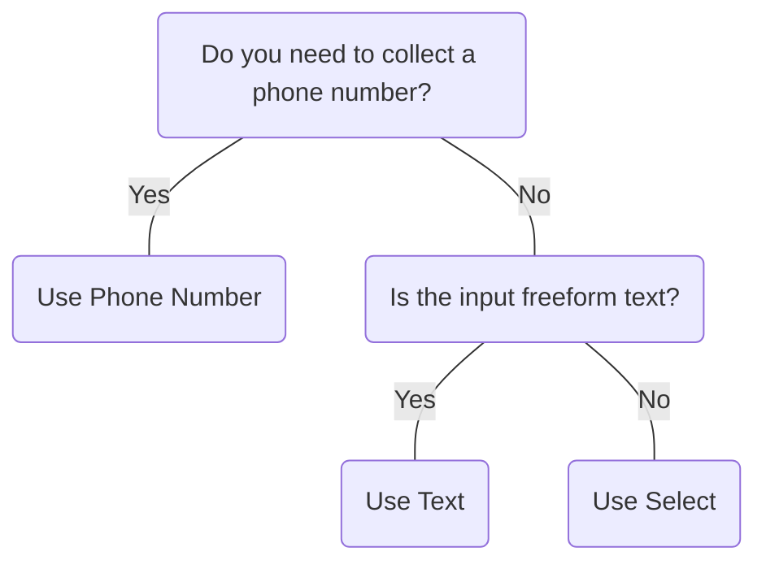

# Phone Number

## Overview


> Image: Illustration of a Phone Number component.


<Message appearance="fill" type="info">
    <div>All data entry components should be wrapped in a [Control Group](ControlGroup) to provide a label, error states, and help or error text, ensuring an accessible experience for all users.</div>
</Message>

## When to use this component
- When collecting phone numbers from users
- When forms or pages require a validated phone number input

## When to use another component
- If the input doesn't require formatting, a country code, or is not specifically for phone numbers, consider using Text



### Check out
- [Select][1]
- [Text][2]

## Behaviors

### Validation
Validates phone number format and length based on the selected country.
Use  <Link to="ControlGroup">Control Group</Link> to display validation results.
> Image: Example of phone number validation.


### Locale
Defaults the country code and formatting based on the user’s locale.
> Image: Example of locale-based default.


### Searchable dropdown
Allows users to filter the country code list by typing either a country name or a dial code.
> Image: Examples of filtering country codes in the dropdown.


## Usage

### Use clear and visible labels
Use a visible label like “Phone Number” to clearly describe the input. Avoid using placeholder phone numbers as a substitute for labeling to maintain accessibility.
> Image: Examples of Phone Number labeling. The first example with heart eyes shows a clearly labeled input. The second example with a grimacing face shows a placeholder used instead of a label, reducing accessibility.


### Match input width to phone number length
Match the width of the input to the expected phone number length. Avoid stretching the component across the full page or making it too short to view the full value at a glance.
> Image: Examples of Phone Number input width. The first example with heart eyes shows a field sized to match a typical phone number. The second example with a grimacing face shows an overly wide field that reduces readability.


[1]: ./Select
[2]: ./Text


## Examples


### Controlled

Phone Number requires a `value` prop and an `onChange` callback to update the value prop for most use cases.

```typescript
import React, { useState } from 'react';

import PhoneNumber, { PhoneNumberChangeHandler } from '@splunk/react-ui/PhoneNumber';


const Controlled = () => {
    const [value, setValue] = useState('2345678910');

    const handleChange: PhoneNumberChangeHandler = (e, { value: newValue }) => {
        setValue(newValue);
    };

    return <PhoneNumber value={value} onChange={handleChange} />;
};

export default Controlled;
```


### Uncontrolled

Alternatively, Phone Number can be uncontrolled and optionally provided a `defaultValue`. The `onChange` callback still fires. The `value` prop cannot be set or updated externally.

```typescript
import React from 'react';

import PhoneNumber from '@splunk/react-ui/PhoneNumber';


function Uncontrolled() {
    return <PhoneNumber defaultValue="2345678910" />;
}

export default Uncontrolled;
```


### Default Country

Phone Number can have a different default country set.

```typescript
import React, { useState } from 'react';

import PhoneNumber, { PhoneNumberChangeHandler } from '@splunk/react-ui/PhoneNumber';


const DefaultCountry = () => {
    const [value, setValue] = useState('2345678910');

    const handleChange: PhoneNumberChangeHandler = (e, { value: newValue }) => {
        setValue(newValue);
    };

    return <PhoneNumber defaultCountry="CA" value={value} onChange={handleChange} />;
};

export default DefaultCountry;
```


### Inline

The `inline` prop will render the component inline at a consistent width with other inputs.

```typescript
import React, { useState } from 'react';

import PhoneNumber, { PhoneNumberChangeHandler } from '@splunk/react-ui/PhoneNumber';


const Inline = () => {
    const [value, setValue] = useState('2345678910');

    const handleChange: PhoneNumberChangeHandler = (e, { value: newValue }) => {
        setValue(newValue);
    };

    return <PhoneNumber inline value={value} onChange={handleChange} />;
};

export default Inline;
```


### Error

```typescript
import React, { useState } from 'react';

import PhoneNumber, { PhoneNumberChangeHandler } from '@splunk/react-ui/PhoneNumber';


const Error = () => {
    const [value, setValue] = useState('2345678910');

    const handleChange: PhoneNumberChangeHandler = (e, { value: newValue }) => {
        setValue(newValue);
    };

    return <PhoneNumber error value={value} onChange={handleChange} />;
};

export default Error;
```


### Disabled

```typescript
import React, { useState } from 'react';

import PhoneNumber, { PhoneNumberChangeHandler } from '@splunk/react-ui/PhoneNumber';


const Disabled = () => {
    const [value, setValue] = useState('2345678910');

    const handleChange: PhoneNumberChangeHandler = (e, { value: newValue }) => {
        setValue(newValue);
    };

    return <PhoneNumber disabled value={value} onChange={handleChange} />;
};

export default Disabled;
```


## API


### PhoneNumber API

#### Props

| Name | Type | Required | Default | Description |
|------|------|------|------|------|
| append | boolean | no |  | Append removes rounded corners and the border from the right side. |
| canClear | boolean | no | true | Include an "X" button to clear the value. |
| defaultCountry | string | no |  | The iso2 country code to use for the phone number input. |
| defaultValue | string | no |  | Set this property instead of value to make the value uncontrolled. |
| describedBy | string | no |  | The id of the description. When placed in a ControlGroup, this is automatically set to the ControlGroup's help component. |
| disabled | boolean | no |  | Determines whether or not the input is disabled. |
| elementRef | React.Ref<HTMLDivElement> | no |  | A React ref which is set to the DOM element when the component mounts, and null when it unmounts. |
| error | boolean | no |  | Highlight the field as having an error. |
| inline | boolean | no |  | When true, displays inline with a default width. |
| inputId | string | no |  | An id for the text input. |
| inputRef | React.Ref<HTMLInputElement> | no |  | A React ref which is set to the text input element when the component mounts, and null when it unmounts. |
| labelledBy | string | no |  | The id of the label. When placed in a ControlGroup, this is automatically set to the ControlGroup's label. |
| name | string | no |  |  |
| onBlur | PhoneNumberBlurHandler | no |  | A callback for when the input loses focus. |
| onChange | PhoneNumberChangeHandler | no |  | Called whenever the value changes. If the value prop is set, this callback is required. |
| onClick | React.MouseEventHandler<HTMLInputElement> | no |  | A callback for when the input is clicked. |
| onFocus | PhoneNumberFocusHandler | no |  | A callback for when the input takes focus. |
| onSelect | React.ReactEventHandler<HTMLInputElement> | no |  | A callback for when the user selects text. |
| prepend | boolean | no |  | Prepend removes rounded borders from the left side. |
| toggleRef | React.Ref<HTMLButtonElement> | no |  | A React ref which is set to the dropdown toggle when the component mounts and null when it unmounts. |
| value | string | no |  | The contents of the input. Setting this value makes the input controlled. A callback is required. |

#### Types

| Name | Type | Description |
|------|------|------|
| PhoneNumberBlurHandler | (     event: React.FocusEvent<HTMLInputElement>,     data: {         name?: string;         value: string;         displayValue: string;         country?: string;         isPossibleNumber: boolean;         isValidNumber: boolean;         internationalFormat: string;     } ) => void |  |
| PhoneNumberChangeHandler | (     event:         \| React.ChangeEvent<HTMLInputElement>         \| React.KeyboardEvent<HTMLInputElement>         \| React.MouseEvent<HTMLButtonElement \| HTMLSpanElement>,     data: {         name?: string;         value: string;         displayValue: string;         country?: string;         isPossibleNumber: boolean;         isValidNumber: boolean;         internationalFormat: string;     } ) => void |  |
| PhoneNumberFocusHandler | (     event: React.FocusEvent<HTMLInputElement>,     data: {         name?: string;         value: string;         displayValue: string;         country?: string;         isPossibleNumber: boolean;         isValidNumber: boolean;         internationalFormat: string;     } ) => void |  |


