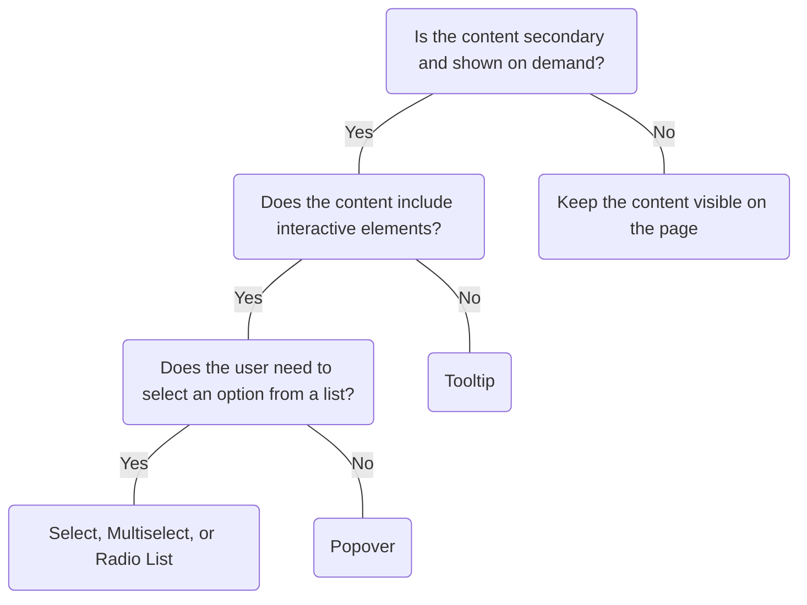

# Popover

## Overview


> Image: Illustration of a popover component.


## When to use this component
- Use a Popover for brief, persistent hints tied to an element.
- To provide non-essential supporting information for specific elements on a page.
- To provide additional interactions with the supporting information.

## When to use another component
- When you have multiple steps that the user needs to go through, implement a [Modal][2].
- If the content is critical and should always be visible, keep the content visible on a page.
- If the content is critical or must remain visible use [Message][4] or [Message Bar][5].



### Check out
- [Tooltip][1]
- [Modal] [2]
- [Dropdown][3]
- [Message][4]
- [Message Bar][5]

## Behaviors

### Interactive
Popovers include interactive content, and must be activated on click rather than hover.

 > Image: Illustration of two Popovers. The first example with heart eyes emoji shows a Popover with multiple interactive elements that is activated on click. The second example with grimacing emoji shows a Popover with multiple interactive elements that is activated on hover.


## Usage

### Limit content
Use Popover for brief, task-related content like definitions or quick actions. Avoid long text, complex interactions, or stacking Popovers.

> Image: Illustration of two Popovers. The first example with heart eyes emoji shows a Popover announcing a new feature, and a single call-to-action labeled as ‘Continue’. The second example with grimacing emoji shows two stacked Popovers with multiple interactive elements.


### Supplemental
Supports content that is nonessential to the primary task.
> Image: Illustration of two Popovers. The first example with heart eyes emoji shows a Popover in a focus state with the header ‘New Feature Available’. The second example with grimacing emoji shows a Popover opening on hover with buttons and multiple steps.


[1]: ./Tooltip
[2]: ./Modal
[3]: ./Dropdown
[4]: ./Message
[5]: ./MessageBar


## Examples


### Basic

Click the button to view the Popover.

```typescript
import React, { useState, useCallback } from 'react';

import Button from '@splunk/react-ui/Button';
import Popover from '@splunk/react-ui/Popover';


function Example() {
    const [open, setOpen] = useState(false);
    const [anchor, setAnchor] = useState<HTMLButtonElement>();

    const anchorRef = useCallback((el: HTMLButtonElement) => setAnchor(el), []);
    const handleOpen = useCallback(() => setOpen(true), []);
    const handleRequestClose = useCallback(() => setOpen(false), []);

    return (
        <>
            <Button onClick={handleOpen} elementRef={anchorRef} label="Click me" />
            <Popover open={open} anchor={anchor} onRequestClose={handleRequestClose}>
                <div style={{ padding: '20px', width: '300px' }}>
                    This is the content of the popover. You can place any information here.
                </div>
            </Popover>
        </>
    );
}

export default Example;
```


## API


### Popover API

`Popover` is used to create layovers such as dropdowns, contextual menus, or tooltips. Use
this only when the other components don't provide sufficient functionality or control. A controlled
`Dropdown` covers use cases where you might consider using `Popover` directly.

#### Props

| Name | Type | Required | Default | Description |
|------|------|------|------|------|
| anchor | HTMLElement \| null | no |  | The element used to set the position of the `Popover`. It is required when the `Popover` is open and must be mounted. |
| animation | boolean | no | true | If `true`, the popover applies transitions when it is added to the DOM. |
| appearance | 'normal' \| 'inverted' \| 'none' | no | 'normal' | **DEPRECATED**: Value 'inverted' `'normal'` is the default appearance.`'none'` is a transparent box.  The 'inverted' value is deprecated and will be removed in a future major version. |
| autoCloseWhenOffScreen | boolean | no | true | If `true`, the `Popover` hides when the anchor is scrolled off the screen. |
| canCoverAnchor | boolean | no |  | If there isn't enough room to render the `Popover` in a direction, this option enables it to be rendered over the anchor. |
| children | React.ReactNode \| PopoverChildrenRenderer | no |  | The content of the `Popover`. If a function is provided, it is invoked with an object containing `anchorHeight`, `anchorWidth`, `maxHeight`, `maxWidth`, and `placement`, and is expected to return renderable content. |
| closeReasons | PopoverPossibleCloseReason[] | no | [     'clickAway',     'escapeKey',     'offScreen',     'tabKey', ] | An array of reasons for which this `Popover` should close. |
| defaultPlacement | PopoverPlacement | no | 'below' | The default placement of the `Popover`. It might be rendered in a different direction depending upon the space available and the `repositionMode`. |
| elementRef | React.Ref<HTMLDivElement> | no |  | A React ref which is set to the DOM element when the component mounts and null when it unmounts. |
| hideArrow | boolean | no |  | Whether or not to hide the arrow pointing to the anchor.  The arrow is always hidden when `appearance="none"`. |
| onRequestClose | PopoverRequestCloseHandler | no |  | Callback function fired when the popover is requested to be closed. |
| open | boolean | no |  | If `true`, the `Popover` is visible. |
| pointTo | { x?: number; y?: number } | no |  | Allows the `Popover` to point to and align with a different part of the anchor. The x and y values are relative to the upper left corner of the anchor.  This property overides `align`.  When positioned above or below, only `x` is used. When positioned left or right, `y` is used. |
| repositionMode | 'none' \| 'flip' \| 'any' | no | 'flip' | If the `Popover` doesn't fit in the `defaultPlacement`, `repositionMode` determines if and how the `Popover` repositions itself to fit on the page. `none` doesn't reposition the `Popover`. It always renders in the `defaultPlacement` direction. `flip` allows the `Popover` to reposition to the opposite of the `defaultPlacement` if it can fit there and not in the `defaultPlacement`. `any` allows the `Popover` to reposition in any direction if it can fit on the page. |
| retainFocus | boolean | no | true | Keeps focus within the `Popover` while open. |
| splunkTheme |  | no |  |  |
| takeFocus | boolean | no |  | When `true`, the `Popover` automatically takes focus when 'open' changes to `true`. Disable this for a `Popover` that has shows on hover, such as a tooltip. |

#### Types

| Name | Type | Description |
|------|------|------|
| PopoverChildrenRenderer | (data: {     anchorHeight: number \| null;     anchorWidth: number \| null;     maxHeight: number \| null;     maxWidth: number \| null;     placement: PopoverPlacementStatus \| null;     toggleId?: string; }) => React.ReactNode |  |
| PopoverPlacement | 'above' \| 'below' \| 'left' \| 'right' \| 'vertical' \| 'horizontal' |  |
| PopoverPlacementStatus | 'above' \| 'below' \| 'left' \| 'right' \| 'misaligned' |  |
| PopoverPossibleCloseReason | 'clickAway' \| 'escapeKey' \| 'offScreen' \| 'tabKey' |  |
| PopoverRequestCloseHandler | (data: {     event?: MouseEvent \| KeyboardEvent \| TouchEvent;     reason: PopoverPossibleCloseReason; }) => void |  |


### PopoverProvider API

Provides a method for controlling certain `Popover` props in components that use `Popover`.

#### Props

| Name | Type | Required | Default | Description |
|------|------|------|------|------|
| children | React.ReactNode | no |  |  |
| hideArrow | boolean | no |  | Whether or not to hide the arrow pointing to the `Popover` anchor.  `Popover`'s `hideArrow` prop takes priority over this. |


