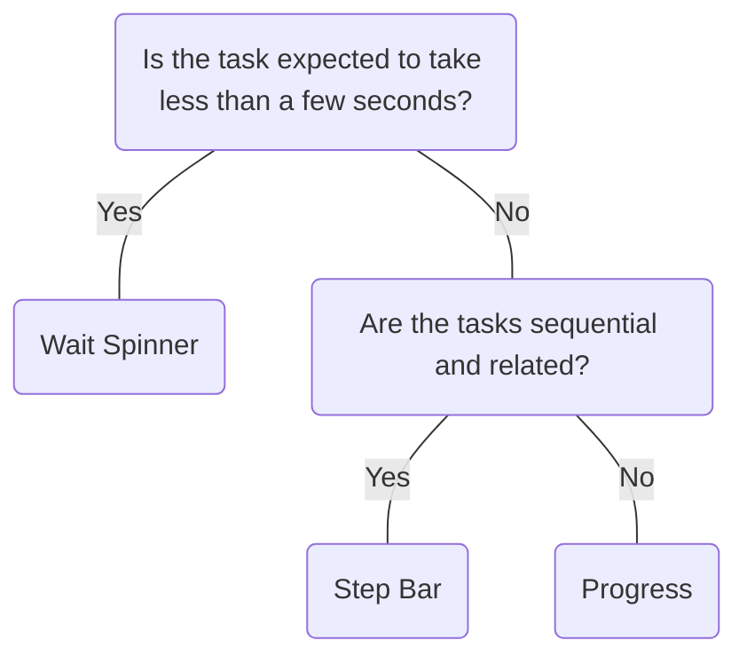

# Progress

## Overview


> Image: Illustration of a Progress component.


## When to use this component
- When users need feedback on the status of an ongoing task.
- To show the length of a process and track its progression toward completion.
- When the process is complex and has a long wait time.
- When the percentage of the completed process can be determined.
- To convey that data is being requested, transferred, or processed.

## When to use another component
- For short wait times, use a Wait Spinner.
- For related tasks that need to be completed in a linear sequence, use a Step Bar.



### Check out
- [Wait Spinner][1]
- [Step Bar][2]

## Usage

### Grouping
Display overall progress of a group rather than the progress of each item in the group.

> Image: Example showing grouping of content while using the progress component. The first example with the heart eyes emoji displays the progress component at the top of the page, loading for all the contents on the page, whereas the second example with the grimacing emoji displays the progress component loading for all content sections individually.


### Labels
Labels should always be placed below the progress bar contained in a tooltip for accessibility. Avoid placing text inside the progress bar, this could cause clutter and poor text readability.

> Image: Example showing how labels should appear while using the progress component. The first example with the heart eyes emoji displays the context label (percentage complete) inside a tool tip under the progress component, whereas the second example with the grimacing emoji displays the context label inside the progress component.


### Screen real estate
Avoid using the progress component in small spaces such as within a button.

> Image: Example showing appropriate screen realestate for the progress component. The first example with the heart eyes emoji displays the progress component at the top of the screen, taking up a good amount of screen real estate, whereas the second example with the grimacing emoji displays the progress component cramped inside a button component.


### Quantifiable processes
Use a progress bar for processes that can be quantified, such as displaying a percentage (e.g., file upload). Avoid using it for stepped progress determined by user actions.

> Image: Example showing what processes the label component should be used for. The first example with the heart eyes emoji displays the progress component used to showcase upload time within a table, whereas the second example with the grimacing emoji displays the progress component used to determine a user


[1]: ./WaitSpinner
[2]: ./StepBar

## Examples


### Basic

```typescript
import React, { useState, useEffect } from 'react';

import Progress from '@splunk/react-ui/Progress';


function Example() {
    const [percentage, setPercentage] = useState(0);

    useEffect(() => {
        const timer = window.setInterval(() => {
            setPercentage((currentPercentage) => {
                if (currentPercentage >= 100) {
                    return 0;
                }
                return currentPercentage + 5;
            });
        }, 1000);
        return () => {
            window.clearInterval(timer);
        };
    }, []);

    return <Progress percentage={percentage} tooltip={`${percentage}% uploaded`} />;
}

export default Example;
```


### Type

```typescript
import React from 'react';

import Progress from '@splunk/react-ui/Progress';


function Type() {
    return (
        <>
            <Progress type="info" percentage={30} />
            <br />
            <Progress type="success" percentage={60} />
            <br />
            <Progress type="error" percentage={100} />
        </>
    );
}

export default Type;
```


## API


### Progress API

#### Props

| Name | Type | Required | Default | Description |
|------|------|------|------|------|
| elementRef | React.Ref<HTMLDivElement> | no |  | A React ref which is set to the DOM element when the component mounts and null when it unmounts. |
| percentage | number | no |  | The percentage complete. If unset, no progress bar is shown. Percentage must be a number from 0-100. |
| tooltip | React.ReactNode | no |  | Tooltip defaults to the percentage complete. |
| type | 'info' \| 'success' \| 'error' | no | 'info' | Sets the appearance of the `Progress` component.  Note: `success` and `error` types are not animated. |


