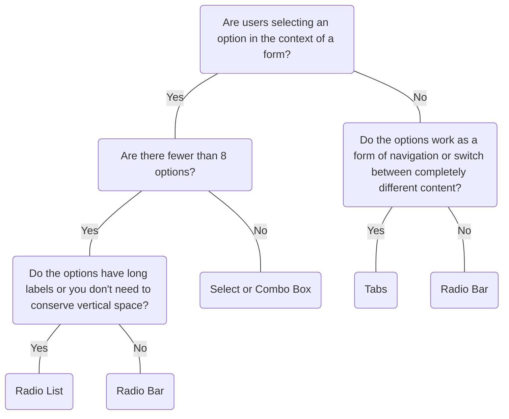

# Radio Bar

## Overview


> Image: Illustration of a Radio Bar component.


## When to use this component
- For quick selection within a form. Use only if there are less than 8 options that are simple and straightforward.
- As a filter for related content (e.g. filter messages by “All”, “Read”, and “Unread”).
- Useful to switch between alternate views of the same set of data in the same context. (e.g. list view, grid view, or map view).
- If additional visual affordances and adornments, such as icons, can provide separation between options.

## When to use another component
- If vertical space is not a concern or the options labels are long, use Radio List.
- For binary selections like “on/off”, “yes/no”, “true/false”, consider using a Switch - Toggle.
- Use Tab Bar to change the entire display of different sets of data, as a form of navigation.



### Check out
- [Radio List][1]
- [Switch][2]
- [Tab Bar][3]
- [Select][4]
- [Combo Box][5]

## Usage

### Inutitive icons
Use icon-only variants when the icons are intuitive and easy to understand.

> Image: Examples of a icon-only Radio Bar with two options. In the first example with heart eyes emojis, the icons are intutive 


### Radio Bar as a menu bar
Radio Bar can be used outside the context of a form and behave like a menu `role="menubar"`. When used in this context, ensure the options are straightforward and mutually exclusive.

> Image: Examples of a Radio Bar with two options. In the first example with heart eyes emojis, the options are 


## Content

### Be concise
Keep option labels short and concise to prevent text wrapping. Use sentence-case capitalization and avoid punctuation and articles (“the”, “an”, “a”).

> Image: Examples of a Radio Bar with two options. In the first example with heart eyes emojis, the options are 


[1]: ./RadioList
[2]: ./Switch
[3]: ./TabBar
[4]: ./Select
[5]: ./ComboBox

## Examples


### Controlled

```typescript
import React, { useState } from 'react';

import RadioBar, { RadioBarChangeHandler } from '@splunk/react-ui/RadioBar';


function Basic() {
    const [value, setValue] = useState(3);

    const handleChange: RadioBarChangeHandler = (e, { value: radioValue }) => {
        setValue(radioValue);
    };

    return (
        <RadioBar onChange={handleChange} value={value} style={{ width: 500 }}>
            <RadioBar.Option value={1} label="one" />
            <RadioBar.Option value={2} label="two" />
            <RadioBar.Option value={3} label="threethreethree" />
            <RadioBar.Option value={4} label="four" />
        </RadioBar>
    );
}

export default Basic;
```


### Uncontrolled

```typescript
import React from 'react';

import RadioBar from '@splunk/react-ui/RadioBar';


function Uncontrolled() {
    return (
        <RadioBar defaultValue={2} style={{ width: 500 }}>
            <RadioBar.Option value={1} label="one" />
            <RadioBar.Option value={2} label="two" />
            <RadioBar.Option value={3} label="threethreethree" />
            <RadioBar.Option value={4} label="four" />
        </RadioBar>
    );
}

export default Uncontrolled;
```


### Error

```typescript
import React from 'react';

import RadioBar from '@splunk/react-ui/RadioBar';


function RadioBarError() {
    return (
        <RadioBar defaultValue={2} style={{ width: 500 }} error>
            <RadioBar.Option value={1} label="one" />
            <RadioBar.Option value={2} label="two" />
            <RadioBar.Option value={3} label="threethreethree" />
            <RadioBar.Option value={4} label="four" />
        </RadioBar>
    );
}

export default RadioBarError;
```


### Disabled

Either the entire RadioBar or individual Options can be disabled using the disabled prop. When set on the RadioBar, this overrides any individual Option disabled states.

```typescript
import React from 'react';

import RadioBar from '@splunk/react-ui/RadioBar';


function Disabled() {
    return (
        <RadioBar defaultValue={2} disabled style={{ width: 500 }}>
            <RadioBar.Option value={1} label="one" />
            <RadioBar.Option value={2} label="two" />
            <RadioBar.Option value={3} label="threethreethree" />
            <RadioBar.Option value={4} label="four" />
        </RadioBar>
    );
}

export default Disabled;
```


### Adornments using `aria-*` attributes

```typescript
import React from 'react';

import styled from 'styled-components';

import ChartArea from '@splunk/react-icons/ChartArea';
import ChartBubble from '@splunk/react-icons/ChartBubble';
import ChartLine from '@splunk/react-icons/ChartLine';
import Plus from '@splunk/react-icons/Plus';
import Chip from '@splunk/react-ui/Chip';
import RadioBar from '@splunk/react-ui/RadioBar';
import { mixins, variables } from '@splunk/themes';

const StyledNewChip = styled(Chip)`
    ${mixins.typography('smallBody', { weight: 'bold' })}
    background-color: ${variables.notificationColorInfoWeak};
    height: calc(${variables.inputHeight} - ${variables.spacingMedium});
`;


function AdornmentAriaExamples() {
    return (
        <RadioBar defaultValue={3} style={{ width: 800 }}>
            <RadioBar.Option value={1} label="Option one" endAdornment={<ChartLine />} />
            <RadioBar.Option value={2} label="Option two" startAdornment={<ChartBubble />} />

            <RadioBar.Option
                value={3}
                label="Option three"
                aria-describedby="new"
                endAdornment={<StyledNewChip id="new">New</StyledNewChip>}
            />

            <RadioBar.Option
                value={4}
                label="Option four"
                startAdornment={<Plus />}
                endAdornment={<ChartArea />}
            />
        </RadioBar>
    );
}

export default AdornmentAriaExamples;
```


### menubar

Radio Bar can be used outside of a form context to behave like a menu bar by setting role="menubar"

```typescript
import React, { useState } from 'react';

import RadioBar, { RadioBarChangeHandler } from '@splunk/react-ui/RadioBar';


function MenuBar() {
    const [value, setValue] = useState('ts');

    const handleChange: RadioBarChangeHandler = (e, { value: radioValue }) => {
        setValue(radioValue);
    };

    return (
        <RadioBar role="menubar" onChange={handleChange} value={value}>
            <RadioBar.Option value="ts" label="Typescript" />
            <RadioBar.Option value="js" label="Javascript" />
        </RadioBar>
    );
}

export default MenuBar;
```


## API


### RadioBar API

RadioBar is a form control that provides the ability to select one option out of a group.

#### Props

| Name | Type | Required | Default | Description |
|------|------|------|------|------|
| children | React.ReactNode | no |  | `children` should be `RadioBar.Option`. |
| defaultValue | string \| number \| boolean | no |  | The default value. Only applicable if this is an uncontrolled component. Otherwise, use the value prop. |
| describedBy | string | no |  | The id of the description. When placed in a ControlGroup, this is automatically set to the ControlGroup's help component. |
| disabled | boolean | no | false | Disable all options in the RadioBar. This will override the disabled prop on any individual Option. |
| elementRef | React.Ref<HTMLDivElement> | no |  | A React ref which is set to the DOM element when the component mounts, and null when it unmounts. |
| error | boolean | no |  | Highlight the field as having an error. The buttons will turn red. |
| inline | boolean | no |  |  |
| labelledBy | string | no |  | The id of the label. When placed in a ControlGroup, this is automatically set to the ControlGroup's label. |
| name | string | no |  | The name is returned with onChange events, which can be used to identify the control when multiple controls share an onChange callback. |
| onChange | RadioBarChangeHandler | no |  | A callback that receives the new value. |
| role | 'radiogroup' \| 'menubar' | no | 'radiogroup' | The role of the RadioBar. The children Options' `role` will be set to `radio` or `menuitemradio` respectively. |
| value | string \| number \| boolean | no |  | The currently selected value. Only applicable if this is a controlled component. |

#### Types

| Name | Type | Description |
|------|------|------|
| RadioBarChangeHandler | (     e: React.MouseEvent<HTMLButtonElement \| HTMLAnchorElement> \| React.KeyboardEvent<HTMLElement>,     data: {         label?: string;         name?: string;         value: any; // eslint-disable-line @typescript-eslint/no-explicit-any     } ) => void |  |


### RadioBar.Option API

#### Props

| Name | Type | Required | Default | Description |
|------|------|------|------|------|
| disabled | boolean | no |  | Add a disabled attribute and prevent clicking. |
| endAdornment | React.ReactNode | no |  | Adornment after the label. |
| label | string | no |  | The text shown on the button. |
| startAdornment | React.ReactNode | no |  | Adornment in front of the label. |
| value | any | yes |  | The value of the `Option`. |


