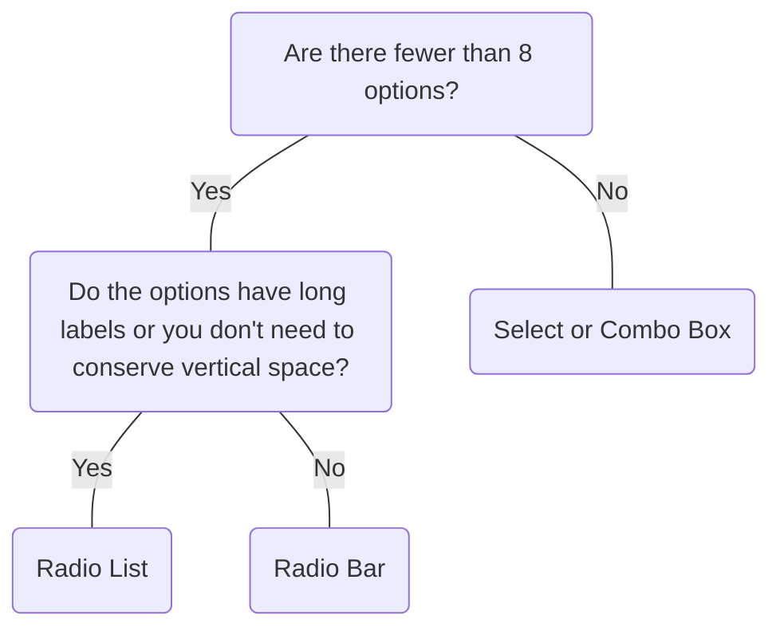

# Radio List

## Overview


> Image: Illustration of a Radio List component.


## When to use this component
- To select a single option from a set of two or more that are mutually exclusive.
- Exposing all available options would benefits the user.

## When to use another component
- The options a user has are opposing states (e.g. on/off, before/after). Use a Switch instead.
- More than one option can be selected; use a Checkbox or Multiselect component.
- Visual indicators (like icons for Radio Bar) help the user find an option faster.
- Options can be collapsed; use Select or Combo Box  to conserve space.



### Check out
- [Switch][1]
- [Multiselect][2]
- [Select][3]
- [Radio Bar][4]
- [Combo Box][5]

## Behaviors

### Customization
Child elements, like a text input, can be included if necessary.

> Image: Image of a Radio List with the label, 


## Usage

### Always include a label
> Image: Examples of a Radio List with the three options, 


### Make options distinct
Users should be able to easily differentiate between options.
> Image: Examples of mutual exclusivity: The first example with the heart eyes emoji shows a Radio List with the options, 


### List options in a logical order
Order your list of options in a way that will make the most sense. Possible orders include:
- Most likely to least likely to be selected
- Simplest to most complex operation
- Least to most risk

> Image: Examples of a Radio List with label 


### Default option
An option must be selected at all times. If you need an unselected state, add a "None" option.

> Image: Examples of a Radio List with label 


## Content

### Avoid punctuation and articles (“the”, “an”, “a”)
Be descriptive, not instructional. If the selection needs more explanation, use help text.

> Image: Examples of label punctuation: The first example with the heart eyes emoji shows a Radio List with the label, 


### Keep descriptions concise
Descriptions should be text only and short enough that bullet points aren't needed. If more detail is needed, move the description outside of the radio list.

> Image: Examples of description length: The first example with the heart eyes emoji shows a Radio List with label 


[1]: ./Switch
[2]: ./Multiselect
[3]: ./Select
[4]: ./RadioBar
[5]: ./ComboBox

## Examples


### Controlled

Radio List requires a value prop and an onChange callback to update the value prop for most use cases.

```typescript
import React, { useState } from 'react';

import RadioList, { RadioListChangeHandler, RadioListValueTypes } from '@splunk/react-ui/RadioList';


function Basic() {
    const [value, setValue] = useState<RadioListValueTypes>(2);

    const handleChange: RadioListChangeHandler = (e, { value: radioValue }) => {
        setValue(radioValue);
    };

    return (
        <RadioList value={value} onChange={handleChange}>
            <RadioList.Option value={1}>One</RadioList.Option>
            <RadioList.Option value={2}>Two</RadioList.Option>
            <RadioList.Option value={3}>Three three three</RadioList.Option>
            <RadioList.Option disabled value={4}>
                Four
            </RadioList.Option>
        </RadioList>
    );
}

export default Basic;
```


### Uncontrolled

Alternately, Radio List can be uncontrolled and optionally provided a defaultValue. The onChange callback still fires. The value prop cannot be set or updated externally.

```typescript
import React from 'react';

import RadioList from '@splunk/react-ui/RadioList';


function Uncontrolled() {
    return (
        <RadioList defaultValue={2}>
            <RadioList.Option value={1}>One</RadioList.Option>
            <RadioList.Option value={2}>Two</RadioList.Option>
            <RadioList.Option value={3}>Three three three</RadioList.Option>
            <RadioList.Option value={4}>Four</RadioList.Option>
        </RadioList>
    );
}

export default Uncontrolled;
```


### Disabled

```typescript
import React, { useState } from 'react';

import RadioList, { RadioListChangeHandler, RadioListValueTypes } from '@splunk/react-ui/RadioList';


function Disabled() {
    const [value, setValue] = useState<RadioListValueTypes>(2);

    const handleChange: RadioListChangeHandler = (e, { value: radioValue }) => {
        setValue(radioValue);
    };

    return (
        <RadioList value={value} disabled onChange={handleChange}>
            <RadioList.Option value={1}>One</RadioList.Option>
            <RadioList.Option value={2}>Two</RadioList.Option>
            <RadioList.Option value={3}>Three three three</RadioList.Option>
            <RadioList.Option disabled value={4}>
                Four
            </RadioList.Option>
        </RadioList>
    );
}

export default Disabled;
```


### Error

```typescript
import React, { useState } from 'react';

import RadioList, { RadioListChangeHandler, RadioListValueTypes } from '@splunk/react-ui/RadioList';


function RadioListError() {
    const [value, setValue] = useState<RadioListValueTypes>(2);

    const handleChange: RadioListChangeHandler = (e, { value: radioValue }) => {
        setValue(radioValue);
    };

    return (
        <RadioList value={value} onChange={handleChange} error>
            <RadioList.Option value={1}>One</RadioList.Option>
            <RadioList.Option value={2}>Two</RadioList.Option>
            <RadioList.Option value={3}>Three three three</RadioList.Option>
            <RadioList.Option value={4}>Four</RadioList.Option>
        </RadioList>
    );
}

export default RadioListError;
```


### Description

```typescript
import React from 'react';

import RadioList from '@splunk/react-ui/RadioList';


function Description() {
    return (
        <RadioList defaultValue={2}>
            <RadioList.Option value={1} description="This is the first option.">
                One
            </RadioList.Option>
            <RadioList.Option value={2} description="This is the second option.">
                Two
            </RadioList.Option>
            <RadioList.Option value={3} description="This is the third option.">
                Three three three
            </RadioList.Option>
            <RadioList.Option value={4} description="This is the fourth option.">
                Four
            </RadioList.Option>
        </RadioList>
    );
}

export default Description;
```


## API


### RadioList API

#### Props

| Name | Type | Required | Default | Description |
|------|------|------|------|------|
| children | React.ReactNode | no |  | `children` should be `RadioList.Option`s. |
| defaultValue | number \| string \| boolean \| Record<string, unknown> \| symbol | no |  | Set this property instead of value to make value uncontrolled. |
| direction | 'column' \| 'row' | no |  | **DEPRECATED**: This prop is deprecated and will be removed in the next major version. Changes the layout of the RadioList. |
| disabled | boolean | no | false |  |
| elementRef | React.Ref<HTMLDivElement> | no |  | A React ref which is set to the DOM element when the component mounts and null when it unmounts. |
| error | boolean | no | false | Highlight the field as having an error. The buttons and labels will turn red. |
| name | string | no |  | The name is returned with onChange events, which can be used to identify the control when multiple controls share an onChange callback. A randomly generated name is used if one is not provided. |
| onChange | RadioListChangeHandler | no |  | A callback to receive the change events. If value is set, this callback is required. This must set the value prop to retain the change. |
| value | number \| string \| boolean \| Record<string, unknown> \| symbol | no |  | The current selected value.  Setting this value makes the property controlled. A callback is required. |

#### Types

| Name | Type | Description |
|------|------|------|
| RadioListChangeHandler | (     event: React.ChangeEvent<HTMLInputElement>,     data: { name?: string; value: RadioListValueTypes } ) => void |  |


### RadioList.Option API

#### Props

| Name | Type | Required | Default | Description |
|------|------|------|------|------|
| children | React.ReactNode | no |  |  |
| description | string | no |  | Additional information to explain the option. |
| disabled | boolean | no | false |  |
| error | boolean | no | false |  |
| id | string | no |  |  |
| onChange | RadioListChangeHandler | no |  |  |
| value | RadioListValueTypes | yes |  | The selectable value. If this matches the ControlRadioList value, the item is selected. |


## Accessibility

## Visual Design

- Color contrast ratio **MUST** be:
    - &gt=4.5:1 for...[SC 1.4.3][1]
        - Label text to page-background (all states)
    - &gt=3:1 for...[SC 1.4.11][2]
        - Circle to toggle-background-color (selected)
        - Toggle-background-color to page-background (selected)
        - Border to page-background (unselected)
    - Focus State: if the focus ring has a radius of [SC 1.4.11][2]
        - &lt 3px: &gt=4.5.1 between button &lt&gt focus &lt&gt background
        - &gt 3px: &gt=3.1 between button &lt&gt focus &lt&gt background

## States

- Color contrast rules do not apply to disabled radio buttons

## Interaction Model

### Focus management
- For radio groups not in a toolbar (most cases), keyboard navigation **MUST** have [SC 2.1][3]
    - <kbd>Tab</kbd> and <kbd>Shift</kbd>+<kbd>Tab</kbd> to move focus into and out of the radio group.
        When focus moves into a radio group : 

        - If a radio button is checked, focus is set on the checked button.
        - If none of the radio buttons are checked, focus is set on the first radio button in the group.
    - <kbd>Space</kbd> to check the focused radio button if it is not already checked.
    - <kbd>Right/Down Arrow</kbd> to move focus to the next radio button in the group, uncheck the
        previously focused button, and check the newly focused button. If focus is on the last button,
        focus moves to the first button.
    - <kbd>Left/Up Arrow</kbd> to move focus to the previous radio button in the group, uncheck the
        previously focused button, and check the newly focused button. If focus is on the first button,
        focus moves to the last button.
- For Radio Group inside a toolbar, consult [WAI-ARIA][4]

## Implementation

- Every radio button **MUST** have...[SC 4.1.2][5]
    - label (name)--visible label referenced by `aria-labelledby`, or a label specified with aria-label
    - `"radio"` role
    - `"checked"` or `"unchecked"` (value)
    - `aria-checked` set to either `"true"` (checked) or `"false"` (unchecked)
- A group of radio buttons **MUST** ...
    - be contained in or owned by an element with the role radiogroup.
    - have a visible label referenced by `aria-labelledby` or has a label specified with aria-label
- If elements providing additonal information about either the radio group or each radio button are present, those elements **MUST** be labeled using one of the following:
    - the `aria-describedby` property
    - radiogroup element
    - radio element

[1]: https://www.w3.org/TR/WCAG21/#contrast-minimum
[2]: https://www.w3.org/TR/WCAG21/#non-text-contrast
[3]: https://www.w3.org/TR/WCAG21/#keyboard-accessible
[4]: https://www.w3.org/TR/wai-aria-practices-1.1/#for-radio-group-contained-in-a-toolbar
[5]: https://www.w3.org/TR/WCAG21/#name-role-value

