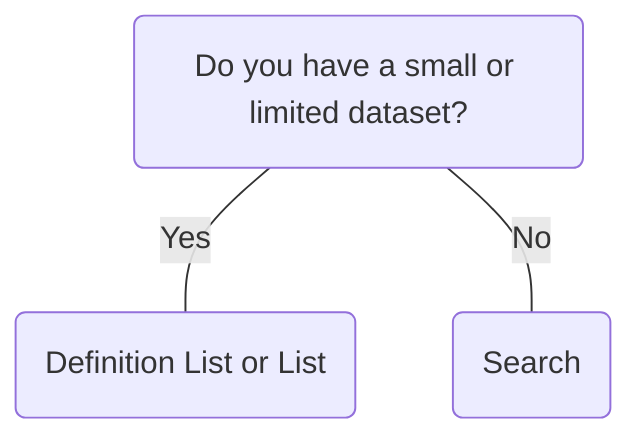

# Search

## Overview


> Image: Illustration of a Search.


## When to use this component
Search lets users input keywords to find specific content within a system.
- When specific data needs to be quickly found within a large dataset.
- When the desired information is not readily accessible through navigation or filtering.
- When the user needs to directly find specific content by inputting keywords.
- When searching within specific components, such as a `Table`, is required.

## When to use another component
- When you have a small or limited dataset.
- When the information is simple and easily accessible.



### Check out
- [Definition List][1]
- [List][2]

## Usage

### Search width
Adjust the width to accommodate the anticipated input length, ensuring it is sufficiently wide to support the longest expected values. Avoid extending Text across the entire width of large screens to maintain usability and readability.

> Image: Examples of Search component widths. The first example with heart eyes emoji has a Search component that is sufficiently wide enough to support the longest expected values. The second example with a grimacing face emoji has a Search component that is a smaller width than the longest expected values.


### Quick options
Quick options provide pre-defined search terms or filters. Focus on quick options that are most frequently used or relevant to the current context. Order your list of options in a way that will make the most sense. This could be by the most commonly selected option, numerically, or alphabetical.
> Image: Examples of Search component with quick options. The first example with heart eyes emoji has a Search component that has four quick options populated below the input. The second example with a grimacing face emoji has a Search component that has twelve quick options populated below the input.


## Content

### Placeholder text
Provide a brief, helpful hint to guide users on what they can search for, such as "Search applications."
> Image: Examples of using placeholder text in the Search component. The first example with heart eyes emoji has a Search component with placholder text 


[1]: ./DefinitionList
[2]: ./List

## Examples


### Controlled

The Search component can be used as both uncontrolled default variant and as a controlled variant. In this example we show the controlled variant.

```typescript
import React, { useState } from 'react';

import Search, { SearchChangeHandler } from '@splunk/react-ui/Search';


const Controlled = () => {
    const [value, setValue] = useState('');

    const handleChange: SearchChangeHandler = (e, { value: searchValue }) => {
        setValue(searchValue);
    };

    return <Search inline onChange={handleChange} value={value} />;
};

export default Controlled;
```


### Quick Options

The Search component can be populated with quick Options. In this example the user can select a quick Option or search via the input, but the Options are not filtered.

```typescript
import React, { useState } from 'react';

import Search, { SearchChangeHandler } from '@splunk/react-ui/Search';


const Options = () => {
    const [value, setValue] = useState('');

    const handleChange: SearchChangeHandler = (e, { value: searchValue }) => {
        setValue(searchValue);
    };

    let options;
    if (!value?.length) {
        options = [
            <Search.Option key="line" value="Line Chart" description="Recommended" />,
            <Search.Option key="area" value="Area Chart" />,
            <Search.Option key="column" value="Column Chart" />,
            <Search.Option key="bar" value="Bar Chart" />,
            <Search.Option key="pie" value="Pie Chart" />,
            <Search.Option key="scatter" value="Scatter Chart" />,
            <Search.Option key="bubble" value="Bubble Chart" />,
        ];
    }

    return (
        <Search inline onChange={handleChange}>
            {options}
        </Search>
    );
};

export default Options;
```


### Options as links

The option on a list of results of search can be a link redirecting to a product page

```typescript
import React, { useState } from 'react';

import Search, { SearchChangeHandler } from '@splunk/react-ui/Search';


const OptionsLinks = () => {
    const [value, setValue] = useState('');

    const handleChange: SearchChangeHandler = (e, { value: searchValue }) => {
        setValue(searchValue);
    };

    let options;
    if (!value?.length) {
        options = [
            <Search.Option key="button" value="Button" to="./Button" description="Recommended" />,
            <Search.Option
                key="splunk"
                value="Splunk"
                to="https://www.splunk.com"
                openInNewContext
            />,
        ];
    }

    return (
        <Search inline onChange={handleChange}>
            {options}
        </Search>
    );
};

export default OptionsLinks;
```


### Asynchronously Loaded Options

The Search component's quick Options can be loaded asynchronously. In this example we show the input paired with asycnchrously loaded and filtered Options.

```typescript
import React, { useCallback, useEffect, useState } from 'react';

import useFetchOptions, { MovieOption } from '@splunk/react-ui/fixtures/useFetchOptions';
import Search, { SearchChangeHandler } from '@splunk/react-ui/Search';


function Loading() {
    
    const { fetch, stop } = useFetchOptions();

    const [isLoading, setIsLoading] = useState(false);
    const [options, setOptions] = useState<MovieOption[]>([]);
    const [value, setValue] = useState('');

    const handleFetch = useCallback(
        (searchValue = '') => {
            setValue(searchValue);
            setIsLoading(true);
            fetch(searchValue)
                .then((searchOptions) => {
                    setIsLoading(false);
                    setOptions(searchOptions);
                })
                .catch((error) => {
                    if (!error.isCanceled) {
                        throw error;
                    }
                });
        },
        [fetch]
    );

    const generateOptions = () => {
        if (isLoading) {
            return null;
        }

        return options.map((movie) => (
            <Search.Option value={movie.title} key={movie.id} matchRanges={movie.matchRanges} />
        ));
    };

    const handleChange: SearchChangeHandler = (e, { value: searchValue }) => {
        handleFetch(searchValue);
    };

    useEffect(() => {
        handleFetch();

        return () => {
            stop();
        };
    }, [handleFetch, stop]);

    const searchOptions = generateOptions();

    return (
        <Search value={value} inline onChange={handleChange} isLoadingOptions={isLoading}>
            {searchOptions}
        </Search>
    );
}

export default Loading;
```


### Filtered Results

```typescript
import React, { useState } from 'react';

import Card from '@splunk/react-ui/Card';
import Search, { SearchChangeHandler } from '@splunk/react-ui/Search';

const resultData = [
    { value: 'line', display: 'Line Chart' },
    { value: 'area', display: 'Area Chart' },
    { value: 'column', display: 'Column Chart' },
    { value: 'bar', display: 'Bar Chart' },
    { value: 'pie', display: 'Pie Chart' },
    { value: 'scatter', display: 'Scatter Chart' },
    { value: 'bubble', display: 'Bubble Chart' },
];
interface Result {
    value: string;
    display: string;
}

type ResultArray = Array<Result>;


const filteredResults = (results: ResultArray, filterValue: string) => {
    if (!filterValue || !filterValue.length) {
        return results;
    }

    return results.filter((result: Result) =>
        result.display.toLowerCase().includes(filterValue.toLowerCase())
    );
};

const cardForResult = (result: Result) => {
    return (
        <Card key={result.value} style={{ margin: '0 20px 20px 0' }}>
            <Card.Header title={result.display} />
        </Card>
    );
};

const Results = () => {
    const [value, setValue] = useState('');

    const handleChange: SearchChangeHandler = (e, { value: searchValue }) => {
        setValue(searchValue);
    };

    return (
        <>
            <Search aria-controls="example-search-results" onChange={handleChange} value={value} />
            <div id="example-search-results" style={{ paddingTop: '10px' }}>
                {filteredResults(resultData, value)?.map((result: Result) => {
                    return cardForResult(result);
                })}
            </div>
        </>
    );
};

export default Results;
```


## API


### Search API

#### Props

| Name | Type | Required | Default | Description |
|------|------|------|------|------|
| animateLoading | boolean | no | false |  |
| append | boolean | no |  | Append removes rounded borders and the border from the right side. |
| children | React.ReactNode | no |  | All children must be instances of `Search.Option`. |
| defaultPlacement | 'above' \| 'below' \| 'vertical' | no |  | The default placement of the dropdown menu. It might be rendered in a different direction depending upon the space available. |
| defaultValue | string | no |  | The initial value of the input. Only applicable in uncontrolled mode. |
| describedBy | string | no |  | The id of the description. |
| disabled | boolean | no | false |  |
| elementRef | React.Ref<HTMLDivElement> | no |  | A React ref which is set to the DOM element when the component mounts and null when it unmounts. |
| error | boolean | no | false | Highlight the field as having an error. The border and text will turn red. |
| footerMessage | React.ReactNode | no |  | The footer message can show additional information, such as a truncation message. |
| inline | boolean | no | false | Make the control an inline block with variable width. |
| inputRef | React.Ref<HTMLInputElement> | no |  | A React ref which is set to the input element when the component mounts and null when it unmounts. |
| isLoadingOptions | boolean | no | false |  |
| labelledBy | string | no |  | The id of the label. |
| loadingMessage | React.ReactNode | no |  | The loading message to show when isLoadingOptions. |
| menuStyle | React.CSSProperties | no | {} |  |
| name | string | no |  | The name is returned with onChange events, which can be used to identify the control when multiple controls share an onChange callback. |
| noOptionsMessage | React.ReactNode | no |  | The noOptionsMessage is shown when there are no children and it's not loading, such as when there are no Options matching the filter. This can be customized to the type of content, for example: "No matching dashboards". You can insert content such as an error message or communicate a minimum number of characters to enter to see results. |
| onBlur | SearchBlurHandler | no |  |  |
| onChange | SearchChangeHandler | no |  |  |
| onClose | () => void | no |  | A callback function invoked when the popover closes. |
| onFocus | SearchFocusHandler | no |  |  |
| onKeyDown | React.KeyboardEventHandler<HTMLInputElement> | no |  |  |
| onOpen | () => void | no |  | A callback function invoked when the popover opens. |
| onScroll | React.UIEventHandler<Element> | no |  | A callback function invoked when the menu is scrolled. |
| onSelect | React.ReactEventHandler<HTMLInputElement> | no |  |  |
| placeholder | string | no | _('Search...') |  |
| prepend | boolean | no |  | Prepend removes rounded borders from the left side. |
| value | string | no |  | The value of the input. Only applicable in controlled mode. |

#### Types

| Name | Type | Description |
|------|------|------|
| SearchBlurHandler | (     event: React.FocusEvent<HTMLInputElement>,     data: {         name?: string;         value: string;     } ) => void |  |
| SearchChangeHandler | (     event:         \| React.ChangeEvent<HTMLInputElement>         \| React.MouseEvent<HTMLButtonElement \| HTMLSpanElement>         \| React.KeyboardEvent<HTMLInputElement>,     data: {         name?: string;         value: string;     } ) => void |  |
| SearchFocusHandler | (     event: React.FocusEvent<HTMLInputElement>,     data: {         name?: string;         value: string;     } ) => void |  |


### Search.Option API

An option within a `Search`.

#### Props

| Name | Type | Required | Default | Description |
|------|------|------|------|------|
| description | string | no |  | Additional information to explain the option, such as "Recommended". |
| descriptionPosition | 'right' \| 'bottom' | no | 'bottom' | The description text may appear to the right of the label or under the label. |
| disabled | boolean | no |  | If disabled=true, the option is grayed out and cannot be clicked. |
| elementRef | React.Ref<HTMLButtonElement \| HTMLAnchorElement> | no |  | A React ref which is set to the DOM element when the component mounts and null when it unmounts. |
| endAdornment | React.ReactNode | no |  | Adornment after the label. |
| label | string | no |  | When provided, `label` is rendered instead of the `value`. |
| matchRanges | { start: number; end: number }[] | no |  | Sections of the label string to highlight as a match. |
| onClick | (     event: React.MouseEvent<HTMLButtonElement \| HTMLAnchorElement>,     data: { to?: string; value: string } ) => boolean \| void | no |  | Callback for click events. Returning "false" from the callback will prevent the parent Search component from updating its value, closing the popover, or firing the `onChange` callback. |
| openInNewContext | boolean | no |  | To open the link in a new window, set `openInNewContext` to `true`. An icon is added indicating the behavior. |
| startAdornment | React.ReactNode | no |  | Adornment in front of the label. |
| to | string | no |  | The URL or path to link to. |
| truncate | boolean | no |  | When `true`, wrapping is disabled and any additional text is ellipsised. |
| value | string | yes |  | The value of this option and the label shown for it. |


