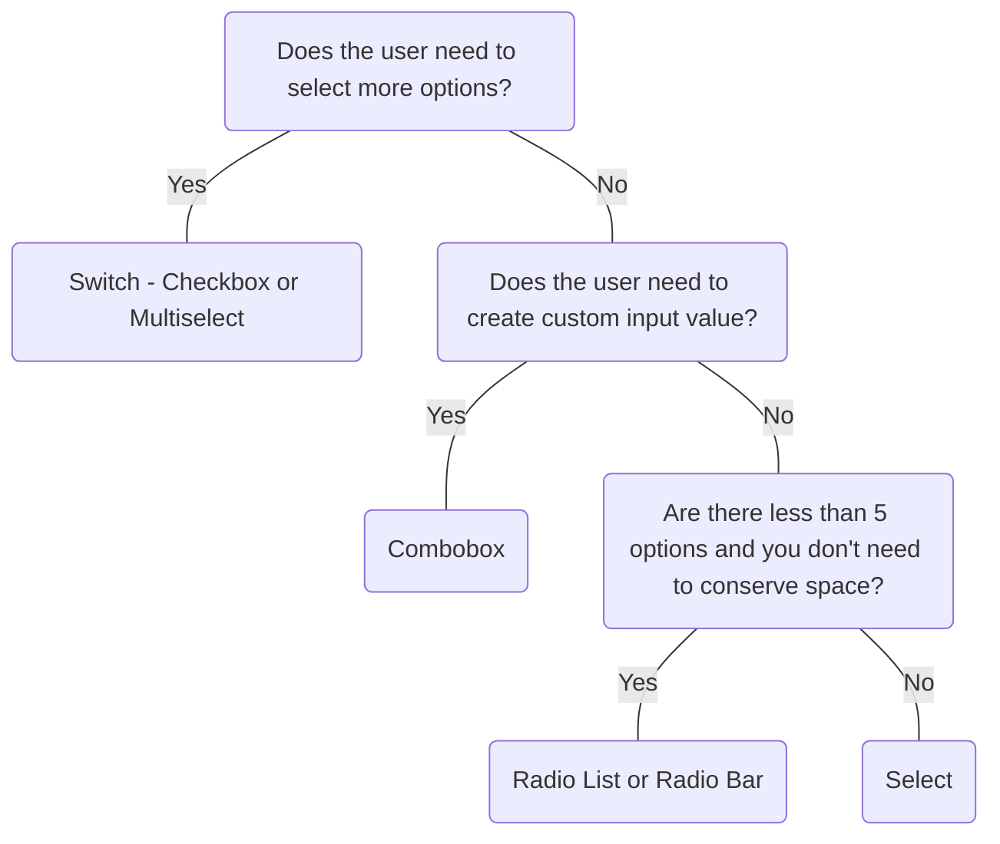

# Select

## Overview


> Image: Illustration of a select component.


<Message appearance="fill" type="info">
    <div>All data entry components should be wrapped in a <Link to="ControlGroup">Control Group</Link> to provide a label, error states, and help or error text, ensuring an accessible experience for all users.</div>
</Message>

## When to use this component
- To choose one option from a list of predefined options without having to render the whole list unless in focus.
- Users need filtering or sorting, such as in a product list or table.

## When to use another component
- If the list of options is small and you don't need to conserve space, consider using Radio List or Radio Bar to minimize steps.
- If the user is only required to select one option, but needs to create a custom value in addition to selecting from a list, use Combo Box.
- Use Radio List or a Switch - Toggle for yes/no or true/false questions.



### Check out
- [Radio List][1]
- [Radio Bar][2]
- [Combo Box][3]
- [Switch][4]
- [Multiselect][5]
- [Dropdown][6]

## Behaviors

### Appearance
The appearance property changes the Select to any button appearance or a link for use in sentences.

> Image: Image showing three Select components with different appearances: default, subtle and link.


### Filtering
An additonal search bar can be included in the menu to allow users to filter through options.

> Image: Image showing a Select in a focus state with an additional search box within the menu for filtering.


### Descriptions, headings and dividers, or footers
For complex lists, additional affordances such as descriptions, headings and dividers, or footers can be added.

> Image: Image showing three Select components in focus state with different menu appearances, menu item descriptions, menu headers and dividers, and footers.


## Usage

### Leave enough space for selections
Consider the width of the Select to leave enough space for multiple selections.

> Image: In this example, there is a Chart type Select and Save chart button in a form. In the first example with heart eyes emoji, the Select is wide enough that the selected option, Line chart, is completely visible. In the second example with a grimacing emoji, the Select width is shorter so that the label of the selected option is truncated.


### Error
Validation and error messages help users to understand and resolve problems. The error message should inform users what the problem is and how to fix it.

> Image: Examples of a Select with an error message. In the first example with heart eyes emoji, the error message says 


### Mutually exclusive options
Each option should be distinct so that users can clearly differentiate between them.

> Image: Examples of mutual exclusivity: The first example with the heart eyes emoji shows a Select with the options, 


#### Options order
Order your list of options in a way that will make the most sense. This could be by the most commonly selected option, numerically, or alphabetical.
> Image: Two examples of a Select component labeled 


#### Limit options
Limit the number of options as not too overwhelm people with too many options.

## Content

### Be concise
Keep options short and compact so that they fit in the input box.

> Image: Examples of option label length: The first example with the heart eyes emoji has three options with the titles: 


### Avoid punctuation and articles (“the”, “an”, “a”)
Be descriptive, not instructional. If the selection needs more explanation, use help text below the field.

> Image: Examples of label punctuation: The first example with the heart eyes emoji shows a Select with the title, 


[1]: ./Radiolist
[2]: ./Radiobar
[3]: ./ComboBox
[4]: ./Switch
[5]: ./Multiselect
[6]: ./Dropdown

## Examples


### Controlled

Select requires a value prop and an onChange callback to update the value prop for most use cases.

```typescript
import React, { useState } from 'react';

import Select, { SelectChangeHandler } from '@splunk/react-ui/Select';


function Basic() {
    const [value, setValue] = useState<string | number | boolean>('5');

    const handleChange: SelectChangeHandler = (e, { value: newValue }) => {
        setValue(newValue);
    };

    return (
        <Select value={value} onChange={handleChange}>
            <Select.Option label="Area chart" value="1" />
            <Select.Option label="Bar chart" value="2" />
            <Select.Option label="Bubble chart" value="3" />
            <Select.Option label="Column chart" value="4" />
            <Select.Option label="Line chart" value="5" />
            <Select.Option label="Pie chart" value="6" />
            <Select.Option label="Scatter chart" value="7" />
        </Select>
    );
}

export default Basic;
```


### Uncontrolled

Alternatively, Select can be uncontrolled and optionally provided a defaultValue. The onChange callback still fires. The value prop cannot be set or updated externally.

```typescript
import React from 'react';

import Select from '@splunk/react-ui/Select';


function Uncontrolled() {
    return (
        <Select defaultValue="1">
            <Select.Option label="Area chart" value="1" />
            <Select.Option label="Bar chart" value="2" />
            <Select.Option label="Bubble chart" value="3" />
            <Select.Option label="Column chart" value="4" />
            <Select.Option label="Line chart" value="5" />
            <Select.Option label="Pie chart" value="6" />
            <Select.Option label="Scatter chart" value="7" />
        </Select>
    );
}

export default Uncontrolled;
```


### enterpriseIconProps

```typescript
import React, { useState } from 'react';

import ChartArea from '@splunk/react-icons/ChartArea';
import ChartBar from '@splunk/react-icons/ChartBar';
import ChartBubble from '@splunk/react-icons/ChartBubble';
import ChartColumn from '@splunk/react-icons/ChartColumn';
import ChartLine from '@splunk/react-icons/ChartLine';
import ChartPie from '@splunk/react-icons/ChartPie';
import ChartScatter from '@splunk/react-icons/ChartScatter';
import EnterpriseChartArea from '@splunk/react-icons/enterprise/ChartArea';
import EnterpriseChartBar from '@splunk/react-icons/enterprise/ChartBar';
import EnterpriseChartBubble from '@splunk/react-icons/enterprise/ChartBubble';
import EnterpriseChartColumn from '@splunk/react-icons/enterprise/ChartColumn';
import EnterpriseChartLine from '@splunk/react-icons/enterprise/ChartLine';
import EnterpriseChartPie from '@splunk/react-icons/enterprise/ChartPie';
import EnterpriseChartScatter from '@splunk/react-icons/enterprise/ChartScatter';
import Select, { SelectChangeHandler } from '@splunk/react-ui/Select';
import { useSplunkTheme } from '@splunk/themes';

const enterpriseIconProps = {
    hideDefaultTooltip: true,
    screenReaderText: null,
    size: '16px',
};

const enterpriseIcons = {
    'Area chart': <EnterpriseChartArea {...enterpriseIconProps} />,
    'Bar chart': <EnterpriseChartBar {...enterpriseIconProps} />,
    'Bubble chart': <EnterpriseChartBubble {...enterpriseIconProps} />,
    'Column chart': <EnterpriseChartColumn {...enterpriseIconProps} />,
    'Line chart': <EnterpriseChartLine {...enterpriseIconProps} />,
    'Pie chart': <EnterpriseChartPie {...enterpriseIconProps} />,
    'Scatter chart': <EnterpriseChartScatter {...enterpriseIconProps} />,
};

const prismaIconProps = {
    height: 20,
    width: 20,
};

const prismaIcons = {
    'Area chart': <ChartArea {...prismaIconProps} />,
    'Bar chart': <ChartBar {...prismaIconProps} />,
    'Bubble chart': <ChartBubble {...prismaIconProps} />,
    'Column chart': <ChartColumn {...prismaIconProps} />,
    'Line chart': <ChartLine {...prismaIconProps} />,
    'Pie chart': <ChartPie {...prismaIconProps} />,
    'Scatter chart': <ChartScatter {...prismaIconProps} />,
};


function Icons() {
    const [value, setValue] = useState<string | number | boolean>('Chart5');

    const handleChange: SelectChangeHandler = (e, { value: key }) => {
        setValue(key);
    };

    const { isEnterprise } = useSplunkTheme();
    const iconMap = isEnterprise ? enterpriseIcons : prismaIcons;

    return (
        <Select value={value} onChange={handleChange}>
            <Select.Option label="Area chart" icon={iconMap['Area chart']} value="Chart1" />
            <Select.Option label="Bar chart" icon={iconMap['Bar chart']} value="Chart2" />
            <Select.Option label="Bubble chart" icon={iconMap['Bubble chart']} value="Chart3" />
            <Select.Option label="Column chart" icon={iconMap['Column chart']} value="Chart4" />
            <Select.Option label="Line chart" icon={iconMap['Line chart']} value="Chart5" />
            <Select.Option label="Pie chart" icon={iconMap['Pie chart']} value="Chart6" />
            <Select.Option label="Scatter chart" icon={iconMap['Scatter chart']} value="Chart7" />
        </Select>
    );
}

export default Icons;
```


### Prefixed Label

When used outside of a Control Group, it is useful to inline the label inside the button.

```typescript
import React, { useState } from 'react';

import Select, { SelectChangeHandler } from '@splunk/react-ui/Select';


function Prefix() {
    const [selectedValue, setSelectedValue] = useState<string | number | boolean>('5');

    const handleChange: SelectChangeHandler = (e, { value: newValue }) => {
        setSelectedValue(newValue);
    };

    return (
        <Select prefixLabel="Chart" value={selectedValue} onChange={handleChange}>
            <Select.Option label="Area chart" value="1" />
            <Select.Option label="Bar chart" value="2" />
            <Select.Option label="Bubble chart" value="3" />
            <Select.Option label="Column chart" value="4" />
            <Select.Option label="Line chart" value="5" />
            <Select.Option label="Pie chart" value="6" />
            <Select.Option label="Scatter chart" value="7" />
        </Select>
    );
}

export default Prefix;
```


### Appearance

The appearance prop changes the toggle to any button appearance, or a link for use in sentences.

```typescript
import React, { useState } from 'react';

import Select, { SelectChangeHandler } from '@splunk/react-ui/Select';


function Appearance() {
    const [value, setValue] = useState<string | number | boolean>('4');

    const handleChange: SelectChangeHandler = (e, { value: newValue }) => {
        setValue(newValue);
    };

    return (
        <Select appearance="subtle" value={value} onChange={handleChange}>
            <Select.Option label="Area chart" value="1" />
            <Select.Option label="Bar chart" value="2" />
            <Select.Option label="Bubble chart" value="3" />
            <Select.Option label="Column chart" value="4" />
            <Select.Option label="Line chart" value="5" />
            <Select.Option label="Pie chart" value="6" />
            <Select.Option label="Scatter chart" value="7" />
        </Select>
    );
}

export default Appearance;
```


### Descriptions

Descriptions can be placed below or to the right of the label.

```typescript
import React, { useState } from 'react';

import Select, { SelectChangeHandler } from '@splunk/react-ui/Select';


function Descriptions() {
    const [selectedValue, setSelectedValue] = useState<string | number | boolean>('1');

    const handleChange: SelectChangeHandler = (e, { value: newValue }) => {
        setSelectedValue(newValue);
    };

    return (
        <Select value={selectedValue} onChange={handleChange} menuStyle={{ width: 350 }}>
            <Select.Option
                label="Statistics table"
                description="Recommended"
                descriptionPosition="right"
                value="1"
            />
            <Select.Divider />
            <Select.Option
                label="Choropleth map"
                description="A map with colored regions"
                value="2"
            />
            <Select.Option
                label="Cluster map"
                description="A map with overlaid circles"
                value="3"
            />
        </Select>
    );
}

export default Descriptions;
```


### Error

```typescript
import React from 'react';

import Select from '@splunk/react-ui/Select';


function SelectError() {
    return (
        <Select defaultValue="1" error>
            <Select.Option label="Area chart" value="1" />
            <Select.Option label="Bar chart" value="2" />
            <Select.Option label="Bubble chart" value="3" />
            <Select.Option label="Column chart" value="4" />
            <Select.Option label="Line chart" value="5" />
            <Select.Option label="Pie chart" value="6" />
            <Select.Option label="Scatter chart" value="7" />
        </Select>
    );
}

export default SelectError;
```


### longLabel

```typescript
import React, { useState } from 'react';

import Select, { SelectChangeHandler } from '@splunk/react-ui/Select';

const longLabel = 'A very long label truncation truncation truncation truncation';


function Truncate() {
    const [selectedValue, setSelectedValue] = useState<string | number | boolean>('1');

    const handleChange: SelectChangeHandler = (e, { value: newValue }) => {
        setSelectedValue(newValue);
    };

    return (
        <Select
            prefixLabel="Direction"
            style={{ maxWidth: '300px' }}
            value={selectedValue}
            onChange={handleChange}
        >
            <Select.Option label={longLabel} truncate value="1" />
            <Select.Option label={longLabel} truncate value="2" />
            <Select.Option label={longLabel} value="3" />
            <Select.Option label={longLabel} value="4" />
        </Select>
    );
}

export default Truncate;
```


### Headings and Dividers

```typescript
import React, { useState } from 'react';

import Select, { SelectChangeHandler } from '@splunk/react-ui/Select';


function Headings() {
    const [selectedValue, setSelectedValue] = useState<string | number | boolean>('Chart5');

    const handleChange: SelectChangeHandler = (e, { value: newValue }) => {
        setSelectedValue(newValue);
    };

    return (
        <Select value={selectedValue} onChange={handleChange} filter>
            <Select.Option label="Events" value="Basic1" />
            <Select.Divider />
            <Select.Option label="Statistics table" value="Basic2" />
            <Select.Heading>Chart</Select.Heading>
            <Select.Option label="Area chart" value="Chart1" />
            <Select.Option label="Bar chart" value="Chart2" />
            <Select.Option label="Bubble chart" value="Chart3" />
            <Select.Option label="Column chart" value="Chart4" />
            <Select.Option label="Line chart" value="Chart5" />
            <Select.Option label="Pie chart" value="Chart6" />
            <Select.Option label="Scatter chart" value="Chart7" />
            <Select.Heading>Map</Select.Heading>
            <Select.Option label="Choropleth map" value="Map1" />
            <Select.Option label="Cluster map" value="Map2" />
            <Select.Heading>Value</Select.Heading>
            <Select.Option label="Filler gauge" value="Value1" />
            <Select.Option label="Marker gauge" value="Value2" />
            <Select.Option label="Radial gauge" value="Value3" />
            <Select.Option label="Single value" value="Value4" />
        </Select>
    );
}

export default Headings;
```


### Children

children replace label when provided. label is still used for matching to the filter.

```typescript
import React, { useState } from 'react';

import Select, { SelectChangeHandler } from '@splunk/react-ui/Select';


function Children() {
    const [selectedValue, setSelectedValue] = useState<string | number | boolean>('5');

    const handleChange: SelectChangeHandler = (e, { value: newValue }) => {
        setSelectedValue(newValue);
    };

    return (
        <Select value={selectedValue} onChange={handleChange}>
            <Select.Option label="Chart: Area" value="1">
                Chart: <b>Area</b>
            </Select.Option>
            <Select.Option label="Chart: Bar" value="2">
                Chart: <b>Bar</b>
            </Select.Option>
            <Select.Option label="Chart: Bubble" value="3">
                Chart: <b>Bubble</b>
            </Select.Option>
            <Select.Option label="Chart: Column" value="4">
                Chart: <b>Column</b>
            </Select.Option>
            <Select.Option label="Chart: Line" value="5">
                Chart: <b>Line</b>
            </Select.Option>
            <Select.Option label="Chart: Pie" value="6">
                Chart: <b>Pie</b>
            </Select.Option>
            <Select.Option label="Chart: Scatter" value="7">
                Chart: <b>Scatter</b>
            </Select.Option>
        </Select>
    );
}

export default Children;
```


### Filter Select Items

An additional filter box can be enabled.

```typescript
import React, { useState } from 'react';

import Select, { SelectChangeHandler } from '@splunk/react-ui/Select';


function Filter() {
    const [selectedValue, setSelectedValue] = useState<string | number | boolean>('Chart5');

    const handleChange: SelectChangeHandler = (e, { value: newValue }) => {
        setSelectedValue(newValue);
    };

    return (
        <Select value={selectedValue} filter onChange={handleChange}>
            <Select.Option label="Events" value="Basic1" />
            <Select.Option label="Statistics table" value="Basic2" />
            <Select.Heading>Chart</Select.Heading>
            <Select.Option label="Area chart" value="Chart1" />
            <Select.Option label="Bar chart" value="Chart2" />
            <Select.Option label="Bubble chart" value="Chart3" disabled="dimmed" />
            <Select.Option label="Column chart" value="Chart4" />
            <Select.Option label="Line chart" value="Chart5" />
            <Select.Option label="Pie chart" value="Chart6" />
            <Select.Option label="Scatter chart" value="Chart7" />
            <Select.Heading>Map</Select.Heading>
            <Select.Option label="Choropleth map" value="Map1" />
            <Select.Option label="Cluster map" value="Map2" />
            <Select.Heading>Value</Select.Heading>
            <Select.Option label="Filler gauge" value="Value1" />
            <Select.Option label="Marker gauge" value="Value2" />
            <Select.Option label="Radial gauge" value="Value3" />
            <Select.Option label="Single value" value="Value4" />
        </Select>
    );
}

export default Filter;
```


### Fetching

It's possible to populate the Options from a server. Here, that behavior is simulated. This simplified example only matches the start of the label. The matchRange prop may be set manually to reflect the matching algorithm used to filter the results. Otherwise matching text is not shown.

```typescript
import React, { useState, useEffect, useCallback } from 'react';

import useFetchOptions, {
    isMovieOption,
    Movie,
    MovieOption,
} from '@splunk/react-ui/fixtures/useFetchOptions';
import Select, { SelectChangeHandler, SelectFilterChangeHandler } from '@splunk/react-ui/Select';
import { _ } from '@splunk/ui-utils/i18n';


function Fetching() {
    const [fullCount, setFullCount] = useState(0);
    const [isLoading, setIsLoading] = useState(false);
    const [options, setOptions] = useState<MovieOption[]>([]);
    const [selectedValue, setSelectedValue] = useState<string | number | boolean>('');

    
    const { fetch, getFullCount, getOption, stop } = useFetchOptions();

    const handleFetch = useCallback(
        (keyword = '') => {
            setIsLoading(true);
            fetch(keyword)
                .then((newOptions) => {
                    setIsLoading(false);
                    setOptions(newOptions);
                    setFullCount(getFullCount());
                })
                .catch((error) => {
                    if (!error.isCanceled) {
                        throw error;
                    }
                });
        },
        [fetch, getFullCount]
    );

    useEffect(() => {
        handleFetch();

        return () => {
            stop();
        };
    }, [handleFetch, stop]);

    const handleChange: SelectChangeHandler = useCallback((e, { value: newValue }) => {
        setSelectedValue(newValue);
    }, []);

    const handleFilterChange: SelectFilterChangeHandler = useCallback(
        (e, { keyword }) => {
            handleFetch(keyword);
        },
        [handleFetch]
    );

    const createOption = (movie: Movie | MovieOption, isSelected = false) => (
        
        <Select.Option
            hidden={!!isSelected}
            key={isSelected ? `selected-${movie.id}` : movie.id}
            label={movie.title}
            matchRanges={isMovieOption(movie) ? movie.matchRanges : undefined}
            value={movie.id}
        />
    );

    const generateOptions = useCallback(() => {
        let selectedOption;
        if (selectedValue) {
            const selectedMovie = getOption(selectedValue as number);
            if (selectedMovie) {
                selectedOption = createOption(selectedMovie, true);
            }
        }

        if (isLoading) {
            // Only return the selected item
            return selectedOption;
        }

        const list = options.map((movie) => createOption(movie));
        if (selectedOption) {
            list.push(selectedOption);
        }
        return list;
    }, [selectedValue, isLoading, options, getOption]);

    const footerMessage = useCallback(() => {
        if (fullCount > options.length && !isLoading) {
            return _('%1 of %2 movies')
                .replace('%1', options.length.toString())
                .replace('%2', fullCount.toString());
        }
        return null;
    }, [fullCount, options.length, isLoading]);

    return (
        <Select
            value={selectedValue}
            filter="controlled"
            placeholder={_('Select a movie...')}
            menuStyle={{ width: 300 }}
            onChange={handleChange}
            onFilterChange={handleFilterChange}
            isLoadingOptions={isLoading}
            footerMessage={footerMessage()}
        >
            {generateOptions()}
        </Select>
    );
}

export default Fetching;
```


### Load more on scroll bottom

This example is similar to the example for fetching. You can append more Options from a server when the list is scrolled to the bottom. Here, that behavior is simulated. The onScrollBottom prop is a function that should fetches more results and appends them to the current Options. Once all items are loaded, the onScrollBottom prop should be set to null.

```typescript
import React, { useState, useEffect, useCallback, useMemo } from 'react';

import useFetchOptions, {
    isMovieOption,
    Movie,
    MovieOption,
} from '@splunk/react-ui/fixtures/useFetchOptions';
import Select, { SelectChangeHandler, SelectFilterChangeHandler } from '@splunk/react-ui/Select';
import { _ } from '@splunk/ui-utils/i18n';


function LoadMoreOnScrollBottom() {
    const [isLoading, setIsLoading] = useState(false);
    const [isLoadingMore, setIsLoadingMore] = useState(false);
    const [options, setOptions] = useState<MovieOption[]>([]);
    const [selectedValue, setSelectedValue] = useState<string | number | boolean>('');

    
    const { fetch, fetchMore, getFullCount, getOption, stop } = useFetchOptions();

    const handleFetch = useCallback(
        (keyword: string = '') => {
            setIsLoading(true);
            fetch(keyword)
                .then((newOptions) => {
                    setOptions(newOptions);
                    setIsLoading(false);
                    setIsLoadingMore(false);
                })
                .catch((error) => {
                    if (!error.isCanceled) {
                        throw error;
                    }
                });
        },
        [fetch]
    );

    useEffect(() => {
        handleFetch();

        return () => {
            stop();
        };
    }, [handleFetch, stop]);

    const handleFetchMore = useCallback(() => {
        if (isLoadingMore) return;
        setIsLoadingMore(true);
        fetchMore(options)
            .then((newOptions) => {
                setOptions(newOptions);
                setIsLoading(false);
                setIsLoadingMore(false);
            })
            .catch((error) => {
                if (!error.isCanceled) {
                    throw error;
                }
            });
    }, [isLoadingMore, fetchMore, options]);

    const handleChange: SelectChangeHandler = useCallback((e, { value: newValue }) => {
        setSelectedValue(newValue);
    }, []);

    const handleFilterChange: SelectFilterChangeHandler = useCallback(
        (e, { keyword }) => {
            handleFetch(keyword);
        },
        [handleFetch]
    );

    const handleScrollBottom = useCallback(() => {
        if (!isLoadingMore) {
            handleFetchMore();
        }
    }, [isLoadingMore, handleFetchMore]);

    const createOption = useCallback(
        (movie: Movie, isSelected = false) => (
            
            <Select.Option
                hidden={!!isSelected}
                key={isSelected ? `selected-${movie.id}` : movie.id}
                label={movie.title}
                matchRanges={isMovieOption(movie) ? movie.matchRanges : undefined}
                value={movie.id}
            />
        ),
        []
    );

    const generateOptions = useMemo(() => {
        // The selected item always has to be in the option list, but can be hidden
        let selectedOption;
        if (selectedValue) {
            const selectedMovie = getOption(selectedValue as number);
            if (selectedMovie) {
                selectedOption = createOption(selectedMovie, true);
            }
        }

        if (isLoading) {
            // Only return the selected item
            return selectedOption ? [selectedOption] : [];
        }

        const list = options.map((movie) => createOption(movie));
        if (selectedOption) {
            list.push(selectedOption);
        }
        return list;
    }, [selectedValue, isLoading, options, getOption, createOption]);

    const footerMessage = useMemo(
        () =>
            _('%1 movies %2')
                .replace('%1', getFullCount().toString())
                .replace('%2', isLoadingMore ? _('(Loading more movies)') : ''),
        [getFullCount, isLoadingMore]
    );

    const scrollBottom = getFullCount() === options.length ? undefined : handleScrollBottom;

    return (
        <Select
            value={selectedValue}
            filter="controlled"
            placeholder={_('Select a movie...')}
            menuStyle={{ width: 300 }}
            onChange={handleChange}
            onFilterChange={handleFilterChange}
            onScrollBottom={scrollBottom}
            isLoadingOptions={isLoading}
            footerMessage={footerMessage}
        >
            {generateOptions}
        </Select>
    );
}

export default LoadMoreOnScrollBottom;
```


### Dimmed

If you absolutely need to disable a Select use a dimmed Select. When the disabled prop is set to "dimmed", the Select does not respond to events but can still receive focus to ensure users can navigate to the Select when using assistive technologies. This also sets aria-disabled to true.

```typescript
import React, { useState } from 'react';

import Select, { SelectChangeHandler } from '@splunk/react-ui/Select';


function Dimmed() {
    const [selectedValue, setSelectedValue] = useState<string | number | boolean>('Chart5');

    const handleChange: SelectChangeHandler = (e, { value: newValue }) => {
        setSelectedValue(newValue);
    };

    return (
        <Select value={selectedValue} filter onChange={handleChange} disabled="dimmed">
            <Select.Option label="Area chart" value="Chart1" />
            <Select.Option label="Bar chart" value="Chart2" />
            <Select.Option label="Bubble chart" value="Chart3" />
            <Select.Option label="Column chart" value="Chart4" />
            <Select.Option label="Line chart" value="Chart5" />
            <Select.Option label="Pie chart" value="Chart6" />
            <Select.Option label="Scatter chart" value="Chart7" />
        </Select>
    );
}

export default Dimmed;
```


## API


### Select API

#### Props

| Name | Type | Required | Default | Description |
|------|------|------|------|------|
| allowKeyMatching | boolean | no | true | Whether or not to allow entered keyboard printable characters to match options. Keymatching is disabled when using filtering or loading. |
| animateLoading | boolean | no |  | Whether or not to show the wait spinner when loading. It's recommended to set this to `true` when loading may take more than one second. |
| appearance | 'default' \| 'link' \| 'subtle' | no | 'default' | **DEPRECATED**: Value 'link' Change the style of the button or link.  The `link` value is deprecated and will be removed in a future major version. |
| append | boolean | no |  | Remove rounding from the right side of the toggle. |
| children | React.ReactNode | no |  | `children` should be `Select.Option`, `Select.Header`, or `Select.Divider`. |
| defaultPlacement | 'above' \| 'below' \| 'vertical' | no | 'vertical' | The default placement of the dropdown menu. It might be rendered in a different direction depending upon the space available. This property is effective only when filter is enabled. |
| defaultValue | string \| number \| boolean | no |  | Set this property instead of value to keep the value uncontrolled. |
| describedBy | string | no |  | The id of the description. When placed in a ControlGroup, this is automatically set to the ControlGroup's help component. |
| disabled | boolean \| 'dimmed' \| 'disabled' | no |  | Prevents user interaction and adds disabled styling.  If set to `dimmed`, the component is able to receive focus. If set to `disabled`, the component is unable to receive focus (as a result of setting the html `disabled` attribute). |
| elementRef | React.Ref<HTMLButtonElement> | no |  | A React ref which is set to the DOM element when the component mounts, and null when it unmounts. |
| error | boolean | no |  | Highlight the field as having an error. The button will turn red. |
| filter | boolean \| 'controlled' | no |  | Determines whether to show the filter box. When true, the children are automatically filtered based on the label. When controlled, the parent component must provide a onFilterChange callback and update the children. This can also be used to fetch new results. |
| footerMessage | React.ReactNode | no |  | The footer message can show additional information, such as a truncation message. |
| inline | boolean | no | true | Make the control an inline block with variable width. |
| inputId | string | no |  | An id for the input, which may be necessary for accessibility, such as for aria attributes. |
| inputRef | React.Ref<HTMLInputElement> | no |  | A React ref which is set to the input element when the component mounts and null when it unmounts. |
| isLoadingOptions | boolean | no |  |  |
| labelText | string | no |  | Text presented in the label for this field. This is used to supply this text along with the current value to a screen reader. |
| labelledBy | string | no |  | The id of the label. When placed in a ControlGroup, this is automatically set to the ControlGroup's label. This property is not used when `labelText` is provided. |
| loadingMessage | React.ReactNode | no |  | The loading message to show when isLoadingOptions. |
| menuStyle | React.CSSProperties | no |  |  |
| name | string | no |  | The name is returned with onChange events, which can be used to identify the control when multiple controls share an onChange callback. |
| noOptionsMessage | React.ReactNode | no | _('No matches') | The noOptionsMessage is shown when there are no children and it's not loading, such as when there are no Options matching the filter. This can be customized to the type of content, for example: "No matching dashboards". You can insert other content, such as an error message, or communicate a minimum number of characters to enter to see results. |
| onChange | SelectChangeHandler | no |  | A callback to receive the change events. If value is set, this callback is required. This must set the value prop to retain the change. |
| onClose | () => void | no |  | A callback function invoked when the popover closes. |
| onFilterChange | SelectFilterChangeHandler | no |  | A callback with the change event and value of the filter box. Providing this callback and setting controlledFilter to true enables you to filter and update the children by other criteria. |
| onOpen | () => void | no |  | A callback function invoked when the popover opens. |
| onScroll | React.UIEventHandler<Element> | no |  | A callback function invoked when the menu is scrolled. |
| onScrollBottom | SelectScrollBottomHandler | no |  | A callback function for loading additional list items. Called when the list is scrolled to the bottom or all items in the list are visible. This is called with an event argument if this is the result of a scroll.  This should be set this to `null` when all items are loaded. |
| placeholder | string | no | _('Select...') | If 'value' is undefined or doesn't match an item, the Button will display this text. |
| prefixLabel | string | no |  | When used outside of a control group, it can be useful to include the label on the toggle. |
| prepend | boolean | no |  | Remove rounding from the left side of the toggle. |
| repositionMode | 'none' \| 'flip' | no |  | See `repositionMode` on `Popover` for details. |
| suffixLabel | string | no |  | Places this string after the selected label. |
| toggleContent | 'optionChildren' \| 'optionLabel' | no | 'optionChildren' | Controls whether the `children` or `label` of the selected `Option` is rendered on the toggle button. |
| value | string \| number \| boolean | no |  | Value will be matched to one of the children to deduce the label and/or icon for the toggle. |

#### Types

| Name | Type | Description |
|------|------|------|
| SelectChangeHandler | (     event: React.MouseEvent<HTMLButtonElement> \| React.KeyboardEvent<HTMLInputElement>,     data: {         name?: string;         value: string \| number \| boolean;     } ) => void |  |
| SelectFilterChangeHandler | (     event:         \| React.ChangeEvent<HTMLInputElement>         \| React.MouseEvent<HTMLSpanElement>         \| React.KeyboardEvent,     data: { keyword: string } ) => void |  |
| SelectScrollBottomHandler | (     event:         \| React.UIEvent<HTMLDivElement>         \| React.KeyboardEvent<HTMLInputElement>         \| React.KeyboardEvent<HTMLButtonElement>         \| null ) => void |  |


### Select.Option API

An option within a `Select`. Any elements passed to it should be memoized.

#### Props

| Name | Type | Required | Default | Description |
|------|------|------|------|------|
| children | React.ReactNode | no |  | When provided, `children` is rendered instead of the `label`.  Caution: The element(s) passed here must be pure. |
| description | string | no |  | Additional information to explain the option, such as "Recommended". |
| descriptionPosition | 'right' \| 'bottom' | no | 'bottom' | The description text may appear to the right of the label or under the label. |
| disabled | boolean \| 'dimmed' \| 'disabled' | no |  | Prevents user interaction and adds disabled styling.  If set to `dimmed`, the component is able to receive focus. If set to `disabled`, the component is unable to receive focus (as a result of setting the html `disabled` attribute). |
| elementRef | React.Ref<HTMLAnchorElement \| HTMLButtonElement> | no |  | A React ref which is set to the DOM element when the component mounts, and null when it unmounts. |
| hidden | boolean | no |  | Adding hidden options can be useful for resolving the selected display label and icon, when the option should not be in the list. This scenario can arise when Select's filter is controlled, because the selected item may be filtered out; and when a legacy option is valid, but should no longer be displayed as a selectable option. |
| icon | React.ReactNode | no |  | The icon to show before the label. See the @splunk/react-icons package for drop in icons.  Caution: The element(s) passed here must be pure. All icons in the react-icons package are pure. |
| label | string | yes |  | The text to show for the option when `children` is not defined. When filtering, the `label` is used for matching to the filter text. |
| matchRanges | { start: number; end: number }[] | no |  | Sections of the label string to highlight as a match. This is automatically set for uncontrolled filters, so it's not normally necessary to set this property when using filtering. |
| truncate | boolean | no |  | When `true`, wrapping is disabled and any additional text is ellipsised. |
| value | string \| number \| boolean | yes |  | The label and/or icon will be placed on the Control's toggle if it matches this value. |


### Select.Heading API

A non-interactive `Menu` item used to separate and label groups of `Menu` items.

#### Props

| Name | Type | Required | Default | Description |
|------|------|------|------|------|
| children | React.ReactNode | no |  |  |
| outerStyle | React.CSSProperties | no |  |  |
| title | boolean | no |  | Renders this heading as a title to describe the whole `Menu`, which should only be enabled for the first heading in a `Menu`. |


