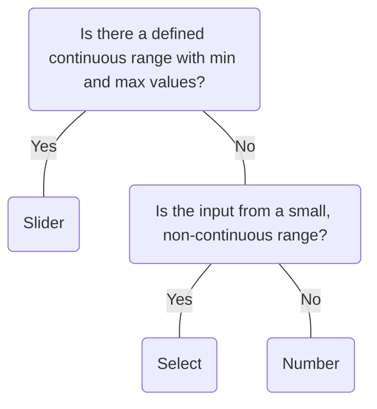

# Slider

## Overview


> Image: Illustration of a Slider component


## When to use this component
- To choose a single number within a range with minimum and maximum values


## When to use another component
- For precise number input where a range is not defined, consider `Number`
- For an input that is from a non-continuous range, consider `Select`



### Check out
- [Number][1]
- [Select][2]

## Behaviors
### Controlled slider
If the slider use case requires more precision, use the slider along with the Number component. <br />
[View controlled Slider example](Slider?section=examples#Controlled)

### Step marks
Sliders with step marks allows users to choose from discrete values. The thumb will snap to the ticks. <br />
[View Slider with step marks example](Slider?section=examples#Step%20marks)

## Usage
### Use descriptive text for custom labels
Sliders support adding custom labels for the range. Keep these succinct and descriptive so that the user knows what the range is depicting.

> Image: The image illustrates two examples of a volume control slider. In the good example, the slider is labeled with descriptive text, showing 


### Avoid selecting ranges instead of values
Sliders do not support selecting a subset range within the range. Currently, the slider thumb can only select a single value.

> Image: The image illustrates two examples of a volume control slider. In the good example, the slider only has one thumb, selecting an exact value. In the bad example, the slider has two thumbs, selecting a subset of a range in the slider. 


## Content guidelines

### Use parallel terminology
Slider labels should briefly describe what the range represents. Define the values at the min and max of the range. For non-numerical ranges, use parallel terminology, like min/max and high/low.

> Image: The image illustrates two examples of a volume control slider with different value labels. In the good example, the slider labels uses parallel terminology of min and max, while the bad example shows the slider labels going from 0 to max.


[1]: ./Number
[2]: ./Select


## Examples


### Uncontrolled

```typescript
import React from 'react';

import Slider from '@splunk/react-ui/Slider';


function Basic() {
    return <Slider min={100} max={500} step={25} defaultValue={300} />;
}

export default Basic;
```


### Controlled

Slider syncing with a Number input.

```typescript
import React, { Component } from 'react';

import ControlGroup from '@splunk/react-ui/ControlGroup';
import Number, { NumberChangeHandler } from '@splunk/react-ui/Number';
import Slider, { SliderChangeHandler } from '@splunk/react-ui/Slider';


class Controlled extends Component<object, { value?: number }> {
    constructor(props: object) {
        super(props);
        this.state = { value: 300 };
    }

    handleSliderChange: SliderChangeHandler = (e, { value }) => {
        this.setState({ value });
    };

    handleNumberChange: NumberChangeHandler = (e, { value }) => {
        this.setState({ value });
    };

    render() {
        return (
            <ControlGroup label="Controls">
                <Slider
                    inline
                    min={100}
                    max={500}
                    step={25}
                    onChange={this.handleSliderChange}
                    value={this.state.value}
                />
                <Number
                    inline
                    min={100}
                    max={500}
                    step={25}
                    value={this.state.value}
                    onChange={this.handleNumberChange}
                    style={{ flexBasis: 40 }}
                />
            </ControlGroup>
        );
    }
}

export default Controlled;
```


### Custom Labels

Labels can be modified or removed. Replacing all labels can create very different experiences, such as exponentially increasing values or ordered values (words only).

```typescript
import React, { Component } from 'react';

import Slider, { SliderChangeHandler } from '@splunk/react-ui/Slider';


class CustomLabels extends Component<object, { displayValue: string; value: number }> {
    static convertValueToLabel(value: number) {
        const trueValue = 10 ** value;
        const trueValueRounded = Math.round(trueValue * 100) / 100;

        return `${trueValueRounded}px`;
    }

    constructor(props: object) {
        super(props);
        this.state = {
            displayValue: CustomLabels.convertValueToLabel(1),
            value: 1,
        };
    }

    handleChange: SliderChangeHandler = (e, { value }) => {
        this.setState({
            displayValue: CustomLabels.convertValueToLabel(value),
            value,
        });
    };

    render() {
        return (
            <Slider
                inline
                displayValue={this.state.displayValue}
                min={0}
                minLabel="sharp"
                max={2}
                maxLabel="blurry"
                step={0.2}
                onChange={this.handleChange}
                value={this.state.value}
            />
        );
    }
}

export default CustomLabels;
```


### Disabled

```typescript
import React from 'react';

import Slider from '@splunk/react-ui/Slider';


function Disabled() {
    return <Slider min={1} max={100} step={1} defaultValue={50} inline disabled />;
}

export default Disabled;
```


### Step Marks

stepMarks can be set to always or never. Defaults to show on focus.

```typescript
import React from 'react';

import Slider from '@splunk/react-ui/Slider';


function StepMarks() {
    return (
        <span>
            <Slider min={100} max={200} step={10} defaultValue={150} stepMarks="always" inline />
            <br />
            <Slider min={100} max={200} step={10} defaultValue={150} stepMarks="never" inline />
        </span>
    );
}

export default StepMarks;
```


### Error

```typescript
import React from 'react';

import Slider from '@splunk/react-ui/Slider';


function Error() {
    return <Slider min={100} max={500} step={25} defaultValue={300} error />;
}

export default Error;
```


## API


### Slider API

#### Props

| Name | Type | Required | Default | Description |
|------|------|------|------|------|
| defaultValue | number | no |  | Set this property instead of value to make value uncontrolled. |
| describedBy | string | no |  | The id of the description. When placed in a ControlGroup, this is automatically set to the ControlGroup's help component. |
| disabled | boolean | no |  | Determines whether or not the slider can be moved. |
| displayValue | string | no |  | The label shown in the tooltip. Defaults to the value. |
| elementRef | React.Ref<HTMLDivElement> | no |  | A React ref which is set to the DOM element when the component mounts and null when it unmounts. |
| error | boolean | no |  | Highlight the Slider as having an error. The thumb and bar background-color turn to accent negative. |
| inline | boolean | no |  | When false, display as inline-block with the default width. |
| inputId | string | no |  | An id for the input, which may be necessary for accessibility, such as for aria attributes. |
| labelledBy | string | no |  | The id of the label. When placed in a ControlGroup, this is automatically set to the ControlGroup's label. |
| max | number | no | 5 | The maximum value of the Slider input. |
| maxLabel | React.ReactNode | no |  | The label shown to the right of the slider. Defaults to the max value. Set to null to remove. |
| min | number | no | 1 | The minimum value of the Slider input. |
| minLabel | React.ReactNode | no |  | The label shown to the left of the slider. Defaults to the min value. Set to null to remove. |
| name | string | no |  | The name is returned with onChange events, which can be used to identify the control when multiple controls share an onChange callback. |
| onChange | SliderChangeHandler | no |  | Return event and data object with slider value. |
| step | number | no | 1 | The step value of the Slider input. |
| stepMarks | 'focus' \| 'always' \| 'never' | no | 'focus' | Determines whether or not the step marks should be shown. Defaults to show on focus. |
| thumbRef | React.Ref<HTMLButtonElement> | no |  | A React ref which is set to the slider thumb when the component mounts and null when it unmounts. |
| value | number | no |  | The value of the slider. Setting this value makes the property controlled. An `onChange` callback is required. |

#### Types

| Name | Type | Description |
|------|------|------|
| SliderChangeHandler | (     event: React.MouseEvent<HTMLDivElement> \| React.KeyboardEvent<HTMLButtonElement> \| MouseEvent,     data: {         name?: string;         value: number;     } ) => void |  |


## Accessibility

> NOT supported by design system: multiple thumbs

## Visual Design
- Color contrast ratio **MUST** be:
    - &gt=4.5:1 [SC 1.4.3][1]
        - Any text to page-background (endpoints, tooltip text)
    - &gt=3:1 for [SC 1.4.11][2]
        - Selected color to page-background
        - Unselected color to page-background
        - Thumb to page-background
    - Focus State: if the focus ring has a radius of [SC 1.4.11][2]
        - &lt 3px: &gt=4.5.1 between thumb &lt&gt focus &lt&gt background
        - &gt 3px: &gt=3.1 between thumb &lt&gt focus &lt&gt background

## States
- Color contrast does not apply to disabled slider

## Interaction Model
- In the case where two inputs are controlling a single value, such as a slider and number input, 
focus **MUST** be on number input to change the value, as it has an easier interaction model on a keyboard than slider.
- Focus visible **MUST** be visible on thumb [SC 2.4.7][3]
- **MUST** have keyboard navigation [SC 2.1][4]
    - <kbd>Tab</kbd> and <kbd>Shift+Tab</kbd>: focus lands on thumb
    - <kbd>Left/Right Arrow</kbd>: moves thumb one step up or down
    - <kbd>Up/Down</kbd>: moves thumb one step up or down
    - <kbd>Home</kbd>: sets the thumb to the first allowed value in its range
    - <kbd>End</kbd>: sets the thumb to the last allowed value in its range

## Implementation
- Implementation **MUST** use either `aria-role="slider"` or HTML `input` with type `range`
- Slider element **MUST** have the following attributes based on its respective implementation:
    - `aria-valuenow/value` set to a decimal value representing the current value of the slider
    - `aria-valuemin/min` set to a decimal value representing the minimun allowed value of the slider
    - `aria-valuemax/max` set to a decimal value representing the maximum allowed value of the slider
- For vertical slider, `aria-orientation` **MUST** be set to `vertical`. The default value of `aria-orientation` for slider is `horizontal`.

[1]: https://www.w3.org/TR/WCAG21/#contrast-minimum
[2]: https://www.w3.org/TR/WCAG21/#non-text-contrast
[3]: https://www.w3.org/TR/WCAG21/#focus-visible
[4]: https://www.w3.org/TR/WCAG21/#keyboard-accessible


