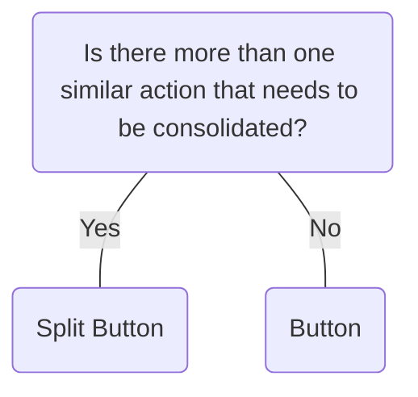

# Split Button

## Overview


> Image: Illustration of a Split Button component


## When to use this component
- When you have two or more actions related to the primary action that need to be consolidated and space is limited.

## When to use another component
Use a button instead of a split button in the following cases:
- When you want to pair a primary and secondary action, for example “Save” and “Cancel”.
- If you have only one primary action in a workflow, for example “Done”.
- If you want to use an icon only and no visible label.



### Check out
- [Button] [1]

## Behaviors

### Change label
Labels can be dynamically swapped for actions that might be repeated.
> Image: Split button labeled 


## Usage

### Primary action
Place the primary action on the main button to guide the most common user intent.
> Image: Two split button examples demonstrating primary action placement. The first example, with a heart eyes emoji, shows a Split button labeled 


### Secondary actions
Ensure the secondary actions in the dropdown are contextually related to the primary action.
> Image: Two split button examples demonstrating secondary actions in the dropdown. The first example, with a heart eyes emoji, shows a Split button labeled 


### Icons
Always include a text label for the primary action in Split button to ensure clarity and accessibility. Icons can be used as supplementary elements but should never replace the text label.
> Image: Two split button examples demonstrating icon usage in labels. The first example, with a heart-eyes emoji, shows a Split button labeled 


### Multiple buttons
Split buttons work best alone or paired with additional buttons, using more than one can create confusion.
> Image: Two examples of split button usage. The first example, with a heart-eyes emoji, shows a single split button labeled 


### Avoid disabling part of the component
Avoid disabling the primary action or secondary menu.
> Image: Two examples showing split button states. The first example, with a heart-eyes emoji, displays an enabled split button labeled 


## Content guidelines
- Start label with a verb when possible.
- Avoid vague or generic language such as “click here” or “read more”; this is not helpful for screen reader users.
- Avoid any acronyms or confusing jargon that may leave a user guessing or afraid to click on a button (SC 2.4.4).

### Label should not exceed three words
Write concise button labels: 1 or 2 words.
> Image: Two examples showing split button label length. The first example, with a heart-eyes emoji, has a concise label, 


### Use sentence-style capitalization
> Image: Two examples showing split button label capitalization. The first example, with a heart-eyes emoji, uses sentence-style capitalization with the label 


### Use precise language
Describe the action. For example, use “Add” when using an existing object in a new context, and use “Create” when making a new object from scratch.
> Image: Two examples showing split button label language. The first example, with a heart-eyes emoji, uses the label 


### Label overflow
While usage guidelines for content recommend one to two words for buttons, for internationalization there might be instances when text needs to overflow.
> Image: Two examples demonstrate split button label overflow. The first example, with a heart-eyes emoji, shows a split button labeled 


[1]: ./Button

## Examples


### Basic

```typescript
import React from 'react';

import Layout from '@splunk/react-ui/Layout';
import SplitButton from '@splunk/react-ui/SplitButton';


export default function Basic() {
    return (
        <Layout>
            <SplitButton>
                <SplitButton.Item>Main action</SplitButton.Item>
                <SplitButton.Item>Option</SplitButton.Item>
                <SplitButton.Item>Another option</SplitButton.Item>
            </SplitButton>
            <SplitButton appearance="primary">
                <SplitButton.Item>Main action</SplitButton.Item>
                <SplitButton.Item>Option</SplitButton.Item>
                <SplitButton.Item>Another option</SplitButton.Item>
            </SplitButton>
            <SplitButton appearance="destructive">
                <SplitButton.Item>Main action</SplitButton.Item>
                <SplitButton.Item>Option</SplitButton.Item>
                <SplitButton.Item>Another option</SplitButton.Item>
            </SplitButton>
            <SplitButton appearance="destructiveSecondary">
                <SplitButton.Item>Main action</SplitButton.Item>
                <SplitButton.Item>Option</SplitButton.Item>
                <SplitButton.Item>Another option</SplitButton.Item>
            </SplitButton>
        </Layout>
    );
}
```


### Disabled

```typescript
import React from 'react';

import Layout from '@splunk/react-ui/Layout';
import SplitButton from '@splunk/react-ui/SplitButton';


export default function Disabled() {
    return (
        <Layout>
            <SplitButton disabled>
                <SplitButton.Item>Main action</SplitButton.Item>
                <SplitButton.Item>Option</SplitButton.Item>
                <SplitButton.Item>Another option</SplitButton.Item>
            </SplitButton>
            <SplitButton appearance="primary" disabled>
                <SplitButton.Item>Main action</SplitButton.Item>
                <SplitButton.Item>Option</SplitButton.Item>
                <SplitButton.Item>Another option</SplitButton.Item>
            </SplitButton>
            <SplitButton appearance="destructive" disabled>
                <SplitButton.Item>Main action</SplitButton.Item>
                <SplitButton.Item>Option</SplitButton.Item>
                <SplitButton.Item>Another option</SplitButton.Item>
            </SplitButton>
            <SplitButton appearance="destructiveSecondary" disabled>
                <SplitButton.Item>Main action</SplitButton.Item>
                <SplitButton.Item>Option</SplitButton.Item>
                <SplitButton.Item>Another option</SplitButton.Item>
            </SplitButton>
        </Layout>
    );
}
```


### Block

By default, Split Buttons exist in inline blocks. Set inline to false to make the Split Button the full width of the parent container.

```typescript
import React from 'react';

import Layout from '@splunk/react-ui/Layout';
import SplitButton from '@splunk/react-ui/SplitButton';


export default function Block() {
    return (
        <Layout style={{ width: '300px', flexDirection: 'column' }}>
            <SplitButton inline={false}>
                <SplitButton.Item>Main action</SplitButton.Item>
                <SplitButton.Item>Option</SplitButton.Item>
                <SplitButton.Item>Another option</SplitButton.Item>
            </SplitButton>

            <SplitButton inline={false} appearance="primary">
                <SplitButton.Item>Primary action</SplitButton.Item>
                <SplitButton.Item>Option</SplitButton.Item>
                <SplitButton.Item>Another option</SplitButton.Item>
            </SplitButton>

            <SplitButton inline={false} appearance="destructive">
                <SplitButton.Item>Destructive action</SplitButton.Item>
                <SplitButton.Item>Option</SplitButton.Item>
                <SplitButton.Item>Another option</SplitButton.Item>
            </SplitButton>
            <SplitButton inline={false} appearance="destructiveSecondary">
                <SplitButton.Item>Destructive secondary action</SplitButton.Item>
                <SplitButton.Item>Option</SplitButton.Item>
                <SplitButton.Item>Another option</SplitButton.Item>
            </SplitButton>
        </Layout>
    );
}
```


### Change Label

The isMain prop can be used to change which Item appears as the main button.

```typescript
import React, { useState } from 'react';

import SplitButton from '@splunk/react-ui/SplitButton';


export default function ChangeLabel() {
    const options = ['Create a merge commit', 'Squash and merge', 'Rebase and merge'];
    const [selected, setSelected] = useState(0);

    const handleMenuItemClick = (index: number) => {
        setSelected(index);
    };

    return (
        <SplitButton aria-label="PR merge actions">
            {options.map((option, index) => {
                return (
                    <SplitButton.Item
                        aria-label={option}
                        key={option}
                        isMain={selected === index}
                        onClick={() => handleMenuItemClick(index)}
                    >
                        {option}
                    </SplitButton.Item>
                );
            })}
        </SplitButton>
    );
}
```


## API


### SplitButton API

#### Props

| Name | Type | Required | Default | Description |
|------|------|------|------|------|
| appearance | 'default' \| 'secondary' \| 'primary' \| 'destructive' \| 'destructiveSecondary' | no | 'secondary' | **DEPRECATED**: Value 'default' Changes the style of the main button and toggle.  The `default` value is deprecated and will be removed in a future major version. |
| children | React.ReactNode | no |  | Must be `SplitButton.Item`. By default the first child becomes the main button. The remaining children become dropdown items. |
| disabled | boolean | no |  | Prevents main button and dropdown toggle from being clicked. |
| elementRef | React.Ref<HTMLDivElement> | no |  | A React ref which is set to the DOM element when the component mounts and null when it unmounts. |
| inline | boolean | no | true | Restricts the horizontal size of the button. Set `inline` to `false` to remove the right margin and stretch the button to the full width of its container. |
| onClick | React.MouseEventHandler<HTMLDivElement> | no |  | A callback for when the main button or toggle is clicked. |
| toggleRef | React.Ref<HTMLButtonElement \| HTMLAnchorElement> | no |  | A React ref which is set to the dropdown toggle when the component mounts and null when it unmounts. |


### SplitButton.Item API

An item within a `SplitButton`.

#### Props

| Name | Type | Required | Default | Description |
|------|------|------|------|------|
| children | React.ReactNode | no |  | Becomes the label. |
| disabled | boolean | no |  | Prevents user from clicking the button. |
| elementRef | React.Ref<HTMLButtonElement \| HTMLAnchorElement> | no |  | A React ref which is set to the DOM element when the component mounts and null when it unmounts. |
| icon | React.ReactNode | no |  | Applies an icon in front of the label. |
| isMain | boolean | no |  | Becomes the main button. If no `Item`s have this prop, the first `Item` is the main button. |
| onClick | ItemClickHandler | no |  | A callback for when an item is clicked. |

#### Types

| Name | Type | Description |
|------|------|------|
| ItemClickHandler | (     event: React.MouseEvent<HTMLAnchorElement \| HTMLButtonElement>,     data: {         action?: string;         icon?: React.ReactNode;         label?: React.ReactNode;         value?: any; // eslint-disable-line @typescript-eslint/no-explicit-any     } ) => void |  |


