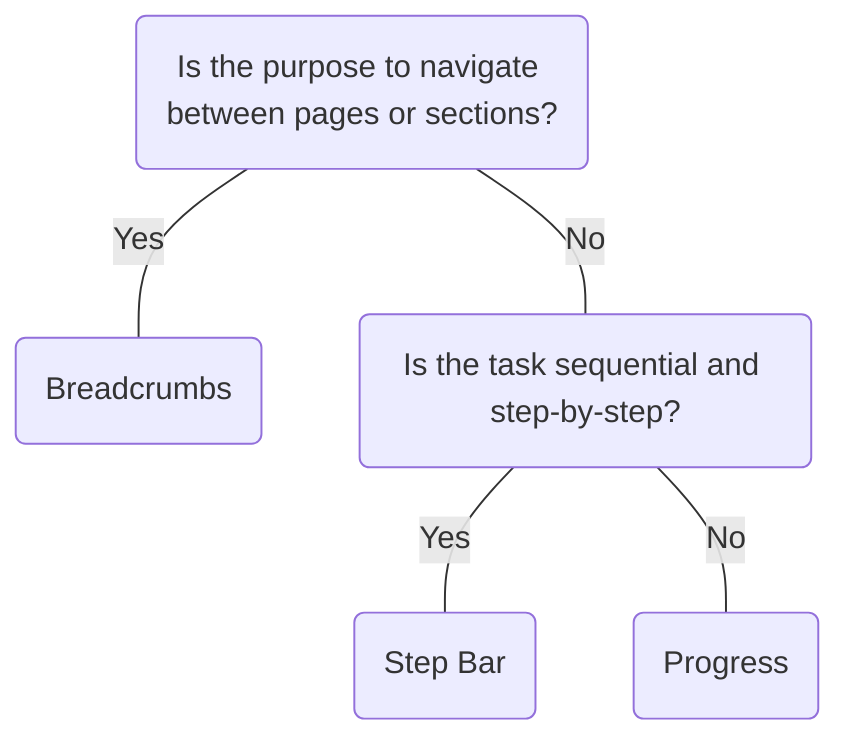

# Step Bar

## Overview


> Image: Illustration of a Step Bar component.


## When to use this component
- You need to guide a user through multiple steps.
- To display a sequence of related tasks that must be completed in a linear order.
- When users need to track their progress, such as in long forms or troubleshooting steps.


## When to use another component
- For navigation between pages, use Breadcrumb instead.
- To represent overall progress outside of a linear flow, use Progress instead.



### Check out
- [Breadcrumbs][1]
- [Progress][2]

## Behaviors

### Interaction
 Use back and next buttons to navigate to the next step. The Step Bar component is not interactive.

 > Image: Example laying emphasis on the interactivity of the Step Bar component. The first example with the heart eyes emoji displays the mouse navigating the Step Bar component through the back & next buttons, whereas the second example with the grimacing emoji displays the navigating through the Step Bar component by clicking on the Step Bar component itself.


## Usage

### Content alignment
 Content in a step should always relate to its corresponding step title.

> Image: Example laying emphasis on content within a step being related to the step title. The first example with the heart eyes emoji displays review summary content under the 


### No less than two steps

> Image: Example laying emphasis on least number of steps provided. The first example with the heart eyes emoji displays 2 steps, whereas the second example with the grimacing emoji displays 1 step.


### Step title content
#### Provide context
 Provide context about the contents of the step with the help of the step title.

> Image: Example laying emphasis on providing context within the step title. The first example with the heart eyes emoji displays step titles that provide context to the step, whereas the second example with the grimacing emoji displays no step titles.


#### Be concise
 Step titles should be kept as descriptive as possible while remaining concise.

> Image: Example laying emphasis on giving concise labels to the step title. The first example with the heart eyes emoji displays a concise label for the step title, whereas the second example with the grimacing emoji displays a longer, more complicated one.


## Content

### Use sentence case, not title case.
 Only the first letter of the word should be capitalized unless it's a proper noun.

 > Image: Example laying emphasis on the capitalization in the Step Bar. The first example with the heart eyes emoji displays the step title to use sentence case, whereas the second example with the grimacing emoji displays step title to use title case.


[1]: ./Breadcrumbs
[2]: ./Progress

## Examples


### numSteps

```typescript
import React, { useCallback, useState } from 'react';

import ChevronLeft from '@splunk/react-icons/ChevronLeft';
import ChevronRight from '@splunk/react-icons/ChevronRight';
import Button from '@splunk/react-ui/Button';
import Layout from '@splunk/react-ui/Layout';
import StepBar from '@splunk/react-ui/StepBar';

const numSteps = 4;


function Basic() {
    const [activeStepId, setActiveStepId] = useState(0);

    const handlePrevious = useCallback(() => {
        setActiveStepId(activeStepId - 1);
    }, [activeStepId]);

    const handleNext = useCallback(() => {
        setActiveStepId(activeStepId + 1);
    }, [activeStepId]);

    return (
        <div>
            <StepBar activeStepId={activeStepId}>
                <StepBar.Step>Select item</StepBar.Step>
                <StepBar.Step>Configure required</StepBar.Step>
                <StepBar.Step>Configure optional</StepBar.Step>
                <StepBar.Step>Review</StepBar.Step>
            </StepBar>
            <br />
            <br />
            <Layout>
                <Button
                    icon={<ChevronLeft />}
                    label="Back"
                    appearance="default"
                    disabled={activeStepId === 0}
                    onClick={handlePrevious}
                />
                <Button
                    label={activeStepId < numSteps - 1 ? 'Next' : 'Done'}
                    appearance="primary"
                    onClick={activeStepId < numSteps - 1 ? handleNext : undefined}
                >
                    <ChevronRight />
                </Button>
            </Layout>
        </div>
    );
}

export default Basic;
```


### numSteps

```typescript
import React, { useCallback, useState } from 'react';

import ChevronLeft from '@splunk/react-icons/ChevronLeft';
import ChevronRight from '@splunk/react-icons/ChevronRight';
import Button from '@splunk/react-ui/Button';
import Layout from '@splunk/react-ui/Layout';
import StepBar from '@splunk/react-ui/StepBar';

const numSteps = 4;


function StepBarError() {
    const [activeStepId, setActiveStepId] = useState(1);
    const handlePrevious = useCallback(() => {
        setActiveStepId(activeStepId - 1);
    }, [activeStepId]);

    const handleNext = useCallback(() => {
        setActiveStepId(activeStepId + 1);
    }, [activeStepId]);

    return (
        <div>
            <StepBar activeStepId={activeStepId}>
                <StepBar.Step>Select item</StepBar.Step>
                <StepBar.Step error>Configure required</StepBar.Step>
                <StepBar.Step>Configure optional</StepBar.Step>
                <StepBar.Step>Review</StepBar.Step>
            </StepBar>
            <br />
            <br />
            <Layout>
                <Button
                    icon={<ChevronLeft />}
                    label="Back"
                    appearance="default"
                    disabled={activeStepId === 0}
                    onClick={handlePrevious}
                />
                <Button
                    label={activeStepId < numSteps - 1 ? 'Next' : 'Done'}
                    appearance="primary"
                    onClick={activeStepId < numSteps - 1 ? handleNext : undefined}
                    disabled={activeStepId === 1}
                >
                    <ChevronRight />
                </Button>
            </Layout>
        </div>
    );
}

export default StepBarError;
```


### numSteps

```typescript
import React, { useCallback, useState } from 'react';

import ChevronLeft from '@splunk/react-icons/ChevronLeft';
import ChevronRight from '@splunk/react-icons/ChevronRight';
import Button from '@splunk/react-ui/Button';
import Layout from '@splunk/react-ui/Layout';
import StepBar from '@splunk/react-ui/StepBar';

const numSteps = 4;


function Vertical() {
    const [activeStepId, setActiveStepId] = useState(0);

    const handlePrevious = useCallback(() => {
        setActiveStepId(activeStepId - 1);
    }, [activeStepId]);

    const handleNext = useCallback(() => {
        setActiveStepId(activeStepId + 1);
    }, [activeStepId]);

    return (
        <div>
            <StepBar activeStepId={activeStepId} orientation="vertical" style={{ width: '250px' }}>
                <StepBar.Step>Select item</StepBar.Step>
                <StepBar.Step>Configure required</StepBar.Step>
                <StepBar.Step>Configure optional</StepBar.Step>
                <StepBar.Step>Review</StepBar.Step>
            </StepBar>
            <br />
            <br />
            <Layout>
                <Button
                    icon={<ChevronLeft />}
                    label="Back"
                    appearance="default"
                    disabled={activeStepId === 0}
                    onClick={handlePrevious}
                />
                <Button
                    label={activeStepId < numSteps - 1 ? 'Next' : 'Done'}
                    appearance="primary"
                    onClick={activeStepId < numSteps - 1 ? handleNext : undefined}
                >
                    <ChevronRight />
                </Button>
            </Layout>
        </div>
    );
}

export default Vertical;
```


## API


### StepBar API

#### Props

| Name | Type | Required | Default | Description |
|------|------|------|------|------|
| activeStepId | number | yes |  | The `stepId` of the `StepBar.Step` to activate. |
| children | React.ReactNode | no |  | Must be `StepBar.Step`. |
| elementRef | React.Ref<HTMLUListElement> | no |  | A React ref which is set to the DOM element when the component mounts and null when it unmounts. |
| inline | boolean | no | false | Setting inline to true makes the Step Bar an inline element. It assumes its minimum width. |
| orientation | 'horizontal' \| 'vertical' | no | 'horizontal' | The flow direction of steps. |


### StepBar.Step API

#### Props

| Name | Type | Required | Default | Description |
|------|------|------|------|------|
| children | React.ReactNode | no |  |  |
| elementRef | React.Ref<HTMLLIElement> | no |  | A React ref which is set to the DOM element when the component mounts and null when it unmounts. |
| error | boolean | no | false | Displays active step with alert icon. |
| stepId | number | no |  | A unique `id` for this step and used by the `StepBar` to keep track of the open `Step`. Defaults to a zero-based index matching the component's position in `StepBar`. |


