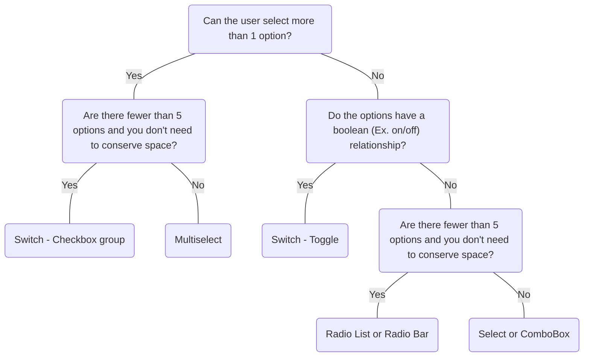

# Switch

## Overview


> Image: Illustration of a switch component.


<Message appearance="fill" type="info">
    <div>All data entry components should be wrapped in a <Link to="ControlGroup">Control Group</Link> to provide a label, error states, and help or error text, ensuring an accessible experience for all users.</div>
</Message>

## When to use this component
### Toggle
- There's a binary choice for enabling a setting, like on/off, true/false, enable/disable, or activate/deactivate.
- Toggles can be grouped when the items can be independently controlled.

### Checkbox
<Message appearance="fill" type="warning">
    <div>Prefer the <Link to="Checkbox">Checkbox</Link> component over the checkbox appearance of Switch.</div>
</Message>

## When to use another component
- If multiple related options can be selected from a list, use Checkbox
- If there are more than two choices or two choices that don't map to a boolean relationship (such as on/off) use Radio List or Radio Bar
- If there are multiple options, space conservation is important, and only one option can be selected at a time use a Select or Combobox
- If making a selection from a long list of items, consider using Multiselect instead.
- If only one option in a set can be selected, use Radio List or Radio Bar instead.



### Check out
- [Radio List][1]
- [Radio Bar][2]
- [Combo Box][3]
- [Select][4]
- [Multiselect][5]

## Usage

### Grouping settings
Checkboxes visually group similar items effectively and take up less space than switches.

> Image: Examples of a group of two Switches, 


### In forms
Toggles work best if changing the state is immediately effective and there's no need for an additional action to apply or save a change. Consider Checkboxes or Radio Lists within a form containing other elements that need to be saved or submitted.

> Image: Example of Notification settings with a group of two Switches, 


### Toggle groups
When grouped, toggles control binary options, not opposing states. A binary option represents a single selection that is either on or off.

> Image: Examples of a group of two Toggles grouped with a title. In the first example with heart eyes emoji, the Toggles are labeled, 


## Content

### Be concise
Use sentence-style capitalization and keep labels concise.

> Image: Examples of switch label length: The first example with the heart eyes emoji has a concise label, 


[1]: ./Radiolist
[2]: ./Radiobar
[3]: ./ComboBox
[4]: ./Select
[5]: ./Multiselect
[6]: ./Dropdown
[7]: ./Checkbox

## Examples


### Basic

```typescript
import React, { useState } from 'react';

import Switch from '@splunk/react-ui/Switch';


const Basic = () => {
    const [enableBluetooth, setEnableBluetooth] = useState(true);
    const [enableWifi, setEnableWifi] = useState(false);

    return (
        <>
            <Switch
                appearance="toggle"
                selected={enableBluetooth}
                onClick={() => setEnableBluetooth(!enableBluetooth)}
            >
                Enable bluetooth
            </Switch>
            <Switch
                appearance="toggle"
                selected={enableWifi}
                onClick={() => setEnableWifi(!enableWifi)}
            >
                Enable wifi
            </Switch>
        </>
    );
};

export default Basic;
```


### Disabled

```typescript
import React from 'react';

import Switch from '@splunk/react-ui/Switch';


const Disabled = () => {
    return (
        <>
            <Switch appearance="toggle" disabled selected>
                Enable bluetooth
            </Switch>
            <Switch appearance="toggle" disabled>
                Enable wifi
            </Switch>
        </>
    );
};

export default Disabled;
```


## API


### Switch API

`Switch` is a basic form control with an on/off state.

#### Props

| Name | Type | Required | Default | Description |
|------|------|------|------|------|
| appearance | 'checkbox' \| 'toggle' | no | 'checkbox' | **DEPRECATED**: Value 'checkbox'. Consider using the `Checkbox` component instead. Determines if the component renders as a checkbox or toggle.  The 'checkbox' value is deprecated and will be removed in a future major version. |
| children | React.ReactNode | no |  |  |
| describedBy | string | no |  | The id of the description. When placed in a ControlGroup, this is automatically set to the ControlGroup's help component. |
| disabled | boolean | no |  |  |
| elementRef | React.Ref<HTMLDivElement> | no |  | A React ref which is set to the DOM element when the component mounts, and null when it unmounts. |
| error | boolean | no |  | Highlight the field as having an error only when appearance is 'checkbox'. |
| id | string | no |  | If `Switch` is not provided children as the label, an id can be provided for the control. Set a label's for attribute to this id to link the two elements. |
| inline | boolean | no |  | Make the control an inline block with variable width. |
| labelledBy | string | no |  | If `Switch` is not provided children as the label, an id can be provided to another element. |
| onClick | SwitchClickHandler \| SwitchCheckboxWithSomeClickHandler | no |  |  |
| selected | boolean \| 'some' | no |  | 'some' is only valid when appearance is 'checkbox'. The current value of `selected` is passed to the onClick handler. |
| selectedLabel | string | no |  | **DEPRECATED**: This prop is deprecated and will be removed in the next major version. The customized content presented to screen readers when selected. |
| someSelectedLabel | string | no |  | **DEPRECATED**: This prop is deprecated and will be removed in the next major version. The customized content presented to screen readers when selected="some". |
| toggleRef | React.Ref<HTMLAnchorElement \| HTMLButtonElement \| HTMLSpanElement> | no |  | A React ref which is set to the toggle when the component mounts and null when it unmounts. |
| unselectedLabel | string | no |  | **DEPRECATED**: This prop is deprecated and will be removed in the next major version. The customized content presented to screen readers when unselected. |
| value | any | no |  | The `value` is used as an identifier and is passed to the `onClick` handler. This is useful when managing a group of switches with a single `onClick` handler. |

#### Types

| Name | Type | Description |
|------|------|------|
| SwitchCheckboxWithSomeClickHandler | (     event: React.MouseEvent<HTMLButtonElement>,     data: {         selected: boolean \| 'some';         value?: any; // eslint-disable-line @typescript-eslint/no-explicit-any     } ) => void |  |
| SwitchClickHandler | (     event: React.MouseEvent<HTMLButtonElement>,     data: {         selected: boolean;         value?: any; // eslint-disable-line @typescript-eslint/no-explicit-any     } ) => void |  |


## Accessibility

## Switch / Checkbox
## Visual Design

- Color contrast ratio **MUST** be:
    - &gt=4.5:1 for Label text to page-background (all states) [SC 1.4.3][1]
    - &gt=3:1 for [SC 1.4.11][2]:
        - For toggle, circle to toggle-background-color
        - For checkbox, checkmark to checkbox-background (selected)
        - Border to page-background (active)
    - Focus State: if the focus ring has a radius of [SC 1.4.11][2]:
        - &lt 3px: &gt=4.5.1 between button &lt&gt focus &lt&gt background
        - &gt 3px: &gt=3.1 between button &lt&gt focus &lt&gt background

## States

- Color contrast rules do not apply to disabled checkbox

## Interaction Model

- Toggle:
    - Focus management
    - **MUST** have keyboard navigation [SC 2.1][3]:
        - <kbd>Tab</kbd> and <kbd>Shift</kbd>+<kbd>Tab</kbd> to focus on checkbox from element before or after in meaningful sequence
        - <kbd>Space</kbd> and <kbd>Enter</kbd> to change state to on or off 

- Checkbox:
    - Checkbox **SHOULD** have `tabindex="0"` to make checkboxes focusable by keyboard
    - **MUST** have keyboard navigation [SC 2.1][3]:
        - <kbd>Tab</kbd> and <kbd>Shift+Tab</kbd> to focus on checkbox from element before or after in
            a meaningful sequence
        - <kbd>Space</kbd> to change status to...

            - Simple State: `selected`, `unselected`
            - Tri-state: `selected`, `unselected`, `mixed-state`

## Implementation

- Toggle:
    - Screen reader **MUST** announce when toggle is focused [SC 4.1.2][4]:
        - Name of toggle(label)
        - `"Switch"` or `"Toggle"` (role's name is dependent on browser)
        - `"On"` or `"Off"` (value)

- Checkbox:
    - Screen reader **MUST** announce when checkbox is focused [SC 4.1.2][4]:
        - Label (name)
        - `"checkbox"` (role)
        - `"unchecked"` or `"checked"`, `"mixed"` (value)
    - **MUST** include ARIA labels: [SC 4.1.2][4]:
        - When checked, `aria-checked=true`
        - When not checked, `aria-checked=false`
        - when partially checked, `aria-checked=mixed`
    - If checkboxes are in a **group** the following **MUST** apply for screen reader:
        - Upon first focus into the group, announce how many checkboxes are in that list
        - Name of group
    - When developing a parent-child checkbox component, the following **MUST** apply:
        - Focused checkbox:
            - <kbd>Space</kbd>: cycle the checked state of the checkbox between checked, unchecked and mixed
            - <kbd>Tab</kbd>: move focus to the next interactive element after checkbox
            - <kbd>Shift+Tab</kbd>: move focus to the previous interactive element
        - Parent checkbox:
            - Unchecked makes all controlled checkboxes unchecked
            - Checked makes all controlled checkboxes checked
            - Mixed makes all the controlled checkboxes return to the last state the user selected for the particular checkbox or default state
        - Child checkbox:
            - Checked: all children checkboxes will check parent checkbox
            - Unchecked: all children checkboxes will uncheck parent checkbox
            - Checking some will partially check (mixed) the parent checkbox

[1]: https://www.w3.org/TR/WCAG21/#contrast-minimum
[2]: https://www.w3.org/TR/WCAG21/#non-text-contrast
[3]: https://www.w3.org/TR/WCAG21/#keyboard-accessible
[4]: https://www.w3.org/TR/WCAG21/#name-role-value


