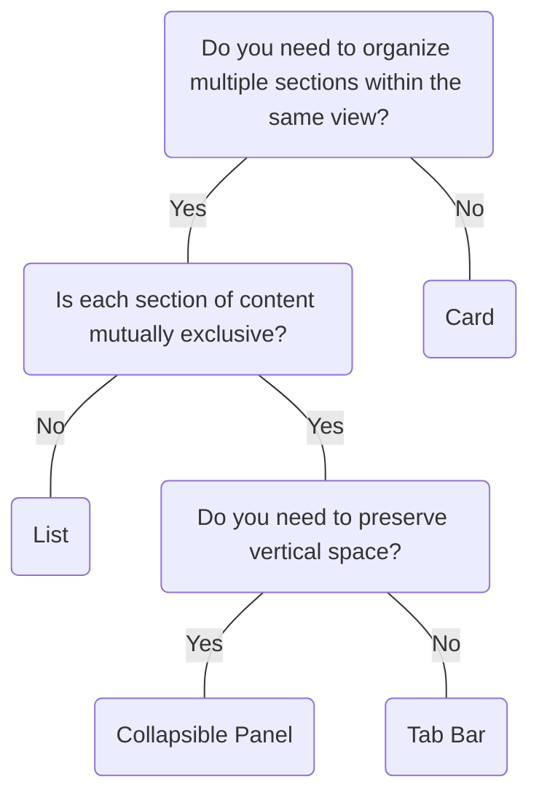

# Tab Bar

## Overview


> Image: Illustration of a Tab Bar component.


## When to use this component
- To group related content into different categories.
- Space is limited and you want to present multiple options to users.
- To organize forms, dashboards or other content to keep users focused on their primary tasks.

## When to use another component
- Consider using a Collapsible Panel if the content is non-essential or supplemental.
- Users need to navigate to a specific page in a single view; consider a Paginator.
- Content requires immediate attention; try using a Modal.
- Use a Switch - Toggle when choices are opposing options (on/off, yes/no).



### Check out
- [Collapsible Panel][1]
- [Paginator][2]
- [Modal][3]
- [Switch][4]
- [Card][5]
- [List][6]

## Behaviors

### Always display a selection
By default, select the first Tab when showcasing a Tab Bar to indicate its content.

> Image: Example showing the importance of always having a selected Tab in a Tab Bar. The first example with the heart eyes emoji displays a selected Tab and the second example with a grimacing emoji displays no selected Tabs.


## Usage

### Pair icons with labels
Only using icons isn’t an effective way to communicate Tab content.

> Image: Example showing how to correctly use icons within the Tab Bar component. The first example with the heart eyes emoji displays three Tabs, each with an icon that corresponds to their respective labels: 


#### Make icons consistent
Maintain visual balance when using icons. All Tab Bar labels should include them.

> Image: Example showing how to maintain a visual balance while using the Tab Bar component. The first example with the heart eyes emoji displays consistent use of icons in all Tabs, where as the second example with a grimacing emoji displays inconsistent icon usage in the Tabs.


### No less than two Tab items

> Image: Example showing the minimum number of tabs required (at least 2). The first example with the heart eyes emoji displays 2 Tabs in the Tab Bar, whereas the second example with a grimacing emoji displays only 1 Tab in the Tab Bar.


### No more than seven Tab items
Limit the Tab Bar component to no more than seven tab items, following Miller’s Law, which suggests that people can effectively manage around 7 (+/- 2) chunks of information at once. This principle helps to reduce cognitive load, allowing users to navigate and comprehend the available options more easily.

> Image: Example showing the maximum number of tabs required - at most 7 (based on Miller


### Content organization
Content within a Tab should be directly related to the selected Tab title.

> Image: Example showing how content within a Tab should be directly related to the selected Title. The first example with the heart eyes emoji displays a correlation between Tab contents and Tab Title: 


## Content

### Use sentence case, not title case.
Only the first letter of the first word should be capitalized unless it's a proper noun.

> Image: Example showing the comparison of how to correctly use sentence case and capitalization in Tab titles. The first example with the heart eyes emoji displays the title written in sentence case, with only the first letter of the first word capitalized: 


> Image: Example showing the comparison of how to correctly use sentence case and capitalization in Tab titles. The first example with the heart eyes emoji displays the title written in sentence case, with only the first letter of the first word capitalized: 


### Be concise
Avoid articles (“a”, “an”, “the”) and do not end Tab labels with punctuation.

> Image: Example showing the correct article usage in a Tab title. The first example with the heart eyes emoji displays the use of no articles: 


> Image: Example showing the correct punctuation usage in a Tab title. The first example with the heart eyes emoji displays the use of no punctuation: 


### Avoid truncation
Labels shouldn’t drop to a second line, so use clear, simple naming.

> Image: Example showing how to use clear and simple label names for Tabs titles in a Tab Bar. The first example with the heart eyes emoji displays a Tab title with only 1-2 words, whereas the second example with a grimacing emoji displays a Tab title that is too long and should be avoided.


[1]: ./Collapsiblepanel
[2]: ./Paginator
[3]: ./Modal
[4]: ./Switch
[5]: ./Card
[6]: ./List

## Examples


### Basic

```typescript
import React, { useCallback, useState } from 'react';

import TabBar, { TabBarChangeHandler } from '@splunk/react-ui/TabBar';


function Basic() {
    const [activeTabId, setActiveTabId] = useState<string | undefined>('one');

    const handleChange: TabBarChangeHandler = useCallback((e, { selectedTabId }) => {
        setActiveTabId(selectedTabId);
    }, []);

    return (
        <TabBar activeTabId={activeTabId} onChange={handleChange}>
            <TabBar.Tab label="Tab one" tabId="one" />
            <TabBar.Tab label="Tab two" tabId="two" />
            <TabBar.Tab label="Tab three" tabId="three" />
            <TabBar.Tab label="Tab four" tabId="four" />
            <TabBar.Tab label="Tab five" tabId="five" />
        </TabBar>
    );
}

export default Basic;
```


### With count

```typescript
import React, { useCallback, useState } from 'react';

import TabBar, { TabBarChangeHandler } from '@splunk/react-ui/TabBar';


function WithCount() {
    const [activeTabId, setActiveTabId] = useState<string | undefined>('one');

    const handleChange: TabBarChangeHandler = useCallback((e, { selectedTabId }) => {
        setActiveTabId(selectedTabId);
    }, []);

    return (
        <TabBar activeTabId={activeTabId} onChange={handleChange}>
            <TabBar.Tab label="Tab one" tabId="one" count={1} />
            <TabBar.Tab disabled label="Tab two" tabId="two" count={13} />
            <TabBar.Tab label="Tab three" tabId="three" count={0} />
            <TabBar.Tab label="Tab four" tabId="four" count={4} />
            <TabBar.Tab label="Tab five" tabId="five" count={908} />
        </TabBar>
    );
}

export default WithCount;
```


### Icons

Icons can be used in tabs to provide additional context. Use icons sparingly and only when they add value that the text alone cannot communicate. Icon only tabs are not recommended. If you do use an icon only tab, a tooltip is required to provide an accessible name to the tab.

```typescript
import React, { useCallback, useState } from 'react';

import ChartBar from '@splunk/react-icons/ChartBar';
import Layout from '@splunk/react-icons/Layout';
import List from '@splunk/react-icons/List';
import Magnifier from '@splunk/react-icons/Magnifier';
import Table from '@splunk/react-icons/Table';
import TabBar, { TabBarChangeHandler } from '@splunk/react-ui/TabBar';


function IconsLeft() {
    const [activeTabId, setActiveTabId] = useState<string | undefined>('search');

    const handleChange: TabBarChangeHandler = useCallback((e, { selectedTabId }) => {
        setActiveTabId(selectedTabId);
    }, []);
    return (
        <TabBar activeTabId={activeTabId} onChange={handleChange}>
            <TabBar.Tab label="Search" icon={<Magnifier />} tabId="search" />
            <TabBar.Tab label="Digger" icon={<List />} tabId="events" />
            <TabBar.Tab label="Statistics" icon={<Table />} tabId="data" />
            <TabBar.Tab label="Visualizations" icon={<ChartBar />} tabId="dist" />
            <TabBar.Tab label="Dashboards" icon={<Layout />} tabId="dashboards" />
        </TabBar>
    );
}

export default IconsLeft;
```


### Vertical

```typescript
import React, { useCallback, useState } from 'react';

import TabBar, { TabBarChangeHandler } from '@splunk/react-ui/TabBar';


function Vertical() {
    const [activeTabId, setActiveTabId] = useState<string | undefined>('one');

    const handleChange: TabBarChangeHandler = useCallback((e, { selectedTabId }) => {
        setActiveTabId(selectedTabId);
    }, []);

    return (
        <TabBar activeTabId={activeTabId} onChange={handleChange} layout="vertical">
            <TabBar.Tab label="Tab one" tabId="one" />
            <TabBar.Tab label="Tab two" tabId="two" />
            <TabBar.Tab label="Tab three" tabId="three" />
            <TabBar.Tab label="Tab four" tabId="four" />
            <TabBar.Tab label="Tab five" tabId="five" />
        </TabBar>
    );
}

export default Vertical;
```


### Vertical icons

```typescript
import React, { useCallback, useState } from 'react';

import ChartBar from '@splunk/react-icons/ChartBar';
import Layout from '@splunk/react-icons/Layout';
import List from '@splunk/react-icons/List';
import Magnifier from '@splunk/react-icons/Magnifier';
import Table from '@splunk/react-icons/Table';
import TabBar, { TabBarChangeHandler } from '@splunk/react-ui/TabBar';


function VerticalIconsLeft() {
    const [activeTabId, setActiveTabId] = useState<string | undefined>('search');

    const handleChange: TabBarChangeHandler = useCallback((e, { selectedTabId }) => {
        setActiveTabId(selectedTabId);
    }, []);

    return (
        <TabBar activeTabId={activeTabId} onChange={handleChange} layout="vertical">
            <TabBar.Tab label="Search" icon={<Magnifier />} tabId="search" />
            <TabBar.Tab label="Digger" icon={<List />} tabId="events" />
            <TabBar.Tab label="Statistics" icon={<Table />} tabId="data" />
            <TabBar.Tab label="Visualizations" icon={<ChartBar />} tabId="dist" />
            <TabBar.Tab label="Dashboards" icon={<Layout />} tabId="dashboards" />
        </TabBar>
    );
}

export default VerticalIconsLeft;
```


### Disabled

```typescript
import React, { useCallback, useState } from 'react';

import TabBar, { TabBarChangeHandler } from '@splunk/react-ui/TabBar';


function Disabled() {
    const [activeTabId, setActiveTabId] = useState<string | undefined>('one');

    const handleChange: TabBarChangeHandler = useCallback((e, { selectedTabId }) => {
        setActiveTabId(selectedTabId);
    }, []);

    return (
        <TabBar activeTabId={activeTabId} onChange={handleChange}>
            <TabBar.Tab label="Tab one" tabId="one" />
            <TabBar.Tab disabled label="Tab two" tabId="two" />
            <TabBar.Tab disabled label="Tab three" tabId="three" />
            <TabBar.Tab disabled label="Tab four" tabId="four" />
            <TabBar.Tab label="Tab five" tabId="five" />
        </TabBar>
    );
}

export default Disabled;
```


### Tooltips

Tooltips must be used when the entire tab label is not visible: e.g. due to truncation. The tooltip will override the accessible name of the tab. Tooltips should not be used to add a description or additional information.

```typescript
import React, { useCallback, useState } from 'react';

import TabBar, { TabBarChangeHandler } from '@splunk/react-ui/TabBar';


function Tooltips() {
    const [activeTabId, setActiveTabId] = useState<string | undefined>('one');

    const handleChange: TabBarChangeHandler = useCallback((e, { selectedTabId }) => {
        setActiveTabId(selectedTabId);
    }, []);

    return (
        <TabBar activeTabId={activeTabId} onChange={handleChange}>
            <TabBar.Tab label="Tab one" tabId="one" tooltip="1.0" />
            <TabBar.Tab label="Tab two" tabId="two" tooltip="2.0" />
            <TabBar.Tab label="Tab three" tabId="three" tooltip="3.0" />
            <TabBar.Tab label="Tab four" tabId="four" tooltip="4.0" />
            <TabBar.Tab label="Tab five" tabId="five" tooltip="5.0" />
        </TabBar>
    );
}

export default Tooltips;
```


## API


### TabBar API

#### Props

| Name | Type | Required | Default | Description |
|------|------|------|------|------|
| activeTabId | string | no |  | The `tabId` of the `TabBar.Tab` to activate. |
| autoActivate | boolean | no |  | If `true`, tabs will trigger the `onChange` callback when they receive focus. |
| children | React.ReactNode | no |  | Must be `TabBar.Tab`. |
| elementRef | React.Ref<HTMLDivElement> | no |  | A React ref which is set to the DOM element when the component mounts and null when it unmounts. |
| iconPosition | 'above' \| 'left' | no | 'left' | **DEPRECATED**: This prop is deprecated and will be removed in the next major version. Position of icon in `TabBar.Tab` if it has an icon. Defaults to "left". |
| layout | 'horizontal' \| 'vertical' | no | 'horizontal' | The layout of tabs. |
| maxTabWidth | number | no |  | Max width of each `TabBar.Tab` in pixels. Leave blank for auto max width. |
| onChange | TabBarChangeHandler | no |  | A callback that receives the event and data (`selectedTabId`). |

#### Types

| Name | Type | Description |
|------|------|------|
| TabBarChangeHandler | (     event: React.MouseEvent<HTMLButtonElement> \| React.FocusEvent<HTMLButtonElement>,     data: { selectedTabId?: string } ) => void |  |
| TabBarOnKeyDownHandler | (event: React.KeyboardEvent<HTMLInputElement>) => void |  |


### TabBar.Tab API

#### Props

| Name | Type | Required | Default | Description |
|------|------|------|------|------|
| ariaControls | string | no |  | The ariaControls prop is the element `id` of the content displayed when the tab is selected. |
| count | number | no |  | Inserts number in tab label. |
| disabled | boolean | no |  | Prevents user from clicking the tab. |
| elementRef | React.Ref<HTMLButtonElement \| HTMLAnchorElement> | no |  | A React ref which is set to the DOM element when the component mounts and null when it unmounts. |
| icon | React.ReactNode | no |  | See Icon documentation for more information. |
| id | string | no |  | Placed on the clickable element. For accessibility, the related content must have an `aria-labelledby` attribute that matches this `id`. The `id` must be unique within the document, unlike `tabId`, which must be unique within the `TabBar` instance. |
| label | React.ReactNode | no |  | The text shown in the button. |
| tabId | string | no |  | A unique `id` for this tab and used by the `TabBar` to keep track of the open tab. If not provided, one will be automatically generated for the tab. |
| to | string | no |  | Identifies the URL for a link. If set, Splunk UI applies an <a> tag instead of a <button> tag. |
| tooltip | React.ReactNode | no |  | Content to show in a tooltip when the user hovers over or focuses on the Tab.  Note: The tooltip will override the label for the Tab for screen readers. |


## Accessibility

> NOT suported by design system: tab list overflow, configurable (add, delete, reorder) tab lists

## Visual Design
- Color contrast ratio **MUST** be:
    - &gt= 4.5:1 for normal text: 14 pt (typically 18.66px) and bold or larger [SC 1.4.3][1]
    - &gt= 3:1 for large text: 18 pt (typically 24px) or larger [SC 1.4.3][1]
    - &gt= 3:1 for tab bar against page background [SC 1.4.11][2]
    - Focus State: if the focus ring has a radius of [SC 1.4.11][2]
        - &lt 3px: &gt= 4.5.1 between button &lt&gt focus &lt&gt background
        - &gt 3px: &gt= 3.1 button button &lt&gt focus &lt&gt background
    - `alt=""` for decorative icons [SC 1.1.1][3]

## States
-  Color contrast guidelines do not apply to disabled tabs

## Interaction Design
- **Define Manual vs. Automatic:** Designers **MUST** specify which interaction model they want in specs for engineering. By default, Splunk Design System uses manual tabs and supports automatic tabs. 
    - **Automatic activation:** When a user focuses on a tab, it automatically loads. This is recommended for static text and some images.
    - **Manual activation:** A user must click the tab or use <kbd>Enter/Space</kbd> to load the content in tabs. This is recommended for dynamic content such as tables, visualizations, etc.
- Focus state does **SHOULD NOT** cover visual design elements that illustate which tab a user is on, or that the elements are not the same color as the selected bar.
- **MUST** have keyboard navigation [SC 2.1][4]:
    - <kbd>Tab</kbd> and <kbd>Shift+Tab</kbd> to move into the tablist, focusing on active tab 

        - A second <kbd>Tab</kbd> and <kbd>Shift+Tab</kbd> moves to the next interactive element in the sequence
    - If the design has a tablist that runs..
        - Horizontally: <kbd>Left</kbd> and <kbd>Right Arrow</kbd> to circle thru tabs
        - Vertically: <kbd>Up</kbd> and <kbd>Down Arrow</kbd> to circle thru tabs
    - disabled tabs **MUST** be skipped in navigation 

## Implementation
- Tabs **MUST** be implemented as a list so users receive correct information
- As a fallback mechanism, this allows tabs to gracefully degrade back to a list of content
- Tabs as part of a navigation bar **MUST** be implemented as links and use manual navigation
- If tabs use quantifier, this number **MUST** to be announced by screen reader
- Vertical tab bars **MUST** have `aria-orientation=vertical`
- Observe specifications for manual or automatic activation as prescribed by the interaction model section

[1]: https://www.w3.org/TR/WCAG21/#contrast-minimum
[2]: https://www.w3.org/TR/WCAG21/#non-text-contrast
[3]: https://www.w3.org/TR/WCAG21/#non-text-content
[4]: https://www.w3.org/TR/WCAG21/#keyboard-accessible


