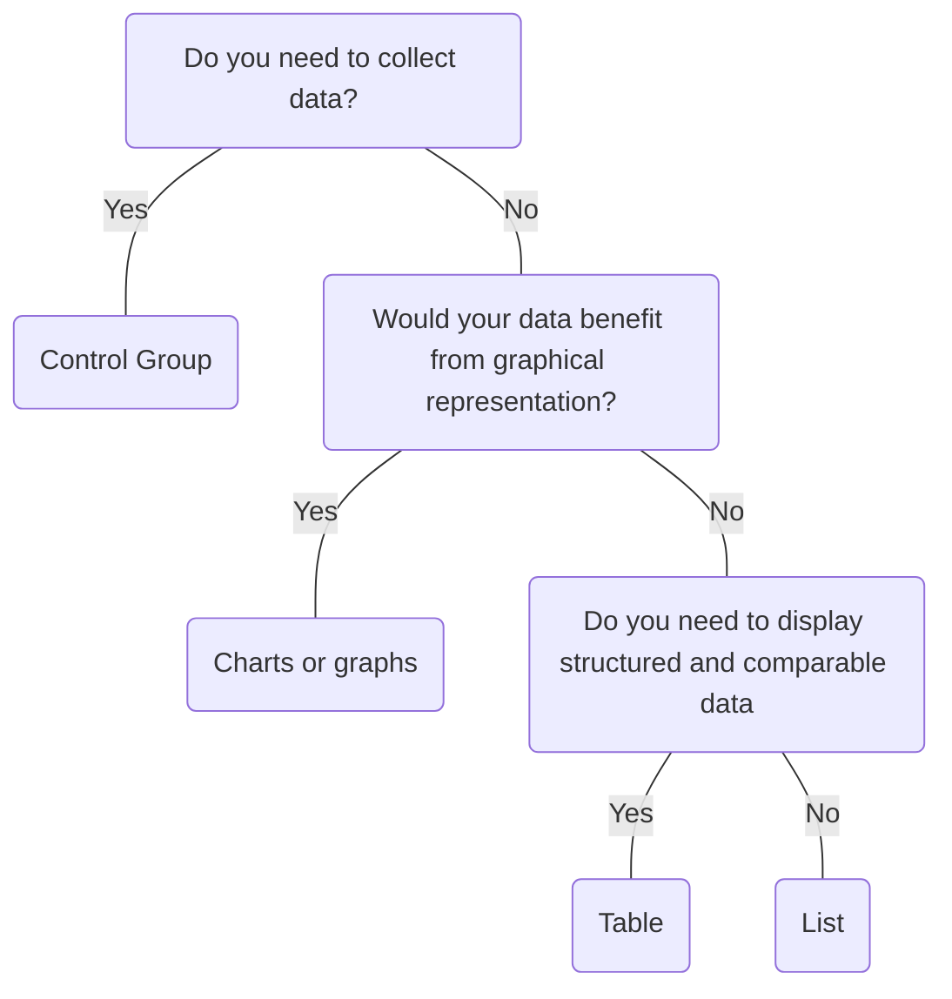

# Table

## Overview


> Image: Illustration of a table component.


## When to use this component
- There’s a need to arrange data in a precise way that’s easy to understand and interact with.
- In contexts where data points are compared side-by-side.
- For schedules, pricing plans, product features, or other structured data.

## When to use another component
- For simpler or single data points, use a List component instead.
- For data collection, create a form with Control Group.
- Consider a graph or chart if there are trends, patterns or exceptions to highlight in the data.



### Check out
- [List] [1]
- [Control Group] [2]
- [Data Visualization] [3]

## Behaviors

### Row selection
> Image: A table displays several rows, each with a checkbox in the first column. Three rows are selected, indicated by check marks in their respective checkboxes. The table contains columns for 


### Column resizing
> Image: A table shows several rows of data with columns for 


### Reordering

#### Columns
> Image: A table shows multiple rows with columns for 


#### Rows
> Image: table displays several rows with columns for 


### Striped rows
Striped rows provide an additional affordance to distinguish between alternating rows, especially in data-heavy tables.
> Image: A table with four columns: Name, Status, Path, and Max Size. The background color alternates between rows to help distinguish between them. The table lists database entries with names such as Simple, Audit, Test, and Splunk. The Status column displays either 


## Usage

### Minimize the number of columns
It's easier to scan many rows than it is to scan many columns.
> Image: Two examples of Table illustrating the impact of column quantity on scanability. The first example, with a heart-eyes emoji, has fewer columns, indicating it is easier to scan. The second example, with a grimacing face emoji, has many more columns, making it harder to read and scan due to the increased number of columns.


### Limit column data
Each column should only contain a single piece of data to maintain readability, accessibility, and usability. If a column contains multiple pieces of data, it can become confusing and difficult for users to parse and understand the information.

> Image: Two examples of Table data, tables have several rows and columns for 


### Filtering and sorting
Start with filtering and sorting on the individual table columns before using other components. For more complex interactions, [dropdowns in column headers](#dropdown) and the [Table toolbar area](#table-toolbar-area) in Table layout.

#### Filter
A column can be filtered as indicated by a funnel icon next to the column header title. You can identify how many filters are applied to a column by the count '2/4' displayed after the column header title.

> Image: Table displays rows of data with columns labeled 


#### Sort
A column can be sorted as indicated by the arrows after the column title. The direction of the arrow indicates whether the column is sorted in ascending or descending order. A column with the ArrowUpDown icon indicates that it can be sorted but is currently unsorted.

> Image: Table displays rows of data with columns labeled 


#### Dropdown
Use a dropdown in the column header when you need to provide filter and sort on the same column or you have multiple actions.
> Image: Table displays rows of data with columns labeled 


### Pagination
- Use pagination to avoid overloading the Table with too much data and improve performance.
- Consider including the option for users to increase or decrease the number of items in a table.
- Recommended to place a Paginator at the top and bottom of longer tables table for improved keyboard navigation.

> Image: A table displays multiple rows of data with columns labeled 


### Editing
Editing table data should be initiated via an action in the actions column, which either opens a modal or toggles a side panel.

#### Modal
Use a modal to edit or update a table data if you have only a few inputs.

> Image: A modal window is displayed over a dimmed table in the background, indicating that the user is in the process of editing or updating table data. The modal contains two input fields and action buttons at the bottom, with a 


#### Side panel
Use a side panel when you have several inputs. The side panel allows users to edit information without fully obstructing the view of the underlying table, providing context while making changes. The side panel can either overlay, push content, or occupy reserved space and remain static.

> Image: Table is partially visible on the left side of the screen, with a side panel open on the right side for editing or updating table data. The side panel contains input fields and action buttons similar to a modal, with a 


## Table layout

Tables fill their container's width, but if they become too wide, readability can suffer as the content spreads too far apart. To improve legibility, ensure that the layout and alignment are properly adjusted. Additionally, organize the table content based on the importance of the information according to your users' needs.

### Title and description
All tables should include a title and, if possible, a description to provide context and clarity.

> Image: A table is displayed with a clear title, 


### Table toolbar area
The toolbar area is reserved for elements like filter, find, tabs, pagination, buttons, and other interactive elements that manipulate the table data.

Organize elements into:
1. Find (Search) and Filter (Select, Multiselect)
2. Additional actions or inputs
3. Select (items per page) and Paginator (page control)

> Image: A table displays a highlighted area above the table which is reserved for elements like filter, find, tabs, pagination, buttons, and other interactive elements that manipulate the table data. The toolbar starts with a search bar and radio bar options labeled 


### Actions
A maximum of three buttons should be used in the actions column. The first two actions should be the most relevant, with the third button reserved for overflow.

If you have button labels with 2 words, want to reduce the space of the actions column, or using an icon alone is too vague, it's recommended to use a menu button for all actions.

> Image: A table displays rows of data with columns labeled 


### Show and hide columns
Use the actions table header to control the visibility of table columns.

> Image: A  table displays rows of data with columns labeled 


### Table data

#### Loading Table data
When loading data, it's best to render the table title, description and column headers on page load, and then load all rows at once.

> Image: A table is displayed with a title at the top, 


#### Empty or no data
Empty state displays both when no rows exist and when no rows exist due to filtering.

> Image: table is displayed with a title at the top, 


## Content

### Column header truncation and text wrapping
Stick with one or two words, use sentence-case capitalization, and avoid truncating or text wrapping if possible.

#### Truncation
> Image: Two examples illustrating the approach to handling truncation in column headers. The first example with heart eyes emoji, features clear and concise column headers like 


#### Text wrapping
> Image: Two examples illustrating the approach to handling text wrapping in column headers. The first example with heart eyes emoji shows clear, unwrapped column headers 


### Row truncation and text wrapping
Ensure enough of the data is displayed for legibility. Text wrapping should avoided if possible. Otherwise, limit text wrapping to a maximum of two lines to maintain row height consistency.

#### Truncation

> Image: Two examples demonstrating the approach handling long text within table rows. The first example with heart eyes emoji, shows the full text in the 


#### Text wrapping
Text wrapping will make table rows taller and potentially harder to scan quickly, so it should be avoided to preserve readability and maintain the layout.

> Image: Two examples demonstrating the approach handling long text within table rows. The first example with heart eyes emoji, maintains a single line of text per row, ensuring that the full path is visible without wrapping, which keeps the table clean and easy to read. The second example with a grimacing face emoji, wraps the text in the 


### Content alignment
Align numerical data to the right and text data to the left for easier comparison.

> Image: Two examples that demonstrate aligning text and numerical data. The first example with heart eyes emoji, correctly aligns text data, such as 


### Missing values
To indicate null or not applicable (N/A) values in the data, use an em dash (—) where there are gaps.

Leaving gaps blank can create confusion and make it harder for users to discern whether data is missing or simply omitted. It’s important to use a clear indicator for missing values to improve readability and understanding.

> Image: Two examples demonstrating the approach to handling null or not applicable (N/A) values. The first example with heart eyes emoji, uses an em dash (—) to clearly indicate gaps or missing data in the 


### Color
Do not rely solely on color to convey information. Ensure there are text or icons for better accessibility.

> Image: Two examples demonstrating the approach to color usage in tables. The first example with heart eyes emoji, uses both color and text/icons in the 


[1]: ./List
[2]: ./ControlGroup
[3]: https://splunkui.splunk.com/Packages/visualizations/?path=/Overview

## Examples


### data

```typescript
import React from 'react';

import Table from '@splunk/react-ui/Table';

const data = [
    { name: 'Rylan', age: 42, email: 'Angelita_Weimann42@gmail.com' },
    { name: 'Amelia', age: 24, email: 'Dexter.Trantow57@hotmail.com' },
    { name: 'Estevan', age: 56, email: 'Aimee7@hotmail.com' },
    { name: 'Florence', age: 71, email: 'Jarrod.Bernier13@yahoo.com' },
    { name: 'Tressa', age: 38, email: 'Yadira1@hotmail.com' },
];


function Basic() {
    return (
        <Table>
            <Table.Head>
                <Table.HeadCell>Name</Table.HeadCell>
                <Table.HeadCell align="right">Age</Table.HeadCell>
                <Table.HeadCell>Email</Table.HeadCell>
            </Table.Head>
            <Table.Body>
                {data.map((row) => (
                    <Table.Row key={row.email}>
                        <Table.Cell>{row.name}</Table.Cell>
                        <Table.Cell align="right">{row.age}</Table.Cell>
                        <Table.Cell>{row.email}</Table.Cell>
                    </Table.Row>
                ))}
            </Table.Body>
        </Table>
    );
}

export default Basic;
```


### Sortable Columns

```typescript
import React, { useState, useCallback } from 'react';

import Table, { HeadCellSortHandler } from '@splunk/react-ui/Table';

interface Row {
    email: string;
    name: string;
}

const data: Row[] = [
    { name: 'Rylan', email: 'Angelita_Weimann42@gmail.com' },
    { name: 'Amelia', email: 'Dexter.Trantow57@hotmail.com' },
    { name: 'Estevan', email: 'Aimee7@hotmail.com' },
    { name: 'Florence', email: 'Jarrod.Bernier13@yahoo.com' },
    { name: 'Tressa', email: 'Yadira1@hotmail.com' },
];

interface Column {
    label: string;
    sortKey: 'email' | 'name';
}

const columns: Column[] = [
    { sortKey: 'name', label: 'Name' },
    { sortKey: 'email', label: 'Email' },
];


function SortableColumns() {
    const [sortKey, setSortKey] = useState<'email' | 'name'>('name');
    const [sortDir, setSortDir] = useState<'asc' | 'desc'>('asc');

    const handleSort: HeadCellSortHandler = useCallback(
        (e, { sortKey: newSortKey }) => {
            setSortKey((prevSortKey) => {
                const prevSortDir = prevSortKey === newSortKey ? sortDir : 'none';
                const nextSortDir = prevSortDir === 'asc' ? 'desc' : 'asc';
                setSortDir(nextSortDir);

                return newSortKey as 'email' | 'name';
            });
        },
        [sortDir]
    );

    return (
        <Table>
            <Table.Head>
                {columns.map((headData) => (
                    <Table.HeadCell
                        key={headData.sortKey}
                        onSort={handleSort}
                        sortKey={headData.sortKey}
                        sortDir={headData.sortKey === sortKey ? sortDir : 'none'}
                    >
                        {headData.label}
                    </Table.HeadCell>
                ))}
            </Table.Head>
            <Table.Body>
                {data
                    .sort((rowA, rowB) => {
                        if (sortDir === 'asc') {
                            return rowA[sortKey] > rowB[sortKey] ? 1 : -1;
                        }
                        return rowB[sortKey] > rowA[sortKey] ? 1 : -1;
                    })
                    .map((row) => (
                        <Table.Row key={row.email}>
                            <Table.Cell>{row.name}</Table.Cell>
                            <Table.Cell>{row.email}</Table.Cell>
                        </Table.Row>
                    ))}
            </Table.Body>
        </Table>
    );
}

export default SortableColumns;
```


### Clickable Cells

```typescript
import React, { useState } from 'react';

import DL, { Term as DT, Description as DD } from '@splunk/react-ui/DefinitionList';
import Table, { CellClickHandler } from '@splunk/react-ui/Table';
import Typography from '@splunk/react-ui/Typography';

interface Row {
    email: string;
    name: string;
}

const initialData: Row[] = [
    { name: 'Rylan', email: 'Angelita_Weimann42@gmail.com' },
    { name: 'Amelia', email: 'Dexter.Trantow57@hotmail.com' },
    { name: 'Estevan', email: 'Aimee7@hotmail.com' },
    { name: 'Florence', email: 'Jarrod.Bernier13@yahoo.com' },
    { name: 'Tressa', email: 'Yadira1@hotmail.com' },
];


function Click() {
    const [data] = useState<Row[]>(initialData);
    const [clickedRow, setClickedRow] = useState<string | undefined>(undefined);

    const handleClick: CellClickHandler = (e, rowData) => {
        setClickedRow(JSON.stringify(rowData));
    };

    return (
        <div>
            <Table>
                <Table.Head>
                    <Table.HeadCell>Name</Table.HeadCell>
                    <Table.HeadCell>Email</Table.HeadCell>
                </Table.Head>
                <Table.Body>
                    {data.map((row) => (
                        <Table.Row key={row.email}>
                            <Table.Cell onClick={handleClick} data={row}>
                                {row.name}
                            </Table.Cell>
                            <Table.Cell>{row.email}</Table.Cell>
                        </Table.Row>
                    ))}
                </Table.Body>
            </Table>
            <aside style={{ marginTop: 20 }} aria-live="polite" aria-relevant="text">
                <Typography as="p">Click a name to see the returned data</Typography>
                {clickedRow && (
                    <div style={{ overflow: 'scroll', marginBottom: 10 }}>
                        <DL>
                            <DT>Data:</DT>
                            <DD>
                                <code>{clickedRow}</code>
                            </DD>
                        </DL>
                    </div>
                )}
            </aside>
        </div>
    );
}

export default Click;
```


### Clickable Rows

```typescript
import React, { useState } from 'react';

import DL, { Term as DT, Description as DD } from '@splunk/react-ui/DefinitionList';
import Table, { RowClickHandler } from '@splunk/react-ui/Table';
import Typography from '@splunk/react-ui/Typography';

interface Row {
    email: string;
    name: string;
}

const initialData: Row[] = [
    { name: 'Rylan', email: 'Angelita_Weimann42@gmail.com' },
    { name: 'Amelia', email: 'Dexter.Trantow57@hotmail.com' },
    { name: 'Estevan', email: 'Aimee7@hotmail.com' },
    { name: 'Florence', email: 'Jarrod.Bernier13@yahoo.com' },
    { name: 'Tressa', email: 'Yadira1@hotmail.com' },
];


function ClickRows() {
    const [data] = useState<Row[]>(initialData);
    const [clickedRow, setClickedRow] = useState<string | undefined>(undefined);

    const handleClick: RowClickHandler = (e, rowData) => {
        setClickedRow(JSON.stringify(rowData));
    };

    return (
        <div>
            <Table>
                <Table.Head>
                    <Table.HeadCell>Name</Table.HeadCell>
                    <Table.HeadCell>Email</Table.HeadCell>
                </Table.Head>
                <Table.Body>
                    {data.map((row) => (
                        <Table.Row key={row.email} onClick={handleClick} data={row}>
                            <Table.Cell>{row.name}</Table.Cell>
                            <Table.Cell>{row.email}</Table.Cell>
                        </Table.Row>
                    ))}
                </Table.Body>
            </Table>
            <aside style={{ marginTop: 20 }} aria-live="polite" aria-relevant="text">
                <Typography as="p">Click a name to see the returned data</Typography>
                {clickedRow && (
                    <div style={{ overflow: 'scroll' }}>
                        <DL>
                            <DT>Data:</DT>
                            <DD>
                                <code>{clickedRow}</code>
                            </DD>
                        </DL>
                    </div>
                )}
            </aside>
        </div>
    );
}

export default ClickRows;
```


### Selectable Rows

```typescript
import React, { useState, useCallback } from 'react';

import { cloneDeep, find } from 'lodash';

import Table, { RowRequestToggleHandler } from '@splunk/react-ui/Table';

interface Row {
    email: string;
    name: string;
    selected: boolean;
}

const initialData: Row[] = [
    { name: 'Rylan', email: 'Angelita_Weimann42@gmail.com', selected: false },
    { name: 'Amelia', email: 'Dexter.Trantow57@hotmail.com', selected: false },
    { name: 'Estevan', email: 'Aimee7@hotmail.com', selected: false },
    { name: 'Florence', email: 'Jarrod.Bernier13@yahoo.com', selected: false },
    { name: 'Tressa', email: 'Yadira1@hotmail.com', selected: false },
];


function Selectable() {
    const [data, setData] = useState<Row[]>(initialData);

    const handleToggle: RowRequestToggleHandler = useCallback((event, { email }) => {
        setData((prevData) => {
            const updatedData = cloneDeep(prevData);

            const selectedRow = find(updatedData, { email });
            if (selectedRow) {
                selectedRow.selected = !selectedRow.selected;

                return updatedData;
            }
            return [];
        });
    }, []);

    const getRowSelectionState = useCallback((rows: Row[]): 'none' | 'all' | 'some' => {
        const selectedCount = rows.filter((row) => row.selected).length;
        if (selectedCount === 0) return 'none';
        if (selectedCount === rows.length) return 'all';
        return 'some';
    }, []);

    const handleToggleAll = useCallback(() => {
        setData((prevData) => {
            const selected = getRowSelectionState(prevData) !== 'all';
            return prevData.map((row) => ({ ...row, selected }));
        });
    }, [getRowSelectionState]);

    return (
        <div>
            <Table
                onRequestToggleAllRows={handleToggleAll}
                rowSelection={getRowSelectionState(data)}
            >
                <Table.Head>
                    <Table.HeadCell>Name</Table.HeadCell>
                    <Table.HeadCell>Email</Table.HeadCell>
                </Table.Head>
                <Table.Body>
                    {data.map((row) => (
                        <Table.Row
                            key={row.email}
                            onRequestToggle={handleToggle}
                            data={row}
                            selected={row.selected}
                        >
                            <Table.Cell>{row.name}</Table.Cell>
                            <Table.Cell>{row.email}</Table.Cell>
                        </Table.Row>
                    ))}
                </Table.Body>
            </Table>
        </div>
    );
}

export default Selectable;
```


### Dropdowns in Header

```typescript
import React, { useState, useCallback } from 'react';

import Menu from '@splunk/react-ui/Menu';
import Table from '@splunk/react-ui/Table';

interface Row {
    email: string;
    name: string;
}

const data: Row[] = [
    { name: 'Rylan', email: 'Angelita_Weimann42@gmail.com' },
    { name: 'Amelia', email: 'Dexter.Trantow57@hotmail.com' },
    { name: 'Estevan', email: 'Aimee7@hotmail.com' },
    { name: 'Florence', email: 'Jarrod.Bernier13@yahoo.com' },
    { name: 'Tressa', email: 'Yadira1@hotmail.com' },
];

interface Column {
    align: 'left' | 'right';
    label: string;
    sortKey: 'email' | 'name';
}

const initialColumns: Column[] = [
    { sortKey: 'name', label: 'Name', align: 'left' },
    { sortKey: 'email', label: 'Email', align: 'left' },
];


function HeadDropdownCell() {
    const [columns, setColumns] = useState<Column[]>(initialColumns);
    const [sortKey, setSortKey] = useState<'email' | 'name'>('name');
    const [sortDir, setSortDir] = useState<'asc' | 'desc'>('asc');

    const handleSort = useCallback(
        (
            e: React.MouseEvent,
            {
                sortKey: newSortKey,
                sortDir: newSortDir,
            }: { sortKey: 'email' | 'name'; sortDir: 'asc' | 'desc' }
        ) => {
            setSortKey(newSortKey);
            setSortDir(newSortDir);
        },
        []
    );

    const handleAlign = useCallback(
        (
            e: React.MouseEvent,
            {
                sortKey: targetSortKey,
                align,
            }: { sortKey: 'email' | 'name'; align: 'left' | 'right' }
        ) => {
            setColumns((prevColumns) =>
                prevColumns.map((column) =>
                    column.sortKey !== targetSortKey ? column : { ...column, align }
                )
            );
        },
        []
    );

    return (
        <Table>
            <Table.Head>
                {columns.map((headData) => (
                    <Table.HeadDropdownCell
                        label={headData.label}
                        key={headData.sortKey}
                        align={headData.align}
                    >
                        <Menu>
                            <Menu.Item
                                selectable
                                selected={headData.sortKey === sortKey && sortDir === 'asc'}
                                onClick={(e: React.MouseEvent) =>
                                    handleSort(e, { sortKey: headData.sortKey, sortDir: 'asc' })
                                }
                            >
                                Sort Ascending
                            </Menu.Item>
                            <Menu.Item
                                selectable
                                selected={headData.sortKey === sortKey && sortDir === 'desc'}
                                onClick={(e: React.MouseEvent) =>
                                    handleSort(e, { sortKey: headData.sortKey, sortDir: 'desc' })
                                }
                            >
                                Sort Descending
                            </Menu.Item>
                            <Menu.Divider />
                            <Menu.Item
                                selectable
                                selected={headData.align === 'left'}
                                onClick={(e: React.MouseEvent) =>
                                    handleAlign(e, { sortKey: headData.sortKey, align: 'left' })
                                }
                            >
                                Align Left
                            </Menu.Item>
                            <Menu.Item
                                selectable
                                selected={headData.align === 'right'}
                                onClick={(e: React.MouseEvent) =>
                                    handleAlign(e, { sortKey: headData.sortKey, align: 'right' })
                                }
                            >
                                Align Right
                            </Menu.Item>
                        </Menu>
                    </Table.HeadDropdownCell>
                ))}
            </Table.Head>
            <Table.Body>
                {data
                    .sort((rowA, rowB) => {
                        if (sortDir === 'asc') {
                            return rowA[sortKey] > rowB[sortKey] ? 1 : -1;
                        }
                        return rowB[sortKey] > rowA[sortKey] ? 1 : -1;
                    })
                    .map((row) => (
                        <Table.Row key={row.email}>
                            <Table.Cell align={columns[0].align}>{row.name}</Table.Cell>
                            <Table.Cell align={columns[1].align}>{row.email}</Table.Cell>
                        </Table.Row>
                    ))}
            </Table.Body>
        </Table>
    );
}

export default HeadDropdownCell;
```


### Filter Column Values

```typescript
import React, { useState } from 'react';

import Filter from '@splunk/react-icons/Filter';
import Menu from '@splunk/react-ui/Menu';
import Table from '@splunk/react-ui/Table';

const kindValues = ['Amazon S3', 'Index', 'Indexer', 'Lookup', 'View'] as const;

type Kind = (typeof kindValues)[number];

interface Row {
    name: string;
    kind: Kind;
}

const data: Row[] = [
    { name: 'S3_bucket_1', kind: 'Amazon S3' },
    { name: 'S3_bucket_2', kind: 'Amazon S3' },
    { name: 'Splunk_CMP_1', kind: 'Index' },
    { name: 'EC_1', kind: 'View' },
    { name: 'EC_2', kind: 'View' },
];


function FilterableTable() {
    const [filter, setFilter] = useState<Kind[]>([]);

    const toggleFilterValue = (filterValue: Kind) => {
        setFilter((prevFilter) =>
            prevFilter.includes(filterValue)
                ? prevFilter.filter((f) => f !== filterValue)
                : [...prevFilter, filterValue]
        );
    };

    return (
        <Table>
            <Table.Head>
                <Table.HeadCell>Name</Table.HeadCell>
                <Table.HeadDropdownCell
                    label={
                        <>
                            <Filter variant={filter.length > 0 ? 'filled' : 'outlined'} />
                            Kind
                            {filter.length > 0 ? ` ${filter.length}/${kindValues.length}` : ''}
                        </>
                    }
                >
                    <Menu>
                        {kindValues.map((kind) => (
                            <Menu.Item
                                key={kind}
                                selectableAppearance="checkbox"
                                selectable
                                selected={filter.includes(kind)}
                                onClick={() => toggleFilterValue(kind)}
                            >
                                {kind}
                            </Menu.Item>
                        ))}
                    </Menu>
                </Table.HeadDropdownCell>
            </Table.Head>
            <Table.Body>
                {data
                    .filter((row) => filter.length === 0 || filter.includes(row.kind))
                    .map((row) => (
                        <Table.Row key={row.name}>
                            <Table.Cell>{row.name}</Table.Cell>
                            <Table.Cell>{row.kind}</Table.Cell>
                        </Table.Row>
                    ))}
            </Table.Body>
        </Table>
    );
}

export default FilterableTable;
```


### Fixed Header

```typescript
import React from 'react';

import Table from '@splunk/react-ui/Table';

interface Row {
    email: string;
    name: string;
}

const data: Row[] = [
    { name: 'Rylan', email: 'Angelita_Weimann42@gmail.com' },
    { name: 'Amelia', email: 'Dexter.Trantow57@hotmail.com' },
    { name: 'Estevan', email: 'Aimee7@hotmail.com' },
    { name: 'Florence', email: 'Jarrod.Bernier13@yahoo.com' },
    { name: 'Tressa', email: 'Yadira1@hotmail.com' },
    { name: 'Bernice', email: 'bernice.Gilbert@gmail.com' },
    { name: 'Adrian', email: 'adrian7456@gmail.com' },
    { name: 'Ester', email: 'esternyc@gmail.com' },
    { name: 'Andrew', email: 'andrew.fillmore2@gmail.com' },
    { name: 'Felix', email: 'felixfelix@hotmail.com' },
];


function FixedHeader() {
    return (
        <Table headType="fixed" innerStyle={{ maxHeight: 160 }}>
            <Table.Head>
                <Table.HeadCell>Name</Table.HeadCell>
                <Table.HeadCell>Email</Table.HeadCell>
            </Table.Head>
            <Table.Body>
                {data.map((row) => (
                    <Table.Row key={row.email}>
                        <Table.Cell>{row.name}</Table.Cell>
                        <Table.Cell>{row.email}</Table.Cell>
                    </Table.Row>
                ))}
            </Table.Body>
        </Table>
    );
}

export default FixedHeader;
```


### Expandable Rows

```typescript
import React from 'react';

import DL from '@splunk/react-ui/DefinitionList';
import Table from '@splunk/react-ui/Table';

interface Row {
    email: string;
    name: string;
}

const data: Row[] = [
    { name: 'Rylan', email: 'Angelita_Weimann42@gmail.com' },
    { name: 'Amelia', email: 'Dexter.Trantow57@hotmail.com' },
    { name: 'Estevan', email: 'Aimee7@hotmail.com' },
    { name: 'Florence', email: 'Jarrod.Bernier13@yahoo.com' },
    { name: 'Tressa', email: 'Yadira1@hotmail.com' },
];


function getExpansionRow(row: Row) {
    return (
        <Table.Row key={`${row.email}-expansion`}>
            <Table.Cell style={{ borderTop: 'none' }} colSpan={2}>
                <DL>
                    <DL.Term>Name</DL.Term>
                    <DL.Description>{row.name}</DL.Description>
                    <DL.Term>Email</DL.Term>
                    <DL.Description>{row.email}</DL.Description>
                </DL>
            </Table.Cell>
        </Table.Row>
    );
}

function ExpandableRows() {
    return (
        <Table rowExpansion="single">
            <Table.Head>
                <Table.HeadCell>Name</Table.HeadCell>
                <Table.HeadCell>Email</Table.HeadCell>
            </Table.Head>
            <Table.Body>
                {data.map((row) => (
                    <Table.Row key={row.email} expansionRow={getExpansionRow(row)}>
                        <Table.Cell>{row.name}</Table.Cell>
                        <Table.Cell>{row.email}</Table.Cell>
                    </Table.Row>
                ))}
            </Table.Body>
        </Table>
    );
}

export default ExpandableRows;
```


### Expandable Rows - Controlled

```typescript
import React, { useState } from 'react';

import DL from '@splunk/react-ui/DefinitionList';
import Table from '@splunk/react-ui/Table';

interface Row {
    id: string;
    email: string;
    name: string;
}

const data: Row[] = [
    { id: 'unique-0', name: 'Rylan', email: 'Angelita_Weimann42@gmail.com' },
    { id: 'unique-1', name: 'Amelia', email: 'Dexter.Trantow57@hotmail.com' },
    { id: 'unique-2', name: 'Estevan', email: 'Aimee7@hotmail.com' },
    { id: 'unique-3', name: 'Florence', email: 'Jarrod.Bernier13@yahoo.com' },
    { id: 'unique-4', name: 'Tressa', email: 'Yadira1@hotmail.com' },
];


function getExpansionRow(row: Row) {
    return (
        <Table.Row key={`${row.email}-expansion`}>
            <Table.Cell style={{ borderTop: 'none' }} colSpan={2}>
                <DL>
                    <DL.Term>Name</DL.Term>
                    <DL.Description>{row.name}</DL.Description>
                    <DL.Term>Email</DL.Term>
                    <DL.Description>{row.email}</DL.Description>
                </DL>
            </Table.Cell>
        </Table.Row>
    );
}

function ExpandableRowsControlled() {
    const [expandedRowId, setExpandedRowId] = useState(null as string | null);

    const handleRowExpansion = (rowId: string) => {
        if (expandedRowId === rowId) {
            setExpandedRowId(null);
        } else {
            setExpandedRowId(rowId);
        }
    };

    return (
        <Table rowExpansion="controlled">
            <Table.Head>
                <Table.HeadCell>Name</Table.HeadCell>
                <Table.HeadCell>Email</Table.HeadCell>
            </Table.Head>
            <Table.Body>
                {data.map((row) => (
                    <Table.Row
                        key={row.id}
                        expansionRow={getExpansionRow(row)}
                        onExpansion={() => handleRowExpansion(row.id)}
                        expanded={row.id === expandedRowId}
                    >
                        <Table.Cell>{row.name}</Table.Cell>
                        <Table.Cell>{row.email}</Table.Cell>
                    </Table.Row>
                ))}
            </Table.Body>
        </Table>
    );
}

export default ExpandableRowsControlled;
```


### Row actions

```typescript
import React, { useState, useCallback } from 'react';

import Cog from '@splunk/react-icons/Cog';
import Pencil from '@splunk/react-icons/Pencil';
import Button from '@splunk/react-ui/Button';
import DL, { Term as DT, Description as DD } from '@splunk/react-ui/DefinitionList';
import Dropdown from '@splunk/react-ui/Dropdown';
import Menu from '@splunk/react-ui/Menu';
import Table, {
    RowActionPrimaryClickHandler,
    RowActionSecondaryClickHandler,
} from '@splunk/react-ui/Table';
import Tooltip from '@splunk/react-ui/Tooltip';
import Typography from '@splunk/react-ui/Typography';
import { _ } from '@splunk/ui-utils/i18n';

interface Row {
    age: number;
    country: string;
    email: string;
    favoriteColor: string;
    favoriteDay: string;
    industry: string;
    name: string;
    occupation: string;
    state: string;
}

interface Column {
    label: string;
    name: keyof Row;
    visible: boolean;
}

const initialData: Row[] = [
    {
        name: 'Rylan',
        age: 42,
        email: 'Angelita_Weimann42@gmail.com',
        state: 'CA',
        country: 'US',
        favoriteColor: 'Orange',
        favoriteDay: 'Monday',
        occupation: 'Engineer',
        industry: 'Software Development',
    },
    {
        name: 'Amelia',
        age: 24,
        email: 'Dexter.Trantow57@hotmail.com',
        state: 'NY',
        country: 'US',
        favoriteColor: 'White',
        favoriteDay: 'Friday',
        occupation: 'Engineer',
        industry: 'Software',
    },
    {
        name: 'Estevan',
        age: 56,
        email: 'Aimee7@hotmail.com',
        state: 'IL',
        country: 'US',
        favoriteColor: 'Green',
        favoriteDay: 'Saturday',
        occupation: 'Engineer',
        industry: 'Software',
    },
    {
        name: 'Florence',
        age: 71,
        email: 'Jarrod.Bernier13@yahoo.com',
        state: 'CA',
        country: 'US',
        favoriteColor: 'Red',
        favoriteDay: 'Tuesday',
        occupation: 'Engineer',
        industry: 'Software',
    },
    {
        name: 'Teresa',
        age: 38,
        email: 'Yadira1@hotmail.com',
        state: 'NJ',
        country: 'US',
        favoriteColor: 'Blue',
        favoriteDay: 'Wednesday',
        occupation: 'Engineer',
        industry: 'Software',
    },
];

const initialColumns: Column[] = [
    { name: 'name', label: 'Name', visible: true },
    { name: 'age', label: 'Age', visible: true },
    { name: 'email', label: 'Email', visible: true },
    { name: 'state', label: 'State', visible: true },
    { name: 'country', label: 'Country', visible: true },
    { name: 'favoriteColor', label: 'Favorite Color', visible: true },
    { name: 'favoriteDay', label: 'Favorite Day', visible: true },
    { name: 'occupation', label: 'Occupation', visible: true },
    { name: 'industry', label: 'Industry', visible: true },
];


function RowAction() {
    const [data] = useState<Row[]>(initialData);
    const [columns, setColumns] = useState<Column[]>(initialColumns);
    const [primaryAction, setPrimaryAction] = useState<string | undefined>();
    const [primaryActionRowData, setPrimaryActionRowData] = useState<string | undefined>();
    const [secondaryAction, setSecondaryAction] = useState<string | undefined>();
    const [secondaryActionRowData, setSecondaryActionRowData] = useState<string | undefined>();

    const handleShowHide = useCallback((e: React.MouseEvent, { name }: { name: string }) => {
        setColumns((prevColumns) =>
            prevColumns.map((col) => (col.name === name ? { ...col, visible: !col.visible } : col))
        );
    }, []);

    const handleEditActionClick: RowActionPrimaryClickHandler = useCallback((e, rowData) => {
        setPrimaryAction('Edit');
        setPrimaryActionRowData(JSON.stringify(rowData));
    }, []);

    const handleSaveActionClick: RowActionSecondaryClickHandler = useCallback((e, rowData) => {
        setSecondaryAction('Save');
        setSecondaryActionRowData(JSON.stringify(rowData));
    }, []);

    const handleAddActionClick: RowActionSecondaryClickHandler = useCallback((e, rowData) => {
        setSecondaryAction('Add');
        setSecondaryActionRowData(JSON.stringify(rowData));
    }, []);

    const handleDeleteActionClick: RowActionSecondaryClickHandler = useCallback((e, rowData) => {
        setSecondaryAction('Delete');
        setSecondaryActionRowData(JSON.stringify(rowData));
    }, []);

    const toggle = (
        <Button appearance="subtle" data-test="actions-toggle" icon={<Cog variant="filled" />} />
    );

    const actions = [
        <Dropdown toggle={toggle} key="settings">
            <Menu>
                <Menu.Heading>Show/Hide Columns</Menu.Heading>
                {columns.map((col) => (
                    <Menu.Item
                        key={col.name}
                        selectable
                        selected={col.visible}
                        onClick={(e: React.MouseEvent) => handleShowHide(e, { name: col.name })}
                    >
                        {col.label}
                    </Menu.Item>
                ))}
                <Menu.Divider />
                <Menu.Heading>More actions</Menu.Heading>
                <Menu.Item>Add new item</Menu.Item>
            </Menu>
        </Dropdown>,
    ];

    const rowActionPrimaryButton = (
        <Tooltip
            content={_('Edit')}
            contentRelationship="label"
            onClick={handleEditActionClick}
            style={{ marginRight: 8 }}
        >
            <Button appearance="subtle" icon={<Pencil variant="filled" />} />
        </Tooltip>
    );

    const rowActionsSecondaryMenu = (
        <Menu>
            <Menu.Item onClick={handleSaveActionClick}>Save</Menu.Item>
            <Menu.Item onClick={handleAddActionClick}>Add</Menu.Item>
            <Menu.Item onClick={handleDeleteActionClick}>Delete</Menu.Item>
        </Menu>
    );

    return (
        <div>
            <Table actions={actions} actionsColumnWidth={104}>
                <Table.Head>
                    {columns.map(
                        (c) => c.visible && <Table.HeadCell key={c.name}>{c.label}</Table.HeadCell>
                    )}
                </Table.Head>
                <Table.Body>
                    {data.map((row) => (
                        <Table.Row
                            data={row}
                            key={row.email}
                            onClick={() => {}}
                            actionPrimary={rowActionPrimaryButton}
                            actionsSecondary={rowActionsSecondaryMenu}
                        >
                            {columns.map(
                                (c) =>
                                    c.visible && <Table.Cell key={c.name}>{row[c.name]}</Table.Cell>
                            )}
                        </Table.Row>
                    ))}
                </Table.Body>
            </Table>
            <aside style={{ marginTop: 20 }} aria-live="polite" aria-relevant="text">
                <Typography as="p">
                    Click a primary action or secondary action to see the returned data
                </Typography>
                {primaryActionRowData && (
                    <div style={{ overflow: 'scroll', marginBottom: 10 }}>
                        <DL>
                            <DT>Primary action:</DT>
                            <DD>&apos;{primaryAction}&apos;</DD>
                            <DT>Data:</DT>
                            <DD>
                                <code>{primaryActionRowData}</code>
                            </DD>
                        </DL>
                    </div>
                )}
                {secondaryActionRowData && (
                    <div style={{ overflow: 'scroll' }}>
                        <DL>
                            <DT>Secondary action:</DT>
                            <DD>&apos;{secondaryAction}&apos;</DD>
                            <DT>Data:</DT>
                            <DD>
                                <code>{secondaryActionRowData}</code>
                            </DD>
                        </DL>
                    </div>
                )}
            </aside>
        </div>
    );
}

export default RowAction;
```


### Pin action column

```typescript
import React, { useState } from 'react';

import { noop } from 'lodash';

import Pencil from '@splunk/react-icons/Pencil';
import Button from '@splunk/react-ui/Button';
import Table from '@splunk/react-ui/Table';
import Tooltip from '@splunk/react-ui/Tooltip';
import { _ } from '@splunk/ui-utils/i18n';

interface Row {
    age: number;
    country: string;
    email: string;
    favoriteColor: string;
    favoriteDay: string;
    industry: string;
    name: string;
    occupation: string;
    state: string;
}

interface Column {
    label: string;
    name: keyof Row;
}

const initialData: Row[] = [
    {
        name: 'Rylan',
        age: 42,
        email: 'Angelita_Weimann42@gmail.com',
        state: 'CA',
        country: 'US',
        favoriteColor: 'Orange',
        favoriteDay: 'Monday',
        occupation: 'Engineer',
        industry: 'Software Development',
    },
    {
        name: 'Amelia',
        age: 24,
        email: 'Dexter.Trantow57@hotmail.com',
        state: 'NY',
        country: 'US',
        favoriteColor: 'White',
        favoriteDay: 'Friday',
        occupation: 'Engineer',
        industry: 'Software',
    },
    {
        name: 'Estevan',
        age: 56,
        email: 'Aimee7@hotmail.com',
        state: 'IL',
        country: 'US',
        favoriteColor: 'Green',
        favoriteDay: 'Saturday',
        occupation: 'Engineer',
        industry: 'Software',
    },
    {
        name: 'Florence',
        age: 71,
        email: 'Jarrod.Bernier13@yahoo.com',
        state: 'CA',
        country: 'US',
        favoriteColor: 'Red',
        favoriteDay: 'Tuesday',
        occupation: 'Engineer',
        industry: 'Software',
    },
    {
        name: 'Teresa',
        age: 38,
        email: 'Yadira1@hotmail.com',
        state: 'NJ',
        country: 'US',
        favoriteColor: 'Blue',
        favoriteDay: 'Wednesday',
        occupation: 'Engineer',
        industry: 'Software',
    },
];

const initialColumns: Column[] = [
    { name: 'name', label: 'Name' },
    { name: 'age', label: 'Age' },
    { name: 'email', label: 'Email' },
    { name: 'state', label: 'State' },
    { name: 'country', label: 'Country' },
    { name: 'favoriteColor', label: 'Favorite Color' },
    { name: 'favoriteDay', label: 'Favorite Day' },
    { name: 'occupation', label: 'Occupation' },
    { name: 'industry', label: 'Industry' },
];


function PinActionColumn() {
    const [data] = useState<Row[]>(initialData);
    const [columns] = useState<Column[]>(initialColumns);

    const rowActionPrimaryButton = (
        <Tooltip content={_('Edit')} contentRelationship="label" onClick={noop}>
            <Button appearance="subtle" icon={<Pencil variant="filled" />} />
        </Tooltip>
    );

    return (
        <div>
            <Table
                outerStyle={{ width: 800 }}
                horizontalOverflow="scroll"
                pinnedColumns={{ actions: true }}
                actionsColumnWidth={45}
            >
                <Table.Head>
                    {columns.map((c) => (
                        <Table.HeadCell key={c.name}>{c.label}</Table.HeadCell>
                    ))}
                </Table.Head>
                <Table.Body>
                    {data.map((row) => (
                        <Table.Row
                            data={row}
                            key={row.email}
                            actionPrimary={rowActionPrimaryButton}
                        >
                            {columns.map((c) => (
                                <Table.Cell key={c.name}>{row[c.name]}</Table.Cell>
                            ))}
                        </Table.Row>
                    ))}
                </Table.Body>
            </Table>
        </div>
    );
}

export default PinActionColumn;
```


### Reorder Rows

```typescript
import React, { useState, useCallback } from 'react';

import { cloneDeep } from 'lodash';

import Table, { TableRequestMoveRowHandler } from '@splunk/react-ui/Table';

interface Row {
    age: number;
    email: string;
    name: string;
}

interface Header {
    key: 'age' | 'email' | 'name';
    label: string;
}

const initialHeaders: Header[] = [
    { label: 'Name', key: 'name' },
    { label: 'Age', key: 'age' },
    { label: 'Email', key: 'email' },
];

const initialData: Row[] = [
    { name: 'Rylan', age: 12, email: 'Angelita_Weimann42@gmail.com' },
    { name: 'Amelia', age: 23, email: 'Dexter.Trantow57@hotmail.com' },
    { name: 'Estevan', age: 19, email: 'Aimee7@hotmail.com' },
    { name: 'Florence', age: 20, email: 'Jarrod.Bernier13@yahoo.com' },
    { name: 'Tressa', age: 22, email: 'Yadira1@hotmail.com' },
];


function ReorderRows() {
    const [headers] = useState<Header[]>(initialHeaders);
    const [data, setData] = useState<Row[]>(initialData);

    const handleRequestMoveRow: TableRequestMoveRowHandler = useCallback(
        ({ fromIndex, toIndex }) => {
            setData((prevData) => {
                const updatedData = cloneDeep(prevData);
                const rowToMove = data[fromIndex];
                const insertionIndex = toIndex < fromIndex ? toIndex : toIndex + 1;
                updatedData.splice(insertionIndex, 0, rowToMove);

                const removalIndex = toIndex < fromIndex ? fromIndex + 1 : fromIndex;
                updatedData.splice(removalIndex, 1);

                return updatedData;
            });
        },
        [data]
    );

    return (
        <Table onRequestMoveRow={handleRequestMoveRow}>
            <Table.Head>
                {headers.map((header) => (
                    <Table.HeadCell key={header.key}>{header.label}</Table.HeadCell>
                ))}
            </Table.Head>
            <Table.Body>
                {data.map((row) => (
                    <Table.Row key={row.email}>
                        {headers.map((header) => (
                            <Table.Cell key={row[header.key]}>{row[header.key]}</Table.Cell>
                        ))}
                    </Table.Row>
                ))}
            </Table.Body>
        </Table>
    );
}

export default ReorderRows;
```


### Reorder Columns

```typescript
import React, { useState, useCallback } from 'react';

import { cloneDeep } from 'lodash';

import Table, { TableRequestMoveColumnHandler } from '@splunk/react-ui/Table';

interface Row {
    age: number;
    email: string;
    name: string;
}

interface Header {
    key: 'age' | 'email' | 'name';
    label: string;
}

const initialHeaders: Header[] = [
    { label: 'Name', key: 'name' },
    { label: 'Age', key: 'age' },
    { label: 'Email', key: 'email' },
];

const initialData: Row[] = [
    { name: 'Rylan', age: 12, email: 'Angelita_Weimann42@gmail.com' },
    { name: 'Amelia', age: 23, email: 'Dexter.Trantow57@hotmail.com' },
    { name: 'Estevan', age: 19, email: 'Aimee7@hotmail.com' },
    { name: 'Florence', age: 20, email: 'Jarrod.Bernier13@yahoo.com' },
    { name: 'Tressa', age: 22, email: 'Yadira1@hotmail.com' },
];


function ReorderColumns() {
    const [headers, setHeaders] = useState<Header[]>(initialHeaders);
    const [data] = useState<Row[]>(initialData);

    const handleRequestMoveColumn: TableRequestMoveColumnHandler = useCallback(
        ({ fromIndex, toIndex }) => {
            setHeaders((prevHeaders) => {
                const updatedHeaders = cloneDeep(prevHeaders);
                const headerToMove = updatedHeaders[fromIndex];

                const insertionIndex = toIndex < fromIndex ? toIndex : toIndex + 1;
                updatedHeaders.splice(insertionIndex, 0, headerToMove);

                const removalIndex = toIndex < fromIndex ? fromIndex + 1 : fromIndex;
                updatedHeaders.splice(removalIndex, 1);

                return updatedHeaders;
            });
        },
        []
    );

    return (
        <Table onRequestMoveColumn={handleRequestMoveColumn}>
            <Table.Head>
                {headers.map((header) => (
                    <Table.HeadCell key={header.key}>{header.label}</Table.HeadCell>
                ))}
            </Table.Head>
            <Table.Body>
                {data.map((row) => (
                    <Table.Row key={row.email}>
                        {headers.map((header) => (
                            <Table.Cell key={`${row.email}-${header.key}`}>
                                {row[header.key]}
                            </Table.Cell>
                        ))}
                    </Table.Row>
                ))}
            </Table.Body>
        </Table>
    );
}

export default ReorderColumns;
```


### Resizable Columns

```typescript
import React, { useState, useCallback } from 'react';

import { cloneDeep } from 'lodash';

import Table, { TableRequestResizeColumnHandler } from '@splunk/react-ui/Table';

interface Row {
    age: number;
    email: string;
    name: string;
}

interface Header {
    key: 'age' | 'email' | 'name';
    label: string;
    minWidth: number;
    width: number;
}

const initialHeaders: Header[] = [
    { label: 'Name', key: 'name', width: 200, minWidth: 80 },
    { label: 'Age', key: 'age', width: 60, minWidth: 40 },
    { label: 'Email Address', key: 'email', width: 400, minWidth: 120 },
];

const initialData: Row[] = [
    { name: 'Rylan', age: 12, email: 'Angelita_Weimann42@gmail.com' },
    { name: 'Amelia', age: 23, email: 'Dexter.Trantow57@hotmail.com' },
    { name: 'Estevan', age: 19, email: 'Aimee7@hotmail.com' },
    { name: 'Florence', age: 20, email: 'Jarrod.Bernier13@yahoo.com' },
    { name: 'Tressa', age: 22, email: 'Yadira1@hotmail.com' },
];


function Resizable() {
    const [headers, setHeaders] = useState<Header[]>(initialHeaders);
    const [data] = useState<Row[]>(initialData);

    const handleResizeColumn: TableRequestResizeColumnHandler = useCallback(
        (event, { columnId, index, width }) => {
            setHeaders((prevHeaders) => {
                const updatedHeaders = cloneDeep(prevHeaders);

                // min and max widths can be controlled in the callback.
                const selectedColumn = updatedHeaders.find(({ key }) => key === columnId);
                if (selectedColumn) {
                    const widthAboveMinimum = Math.max(width, selectedColumn.minWidth);
                    updatedHeaders[index].width = widthAboveMinimum;

                    return updatedHeaders;
                }
                return [];
            });
        },
        []
    );

    return (
        <Table onRequestResizeColumn={handleResizeColumn}>
            <Table.Head>
                {headers.map((header) => (
                    <Table.HeadCell key={header.key} columnId={header.key} width={header.width}>
                        {header.label}
                    </Table.HeadCell>
                ))}
            </Table.Head>
            <Table.Body>
                {data.map((row) => (
                    <Table.Row key={row.email}>
                        {headers.map((header) => (
                            <Table.Cell key={`${row.email}-${header.key}`}>
                                {row[header.key]}
                            </Table.Cell>
                        ))}
                    </Table.Row>
                ))}
            </Table.Body>
        </Table>
    );
}

export default Resizable;
```


### Fill Layout with Resizable Columns

```typescript
import React, { useState, useCallback } from 'react';

import { cloneDeep } from 'lodash';

import Table, { TableRequestResizeColumnHandler } from '@splunk/react-ui/Table';

interface Row {
    age: number;
    email: string;
    name: string;
}

interface Header {
    key: 'age' | 'email' | 'name';
    label: string;
    minWidth: number;
    width: number | 'auto';
}

const initialHeaders: Header[] = [
    { label: 'Name', key: 'name', width: 100, minWidth: 80 },
    { label: 'Age', key: 'age', width: 'auto', minWidth: 60 },
    { label: 'Email Address', key: 'email', width: 'auto', minWidth: 120 },
];

const initialData: Row[] = [
    { name: 'Rylan', age: 12, email: 'Angelita_Weimann42@gmail.com' },
    { name: 'Amelia', age: 23, email: 'Dexter.Trantow57@hotmail.com' },
    { name: 'Estevan', age: 19, email: 'Aimee7@hotmail.com' },
    { name: 'Florence', age: 20, email: 'Jarrod.Bernier13@yahoo.com' },
    { name: 'Tressa', age: 22, email: 'Yadira1@hotmail.com' },
];


function ResizableFill() {
    const [headers, setHeaders] = useState<Header[]>(initialHeaders);
    const [data] = useState<Row[]>(initialData);

    const handleResizeColumn: TableRequestResizeColumnHandler = useCallback(
        (event, { columnId, index, width }) => {
            setHeaders((prevHeaders) => {
                const updatedHeaders = cloneDeep(prevHeaders);

                // min and max widths can be controlled in the callback.
                const selectedColumn = updatedHeaders.find(({ key }) => key === columnId);

                if (selectedColumn) {
                    const widthAboveMinimum = Math.max(width, selectedColumn.minWidth);
                    updatedHeaders[index].width = widthAboveMinimum;

                    return updatedHeaders;
                }
                return [];
            });
        },
        []
    );

    return (
        <section style={{ display: 'block', margin: '0 auto', width: '500px' }}>
            <Table onRequestResizeColumn={handleResizeColumn} resizableFillLayout>
                <Table.Head>
                    {headers.map((header) => (
                        <Table.HeadCell key={header.key} columnId={header.key} width={header.width}>
                            {header.label}
                        </Table.HeadCell>
                    ))}
                </Table.Head>
                <Table.Body>
                    {data.map((row) => (
                        <Table.Row key={row.email}>
                            {headers.map((header) => (
                                <Table.Cell key={row[header.key]}>{row[header.key]}</Table.Cell>
                            ))}
                        </Table.Row>
                    ))}
                </Table.Body>
            </Table>
        </section>
    );
}

export default ResizableFill;
```


### Stripe rows

```typescript
import React from 'react';

import Table from '@splunk/react-ui/Table';

const data = [
    { name: 'Rylan', age: 42, email: 'Angelita_Weimann42@gmail.com' },
    { name: 'Amelia', age: 24, email: 'Dexter.Trantow57@hotmail.com' },
    { name: 'Estevan', age: 56, email: 'Aimee7@hotmail.com' },
    { name: 'Florence', age: 71, email: 'Jarrod.Bernier13@yahoo.com' },
    { name: 'Tressa', age: 38, email: 'Yadira1@hotmail.com' },
];


function StripeRows() {
    return (
        <Table stripeRows>
            <Table.Head>
                <Table.HeadCell>Name</Table.HeadCell>
                <Table.HeadCell align="right">Age</Table.HeadCell>
                <Table.HeadCell>Email</Table.HeadCell>
            </Table.Head>
            <Table.Body>
                {data.map((row) => (
                    <Table.Row key={row.email}>
                        <Table.Cell>{row.name}</Table.Cell>
                        <Table.Cell align="right">{row.age}</Table.Cell>
                        <Table.Cell>{row.email}</Table.Cell>
                    </Table.Row>
                ))}
            </Table.Body>
        </Table>
    );
}

export default StripeRows;
```


### Horizontal overflow scroll

```typescript
import React, { useState } from 'react';

import Table from '@splunk/react-ui/Table';

interface Column {
    label: string;
    name: keyof Row;
    width?: number;
}

interface Row {
    name: string;
    age: number;
    email: string;
    state: string;
    country: string;
    favoriteColor: string;
    favoriteDay: string;
    occupation: string;
    industry: string;
}

const initialData: Row[] = [
    {
        name: 'Amelia Trantow',
        age: 24,
        email: 'Dexter.Trantow57@hotmail.com',
        state: 'NY',
        country: 'US',
        favoriteColor: 'White',
        favoriteDay: 'Friday',
        occupation: 'Engineer',
        industry: 'Software',
    },
    {
        name: 'Estevan',
        age: 56,
        email: 'Aimee7@hotmail.com',
        state: 'IL',
        country: 'US',
        favoriteColor: 'Green',
        favoriteDay: 'Saturday',
        occupation: 'Engineer',
        industry: 'Software',
    },
    {
        name: 'Florence',
        age: 71,
        email: 'Jarrod.Bernier13@yahoo.com',
        state: 'CA',
        country: 'US',
        favoriteColor: 'Red',
        favoriteDay: 'Tuesday',
        occupation: 'Engineer',
        industry: 'Software',
    },
    {
        name: 'Teresa',
        age: 38,
        email: 'Yadira1@hotmail.com',
        state: 'NJ',
        country: 'US',
        favoriteColor: 'Blue',
        favoriteDay: 'Wednesday',
        occupation: 'Engineer',
        industry: 'Software',
    },
];

const initialColumns: Column[] = [
    { name: 'name', label: 'Name' },
    { name: 'age', label: 'Age' },
    { name: 'email', label: 'Email' },
    { name: 'state', label: 'State' },
    { name: 'country', label: 'Country' },
    { name: 'favoriteColor', label: 'Favorite Color' },
    { name: 'favoriteDay', label: 'Favorite Day' },
    { name: 'occupation', label: 'Occupation' },
    { name: 'industry', label: 'Industry' },
];


function HorizontalOverflowScroll() {
    const [data] = useState<Row[]>(initialData);

    return (
        <Table outerStyle={{ width: 800 }} horizontalOverflow="scroll">
            <Table.Head>
                {initialColumns.map((c) => (
                    <Table.HeadCell key={c.name} width={c.width}>
                        {c.label}
                    </Table.HeadCell>
                ))}
            </Table.Head>
            <Table.Body>
                {data.map((row) => (
                    <Table.Row data={row} key={row.email} onClick={() => {}}>
                        {initialColumns.map((c) => (
                            <Table.Cell key={c.name}>{row[c.name]}</Table.Cell>
                        ))}
                    </Table.Row>
                ))}
            </Table.Body>
        </Table>
    );
}

export default HorizontalOverflowScroll;
```


### initialHeaders

```typescript
import React, { useState, useCallback } from 'react';

import { cloneDeep } from 'lodash';
import styled from 'styled-components';

import Gear from '@splunk/react-icons/enterprise/Gear';
import Pencil from '@splunk/react-icons/enterprise/Pencil';
import FilterArrowDown from '@splunk/react-icons/FilterArrowDown';
import FilterArrowUp from '@splunk/react-icons/FilterArrowUp';
import FilterArrowUpDown from '@splunk/react-icons/FilterArrowUpDown';
import Button from '@splunk/react-ui/Button';
import DL, { Term as DT, Description as DD } from '@splunk/react-ui/DefinitionList';
import Dropdown from '@splunk/react-ui/Dropdown';
import Heading from '@splunk/react-ui/Heading';
import Menu from '@splunk/react-ui/Menu';
import Table, {
    HeadCellSortHandler,
    RowActionPrimaryClickHandler,
    RowActionSecondaryClickHandler,
    RowRequestToggleHandler,
    TableRequestMoveColumnHandler,
    TableRequestResizeColumnHandler,
    RowClickHandler,
} from '@splunk/react-ui/Table';
import Text from '@splunk/react-ui/Text';
import Tooltip from '@splunk/react-ui/Tooltip';
import Typography from '@splunk/react-ui/Typography';
import { variables } from '@splunk/themes';
import { _ } from '@splunk/ui-utils/i18n';

interface Row {
    age: number;
    birthState: string;
    disabled: boolean;
    email: string;
    name: string;
    selected: boolean;
    status: string;
}

interface Header {
    align: 'left' | 'center' | 'right';
    key: keyof Row;
    label: string;
    minWidth: number;
    visible: boolean;
    width: number;
    tooltip?: string;
    filterAndSort?: boolean;
}

const initialHeaders: Header[] = [
    {
        label: 'Name',
        key: 'name',
        align: 'left',
        width: 180,
        minWidth: 80,
        visible: true,
        tooltip: 'Legal first name',
    },
    { label: 'Status', key: 'status', align: 'left', width: 100, minWidth: 40, visible: true },
    {
        label: 'Birth State',
        key: 'birthState',
        align: 'left',
        width: 120,
        minWidth: 40,
        visible: true,
    },
    { label: 'Age', key: 'age', align: 'left', width: 100, minWidth: 40, visible: true },
    {
        label: 'Email Address',
        key: 'email',
        align: 'left',
        width: 400,
        minWidth: 120,
        visible: true,
        filterAndSort: true,
    },
];

const initialData: Row[] = [
    {
        name: 'Rylan',
        status: 'single',
        birthState: 'HI',
        age: 12,
        email: 'Angelita_Weimann42@gmail.com',
        selected: false,
        disabled: true,
    },
    {
        name: 'Amelia',
        status: 'married',
        birthState: 'UT',
        age: 23,
        email: 'Dexter.Trantow57@hotmail.com',
        selected: false,
        disabled: false,
    },
    {
        name: 'Estevan',
        status: 'single',
        birthState: 'NY',
        age: 19,
        email: 'Aimee7@hotmail.com',
        selected: false,
        disabled: false,
    },
    {
        name: 'Florence',
        status: 'single',
        birthState: 'AZ',
        age: 20,
        email: 'Jarrod.Bernier13@yahoo.com',
        selected: false,
        disabled: false,
    },
    {
        name: 'Tressa',
        status: 'married',
        birthState: 'CA',
        age: 22,
        email: 'yadira1@hotmail.com',
        selected: false,
        disabled: false,
    },
    {
        name: 'Bernice',
        status: 'single',
        birthState: 'TX',
        age: 17,
        email: 'bernice.Gilbert@gmail.com',
        selected: false,
        disabled: false,
    },
    {
        name: 'Adrian',
        status: 'married',
        birthState: 'MA',
        age: 23,
        email: 'adrian7456@gmail.com',
        selected: false,
        disabled: false,
    },
    {
        name: 'Ester',
        status: 'single',
        birthState: 'NY',
        age: 88,
        email: 'esternyc@gmail.com',
        selected: false,
        disabled: false,
    },
    {
        name: 'Andrew',
        status: 'single',
        birthState: 'NM',
        age: 16,
        email: 'andrew.fillmore2@gmail.com',
        selected: false,
        disabled: false,
    },
    {
        name: 'Felix',
        status: 'married',
        birthState: 'CA',
        age: 36,
        email: 'felixfelix@hotmail.com',
        selected: false,
        disabled: false,
    },
];

const StyledFilterContainer = styled.div`
    display: grid;
    gap: ${variables.spacingSmall};
    padding: ${variables.spacingSmall} ${variables.spacingLarge};
`;


function Complex() {
    const [headers, setHeaders] = useState<Header[]>(initialHeaders);
    const [data, setData] = useState<Row[]>(initialData);
    const [sortKey, setSortKey] = useState<keyof Row>('name');
    const [sortDir, setSortDir] = useState<'asc' | 'desc'>('asc');
    const [columnFilter, setColumnFilter] = useState<{ [key: string]: string }>({});
    const [activeRow, setActiveRow] = useState<string | undefined>(undefined);
    const [activeRowData, setActiveRowData] = useState<string | undefined>(undefined);

    const [primaryAction, setPrimaryAction] = useState<string | undefined>(undefined);
    const [primaryActionRowData, setPrimaryActionRowData] = useState<string | undefined>(undefined);
    const [secondaryAction, setSecondaryAction] = useState<string | undefined>(undefined);
    const [secondaryActionRowData, setSecondaryActionRowData] = useState<string | undefined>(
        undefined
    );

    const handleRequestMoveColumn: TableRequestMoveColumnHandler = useCallback(
        ({ fromIndex, toIndex }) => {
            setHeaders((prevHeaders) => {
                const updatedHeaders = cloneDeep(prevHeaders);
                const headerToMove = updatedHeaders[fromIndex];

                const insertionIndex = toIndex < fromIndex ? toIndex : toIndex + 1;
                updatedHeaders.splice(insertionIndex, 0, headerToMove);

                const removalIndex = toIndex < fromIndex ? fromIndex + 1 : fromIndex;
                updatedHeaders.splice(removalIndex, 1);
                return updatedHeaders;
            });
        },
        []
    );

    const handleSort: HeadCellSortHandler = useCallback(
        (e, { sortKey: newSortKey }) => {
            setSortKey((prevSortKey) => {
                const prevSortDir = prevSortKey === newSortKey ? sortDir : 'none';
                const nextSortDir = prevSortDir === 'asc' ? 'desc' : 'asc';
                setSortDir(nextSortDir);
                return newSortKey as keyof Row;
            });
        },
        [sortDir]
    );

    const handleResizeColumn: TableRequestResizeColumnHandler = useCallback(
        (event, { columnId, index, width }) => {
            setHeaders((prevHeaders) => {
                const updatedHeaders = cloneDeep(prevHeaders);

                // min and max widths can be controlled in the callback.
                const selectedColumn = updatedHeaders.find(({ key }) => key === columnId);
                if (selectedColumn) {
                    const widthAboveMinimum = Math.max(width, selectedColumn.minWidth);
                    updatedHeaders[index].width = widthAboveMinimum;

                    return updatedHeaders;
                }
                return [];
            });
        },
        [setHeaders]
    );

    const handleToggle: RowRequestToggleHandler = useCallback((event, { email }) => {
        setData((prevData) => {
            const updatedData = cloneDeep(prevData);

            const selectedRow = updatedData.find(({ email: rowEmail }) => rowEmail === email);
            if (selectedRow) {
                selectedRow.selected = !selectedRow.selected;

                return updatedData;
            }
            return [];
        });
    }, []);

    const getRowSelectionState = useCallback((rowData: Row[]): 'none' | 'all' | 'some' => {
        const selectedCount = rowData.filter((row) => row.selected).length;
        const disabledCount = rowData.filter((row) => row.disabled).length;

        if (selectedCount === 0) return 'none';
        if (selectedCount + disabledCount === rowData.length) return 'all';
        return 'some';
    }, []);

    const handleToggleAll = useCallback(() => {
        setData((prevData) => {
            const updatedData = cloneDeep(prevData);
            const selected = getRowSelectionState(updatedData) !== 'all';
            const finalData = updatedData.map((row) => ({
                ...row,
                selected: row.disabled ? false : selected,
            }));

            return finalData;
        });
    }, [getRowSelectionState]);

    const handleRowClick: RowClickHandler = useCallback((event, rowData) => {
        setActiveRow(rowData.name);
        setActiveRowData(JSON.stringify(rowData));
    }, []);

    const handleShowHide = useCallback((e: React.MouseEvent, { label }: { label: string }) => {
        setHeaders((prevHeaders) =>
            prevHeaders.map((header) =>
                header.label === label ? { ...header, visible: !header.visible } : header
            )
        );
    }, []);

    const handleEditActionClick: RowActionPrimaryClickHandler = useCallback((e, rowData) => {
        setPrimaryAction('Edit');
        setPrimaryActionRowData(JSON.stringify(rowData));
    }, []);

    const handleSaveActionClick: RowActionSecondaryClickHandler = useCallback((e, rowData) => {
        setSecondaryAction('Save');
        setSecondaryActionRowData(JSON.stringify(rowData));
    }, []);

    const handleAddActionClick: RowActionSecondaryClickHandler = useCallback((e, rowData) => {
        setSecondaryAction('Add');
        setSecondaryActionRowData(JSON.stringify(rowData));
    }, []);

    const handleDeleteActionClick: RowActionSecondaryClickHandler = useCallback((e, rowData) => {
        setSecondaryAction('Delete');
        setSecondaryActionRowData(JSON.stringify(rowData));
    }, []);

    const getFilterIcon = (header: Header) => {
        const hasFilter = columnFilter[header.key]?.length > 0;
        const iconProps = { variant: hasFilter ? 'filled' : 'outlined' } as const;

        if (sortKey === header.key && sortDir === 'asc') {
            return <FilterArrowUp {...iconProps} />;
        }
        if (sortKey === header.key && sortDir === 'desc') {
            return <FilterArrowDown {...iconProps} />;
        }
        return <FilterArrowUpDown {...iconProps} />;
    };

    const toggle = (
        <Button appearance="subtle" data-test="actions-toggle" icon={<Gear hideDefaultTooltip />} />
    );

    const actions = [
        <Dropdown toggle={toggle} key="settings">
            <Menu>
                <Menu.Heading>Show/Hide Columns</Menu.Heading>
                {headers.map((header) => (
                    <Menu.Item
                        key={header.label}
                        selectable
                        selected={header.visible}
                        onClick={(e: React.MouseEvent) =>
                            handleShowHide(e, {
                                label: header.label,
                            })
                        }
                    >
                        {header.label}
                    </Menu.Item>
                ))}
                <Menu.Divider />
                <Menu.Heading>More actions</Menu.Heading>
                <Menu.Item>Add new item</Menu.Item>
            </Menu>
        </Dropdown>,
    ];

    const rowActionPrimaryButton = (
        <Tooltip
            content={_('Edit')}
            contentRelationship="label"
            onClick={handleEditActionClick}
            style={{ marginRight: 8 }}
        >
            <Button
                appearance="subtle"
                icon={<Pencil hideDefaultTooltip screenReaderText={null} />}
            />
        </Tooltip>
    );

    const rowActionsSecondaryMenu = (
        <Menu>
            <Menu.Item onClick={handleSaveActionClick}>Save</Menu.Item>
            <Menu.Item onClick={handleAddActionClick}>Add</Menu.Item>
            <Menu.Item onClick={handleDeleteActionClick}>Delete</Menu.Item>
        </Menu>
    );

    return (
        <div>
            <Table
                onRequestMoveColumn={handleRequestMoveColumn}
                onRequestResizeColumn={handleResizeColumn}
                onRequestToggleAllRows={handleToggleAll}
                rowSelection={getRowSelectionState(data)}
                headType="fixed"
                innerStyle={{ maxHeight: 160 }}
                actions={actions}
                actionsColumnWidth={104}
            >
                <Table.Head>
                    {headers.map((header) =>
                        header.filterAndSort ? (
                            <Table.HeadDropdownCell
                                key={header.key}
                                columnId={header.key}
                                align={header.align}
                                width={header.width}
                                label={
                                    <>
                                        {getFilterIcon(header)} {header.label}
                                    </>
                                }
                            >
                                <StyledFilterContainer>
                                    <Heading level={4}>Filter</Heading>
                                    <Text
                                        onChange={(e, { value }) =>
                                            setColumnFilter((prev) => ({
                                                ...prev,
                                                [header.key]: value,
                                            }))
                                        }
                                        value={columnFilter[header.key] || ''}
                                    />
                                </StyledFilterContainer>

                                <Menu>
                                    <Menu.Heading title>Sort</Menu.Heading>
                                    <Menu.Divider />
                                    <Menu.Item
                                        selectable
                                        selected={sortKey === header.key && sortDir === 'asc'}
                                        onClick={() => {
                                            setSortKey(header.key);
                                            setSortDir('asc');
                                        }}
                                    >
                                        Ascending
                                    </Menu.Item>
                                    <Menu.Item
                                        selectable
                                        selected={sortKey === header.key && sortDir === 'desc'}
                                        onClick={() => {
                                            setSortKey(header.key);
                                            setSortDir('desc');
                                        }}
                                    >
                                        Descending
                                    </Menu.Item>
                                </Menu>
                            </Table.HeadDropdownCell>
                        ) : (
                            <Table.HeadCell
                                key={header.key}
                                columnId={header.key}
                                align={header.align}
                                width={header.width}
                                onSort={handleSort}
                                sortKey={header.key}
                                sortDir={header.key === sortKey ? sortDir : 'none'}
                                tooltip={header.tooltip}
                            >
                                {header.label}
                            </Table.HeadCell>
                        )
                    )}
                </Table.Head>
                <Table.Body>
                    {data
                        .filter((row) => {
                            return Object.entries(columnFilter).every(([key, filterValue]) => {
                                if (!filterValue) return true;
                                const cellValue = String(row[key as keyof Row]).toLowerCase();
                                return cellValue.startsWith(filterValue.toLowerCase());
                            });
                        })
                        .sort((rowA, rowB) => {
                            if (sortDir === 'asc') {
                                return rowA[sortKey] > rowB[sortKey] ? 1 : -1;
                            }
                            if (sortDir === 'desc') {
                                return rowB[sortKey] > rowA[sortKey] ? 1 : -1;
                            }
                            return 0;
                        })
                        .map((row) => (
                            <Table.Row
                                key={row.email}
                                actionPrimary={row.disabled ? undefined : rowActionPrimaryButton}
                                actionsSecondary={
                                    row.disabled ? undefined : rowActionsSecondaryMenu
                                }
                                onRequestToggle={handleToggle}
                                onClick={row.disabled ? undefined : handleRowClick}
                                data={row}
                                selected={row.selected}
                                disabled={row.disabled}
                            >
                                {headers.map((header) => (
                                    <Table.Cell
                                        key={`${row.email}-${header.key}`}
                                        align={header.align}
                                    >
                                        {row[header.key]}
                                    </Table.Cell>
                                ))}
                            </Table.Row>
                        ))}
                </Table.Body>
            </Table>
            <aside style={{ marginTop: 20 }} aria-live="polite" aria-relevant="text">
                <Typography as="p">
                    Click a primary action, secondary action, or row to see the returned data
                </Typography>
                {activeRowData && (
                    <div style={{ overflow: 'scroll' }}>
                        <DL>
                            <DT>Row:</DT>
                            <DD>&apos;{activeRow}&apos;</DD>
                            <DT>Data:</DT>
                            <DD>
                                <code>{activeRowData}</code>
                            </DD>
                        </DL>
                    </div>
                )}
                {primaryActionRowData && (
                    <div style={{ overflow: 'scroll', marginBottom: 10 }}>
                        <DL>
                            <DT>Primary action:</DT>
                            <DD>&apos;{primaryAction}&apos;</DD>
                            <DT>Data:</DT>
                            <DD>
                                <code>{primaryActionRowData}</code>
                            </DD>
                        </DL>
                    </div>
                )}
                {secondaryActionRowData && (
                    <div style={{ overflow: 'scroll', marginBottom: 10 }}>
                        <DL>
                            <DT>Secondary action:</DT>
                            <DD>&apos;{secondaryAction}&apos;</DD>
                            <DT>Data:</DT>
                            <DD>
                                <code>{secondaryActionRowData}</code>
                            </DD>
                        </DL>
                    </div>
                )}
            </aside>
        </div>
    );
}

export default Complex;
```


## API


### Table API

#### Props

| Name | Type | Required | Default | Description |
|------|------|------|------|------|
| actions | React.ReactElement[] | no |  | Adds table-level actions. Not compatible with `onRequestResize`. |
| actionsColumnWidth | number | no |  | Specifies the width of the actions column. Adds an empty header for row actions if no table-level actions are present. |
| children | React.ReactNode | no |  | Must be `Table.Head`, `Table.Body`, or `Table.Caption`. |
| dockOffset | number | no |  | Sets the offset from the top of the window. Only applies when `headType` is 'docked'. |
| dockScrollBar | boolean | no |  | Docks the horizontal scroll bar at the bottom of the window when the bottom of the table is below the viewport. |
| elementRef | React.Ref<HTMLDivElement> | no |  | A React ref which is set to the DOM element when the component mounts and null when it unmounts. |
| headType | 'docked' \| 'fixed' \| 'inline' | no |  | Sets the table head type:   * `docked`: The head is docked against the window  * `fixed` : The head is fixed in the table. The table can scroll          independently from the head.  * `inline`: The head isn't fixed, but can scroll with the rest of          the table. |
| horizontalOverflow | 'auto' \| 'scroll' | no |  | Controls how the Table handles horizontal content overflow:   * `auto`: The default behavior for overflow. `HeadCell` content will truncate and `Cell` content will wrap.            The Table will scroll horizontally when the container's width exceeds the Table's width.  * `scroll`: The Table will scroll horizontally. `HeadCell` content will not truncate and `Cell` content will wrap only for word breaks. |
| innerStyle | React.CSSProperties | no |  | Style specification for the inner container, which is the scrolling container. |
| onRequestMoveColumn | TableRequestMoveColumnHandler | no |  | An event handler for handle the re-order action of Table. The function is passed an options object with `fromIndex` and `toIndex`. |
| onRequestMoveRow | TableRequestMoveRowHandler | no |  | An event handler to handle the reorder rows action of Table. The function is passed an options object with `fromIndex` and `toIndex`. |
| onRequestResizeColumn | TableRequestResizeColumnHandler | no |  | An event handler for resize of columns for the current column being resized. The function is passed an event and a data object with `columnId`, `id`, `index`, and `width`. Every Table.HeadCell must have a width prop when using onRequestResizeColumn. Table with resizableFillLayout supports width of "auto". |
| onRequestToggleAllRows | () => void | no |  | Callback invoked when a user clicks the row selection toggle in the header. |
| onScroll | React.UIEventHandler<HTMLDivElement> | no |  | Callback invoked when a scroll event occurs on the inner scrolling container. |
| outerStyle | React.CSSProperties | no |  | Style specification for the outer container. |
| pinnedColumns | PinnedColumnsProp | no |  | Optionally pin the actions column to the end of the table by passing `pinnedColumns={{ actions: true }}.` When using pinned columns `horizontalOverflow` should be set to `scroll`. |
| primaryColumnIndex | number | no |  | Indicates the column to use as the primary label for each row. |
| resizableFillLayout | boolean | no |  | Table will fill parent container. Resizable columns can have a `width` of `auto` only with this prop enabled. |
| rowExpansion | 'single' \| 'multi' \| 'controlled' \| 'none' | no |  | Adds a column to the table with an expansion button for each row that has expansion content. Supported values:  * `single`: Only one row can be expanded at a time. If another expansion button is clicked, the currently expanded row closes and the new one opens. * `multi`: Allows multiple rows to be expanded at the same time. * `controlled`: Allows the expanded state to be externally managed by `expanded` prop of `Row`. * `none`: The default with no row expansion. |
| rowSelection | 'all' \| 'some' \| 'none' | no |  | When an `onRequestToggleAllRows` handler is defined, this prop determines the appearance of the toggle all rows button. |
| stripeRows | boolean | no |  | Alternate rows are given a darker background to improve readability. |
| tableStyle | React.CSSProperties | no |  | The style attribute for the table. This is primarily useful for setting the CSS table-layout property. |

#### Types

| Name | Type | Description |
|------|------|------|
| PinnedColumnsProp | {     actions?: boolean; } |  |
| TableRequestMoveColumnHandler | (data: { fromIndex: number; toIndex: number }) => void |  |
| TableRequestMoveRowHandler | (data: { fromIndex: number; toIndex: number }) => void |  |
| TableRequestResizeColumnHandler | (     event: React.MouseEvent<HTMLHRElement> \| React.KeyboardEvent<HTMLHRElement> \| MouseEvent,     data: {         columnId?: string;         id?: string;         index: number;         width: number;     } ) => void |  |


### Table.Head API

#### Props

| Name | Type | Required | Default | Description |
|------|------|------|------|------|
| children | React.ReactNode | no |  | Must be `Table.HeadCell`s or `Table.HeadDropdownCell`s. |
| elementRef | React.Ref<HTMLTableSectionElement> | no |  | A React ref which is set to the DOM element when the component mounts and null when it unmounts. |


### Table.Body API

#### Props

| Name | Type | Required | Default | Description |
|------|------|------|------|------|
| children | React.ReactNode | no |  | Must be `Table.Row`. |
| elementRef | React.Ref<HTMLTableSectionElement> | no |  | A React ref which is set to the DOM element when the component mounts and null when it unmounts. |


### Table.Row API

#### Props

| Name | Type | Required | Default | Description |
|------|------|------|------|------|
| actionPrimary | React.ReactElement | no |  | Adds primary actions. For best results, use an icon-only button style. The `onClick` handler of each action is passed the event and the `data` prop of this row. |
| actionsSecondary | React.ReactElement | no |  | Adds a secondary actions dropdown menu. This prop must be a `Menu`. The `onClick` handler of each action is passed the event and the `data` prop of this row. |
| children | React.ReactNode | no |  | Must be `Table.Cell`. |
| data | any | no |  | This data is returned with the onClick and toggle events as the second argument. |
| disabled | boolean | no |  | Indicates whether the row selection is disabled. |
| elementRef | React.Ref<HTMLTableRowElement> | no |  | A React ref which is set to the DOM element when the component mounts and null when it unmounts. |
| expanded | boolean | no |  | Allows row expansion to be controlled programmatically if the `rowExpansion` prop is set to `controlled` in `Table`. |
| expansionRow | React.ReactElement \| React.ReactElement[] | no |  | An optional row that is displayed when this row is expanded, or an array of rows. |
| onClick | RowClickHandler | no |  | Providing an `onClick` handler enables focus, hover, and related styles. |
| onExpansion | (     event: React.MouseEvent<HTMLButtonElement> \| React.KeyboardEvent<HTMLButtonElement>,     data?: any // eslint-disable-line @typescript-eslint/no-explicit-any ) => void | no |  | An event handler that triggers when the row expansion element is selected. |
| onRequestToggle | RowRequestToggleHandler | no |  | An event handler for toggle of the row. resize of columns. The function is passed the event and the `data` prop for this row. |
| rowScreenReaderText | string | no |  | Indicates the row's label when selected or unselected. |
| selected | boolean | no |  | When an `onRequestToggle` handler is defined, this prop determines the appearance of the toggle. |

#### Types

| Name | Type | Description |
|------|------|------|
| RowActionPrimaryClickHandler | (     event: React.MouseEvent,     data?: any // eslint-disable-line @typescript-eslint/no-explicit-any ) => void |  |
| RowActionSecondaryClickHandler | (     event: React.MouseEvent,     data?: any // eslint-disable-line @typescript-eslint/no-explicit-any ) => void |  |
| RowClickHandler | (     event: React.MouseEvent<HTMLTableRowElement> \| React.KeyboardEvent<HTMLTableRowElement>,     data?: any // eslint-disable-line @typescript-eslint/no-explicit-any ) => void |  |
| RowRequestExpansionHandler | (     event: React.MouseEvent<HTMLButtonElement> \| React.KeyboardEvent<HTMLButtonElement>,     data?: any // eslint-disable-line @typescript-eslint/no-explicit-any ) => void |  |
| RowRequestToggleHandler | (     event: React.MouseEvent<HTMLButtonElement \| HTMLAnchorElement>,     data?: any // eslint-disable-line @typescript-eslint/no-explicit-any ) => void |  |


### Table.Cell API

#### Props

| Name | Type | Required | Default | Description |
|------|------|------|------|------|
| align | 'left' \| 'center' \| 'right' | no | 'left' | Align the text in the cell. |
| children | React.ReactNode | no |  |  |
| data | any | no |  | This data is returned with the onClick events as the second argument. |
| elementRef | React.Ref<HTMLTableCellElement> | no |  | A React ref which is set to the DOM element when the component mounts and null when it unmounts. |
| onClick | CellClickHandler | no |  | Providing an `onClick` handler enables focus, hover, and related styles. |

#### Types

| Name | Type | Description |
|------|------|------|
| CellClickHandler | (     event: React.MouseEvent<HTMLTableCellElement> \| React.KeyboardEvent<HTMLTableCellElement>,     data?: any // eslint-disable-line @typescript-eslint/no-explicit-any ) => void |  |


### Table.HeadCell API

#### Props

| Name | Type | Required | Default | Description |
|------|------|------|------|------|
| align | 'left' \| 'center' \| 'right' | no | 'left' | Align the text in the label. |
| children | React.ReactNode | no |  |  |
| columnId | string | no |  | An id that is passed to the `onSort` callback and as `Table`'s `onRequestResizeColumn` callback. |
| elementRef | React.Ref<HTMLTableCellElement> | no |  | A React ref which is set to the DOM element when the component mounts and null when it unmounts. |
| headCellScreenReaderText | string | no |  | A string used to generate the `aria-label` for the head cell during column reordering.  When the `children` prop is not a string, providing `headCellScreenReaderText` is recommended to improve the screen reader announcements during the reordering interaction. |
| onSort | HeadCellSortHandler | no |  | A callback invoked when this head cell is clicked. If provided, this HeadCell is sortable and renders the appropriate user interface. |
| resizable | boolean | no | true | Allows the user to resize the column when onRequestResize is passed to the `Table`. Set resizable to `false` to prevent some columns for resizing. |
| sortDir | HeadCellSortDir | no | 'none' | The current sort direction of this column. |
| sortKey | string | no |  | The `sortKey` is passed in the data object to the `onSort` callback, if provided. |
| tooltip | React.ReactNode | no |  | Content to show in a tooltip. |
| truncate | boolean | no | true | Truncate the text in the label. |
| width | number \| 'auto' | no |  | The width of the column in pixels. |

#### Types

| Name | Type | Description |
|------|------|------|
| HeadCellSortDir | 'asc' \| 'desc' \| 'none' |  |
| HeadCellSortHandler | (     event:         \| React.MouseEvent<HTMLButtonElement \| HTMLDivElement>         \| React.KeyboardEvent<HTMLButtonElement \| HTMLDivElement>,     data: {         columnId?: string;         id?: string;         index: number;         sortDir: HeadCellSortDir;         sortKey?: string;     } ) => void |  |


### Table.HeadDropdownCell API

#### Props

| Name | Type | Required | Default | Description |
|------|------|------|------|------|
| align | 'left' \| 'center' \| 'right' | no | 'left' | Align the text in the label. |
| buttonRef | React.Ref<HTMLButtonElement> | no |  | A React ref which is set to the button element when the component mounts and null when it unmounts. |
| canCoverHead | boolean | no | true | If there is not enough room to render the `Popover` in a direction, this option enables it to be rendered over the Head. |
| children | React.ReactNode | yes |  |  |
| closeReasons | HeadDropdownCellPossibleCloseReason[] | no | [     'clickAway',     'contentClick',     'escapeKey',     'offScreen',     'tabKey',     'toggleClick', ] | An array of reasons for which this `Popover` should close. |
| columnId | string | no |  | An id that is passed to the `onRequestOpen`, `onRequestClose` callback and as `Table`'s `onRequestResizeColumn` callback. |
| elementRef | React.Ref<HTMLTableCellElement> | no |  | A React ref which is set to the DOM element when the component mounts and null when it unmounts. |
| focusToggleReasons | HeadDropdownCellPossibleCloseReason[] | no | [     'contentClick',     'escapeKey',     'toggleClick', ] | An array of reasons for which to set focus on the toggle. Only subset of `closeReasons` will be honored. When Menu.Items open a Modal or other dialog, it may be necessary to remove the 'contentClick' reason to allow focus to be passed to the dialog. |
| headCellScreenReaderText | string | no |  | A string used to generate the `aria-label` for the head cell during column reordering.  When the `label` prop is not a string, providing `headCellScreenReaderText` is recommended to improve the screen reader announcements during the reordering interaction. |
| label | React.ReactNode | no |  | The label on the heading, which may simply be text or may contain an element with icons or other markup. |
| onRequestClose | HeadDropdownCellRequestCloseHandler | no |  | A callback function invoked with a data object containing the event (if applicable) and a reason for the close request. |
| onRequestOpen | HeadDropdownCellRequestOpenHandler | no |  | A callback function invoked with a data object containing the event. (The reason is always toggleClick). |
| open | boolean | no |  | If an open prop is provided, this component will behave as a [controlled component](https://reactjs.org/docs/forms.html#controlled-components). This means that the consumer is responsible for handling the open/close state. If no open prop is provided, the component will handle the open/close state internally. |
| repositionMode | 'none' \| 'flip' \| 'any' | no | 'flip' | See `repositionMode` on `Popover` for details. |
| resizable | boolean | no | true | Allow the user to resize the column when onRequestResize is passed to the `Table`. Set resizable to false to prevent some columns for resizing. |
| retainFocus | boolean | no |  | Keep focus within the Popover while open. Note, Menu handles it's own focus by default, so this is only necessary when the popover contains other types of content. |
| takeFocus | boolean | no | true | When true, the Popover will automatically take focus when 'open' changes to true. Disable this for a Popover that has shows on hover, such as a tooltip. |
| truncate | boolean | no | true | Truncate the text in the label. `truncate=false` is not compatible with `Table`'s `onRequestResize`. |
| width | number | no |  | The width of the column in pixels. |

#### Types

| Name | Type | Description |
|------|------|------|
| HeadDropdownCellPossibleCloseReason | \| 'clickAway'     \| 'contentClick'     \| 'escapeKey'     \| 'offScreen'     \| 'tabKey'     \| 'toggleClick' |  |
| HeadDropdownCellRequestCloseHandler | (     event:         \| React.MouseEvent<HTMLDivElement \| HTMLButtonElement>         \| React.KeyboardEvent<HTMLDivElement \| HTMLButtonElement>         \| MouseEvent         \| KeyboardEvent         \| TouchEvent         \| undefined,     data: {         columnId?: string;         index: number;         reason: HeadDropdownCellPossibleCloseReason;     } ) => void |  |
| HeadDropdownCellRequestOpenHandler | (     event:         \| React.MouseEvent<HTMLButtonElement \| HTMLDivElement>         \| React.KeyboardEvent<HTMLButtonElement \| HTMLDivElement>,     data: {         columnId?: string;         index: number;         reason: 'toggleClick';     } ) => void |  |


### Table.Caption API

Tables that use a docked header must place the caption on the bottom side.
Tables that use a fixed header cannot use captions.

#### Props

| Name | Type | Required | Default | Description |
|------|------|------|------|------|
| children | React.ReactNode | yes |  |  |
| side | 'top' \| 'bottom' | no | 'top' | The location of the caption relative to the table. |


