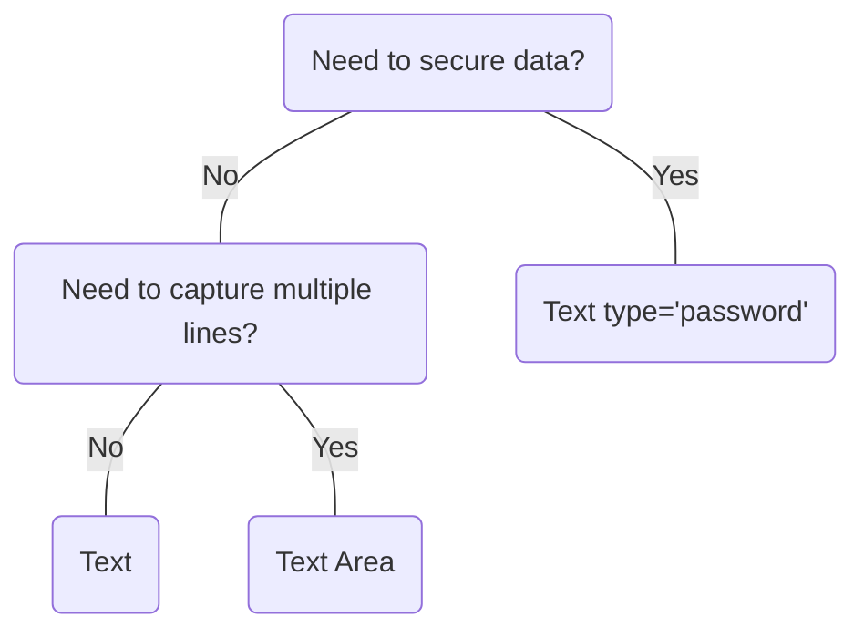

# Text Area

## Overview


> Image: Illustration of Text Area component.


<Message appearance="fill" type="info">
    <div>All data entry components should be wrapped in a <Link to="ControlGroup">Control Group</Link> to provide a label, error states, and help or error text, ensuring an accessible experience for all users.</div>
</Message>

## When to use this component
- You need to capture multiline plain text, such as comments or descriptions
- You want to ask users an open-ended question, such as "Do you have any feedback?"
- When information cannot be predicted with a set of predefined options

## When to use another component
- If you need to capture single line plain text, use Text
- If you need to secure data, information, or a profile, use `Text` with `type="password"`
- When it's easier for users to select from a list options, use `Select` or `Multiselect`



### Check out
- [Control Group][1]
- [Multiselect][2]
- [Select][3]
- [Text][4]

## Behaviors

### Min and Max rows
Text area will grow and shrink vertically based on the defined minimum and maximum number of rows. The default minimum is set to 2 rows, maximum rows is 8. When the content exceeds the max number of rows, Text Area will add a scroll bar.

> Image: Three text areas demonstrating dynamic resizing: the first with 2 rows as the minimum, the second with 8 rows as the maximum, and the third showing a scrollbar when content exceeds 8 rows.


## Usage

### Placeholders
Placeholder text presents a number of visual and cognitive issues; it is best to avoid using it.
Placeholder does not replace a label. [Splunk Style Guide placeholder guidelines][5]

> Image: Comparison of two text areas labeled 


### Text Area width
Don't extend Text Area across the entire width of a screen. To maintain usability and readability, ensure a width that doesn't exceeded 80 characters.

> Image: Two text areas labeled 


### Clear Text area
The suggested way to support a clear content action is a button with clear label and an icon placed outside of Text Area. Avoid placing the clear action inside Text area.

> Image: Two Text Areas examples labeled 


### Text Area resize
Add a [resize][6] handle to provide user the ability to make Text Area size fit there needs.

> Image: Text Area example with heart eyes emoji labeled 


## Content guidelines

### Labels
Labels are required. Keep Text Area labels brief and use sentence-style capitalization.

> Image: Two Text Area examples with labels demonstrating best practices: the first example with heart eyes emoji is labeled 


[1]: ./ControlGroup
[2]: ./Multiselect
[3]: ./Select
[4]: ./Text
[5]: https://docs.splunk.com/Documentation/StyleGuide/drafts/StyleGuide/UIGuidelines#Placeholder_text
[6]: ./Resize

## Examples


### Controlled

Text Area requires a value prop and an onChange callback to update the value prop for most use cases.

```typescript
import React, { useState } from 'react';

import TextArea, { TextAreaChangeHandler } from '@splunk/react-ui/TextArea';


const Basic = () => {
    const [text, setText] = useState('');
    const handleChange: TextAreaChangeHandler = (e, { value }) => {
        setText(value);
    };

    return <TextArea value={text} onChange={handleChange} />;
};

export default Basic;
```


### Uncontrolled

Alternatively, Text Area can be uncontrolled and optionally provided a defaultValue. The onChange callback still fires. The value prop cannot be set or updated externally.

```typescript
import React from 'react';

import TextArea from '@splunk/react-ui/TextArea';


function Uncontrolled() {
    return <TextArea defaultValue="Hello" />;
}

export default Uncontrolled;
```


### Inline

Passing inline will create an inline element and the input will be its default size.

```typescript
import React, { useState } from 'react';

import TextArea, { TextAreaChangeHandler } from '@splunk/react-ui/TextArea';


const Inline = () => {
    const [text, setText] = useState('Hello');
    const handleChange: TextAreaChangeHandler = (e, { value }) => {
        setText(value);
    };

    return <TextArea inline value={text} onChange={handleChange} />;
};

export default Inline;
```


### Disabled

```typescript
import React from 'react';

import TextArea from '@splunk/react-ui/TextArea';


const Disabled = () => <TextArea style={{ width: '250px' }} disabled />;

export default Disabled;
```


### Error

Setting error will highlight the field.

```typescript
import React, { useState } from 'react';

import TextArea, { TextAreaChangeHandler } from '@splunk/react-ui/TextArea';


const Error = () => {
    const [text, setText] = useState('invalid');
    const handleChange: TextAreaChangeHandler = (e, { value }) => {
        setText(value);
    };

    return <TextArea style={{ width: '250px' }} error value={text} onChange={handleChange} />;
};

export default Error;
```


## API


### TextArea API

Note: TextArea places role and aria props onto the input. All other props are placed on the wrapper.

#### Props

| Name | Type | Required | Default | Description |
|------|------|------|------|------|
| append | boolean | no | false | Append removes rounded borders and the border from the right side. |
| autoCapitalize | string | no |  | Control the browser's automatic capitalization functionality. Note: Doesn't apply to physical keyboard input. Examples: 'on', 'off', 'sentences', 'words, 'characters'. |
| autoComplete | string | no |  | Control the browser's autofill functionality. See [the specification](https://html.spec.whatwg.org/multipage/form-control-infrastructure.html#autofilling-form-controls:-the-autocomplete-attribute) for details. Examples: 'on', 'off', 'cc-name', 'shipping street-address'. |
| autoCorrect | string | no |  | Set the input's autocorrect attribute. Only supported by Safari. See also `spellCheck`. |
| autoFocus | boolean | no | false | Specify that the input should request focus when mounted. |
| children | React.ReactNode | no |  |  |
| defaultValue | string | no |  | Set this property instead of value to make value uncontrolled. |
| describedBy | string | no |  | The id of the description. When placed in a ControlGroup, this is automatically set to the ControlGroup's help component. |
| disabled | boolean | no | false | Determines whether or not the input is editable. |
| elementRef | React.Ref<HTMLDivElement> | no |  | A React ref which is set to the DOM element when the component mounts, and null when it unmounts. |
| endAdornment | React.ReactNode | no |  | Adornment after the input. |
| error | boolean | no | false | Highlight the field as having an error. The border will turn red. |
| inline | boolean | no | false | When false, display as inline-block with the default width. |
| inputId | string | no |  | An id for the input, which may be necessary for accessibility, such as for aria attributes. |
| inputRef | React.Ref<HTMLTextAreaElement> | no |  | A React ref which is set to the input element when the component mounts and null when it unmounts. |
| labelledBy | string | no |  | The id of the label. When placed in a ControlGroup, this is automatically set to the ControlGroup's label. |
| maxLength | number | no |  | Set the input's maxlength attribute. |
| name | string | no |  | The name is returned with onChange events, which can be used to identify the control when multiple controls share an onChange callback. |
| onBlur | TextAreaBlurHandler | no |  | A callback for when the input loses focus. |
| onChange | TextAreaChangeHandler | no |  | This is equivalent to onInput which is called on keydown, paste, and so on. If value is set, this callback is required. This must set the value prop to retain the change. |
| onFocus | TextAreaFocusHandler | no |  | A callback for when the input takes focus. |
| onInputClick | React.MouseEventHandler<HTMLTextAreaElement> | no |  | A callback for when the user clicks the textbox. This will only trigger when the textbox itself is clicked and will not trigger for other parts of the component, such as nodes added via "startAdornment" or "endAdornment" props. If you want to handle all click events, pass the "onClick" prop, which will be attached to `TextArea`'s root element. |
| onKeyDown | React.KeyboardEventHandler<HTMLTextAreaElement> | no |  | A keydown callback can be used to prevent a certain input by utilizing the event argument. |
| onSelect | React.ReactEventHandler<HTMLTextAreaElement> | no |  | A callback for when the text selection or cursor position changes. |
| prepend | boolean | no | false | Prepend removes rounded borders from the left side. |
| rowsMax | number | no | 8 | Maximum number of rows to display |
| rowsMin | number | no | 2 | Minimum number of rows to display |
| spellCheck | boolean | no |  | Control the browser's spelling and grammar checking functionality. |
| startAdornment | React.ReactNode | no |  | Adornment in front of the input. |
| tabIndex | number | no | 0 |  |
| value | string | no |  | The contents of the input. Setting this value makes the property controlled. A callback is required. |

#### Types

| Name | Type | Description |
|------|------|------|
| TextAreaBlurHandler | (     event: React.FocusEvent<HTMLTextAreaElement>,     data: {         name?: string;         value: string;     } ) => void |  |
| TextAreaChangeHandler | (     event: React.ChangeEvent<HTMLTextAreaElement>,     data: {         name?: string;         value: string;     } ) => void |  |
| TextAreaFocusHandler | (     event: React.FocusEvent<HTMLTextAreaElement>,     data: {         name?: string;         value: string;     } ) => void |  |


