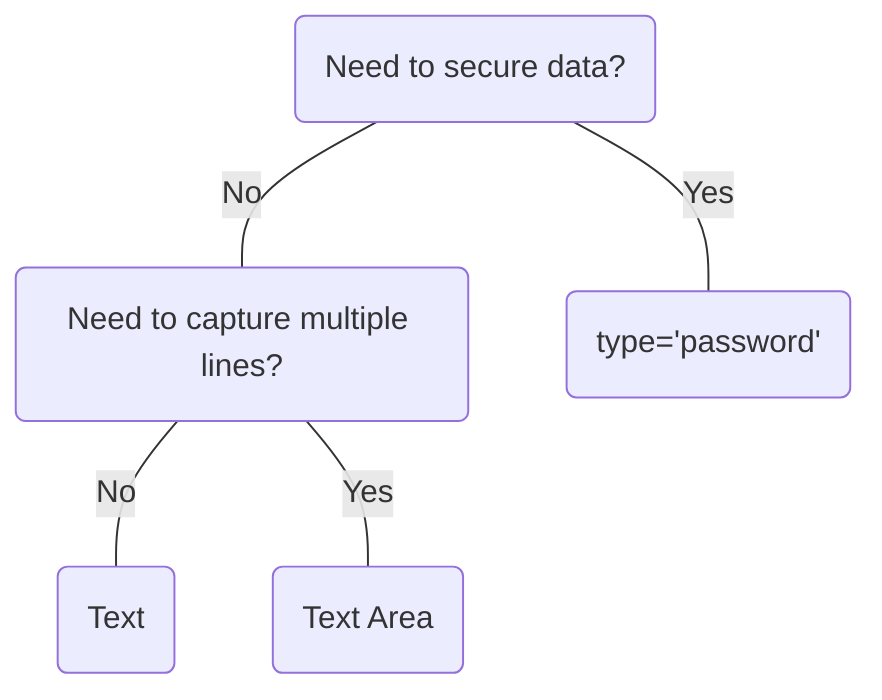

# Text

## Overview


> Image: Illustration of a text input


<Message appearance="fill" type="info">
    <div>All data entry components should be wrapped in a <Link to="ControlGroup">Control Group</Link> to provide a label, error states, and help or error text, ensuring an accessible experience for all users.</div>
</Message>

## When to use this component
- When single line plain text is needed.
- When information cannot be predicted with a set of predefined options.
- When you need to secure data, information, or a profile, use `type="password"`.

## When to use another component
- If you need to capture multiline plain text, such as a comment or description, use `Text Area`.
- If you need to resize the input or validate character count, use `Text Area` or the `Resize` utility.



### Check out
- [Control Group][1]
- [Text Area][2]
- [Resize][3]

## Usage

### Placeholders
Since placeholder text presents a number of visual and cognitive issues, it is best to avoid using it.
Placeholder does not replace a label. [Splunk Style Guide placeholder guidelines][4]
> Image: Examples of using placeholder text in the Text component. The first example with heart eyes emoji has a Text component labeled 


### Text width
Adjust the width to accommodate the anticipated input length, ensuring it is sufficiently wide to support the longest expected values. Avoid extending `Text` across the entire width of large screens to maintain usability and readability.
> Image: Examples of Text component widths. The first example with heart eyes emoji has a Text component labeled 


## Content guidelines

### Labels
Labels are required, keep Text labels brief and use sentence-style capitalization.
> Image: Example of keeping Text component labels brief. The first example with heart eyes emoji has a Text component labeled 


[1]: ./ControlGroup
[2]: ./TextArea
[3]: ./Resize
[4]: https://docs.splunk.com/Documentation/StyleGuide/drafts/StyleGuide/UIGuidelines#Placeholder_text

## Examples


### Controlled

Text requires a value prop and an onChange callback to update the value prop for most use cases.

```typescript
import React, { useState } from 'react';

import Text, { TextChangeHandler } from '@splunk/react-ui/Text';


const Basic = () => {
    const [value, setValue] = useState<string | undefined>('');

    const handleChange: TextChangeHandler = (e, { value: newValue }) => {
        setValue(newValue);
    };

    return <Text canClear value={value} onChange={handleChange} />;
};

export default Basic;
```


### Uncontrolled

Alternatively, Text can be uncontrolled and optionally provided a defaultValue. The onChange callback still fires. The value prop cannot be set or updated externally.

```typescript
import React from 'react';

import Text from '@splunk/react-ui/Text';


function Uncontrolled() {
    return <Text defaultValue="Hello" canClear />;
}

export default Uncontrolled;
```


### Inline

Passing inline will create an inline element and the input will be its default size.

```typescript
import React, { useState } from 'react';

import Text, { TextChangeHandler } from '@splunk/react-ui/Text';


const Inline = () => {
    const [value, setValue] = useState<string | undefined>('');

    const handleChange: TextChangeHandler = (e, { value: newValue }) => {
        setValue(newValue);
    };

    return <Text inline value={value} onChange={handleChange} />;
};

export default Inline;
```


### Dimmed

If you absolutely need to disable a Text use a dimmed Text. When the disabled prop is set to "dimmed", the Text does not respond to events but can still receive focus to ensure users can navigate to the Text when using assistive technologies. This also sets aria-disabled to true.

```typescript
import React from 'react';

import Text from '@splunk/react-ui/Text';


const Dimmed = () => <Text disabled="dimmed" defaultValue="This cannot be edited." inline />;

export default Dimmed;
```


### Disabled

Disabled cannot accept an input or become focused.

```typescript
import React from 'react';

import Text from '@splunk/react-ui/Text';


const Disabled = () => <Text disabled defaultValue="This cannot be edited." inline />;

export default Disabled;
```


### Error

Setting error will highlight the field.

```typescript
import React, { useState } from 'react';

import Text, { TextChangeHandler } from '@splunk/react-ui/Text';


const Error = () => {
    const [value, setValue] = useState<string | undefined>('invalid');

    const handleChange: TextChangeHandler = (e, { value: newValue }) => {
        setValue(newValue);
    };

    return <Text error inline value={value} onChange={handleChange} />;
};

export default Error;
```


### Password

The Text control also supports a password input type and visibility toggle independently of each other.

```typescript
import React, { useState } from 'react';

import Text, { TextChangeHandler } from '@splunk/react-ui/Text';


const Password = () => {
    const [value, setValue] = useState<string | undefined>('password123');

    const handleChange: TextChangeHandler = (e, { value: newValue }) => {
        setValue(newValue);
    };

    return (
        <>
            <Text inline type="password" value={value} onChange={handleChange} />

            <br />
            <br />

            <Text inline passwordVisibilityToggle defaultValue="password123" onChange={() => {}} />
        </>
    );
};

export default Password;
```


### StyledButton

```typescript
import React from 'react';

import styled from 'styled-components';

import LinesThree from '@splunk/react-icons/LinesThree';
import Magnifier from '@splunk/react-icons/Magnifier';
import PaperFolded from '@splunk/react-icons/PaperFolded';
import Portrait from '@splunk/react-icons/Portrait';
import Button from '@splunk/react-ui/Button';
import Text from '@splunk/react-ui/Text';

const StyledButton = styled(Button)`
    min-width: 24px;
    min-height: 24px;
    margin: 4px;
`;


const CustomizedIcon = () => (
    <>
        <Text defaultValue="" inline startAdornment={<div>$</div>} endAdornment={<div>.00</div>} />
        <br />
        <br />
        <Text
            defaultValue=""
            startAdornment={
                <div style={{ display: 'flex', alignItems: 'center' }}>
                    <Portrait variant="filled" />
                </div>
            }
            inline
        />
        <br />
        <br />
        <Text
            defaultValue=""
            endAdornment={
                <>
                    <StyledButton appearance="secondary" icon={<Magnifier />} />
                    <span>|</span>
                    <StyledButton appearance="secondary" icon={<PaperFolded />} />
                </>
            }
            inline
            startAdornment={<StyledButton appearance="secondary" icon={<LinesThree />} />}
        />
    </>
);

export default CustomizedIcon;
```


## API


### Text API

Note: Text places role and aria props onto the input. All other props are placed on the wrapper.

#### Props

| Name | Type | Required | Default | Description |
|------|------|------|------|------|
| append | boolean | no | false | Append removes rounded borders and the border from the right side. |
| autoCapitalize | string | no |  | Control the browser's automatic capitalization functionality. Note: Doesn't apply to physical keyboard input. Examples: 'on', 'off', 'sentences', 'words, 'characters'. |
| autoComplete | string | no |  | Control the browser's autofill functionality. See [the specification](https://html.spec.whatwg.org/multipage/form-control-infrastructure.html#autofilling-form-controls:-the-autocomplete-attribute) for details. Examples: 'on', 'off', 'cc-name', 'shipping street-address'. |
| autoCorrect | string | no |  | Set the input's autocorrect attribute. Only supported by Safari. See also `spellCheck`. |
| autoFocus | boolean | no | false | Specify that the input should request focus when mounted. |
| canClear | boolean | no | false | Include an "X" button to clear the value. If `passwordVisibilityToggle` is `true`, this prop is ignored. |
| children | React.ReactNode | no |  |  |
| defaultValue | string | no |  | Set this property instead of value to make value uncontrolled. |
| describedBy | string | no |  | The id of the description. When placed in a ControlGroup, this is automatically set to the ControlGroup's help component. |
| disabled | boolean \| 'dimmed' | no | false | Determines whether or not the input is editable. If set to `"dimmed"`, the menu item does not respond to events but can still receive focus, and `aria-disabled` is set to `true`. |
| elementRef | React.Ref<HTMLDivElement> | no |  | A React ref which is set to the DOM element when the component mounts, and null when it unmounts. |
| endAdornment | React.ReactNode | no |  | Adornment after the input. |
| error | boolean | no | false | Highlight the field as having an error. The border and text will turn red. |
| inline | boolean | no | false | When false, display as inline-block with the default width. |
| inputId | string | no |  | An id for the input, which may be necessary for accessibility, such as for aria attributes. |
| inputRef | React.Ref<HTMLInputElement> | no |  | A React ref which is set to the input element when the component mounts and null when it unmounts. |
| labelledBy | string | no |  | The id of the label. When placed in a ControlGroup, this is automatically set to the ControlGroup's label. |
| maxLength | number | no |  | Set the input's maxlength attribute. |
| name | string | no |  | The name is returned with onChange events, which can be used to identify the control when multiple controls share an onChange callback. |
| onBlur | TextBlurHandler | no |  | A callback for when the input loses focus. |
| onChange | TextChangeHandler | no |  | This is equivalent to onInput which is called on keydown, paste, and so on. If value is set, this callback is required. This must set the value prop to retain the change. |
| onClick | React.MouseEventHandler<HTMLInputElement> | no |  | A callback for when the user clicks the textbox. This will only trigger when the textbox itself is clicked and will not trigger for other parts of the component, such as the clear button or nodes added via "startAdornment" or "endAdornment" props. |
| onFocus | TextFocusHandler | no |  | A callback for when the input takes focus. |
| onKeyDown | React.KeyboardEventHandler<HTMLInputElement> | no |  | A keydown callback can be used to prevent a certain input by utilizing the event argument. |
| onSelect | React.ReactEventHandler<HTMLInputElement> | no |  | A callback for when the text selection or cursor position changes. |
| passwordVisibilityToggle | boolean | no | false | Allow password visibility to be toggled with an icon button. If this is enabled, `type` prop will be ignored. |
| prepend | boolean | no | false | Prepend removes rounded borders from the left side. |
| spellCheck | boolean | no |  | Control the browser's spelling and grammar checking functionality. |
| startAdornment | React.ReactNode | no |  | Adornment in front of the input. |
| tabIndex | number | no | 0 |  |
| type | string | no | 'text' | Type of the `input` element. It should be [a valid HTML5 input type](https://developer.mozilla.org/en-US/docs/Web/HTML/Element/input#Form_%3Cinput%3E_types). @default 'text' |
| value | string | no |  | The contents of the input. Setting this value makes the property controlled. A callback is required. |

#### Types

| Name | Type | Description |
|------|------|------|
| TextBlurHandler | (     event: React.FocusEvent<HTMLInputElement>,     data: {         name?: string;         value: string;     } ) => void |  |
| TextChangeHandler | (     event: React.ChangeEvent<HTMLInputElement> \| React.MouseEvent<HTMLSpanElement>,     data: {         name?: string;         value: string;     } ) => void |  |
| TextFocusHandler | (     event: React.FocusEvent<HTMLInputElement>,     data: {         name?: string;         value: string;     } ) => void |  |


