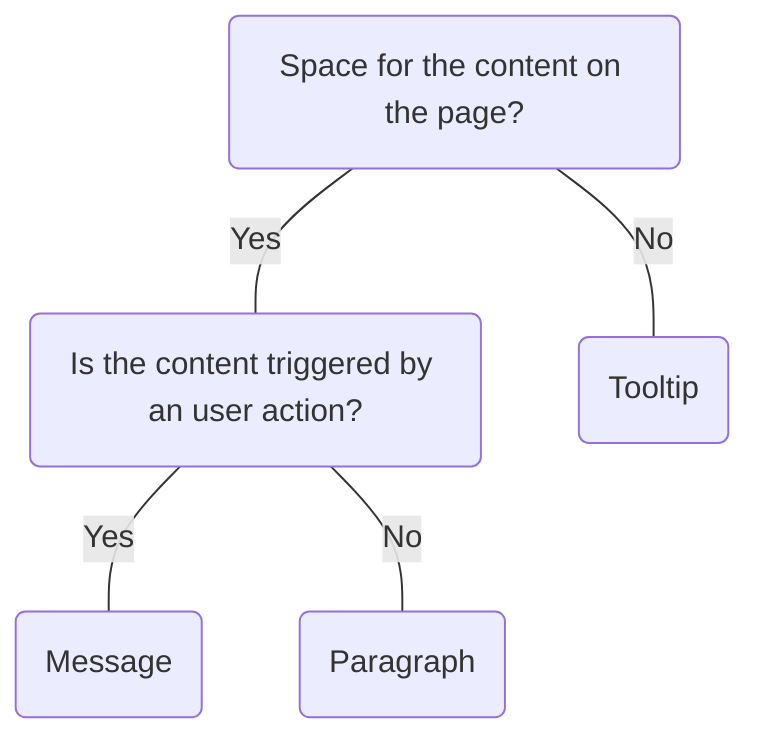

# Tooltip

## Overview


> Image: Illustration of a Tooltip.


## When to use this component
- To provide non-essential supporting information for specific elements on a page.

## When to use another component
<Message appearance="fill" type="warning">
    <Message.Title>
            Information directly on the page is always more inclusive.
    </Message.Title>
    Tooltips have low discoverability and have usability issues on devices without hover or focus interactions. A solution that is available on the page or through help text is more accessible.
</Message>

- If the content is triggered by a user action, a Message is more appropriate.
- Paragraphs or help text subcomponents remove the need for any user interaction to access the information.



### Check out
- [Message][1]
- [Paragraph][2]

## Behaviors

### Labels
To help people understand the meaning of icon-only Buttons, set `contentRelationship="label"` to add a Tooltip.

> Image: A pencil icon Button in a hover state with a Tooltip with the label, 


### Information icon
<Message appearance="fill" type="warning">
    Don't hide essential information behind an icon.
</Message>

An information icon with a hover interaction that displays the tooltip.

> Image: The text 


## Usage

### Icon-Only Buttons
Tooltips aren’t necessary for UI elements that already have labels.

> Image: Examples of using Tooltips as labels for Buttons. There are three Buttons: an icon-text 


### Interactive elements
As tooltips can be activated by hover, additional interactions can be confusing to access.

> Image: Examples of using tooltips for an Icon-Text 


### Help text
To ensure information accessibility and convenience, it's recommended to minimize reliance on tooltips. Tooltips necessitate extra user actions, conceal crucial details, and may obstruct surrounding inputs or content. Instead, using visible help text directly is recommended for clearer and more immediate guidance.

> Image: Examples of using tooltips with a Text component. The first example with heart eyes emoji has a Text component labeled 


## Content
Follow writing best practices outlined in the [UI text style guidelines][3]

### Concise
Keep the content of tooltips short and to the point, as they are meant to be quick references, not full explanations.

> Image: Examples of using a Tooltip as labels for icon-only 


[1]: ./Message
[2]: ./Paragraph
[3]: https://docs.splunk.com/Documentation/StyleGuide/current/StyleGuide/UIGuidelines


## Examples


### Basic

Add additional description to a form control.

```typescript
import React from 'react';

import Text from '@splunk/react-ui/Text';
import Tooltip from '@splunk/react-ui/Tooltip';


function Basic() {
    return (
        <Tooltip content="I explain the text input">
            <Text />
        </Tooltip>
    );
}

export default Basic;
```


### Content Relationship

Set contentRelationship="label" for icon-only buttons.

```typescript
import React from 'react';

import MoreVertical from '@splunk/react-icons/enterprise/MoreVertical';
import Button from '@splunk/react-ui/Button';
import Tooltip from '@splunk/react-ui/Tooltip';
import { _ } from '@splunk/ui-utils/i18n';


function ContentRelationship() {
    return (
        <Tooltip contentRelationship="label" content={_('Actions')} style={{ margin: '0 10px' }}>
            <Button
                appearance="secondary"
                icon={
                    <MoreVertical
                        // screenReaderText is added by Tooltip
                        screenReaderText={null}
                        hideDefaultTooltip
                    />
                }
            />
        </Tooltip>
    );
}

export default ContentRelationship;
```


### Custom Delay

Open and close delays can be configured separately. Default delay values differ across themes.

```typescript
import React from 'react';

import Text from '@splunk/react-ui/Text';
import Tooltip from '@splunk/react-ui/Tooltip';


function CustomDelay() {
    return (
        <div>
            <Tooltip openDelay={1000} closeDelay={1000} content="I explain the form control.">
                <Text />
            </Tooltip>
        </div>
    );
}

export default CustomDelay;
```


### Controlled

Tooltips can also be controlled for more complex use cases.

```typescript
import React, { Component } from 'react';

import P from '@splunk/react-ui/Paragraph';
import Text from '@splunk/react-ui/Text';
import Tooltip, {
    TooltipRequestCloseHandler,
    TooltipRequestOpenHandler,
} from '@splunk/react-ui/Tooltip';


class Controlled extends Component<object, { open: boolean; reason: string }> {
    constructor(props: object) {
        super(props);

        this.state = {
            open: false,
            reason: 'none',
        };
    }

    handleRequestOpen: TooltipRequestOpenHandler = (e, { reason }) => {
        this.setState({ reason, open: true });
    };

    handleRequestClose: TooltipRequestCloseHandler = (e, { reason }) => {
        this.setState({ reason, open: false });
    };

    render() {
        return (
            <P>
                <Tooltip
                    content="I explain the ambiguous control."
                    open={this.state.open}
                    onRequestOpen={this.handleRequestOpen}
                    onRequestClose={this.handleRequestClose}
                >
                    <Text />
                </Tooltip>
                <br />
                Received request reason: {this.state.reason}
            </P>
        );
    }
}

export default Controlled;
```


### Custom Props

Use the renderAnchor prop to customize rendering of the anchor element. Make sure that anchor element get assigned the onBlur, onFocus, onClick listeners, the describedBy or labelledBy string props and the elementRef.

```typescript
import React, { useMemo } from 'react';

import P from '@splunk/react-ui/Paragraph';
import Text from '@splunk/react-ui/Text';
import Tooltip from '@splunk/react-ui/Tooltip';
import { createDOMID } from '@splunk/ui-utils/id';


function CustomProps() {
    const descriptionId = useMemo(() => createDOMID(), []);

    return (
        <div>
            <P id={descriptionId}>Additional explanations for the control</P>
            <Tooltip
                content="I explain the ambiguous control."
                renderAnchor={({ describedBy, ...anchorProps }) => (
                    <Text {...anchorProps} describedBy={`${describedBy} ${descriptionId}`} />
                )}
            />
        </div>
    );
}

export default CustomProps;
```


### Toggletip

Tooltip defaults to showing an info button as an anchor to explain the surrounding context. For accessibility, please consider other ways of conveying this information before you decide to use the toggletip.

```typescript
import React from 'react';

import Tooltip from '@splunk/react-ui/Tooltip';


function Toggletip() {
    return <Tooltip content="Longer explanation of what the user is working with" />;
}

export default Toggletip;
```


## API


### Tooltip API

The Tooltip component wraps arbitrary content to be displayed when the target element is hovered
or focused.

#### Props

| Name | Type | Required | Default | Description |
|------|------|------|------|------|
| children | React.ReactNode | no |  | Provide a node to replace the default question mark. For accessibility, ensure that the child can take focus, and that it accepts a `describedBy` string prop which it places as `aria-describedby` on the appropriate internal element. |
| closeDelay | number | no | 300 | Milliseconds to wait before the tooltip closes. |
| content | React.ReactNode | no |  | The content of the tooltip. If the content is falsy and the `open` prop is uncontrolled, the tooltip doesn't display. |
| contentRelationship | 'description' \| 'label' | no |  | Tooltips can define the primary label for controls, for example buttons with only an icon, or they can provide an auxiliary description to supplement a control's primary label. This relationship is conveyed to assistive technologies with either the `aria-labelledby` or `aria-describedby` properties. By default, tooltips are a description for their control and use `aria-describedby`. Set `contentRelationship` to `label` when the Tooltip's content is a primary label for the control. |
| defaultPlacement | 'above' \| 'below' \| 'left' \| 'right' | no | 'above' | The default placement of the `Tooltip`. It might render in a different location if there is not enough space in the default direction. |
| elementRef | React.Ref<HTMLElement> | no |  | A React ref which is set to the DOM element when the component mounts and null when it unmounts. |
| inline | boolean | no | true | Set inline to `false` when adding a tooltip to a block element. |
| onRequestClose | TooltipRequestCloseHandler | no |  | Callback function fired when the popover is requested to be closed.  @param {event} event Can be `null` depending on the reason the tooltip is closing. @param {object} data @param {string} data.reason The reason for the close request. |
| onRequestOpen | TooltipRequestOpenHandler | no |  | Callback function fired when the popover is requested to be opened.  @param {event} event @param {object} data @param {string} data.reason The reason for the open request. |
| open | boolean | no |  | Whether or not the tooltip is shown. Setting this value makes the prop controlled. The onRequestClose and onRequestOpen callbacks are usually used. |
| openDelay | 'primary' \| 'secondary' \| number | no | 'primary' | Milliseconds to wait before the tooltip opens. |
| pointTo | { x: number; y: number } | no |  | Allows the `Tooltip` to point to and align with a different part of the anchor.  This prop is forwarded to Popover. See `Popover`'s `pointTo` prop for more information. |
| renderAnchor | (props: AnchorProps) => React.ReactNode | no |  | A function for rendering the element that the tooltip is bound to. If both `renderAnchor` and `children` are passed, `children` will be ignored. The function gets as input props object for the anchor, which contains the necessary event listeners and aria attributes. By default or if `contentRelationship` is passed as `description`, the props object contains keys `aria-describedby` and `describedBy`, but if `contentRelationship` is passed as `label`, `aria-labelledby` and `labelledBy` will be passed instead.  @param {object} props @param {function} props.onFocus @param {function} props.onBlur @param {function} props.onClick @param {string} props['aria-describedby'] @param {string} props.describedBy @param {string} props['aria-labelledby'] @param {string} props.labelledBy @param {"toggle"} props.['data-test'] @param {function} props.elementRef |

#### Types

| Name | Type | Description |
|------|------|------|
| TooltipPossibleCloseReason | \| 'blurToggle'     \| 'clickAway'     \| 'escapeKey'     \| 'mouseLeaveHitArea'     \| 'mouseLeavePopover'     \| 'mouseLeaveToggle'     \| 'mouseStopHitArea'     \| 'offScreen'     \| 'tabKey'     \| 'toggleClick' |  |
| TooltipPossibleOpenReason | \| 'focusToggle'     \| 'mouseEnterPopover'     \| 'mouseEnterToggle'     \| 'mouseEnterHitArea' |  |
| TooltipRequestCloseHandler | (     event: React.FocusEvent<HTMLSpanElement> \| React.MouseEvent \| MouseEvent \| null,     data: { reason: TooltipPossibleCloseReason } ) => void |  |
| TooltipRequestOpenHandler | (     event: React.FocusEvent<HTMLSpanElement> \| MouseEvent,     data: { reason: TooltipPossibleOpenReason } ) => void |  |


