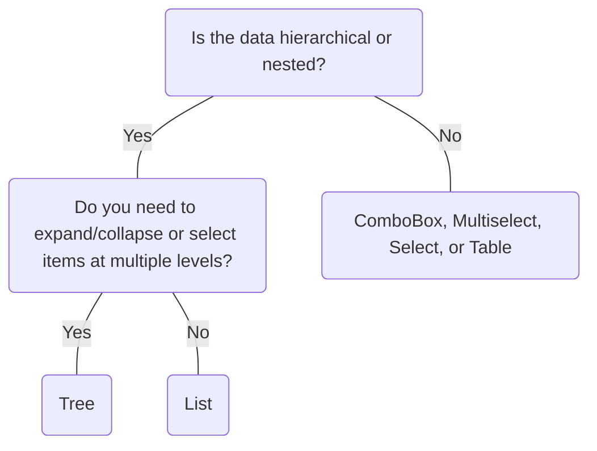

# Tree

## Overview


> Image: Illustration of Tree component


## When to use this component

The `Tree` component displays hierarchical data, allowing users to expand, collapse, and select nested items efficiently.

- When you need to show nested or grouped data in a clear, expandable structure.
- When users must select or interact with items at multiple levels of a hierarchy.
- When space is limited but hierarchical context is important.

### Additional considerations
- For large datasets, consider lazy loading or virtualization to maintain performance.
- Ensure keyboard navigation and screen reader support for accessibility.

## When to use another component
- When you only need to show a flat list, use a `List`.
- For simple selection from a set of options, use a `ComboBox` or `Select`.
- For non-hierarchical multiple selections, use a `Multiselect`.
- If you need to display tabular data, use a `Table`.



### Check out
- [List][1]
- [ComboBox][2]
- [Select][3]
- [Multiselect][4]
- [Table][5]

## Behaviors

### Expand/Collapse

Allows users to expand or collapse branches to view nested items. Users can navigate and interact with the tree using keyboard controls.

> Image: Tree expand/collapse behavior demonstration


### Selection

Nodes within the Tree can be selectable, enabling users to highlight or activate specific items. Keyboard focus management is integral to ensure accessibility and smooth interaction.

> Image: Tree selection behavior demonstration


## Usage

### Grouping and organization

Use the `Tree` component to organize items with clear parent-child relationships, such as file directories, organizational charts, or nested categories. Group related items together to improve clarity and help users understand the hierarchy.

> Image: Grouping items in Tree. The first example with heart eyes emoji shows clear organization; the second example with grimacing emoji shows cluttered grouping.


## Content

### Concise labels

Use concise, descriptive labels for each node, ideally 1-3 words, employing sentence-style capitalization. Labels should clearly convey the content or category represented by the node.

> Image: Tree node label examples. The first example with heart eyes emoji shows clear, brief labels; the second example with grimacing emoji shows overly long or vague labels.


[1]: ./List
[2]: ./ComboBox
[3]: ./Select
[4]: ./Multiselect
[5]: ./Table


## Examples


### Basic

```typescript
import React, { useCallback, useState } from 'react';

import Tree, { TreeItemToggleExpansionHandler } from '@splunk/react-ui/Tree';


export default function Basic() {
    const [expandedIdsMap, setExpandedIdsMap] = useState(
        new Map([
            ['two', true],
            ['three', true],
        ])
    );

    const handleToggleExpansion: TreeItemToggleExpansionHandler = useCallback(
        (event, { treeItemId } = {}) => {
            if (!treeItemId) {
                return;
            }

            setExpandedIdsMap((prevMap) => {
                const newMap = new Map(prevMap);
                if (newMap.has(treeItemId)) {
                    newMap.delete(treeItemId);
                } else {
                    newMap.set(treeItemId, true);
                }

                return newMap;
            });
        },
        []
    );

    return (
        <Tree>
            <Tree.Item content="node-0" id="one" />
            <Tree.Item
                content="node-1"
                id="two"
                expanded={expandedIdsMap.has('two')}
                onToggleExpansion={handleToggleExpansion}
            >
                <Tree.Item
                    content="node-1-0"
                    id="three"
                    expanded={expandedIdsMap.has('three')}
                    onToggleExpansion={handleToggleExpansion}
                >
                    <Tree.Item content="node-1-0-0" id="four" />
                    <Tree.Item content="node-1-0-1" id="five" />
                </Tree.Item>
                <Tree.Item content="node-1-1" id="six" />
            </Tree.Item>
            <Tree.Item content="node-2" id="seven" />
        </Tree>
    );
}
```


### StyledExpansionToggleWrapper

```typescript
import React, { useCallback, useMemo, useState } from 'react';

import styled from 'styled-components';

import ChevronDown from '@splunk/react-icons/ChevronDown';
import ChevronRight from '@splunk/react-icons/ChevronRight';
import Tree, { TreeItemPropsBase, TreeItemToggleExpansionHandler } from '@splunk/react-ui/Tree';
import { variables } from '@splunk/themes';

const StyledExpansionToggleWrapper = styled.span`
    display: inline-flex;
    width: 16px;
    justify-content: center;
    align-items: center;
    padding-inline: ${variables.spacingMedium};
`;
const StyledSpan = styled.span`
    display: inline-flex;
    padding: ${variables.spacingXSmall} 0;
`;


const ExpansionToggle = ({
    expanded,
    treeItemId,
    onToggleExpansion,
}: {
    expanded: boolean;
    treeItemId: string;
    onToggleExpansion: TreeItemPropsBase['onToggleExpansion'];
}) => (
    // eslint-disable-next-line jsx-a11y/no-static-element-interactions, jsx-a11y/click-events-have-key-events
    <span
        onClick={(e) => {
            e.preventDefault();
            onToggleExpansion?.(e, { treeItemId });
        }}
    >
        {expanded ? <ChevronDown /> : <ChevronRight />}
    </span>
);

const TreeItemWithExpansion = ({
    children,
    content,
    expanded,
    id,
    onToggleExpansion,
    ...otherTreeItemProps
}: TreeItemPropsBase) => {
    const contentWithExpansion = useMemo(() => {
        const renderExpansionToggle = () => {
            if (!children) {
                return undefined;
            }

            return (
                <ExpansionToggle
                    expanded={expanded || false}
                    onToggleExpansion={onToggleExpansion}
                    treeItemId={id}
                />
            );
        };

        return (
            <StyledSpan>
                <StyledExpansionToggleWrapper>
                    {renderExpansionToggle()}
                </StyledExpansionToggleWrapper>
                {content}
            </StyledSpan>
        );
    }, [children, content, expanded, id, onToggleExpansion]);

    return (
        <Tree.Item
            content={contentWithExpansion}
            expanded={expanded}
            id={id}
            onToggleExpansion={onToggleExpansion}
            {...otherTreeItemProps}
        >
            {children}
        </Tree.Item>
    );
};

export default function ClickableExpansion() {
    const [expandedIdsMap, setExpandedIdsMap] = useState(
        new Map([
            ['two', true],
            ['three', true],
        ])
    );

    const handleToggleExpansion: TreeItemToggleExpansionHandler = useCallback(
        (event, { treeItemId } = {}) => {
            if (!treeItemId) {
                return;
            }

            setExpandedIdsMap((prevMap) => {
                const newMap = new Map(prevMap);
                if (newMap.has(treeItemId)) {
                    newMap.delete(treeItemId);
                } else {
                    newMap.set(treeItemId, true);
                }

                return newMap;
            });
        },
        []
    );

    return (
        <Tree data-test="tree-fixture">
            <TreeItemWithExpansion content="node-0" id="one" />
            <TreeItemWithExpansion
                content="node-1"
                id="two"
                expanded={expandedIdsMap.has('two')}
                onToggleExpansion={handleToggleExpansion}
            >
                <TreeItemWithExpansion
                    content="node-1-0"
                    id="three"
                    expanded={expandedIdsMap.has('three')}
                    onToggleExpansion={handleToggleExpansion}
                >
                    <TreeItemWithExpansion content="node-1-0-0" id="four" />
                    <TreeItemWithExpansion content="node-1-0-1" id="five" />
                </TreeItemWithExpansion>
                <TreeItemWithExpansion content="node-1-1" id="six" />
            </TreeItemWithExpansion>
            <TreeItemWithExpansion content="node-2" id="seven" />
        </Tree>
    );
}
```


### ClickableExpansioWithSelection

```typescript
import React, { useCallback, useMemo, useRef, useState } from 'react';

import styled from 'styled-components';

import ChevronDown from '@splunk/react-icons/ChevronDown';
import ChevronRight from '@splunk/react-icons/ChevronRight';
import Checkbox from '@splunk/react-ui/Checkbox';
import Tree, {
    TreeItemPropsBase,
    TreeItemToggleExpansionHandler,
    TreeItemToggleSelectionHandler,
} from '@splunk/react-ui/Tree';
import { variables } from '@splunk/themes';

const StyledExpansionToggleWrapper = styled.span`
    display: inline-flex;
    width: 16px;
    justify-content: center;
    align-items: center;
    padding-inline: ${variables.spacingMedium};
`;
const StyledCheckbox = styled(Checkbox)`
    padding-inline-end: ${variables.spacingSmall};
`;
const StyledSpan = styled.span`
    align-items: center;
    display: inline-flex;
    min-height: 100%;
    padding: ${variables.spacingXSmall} 0;
`;


const ExpansionToggle = ({
    expanded,
    onToggleExpansion,
    treeItemId,
}: {
    expanded: boolean;
    onToggleExpansion: TreeItemPropsBase['onToggleExpansion'];
    treeItemId: string;
}) => (
    // eslint-disable-next-line jsx-a11y/no-static-element-interactions, jsx-a11y/click-events-have-key-events
    <span
        onClick={(e) => {
            e.preventDefault();
            onToggleExpansion?.(e, { treeItemId });
        }}
    >
        {expanded ? <ChevronDown /> : <ChevronRight />}
    </span>
);

const ItemSelectionCheckbox = ({
    selected,
    onToggleSelection,
    treeItemId,
}: {
    selected?: boolean;
    onToggleSelection: TreeItemPropsBase['onToggleSelection'];
    treeItemId: string;
}) => (
    // eslint-disable-next-line jsx-a11y/no-static-element-interactions, jsx-a11y/click-events-have-key-events
    <span
        onClick={(e: React.MouseEvent<HTMLButtonElement, MouseEvent>) => {
            e.preventDefault();
            onToggleSelection?.(e, { treeItemId });
        }}
        style={{ display: 'inline-flex', userSelect: 'none' }}
    >
        <StyledCheckbox checked={selected} inert />
    </span>
);

const TreeItemWithExpansionAndSelection = ({
    children,
    expanded,
    id,
    label,
    onToggleSelection,
    onToggleExpansion,
    selected,
    ...otherTreeItemProps
}: Omit<TreeItemPropsBase, 'content'> & {
    label: string;
    selected?: boolean;
}) => {
    const treeItemRef = useRef<HTMLLIElement>(null);

    const content = useMemo(() => {
        const renderExpansionToggle = () => {
            if (!children) {
                return undefined;
            }

            return (
                <ExpansionToggle
                    expanded={expanded || false}
                    onToggleExpansion={onToggleExpansion}
                    treeItemId={id}
                />
            );
        };

        return (
            <StyledSpan>
                <StyledExpansionToggleWrapper>
                    {renderExpansionToggle()}
                </StyledExpansionToggleWrapper>
                <ItemSelectionCheckbox
                    selected={selected}
                    onToggleSelection={onToggleSelection}
                    treeItemId={id}
                />
                {label}
            </StyledSpan>
        );
    }, [children, expanded, id, label, onToggleExpansion, onToggleSelection, selected]);

    return (
        <Tree.Item
            aria-selected={selected ? 'true' : 'false'}
            content={content}
            elementRef={treeItemRef}
            expanded={expanded}
            id={id}
            onToggleExpansion={onToggleExpansion}
            onToggleSelection={onToggleSelection}
            {...otherTreeItemProps}
        >
            {children}
        </Tree.Item>
    );
};

export default function ClickableExpansionWithSelection() {
    const [expandedIdsMap, setExpandedIdsMap] = useState(
        new Map([
            ['two', true],
            ['three', true],
        ])
    );
    const [selectedIdsMap, setSelectedIdsMap] = useState(
        new Map([
            ['two', true],
            ['three', true],
        ])
    );

    const handleToggleExpansion: TreeItemToggleExpansionHandler = useCallback(
        (event, { treeItemId } = {}) => {
            if (!treeItemId) {
                return;
            }

            setExpandedIdsMap((prevMap) => {
                const newMap = new Map(prevMap);
                if (newMap.has(treeItemId)) {
                    newMap.delete(treeItemId);
                } else {
                    newMap.set(treeItemId, true);
                }

                return newMap;
            });
        },
        []
    );

    const handleToggleSelected: TreeItemToggleSelectionHandler = useCallback(
        (event, { treeItemId } = {}) => {
            if (!treeItemId) {
                return;
            }

            setSelectedIdsMap((prevMap) => {
                const newMap = new Map(prevMap);
                if (newMap.has(treeItemId)) {
                    newMap.delete(treeItemId);
                } else {
                    newMap.set(treeItemId, true);
                }

                return newMap;
            });
        },
        []
    );

    return (
        <Tree aria-multiselectable="true" data-test="tree-fixture">
            <TreeItemWithExpansionAndSelection
                id="one"
                label="node-0"
                onToggleSelection={handleToggleSelected}
                selected={selectedIdsMap.has('one')}
            />
            <TreeItemWithExpansionAndSelection
                expanded={expandedIdsMap.has('two')}
                id="two"
                label="node-1"
                onToggleExpansion={handleToggleExpansion}
                onToggleSelection={handleToggleSelected}
                selected={selectedIdsMap.has('two')}
            >
                <TreeItemWithExpansionAndSelection
                    id="three"
                    expanded={expandedIdsMap.has('three')}
                    label="node-1-0"
                    onToggleExpansion={handleToggleExpansion}
                    onToggleSelection={handleToggleSelected}
                    selected={selectedIdsMap.has('three')}
                >
                    <TreeItemWithExpansionAndSelection
                        id="four"
                        label="node-1-0-0"
                        onToggleSelection={handleToggleSelected}
                        selected={selectedIdsMap.has('four')}
                    />
                    <TreeItemWithExpansionAndSelection
                        id="five"
                        label="node-1-0-1"
                        onToggleSelection={handleToggleSelected}
                        selected={selectedIdsMap.has('five')}
                    />
                </TreeItemWithExpansionAndSelection>
                <TreeItemWithExpansionAndSelection
                    id="six"
                    label="node-1-1"
                    onToggleSelection={handleToggleSelected}
                    selected={selectedIdsMap.has('six')}
                />
            </TreeItemWithExpansionAndSelection>
            <TreeItemWithExpansionAndSelection
                id="seven"
                label="node-2"
                onToggleSelection={handleToggleSelected}
                selected={selectedIdsMap.has('seven')}
            />
        </Tree>
    );
}
```


## API


### Tree API

Used to present a hierarchical list.

#### Props

| Name | Type | Required | Default | Description |
|------|------|------|------|------|
| children | React.ReactNode | no |  | Should contain `Tree.Item`s, can also include other elements to display in between tree items. |
| defaultIndent | boolean | no | true | Removes default indent from list styles if set to false. |
| elementRef | React.Ref<HTMLUListElement> | no |  | A React ref which is set to the DOM element when the component mounts and null when it unmounts. |


### Tree.Item API

#### Props

| Name | Type | Required | Default | Description |
|------|------|------|------|------|
| children | React.ReactNode | no |  | Should contain `Tree.Item`s, can also include other elements to display in between tree items. |
| content | React.ReactNode | no |  | Content to show on the `Tree.Item`. |
| elementRef | React.Ref<HTMLLIElement> | no |  | A React ref which is set to the DOM element when the component mounts and null when it unmounts. |
| expanded | boolean | no |  | Expansion state of the `Tree.Item`. |
| id | string | yes |  | A unique `id` for this item and used by `Tree` to keep track of the focused item. |
| onFocus | React.FocusEventHandler<HTMLLIElement> | no |  |  |
| onKeyDown | React.KeyboardEventHandler<HTMLLIElement> | no |  |  |
| onToggleExpansion | TreeItemToggleExpansionHandler | no |  | Called on expansion state change of the `Tree.Item` and should be used to maintain `expanded`. For proper keyboard accessibility this is required when a `Tree.Item` has children. |
| onToggleSelection | TreeItemToggleSelectionHandler | no |  | Called on selection state change of the `Tree.Item` and can be used to maintain optional external `Tree.Item` selection state. |

#### Types

| Name | Type | Description |
|------|------|------|
| TreeItemToggleExpansionHandler | (     event: React.KeyboardEvent<HTMLLIElement> \| React.MouseEvent<HTMLSpanElement>,     data?: {         // Used to support clickable items inside `Tree.Item` `content` that won't have the `Tree.Item`'s id in its click event         treeItemId?: string;     } ) => void |  |
| TreeItemToggleSelectionHandler | (     event: React.KeyboardEvent<HTMLLIElement> \| React.MouseEvent<HTMLSpanElement>,     data?: {         // Used to support clickable items inside `Tree.Item` `content` that won't have the `Tree.Item`'s id in its click event         treeItemId?: string;     } ) => void |  |


