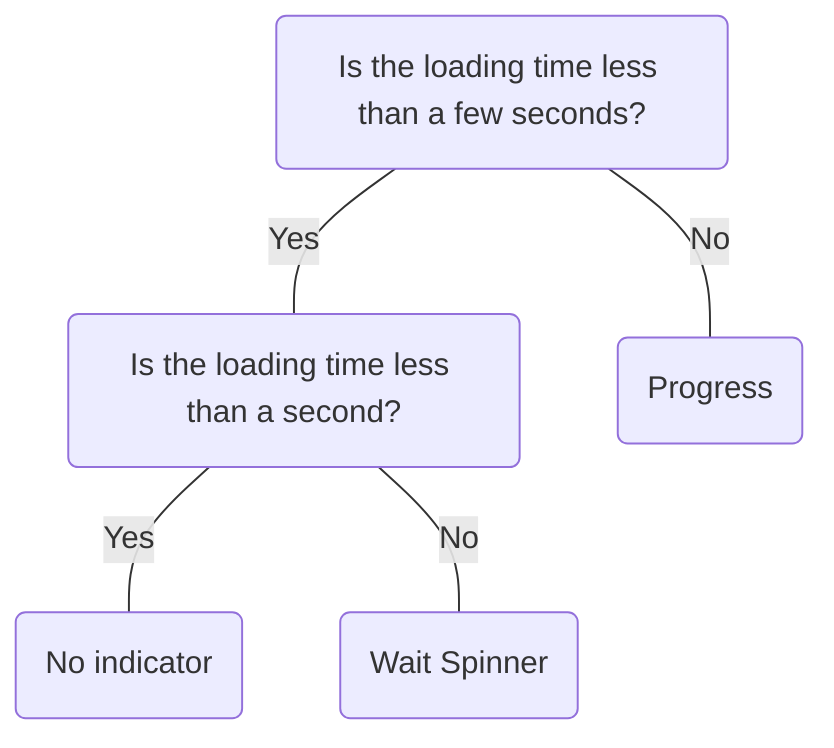

# Wait Spinner

## Overview


> Image: Illustration of a Wait Spinner.


## When to use this component
A Wait Spinner component is a looped animation and an example of an indeterminate loading indicator, as it expresses an unspecified amount of time.
- If you need to represent a loading element for less than a few seconds.

## When to use another component
- If the wait exceeds a few seconds and loading progression can be calculated, use a determinate loading indicator like `Progress`, which considers loading time.
- If the wait will be less than 1 second, no loading indicator is needed.



### Check out
- [Progress][1]

## Usage

### Loading messages
Including a loading message with the Wait Spinner adds an additional affordance for communicating the content’s state. This is useful for users who disable animations, which results in a static Wait Spinner.

> Image: Examples of Wait Spinners. In the first example with heart eyes emoji, the Wait Spinner is accompanied by a loading message saying, 


### Use one Wait Spinner
A group of Wait Spinners can create visual overload for users. Replace a series of adjacent Wait Spinners with a single one.

> Image: Examples of using Wait Spinners for loading a list of items. The first example with heart eyes emoji shows the list title, 


### Sizing
Choose an appropriate size based on the context and visibility requirements.

> Image: Examples of using a Wait Spinner component on a full page. In the first example with heart eyes emoji, the Wait Spinner and accompanied label can clearly be read. In the second example with a grimacing emoji, the Wait Spinner and accompanied label are much smaller and hardly legible, displaying a misuse of a smaller Wait Spinner size.


### Incremental loading
If loading a larger space, consider displaying each item as it loads.

> Image: In this example, there is a full-page map visual with the label 


## Content

### Loading …
For the loading message, use the format, [Loading …]. If the element loading can be summarized in 1-2 words, the format can be improved by replacing the [...] with [element].

> Image: Examples of loading messages for Wait Spinner labels. The first example with heart eyes emoji has a Wait Spinner with a label uses the format; 


### Concise labeling
Avoiding the use of articles ("a," "an," "the") and end punctuation.

> Image: Examples of loading messages for Wait Spinner labels. The first example with heart eyes emoji has a Wait Spinner with a label uses the format; 


[1]: ./Progress

## Examples


### Basic

```typescript
import React from 'react';

import P from '@splunk/react-ui/Paragraph';
import WaitSpinner from '@splunk/react-ui/WaitSpinner';


function Basic() {
    return (
        <>
            <P>Default size:</P>
            <WaitSpinner />
            <br />
            <P>Medium size:</P>
            <WaitSpinner size="medium" />
            <br />
            <P>Large size:</P>
            <WaitSpinner size="large" />
        </>
    );
}

export default Basic;
```


## API


### WaitSpinner API

#### Props

| Name | Type | Required | Default | Description |
|------|------|------|------|------|
| elementRef | React.Ref<HTMLDivElement> | no |  | A React ref which is set to the DOM element when the component mounts and null when it unmounts. |
| screenReaderText | string \| null | no | _('Waiting') | A string to display to screen readers. Set the prop to `null` or an empty string to hide the spinner from screen readers, such as when there is already a text label beside it. |
| size | 'small' \| 'medium' \| 'large' | no | 'small' | Size of WaitSpinner. |


